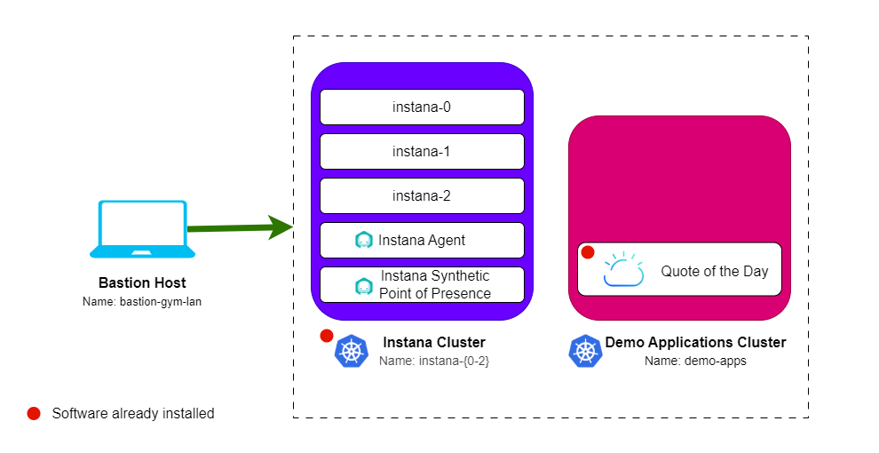

import LicenseInfo from "@site/src/components/Instana/LicenseInfo"

# Lab Environment

The lab environment includes 5 VMs.

1. **Bastion VM** - A RHEL VM named `bastion-gym-lan` that will be used as the
   _bastion host_ for the lab network. This Bastion host has access to all lab
   VM's and will be your primary workstation for these labs.
2. **Instana VMs** - 3 Ubuntu VMs that are running a multi-node self-hosted
   Instana server on K3s.
3. **Demo Applications Cluster** - An Ubuntu VM running K3s, which has the Quote
   of the Day demo application running on it that will be the target for
   synthetic tests in this lab.

## Prerequisites

To complete this lab you will need:

- <LicenseInfo />

## Requesting a Lab Environment

import TechZoneStatus from "@site/src/components/techZoneStatus/techZoneStatus.tsx"

Below is a live chart showing Tech Zone capacity in each available region. When
requesting your environment it would be wise to select the region that has the
most capacity available.

<TechZoneStatus />

:::info

You can follow
[these instructions](/waiops-tech-jam/labs/jam-in-a-box/#requesting-a-lab-environment)
if you need guidance on how to request a lab.

:::

For this lab we will be using the
[Jam-in-a-Box: Instana - Synthetic Monitoring](https://techzone.ibm.com/my/reservations/create/64b726eba6da30001745cf6d)
collection.
