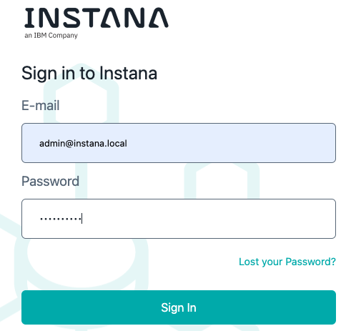
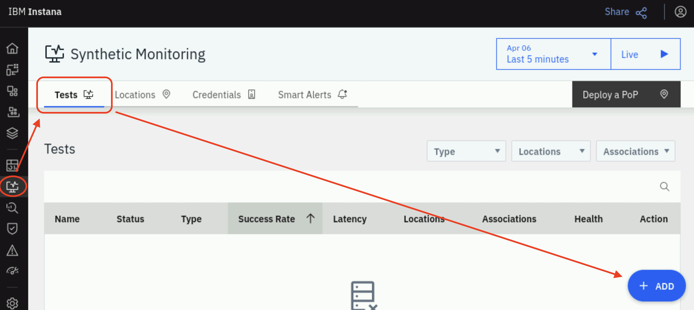
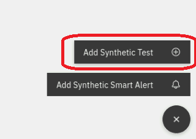
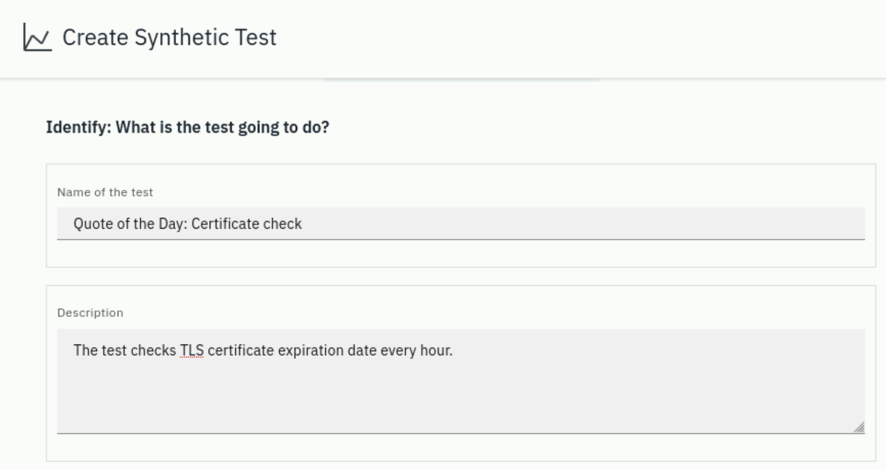
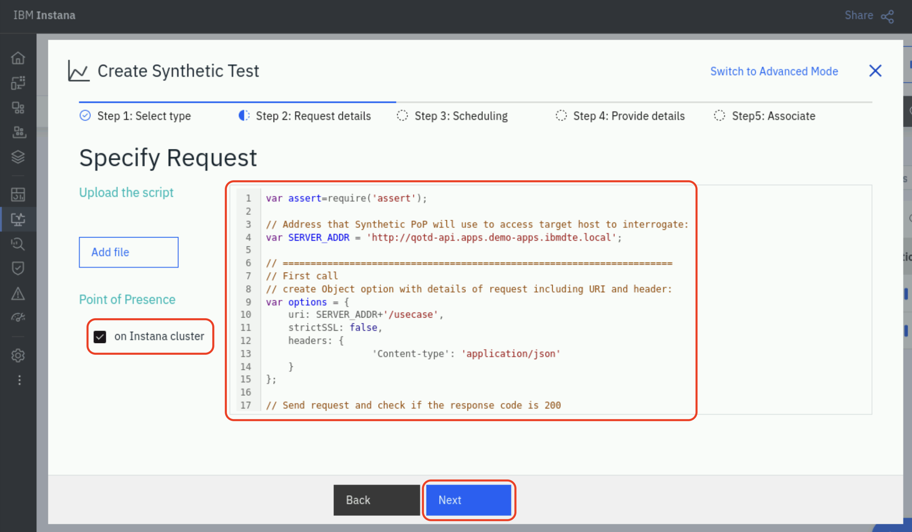
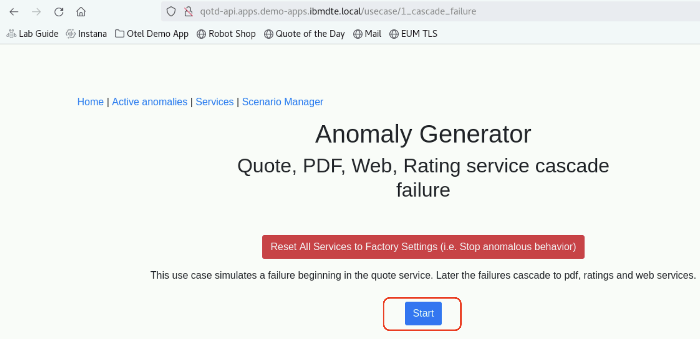
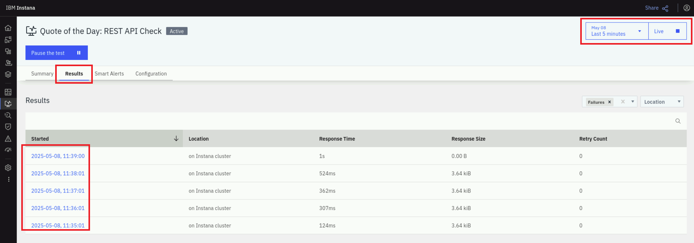

# Synthetic Monitoring

This lab focuses Instana's synthetic monitoring feature.

Key capabilities that will be exercised are:

- Setting up the synthetic "Point of Presence". This is the component that
  executes the synthetic test(s).
- Creating a test for TLS certificate checking.
- Creating a single REST API synthetic test.
- Using JavaScript to execute a scripted synthetic test that exercises multiple
  REST calls.
- Configure Smart Alerts against synthetic tests.

Before we can create any synthetic tests, we must first set up a synthetic
"Point of Presence" or "PoP server" to playback our synthetic tests. Many
customers deploy two or more "Points of Presence" so that they can compare the
response time and availability from different network zones. For example, if a
PoP server running in the LAN network performs well, but a PoP server located on
a WAN network is performing poorly, it is a clear indication that the problem is
the network or load balancer rather than the application.

In the lab, we will begin by installing the "_Synthetic Point Of Presence_".

## Open a terminal session on the bastion host

From the Bastion host, open a terminal window by selecting **Activities** at the
top left of the screen and then the terminal icon.

:::tip

If you are unsure how to get access to the Bastion host (Guacamole) see
[Accessing a Lab Environment](/waiops-tech-jam/labs/jam-in-a-box/#accessing-a-lab-environment)

:::


## Enable the _Synthetic Point Of Presence_ backend feature

We will be installing the _Synthetic Point Of Presence_ onto the same K3s
cluster that the Instana backend is running on. In order to do that, we'll need
a CLI with access to the K3s cluster.

In the bastion terminal window use the following command to connect to the
primary Instana host:

```sh title="Host: bastion-gym-lan"
ssh jammer@instana-0
```

When prompted if you want to continue connecting, type: `yes`

Use sudo to become root.

```bash title="Host: instana-0"
sudo -i
```

You are now operating as root on the primary Instana host.

You can check to ensure you are in the right place by running the following:

```bash title="Host: instana-0"
kubectl get nodes
```

You should see the following output:

```bash title="Example Output"
NAME        STATUS   ROLES                       AGE   VERSION
instana-0   Ready    control-plane,etcd,master   25h   v1.31.5+k3s1
instana-1   Ready    control-plane,etcd,master   25h   v1.31.5+k3s1
instana-2   Ready    control-plane,etcd,master   25h   v1.31.5+k3s1

```

A synthetic feature must be enabled in the Instana backend in order to execute
the synthetic tests. Follow the steps below to enable the synthetics feature
within the Instana cluster. The feature is a backend functionality that allows
the integration of one or many Synthetics Point Of Presence components, placed
in different locations, into the same Instana Backend.

Enable the synthetic feature of the core component:

```bash title="Host: instana-0"
stanctl backend apply --core-feature-flags feature.synthetics.enabled=true
```

If prompted, press ENTER to auto-generate TLS certificate.

Ensure synthetic pods have started successfully:

```bash title="Host: instana-0"
watch -n 2 "kubectl get pods -A | grep synthetic"
```

list of pods should include 5 components:

```text title="Example Output"
instana-core      sli-synthetics-filter-6b4d4cc884-g9qfv          1/1     Running   0   45s
instana-core      synthetics-acceptor-6cfff7c567-b867k            1/1     Running   0   45s
instana-core      synthetics-health-processor-79d9998465-b8w5r    1/1     Running   0   45s
instana-core      synthetics-reader-65fb59499f-vq667              1/1     Running   0   45s
instana-core      synthetics-writer-6fbfc76b56-kpg4d              1/1     Running   0   44s
```

Once all pods are in a `Running` state, press `CTRL+C` to return to the terminal
prompt.

At this point, the Instana cluster is capable of displaying synthetic tests, but
you still need to install the "_Synthetic Point Of Presence_", the component
which will run the tests.

## Install the _Synthetic Point Of Presence_ component

This is the component that plays synthetic tests and reports results to the
Instana backend server.

We will use **Helm**, a package manager for Kubernetes to install the _Synthetic
Point of Presence_ component. First install Helm by running the following
commands:

```sh title="Host: instana-0"
curl -fsSL -o get_helm.sh https://raw.githubusercontent.com/helm/helm/main/scripts/get-helm-3
chmod 700 get_helm.sh
./get_helm.sh
```

From the Bastion host open the Firefox browser and select the **Instana**
bookmark.


:::info

You can safely ignore the warning about the certificate being untrusted.


:::

When prompted, enter the username and password:

- Username: **admin@instana.local**
- Password: **Passw0rd**



From the left menu select **Synthetic Monitoring** and then click the **Deploy a
PoP** button on the right side:


:::tip Can't see the Synthetic Monitoring menu item?

In a normal working environment, if you already had the Instana web console open
before you enabled the _Synthetic Point of Presence_ feature, a page refresh is
required to see the new **Synthetic Monitoring** navigation item.

:::

Use the **Simple** tab for a Helm deployment command:


You will need to copy and edit the parameters of the helm command, so copy and
paste the text into a temporary file where you can edit the content before
executing it, for example "Text editor":


For _Synthetic Point Of Presence_ we need to modify some of the parameters and
provide one additional parameter.

- Set **namespace** for PoP on a new cluster, let's use `instana-synthetic`.
- Modify the **controller.clusterName** parameter and provide a meaningful name,
  let's set it as `MyInstanaCluster`.
- In the **controller.location** parameter, specify a name, display name,
  country, etc. for your _Point of Presence_.

  Format of location parameter is
  `label; displayLabel; country; city; latitude; longitude; description`, where
  label acts as the PoP identifier, it must be a single string without any space
  characters. The `label` field can contain only letters, numbers, hyphens, and
  the underscore character.

  For example:

  ```text
  "Local;on Instana cluster;Serbia;Belgrade;39.54;116.23;A test _Synthetic Point Of Presence_"
  ```

- Enter a **redis** password. This can be any value since you are setting the
  password. We will use `a1fc5d01bcbb`.

:::info Running Instana on OpenShift v4.11 and above?

For OpenShift based deployments, add the following parameter to you `helm`
command:

```sh
--set seccompDefault=true
```

This parameter is **not** required for this lab as it is using Instana Standard
Edition (on K3s).

:::

Execute the helm chart install command by copying it from your test editor and
pasting it into the `root@instana-0` terminal session prompt. You should see an
output similar to the following:

```sh title="Example command and output"
root@instana-0:~# helm install synthetic-pop \
        --repo "https://agents.instana.io/helm" \
        --namespace instana-synthetic \
        --create-namespace \
        --set downloadKey="<hidden-in-this-example>" \
        --set controller.location="Local;on Instana cluster;Serbia;Belgrade;39.54;116.23;A test _Synthetic Point Of Presence_" \
        --set controller.clusterName="MyInstanaCluster" \
        --set controller.instanaKey="hhoOIodXPR6FhWGq468XUi" \
        --set controller.instanaSyntheticEndpoint="https://instana-0.ibmdte.local/synthetics" \
        --set redis.tls.enabled=false \
        --set redis.password="a1fc5d01bcbb" \
        synthetic-pop
NAME: synthetic-pop
LAST DEPLOYED: Sun Apr  6 17:53:51 2025
NAMESPACE: instana-synthetic
STATUS: deployed
REVISION: 1
TEST SUITE: None
NOTES:
CHART NAME: synthetic-pop
CHART VERSION: 1.2.13
APP VERSION: 1.292.0
```

## Verify installation

Confirm that all pods of the _Synthetic Point Of Presence_ are running:

```sh title="Host: instana-0"
watch -n 2 "kubectl get pods -n instana-synthetic"
```

Wait for all pods to be running and stop the `watch` command using "Ctrl+C".

After the _Synthetic Point Of Presence_ is installed verify its appearance in
the interface (refresh the browser page):


## Certificate expiration check with synthetic tests

This functionality allows you to establish certificate expiration checks for
websites. In the lab we will use a test application, _Quote of the day_, which
is installed on the `demo-apps` cluster.

### SSL Certificate synthetic test

From the left navigation menu select **Synthetic Monitoring**. Then select the
**Tests** tab and click the **ADD** button:



From the pop-up options, select **Add Synthetic Test**:



On the top right corner of the dialogue click the **"Switch to advanced mode"**
button, then select **SSL Certificate** and click **Select**:


Specify the address of the test website as `qotd.apps.demo-apps.ibmdte.local`
and the number of days before certificate expiration that will trigger the test
to fail as `15`:


Scroll down to the **Locations** section and click **Select Location**, then
enable the `Local` location and click **Add Location**:


Scroll a little further to the **Schedule: When will this test run?** section
and set the frequency of the SSL checks to run every `1` hour:


Scroll to the **Identify: What is the test going to do?** section and give the
test a name and description. We will use values:

- **Name:** Quote of the Day: Certificate check
- **Description:** The test checks TLS certificate expiration date every hour.



:::info Additional optional configuration

When the website is part of an **Application** or **Website/Mobile App**, we can
choose certain defined Application perspectives or Website / Mobile Apps to
associate the test with. In that case filtering events by the selected
perspective will provide relevant context including TLS certificate checks.

You can also set **Custom Properties** in order to differentiate projects or
particular certificates for notifications.

We will not do these in this lab.

:::

Click **Create** to create the test.

:::tip Ensure **Live** updates are enabled

If you are not seeing the test appear in the **Tests** table, or the status
update, toggle on the **Live** button to get the latest updates.

:::


Click on the name of the test to investigate the summary of the certificate
check. If you see a message like `No results for this time frame`, then change
time the frame to a longer period, for example `last 30 minutes` and refresh the
browser page.

## REST API Synthetic Tests

In this exercise we will create a series of probes to test application REST API
endpoints.

### Simple REST API test

Let's begin by executing a simple REST API test. This will be a single HTTP
`GET` request.

Begin by navigating to **Synthetic Monitoring** in the left navigation menu, and
then click the **ADD** button:


From the pop-up menu options, Select **Add Synthetic Test**:


On the dialog that opens, you will see several options including **API Simple**
test. Leave the default of **API Simple** and click the **Next** button:


A new dialog will open prompting for the REST API **GET** URL. Enter the following URL:

```sh
https://qotd.apps.demo-apps.ibmdte.local/random
```

This could be any REST request. In this case, we are testing the `/random` API
call within the **Quote of the Day** application.

Then, select your **Point of Presence** location. This allows you to choose the
location(s) where you want your synthetic script to execute. In the lab, you
only have 1 location that you can select, select `on Instana cluster` and click
**Next**:


The next screen allows you to specify the scheduling interval for your synthetic
test. Drag the time slider to 1 minute. Then, select **Next**


On the next screen you will give your synthetic test a name and description
using the values:

- **Name of the test:** `Random Quote`
- **Description:** `Quote of the Day, Random Quote REST test`

Click the **Next** button:


On the next step, you can associate the synthetic test with an application. In
this lab we didn't create any Application Perspectives, we will skip the
optional step.

Finally, click the **Create** button to finish creating your synthetic test.

At this point, you should see a synthetic test named **Random Quote**:


It will take up to a minute for the synthetic tests to begin executing, so wait
for the **Health** to update and show a green check mark.

Click on the **Random Quote** link to drill down into the details of the
synthetic test.

On the screen, you can see a summary of the synthetic results. Make sure to
adjust the time window to `Last 5 minutes`:


You can also click on the **Results** tab and see the detailed results of each
synthetic test.

You have now created a synthetic test against a single REST API. Next, we will
be learning how to create more complex synthetics using JavaScript.

### Creating a scripted REST API test

**Scripted REST API synthetic tests** may include several calls and different
HTTP methods, e.g. `GET | POST |PUT |DELETE` in the same test. During the lab we
will be testing two `GET` requests:

- First, we will check if the **Quote of the day** application returns a success
  code of **200**.
- Next, the script will perform a functional test by checking for the
  correctness of a `GET` request response.

To create a synthetic test navigate to "Synthetic Monitoring" in the left
navigation menu, and click the **ADD** button in the bottom-right corner:


From the pop-up options, select **Add Synthetic Test**:


In the **Create Synthetic Test** dialog, select **API Script** and click the
**Next** button:


Paste the following JavaScript code into the text field as shown below:

```javascript
var assert = require("assert")

// Address that Synthetic PoP will use to access target host to interrogate:
var SERVER_ADDR = "http://qotd-api.apps.demo-apps.ibmdte.local"

// ======================================================================
// First call
// create Object option with details of request including URI and header:
var options = {
  uri: SERVER_ADDR + "/usecase",
  strictSSL: false,
  headers: {
    "Content-type": "application/json",
  },
}

// Send request and check if the response code is 200
$http.get(options, function (error, response, body) {
  var bodyObj = JSON.parse(body)
  assert.ok(
    response.statusCode == 200,
    "GET status should be 200. Instead it's " + response.statusCode,
  )
})

// ======================================================================
// Second call
// create Object option with details of request including URI and header:
var options = {
  uri: SERVER_ADDR + "/usecase",
  strictSSL: false,
  headers: {
    "Content-type": "application/json",
  },
}

// Send request and check if the status is empty
$http.get(options, function (error, response, body) {
  var bodyObj = JSON.parse(body)
  assert.ok(
    bodyObj[0].status == "",
    "First anomaly status: " + bodyObj[0].status,
  )
})
```

Also, ensure to select the `on Instana cluster` checkbox. Instana will run the
script from the previously installed _Synthetic Point of Presence_, which can be
placed at multiple locations across available infrastructure. The one we will
use is deployed on the same cluster with Instana. Note, it may have a different
name in different releases of Instana:



Click **Next**.

In the **Scheduling** section, adjust the time slider to run the test every `1`
minute:


Then, click **Next** button.

Give the test a meaningful name and description, then click **Next**. We will
use values:

- **Name of the test:** `Quote of the Day: REST API Check`
- **Description:**
  `Performs anomaly check of Quote of the Day application via REST interface`


At the **Associate** step you may specify the list of existing application
perspectives for which the test is relevant. The result of the test will appear
on the **Synthetic Monitoring** tab of the _Application_ dashboard and you will
be able to filter tests by application on the **Synthetic Monitoring**
dashboard. We didn't create any Application Perspectives in this lab, so will
skip this step.

Click the **Create** button.

It may take up to a minute for Instana to perform the first test and show the
results. You can refresh the browser window or change the time duration for the
dashboard on right top of the window to speed up the status update.

For this lab, change the time window to `Last 5 minutes`.

By now you should see a list of tests:


Click on the test name to access the dashboard of the synthetic test, open
**Results** tab and select one of the test records:


:::note What is the test script doing?

In this lab, we use Quote of the Day's Anomaly Generator service as an example
of an application with a REST API. The script we implemented above is checking
the status of the first task in the generator's list, i.e. task
`Quote, PDF, Web, Rating service cascade failure`:

```javascript
. . .
// Send request and check if the status is empty
$http.get(options, function(error, response, body) {
    var bodyObj = JSON.parse(body);
    assert.ok(bodyObj[0].status == "", "First anomaly status: " + bodyObj[0].status);
});
```

There are two possible values, "" (empty) and "running". Once we execute the
anomaly test `Quote, PDF, Web, Rating service cascade failure` which is first in
the list, the status of the record will become `running` and our API REST script
test will fail because it expects an empty value.

:::

### Generate the error for the test to detect

Start by checking the status of the first record by opening the following
address in a new browser tab:

```text
http://qotd-api.apps.demo-apps.ibmdte.local/usecase
```


Next, in a separate browser tab, open the `Anomaly generator`:

```text
http://qotd-api.apps.demo-apps.ibmdte.local
```

Click on the first anomaly `Quote, PDF, Web, Rating service cascade failure`:


Click the **Start** button to generate the anomaly:



Switch to Instana browser tab, click on the **Results** tab and then click the
**Live** button to view the results of the synthetic tests as they become
available.

Filter on `Failed` tests:


Now, wait about a minute and you will see new test results that have a failure
status (to avoid waiting for automatic refresh you can change the timeframe in
the top right corner, next to **Live** button):



Click on any failed test and you should see a result similar to:


:::note Got an `"undefined" is not valid JSON` or other result?

Sometimes, since this is a lab environment with limited resources, you may see a
different result, such as:


If you happen to see this or another error, it is ok and you can still carry on.
Either try clicking on a few other results and you will see one that matches the
expected error, or ignore this and carry on to the next step.

The key point of this section is that a test failure should generate an event in
the next section.

:::

The test fails because the Synthetic API test expects an empty status, but in
this case it receives status `running`.

## Create a Smart Alert for a test

Smart Alerts allow you to identify a threshold violation. Then, if desired,
alert people via external systems like AIOps, Email, Slack, Service Now, etc. In
Instana, the notification mechanism is called an **Alert Channel**.

To create an Alert Channel, navigate to **Synthetic Monitoring**, then click the
**Add** button:


Then, select **Add Synthetic Smart Alert**:


Next, in the **Create smart alert** dialog, click the **Add Synthetic Test**
link:


Find the test you created earlier and select the **checkbox**. Then, click **Add
1 Test**


Click **Next** to go to **Step 2: Scope** of the dialog.

You may optionally add filters to scope what is being monitored. In this case,
we will not be adding any filters, so click **Next** to go to the **Step 3: Time
Threshold** section of the dialog.

We choose 1 consecutive occurrence to fire an alert, then click **Next** to go
to **Step 4: Alert channels**:


On this step, we will be selecting an _Alert Channel_. These allow you to notify
people and teams through various **channels** such as email, slack, ServiceNow,
etc.

Click the **"Select alert channels"** link, then in the new dialog section that
appears, click the **Create alert channel** link :


Now, populate the alert channel details as below:

- **Alert channel type:** `Email`
- **Name:** `Quote of the Day admins`
- **Emails:** `qotd-admins@my.com`:
  - **Note:** We will not send emails to real addresses in this lab, so just
    populate the field with any email address.

Click the **Create Alert Channel** button to create the new channel:


Now, select the newly created channel and click the **Add 1 Channel** button:


Next, click the **Next** button to proceed to the **Step 5: Alert properties**
section.

Configure the alert that will be visible when the threshold is violated. Set the
following values:

- **Title:** `Quote of the Day functional test failed`
- **Alert level:** `Warning`
- **Description:** `Returned value is incorrect`

Then click the **Create** button:


Now, back in the **Synthetic Monitoring** view, select the **Smart Alerts** tab
to see the newly configured alert:


:::tip Don't see the smart alert yet?

Try refreshing the page.

::::

Next, navigate to the **Events** view and select the **Issues** tab to ensure
that an event was generated:


When new events trigger on the synthetic test, an email will be sent out via the
**Alert Channel** notifying the recipients of the failure. Click on the event to
investigate the details.

## Summary

During this lab we have:

- Enabled the Synthetic feature that allows the Instana backend to receive and
  display synthetic test results.
- Installed a _Synthetic Point Of Presence_ that executes tests and report
  results to the Instana Backend.
- Created a TLS certificate expiration test.
- Created a simple synthetic test using a REST `GET` call that checks if we
  receive a `200` response status code.
- Created a complex synthetic test that uses JavaScript to exercise two REST
  calls and perform an evaluation on the response.
- Configured a Smart Alert for a synthetic test to report issues in the Instana
  Events dashboard and send notifications to admins via email.
