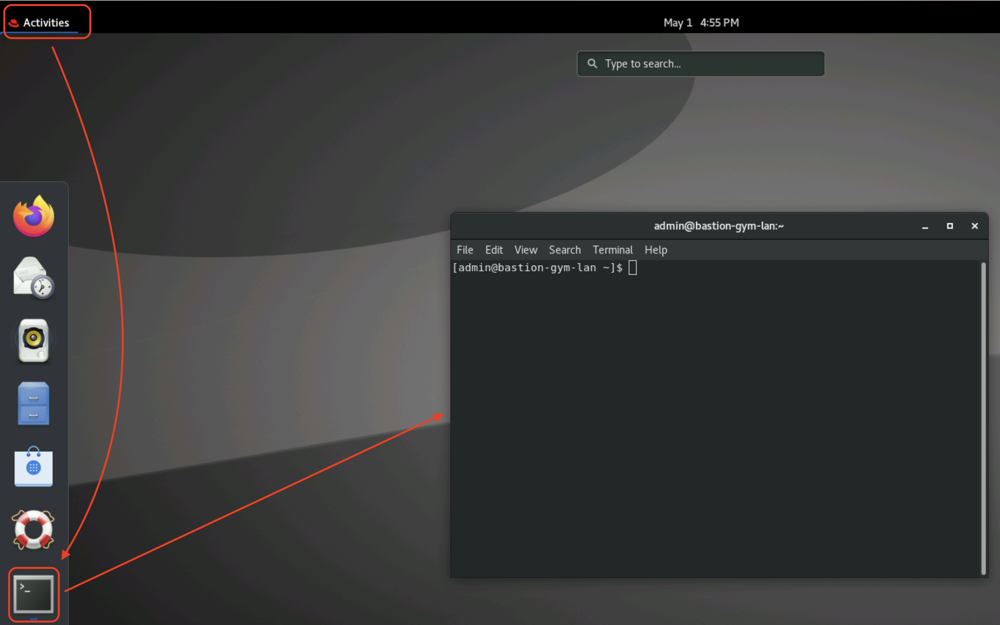
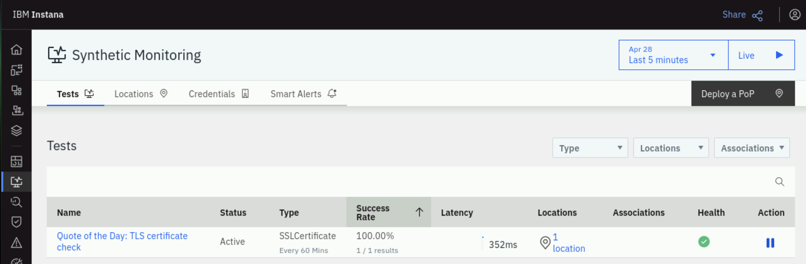
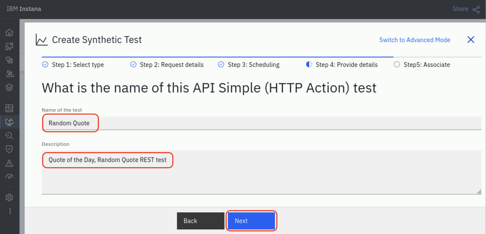
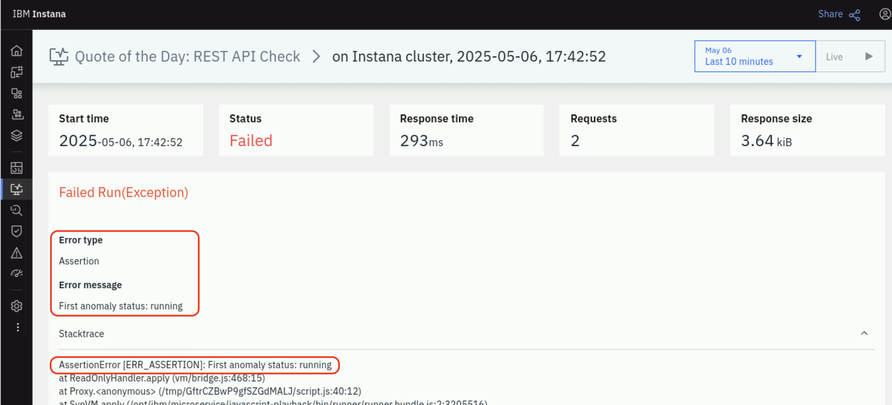

# Synthetic Monitoring

<!-- :::warning Work In Progress

This lab is currently under development.

::: -->

This lab focuses on new Instana features - synthetic monitoring.

Key capabilities that will be exercised are:

- Setting up the synthetic "Point of Presence" This is the component that
  executes the synthetic test.
- Creating test fot TLS certificate checking
- Single REST API synthetic test
- Using javascript to execute a scripted synthetic test that exercises multiple
  REST calls
- Setup Smart Alerts against synthetic tests

Before we can create any synthetic tests, we must first setup a synthetic "Point
of Presence" or "PoP server" to playback our synthetic tests. Many customers
deploy two or more "Points of Presence" so that they can compare the response
time and availability from different network zones. For example, if a PoP server
running in the LAN network performs well, but a PoP server located on a WAN
network is performing poorly, it is clear indication that the problem is the
network or load balancer rather than the application.

In the lab, we will begin by installing the "Synthetic Point of Presence".

## Open bastion terminal

Open Guakamole link from techzone environment dashboard:


In the Red Hat Linux desktop click "Actions" -> "Terminal" to open bastion terminal:


## Enable backend feature "Synthetic Point of Presence"

We will be installing the Synthetic Point of Presence onto the same K3s cluster with Instana backend. In order to do that, we'll need a CLI with access to the K3s cluster.

In the bastion terminal window use the following command to connect to instana cluster:

```sh
ssh jammer@instana-0
```

the access to Instana cluster doesn't require password. When logged in change user to root to have configured environment with kubectl command:

```sh
sudo su -
```

Make sure you are logged into the K3s cluster by typing "kubectl get nodes". The command should result with a list of 3 nodes of the cluster.

A synthetic feature must be enabled in the Instana backend in order for you to play the synthetic tests. Follow the steps below to enable the synthetics feature within the Instana cluster. The feature is a backend functionality that allows to integrate one or many Synthetics Point Of Presence components placed in different locations into the same Instana Backend.

Enable synthetic feature of core component by command:
```bash
stanctl backend apply --core-feature-flags feature.synthetics.enabled=true
```

If asked, press ENTER to auto-generate TLS certificate.

Ensure synthetic pods have started successfully:

```bash
kubectl get pods -A | grep synthetic
```

list of pods should include 5 components:
```text
instana-core      sli-synthetics-filter-6b4d4cc884-g9qfv          1/1     Running   0   45s
instana-core      synthetics-acceptor-6cfff7c567-b867k            1/1     Running   0   45s
instana-core      synthetics-health-processor-79d9998465-b8w5r    1/1     Running   0   45s
instana-core      synthetics-reader-65fb59499f-vq667              1/1     Running   0   45s
instana-core      synthetics-writer-6fbfc76b56-kpg4d              1/1     Running   0   44s
```

At this point, the Instana cluster is capable of displaying synthetic tests, but you still need to install the "Synthetic Point of Presence" a component which  will run the tests.

## Install "Synthetic Point Of Presence"

"Synthetic Point Of Presence" is a component that plays synthetic tests and reports result to Instana backend server.

Install helm using command on instana-0 node:
```bash
curl https://raw.githubusercontent.com/helm/helm/main/scripts/get-helm-3 | bash
```

From top left corner of Red Hat Linux dashboard click "Activities", select Firefox to open browser. Select Instana from bookmark bar.
Login to Instana.

by default username: `admin@instana.local`, password: `Passw0rd`

From the left menu select "Synthetic Monitoring" and then click on "Deploy a PoP" button on the right side:


Use **Simple** tab for Helm command.


You will need to copy and edit parameters of the helm command, so copy and paste the text into a temporary file where you can edit the content before executing it, for example "Text editor":


For Synthetic Point of Presence we need to modify some of the parameters and provide one additional parameter.
- Set **namespace** for PoP on a new cluster, let's use "instana-synthetic".
- Modify the **controller.clusterName** parameter and provide a meaningful name, let's set i as "MyInstanaCluster".
- In the **controller.location**, specify a name, display name, country, etc. for your "Point of Presence".
  
  Format of location parameter is `label; displayLabel; country; city; latitude; longitude; description`, where label acts as the PoP identifier, it must be a single string without any space characters. The `label` field can contain only letters, numbers, hyphens, and the underscore character.
  
  For example: 
  ```text
  "Local;on Instana cluster;Serbia;Belgrade;39.54;116.23;A test Synthetic Point of Presence"
  ```

- Enter a redis password.  This can be any value since you are setting the password. For example "a1fc5d01bcbb".
- ***If OpenShift versions 4.11 and above is used*** add `--set seccompDefault=true \`.  This parameter is **not** required for the lab as in our case seccompProfile is of DefaultRuntime type by default.

Execute the helm chart install command. You should see an output similar to the following:

```sh
root@instana-0:~# helm install synthetic-pop \
        --repo "https://agents.instana.io/helm" \
        --namespace instana-synthetic \
        --create-namespace \
        --set downloadKey="***" \
        --set controller.location="Local;on Instana cluster;Serbia;Belgrade;39.54;116.23;A test Synthetic Point of Presence" \
        --set controller.clusterName="MyInstanaCluster" \
        --set controller.instanaKey="t7g6RMBU12KpiPy2tW3Vox" \
        --set controller.instanaSyntheticEndpoint="https://instana-0.ibmdte.local/synthetics" \
        --set redis.tls.enabled=false \
        --set redis.password="a1fc5d01bcbb" \
        synthetic-pop
NAME: synthetic-pop
LAST DEPLOYED: Sun Apr  6 17:53:51 2025
NAMESPACE: instana-synthetic
STATUS: deployed
REVISION: 1
TEST SUITE: None
NOTES:
CHART NAME: synthetic-pop
CHART VERSION: 1.2.13
APP VERSION: 1.292.0
```

## Verify installation

Confirm that all pods of the Synthetic Point of Presence are running by typing:
```sh
watch "kubectl get pods -n instana-synthetic"
```

Wait for all pods to be running and stop watch command with "Ctrl + C".

After the Synthetic point of presence is installed verify its appearance in the interface (refresh the browser page):


## Certificate expiration check with Synthetic Tests
The functionality allows to establish certificate expiration check for websites. In the lab we will use a test application "Quote of the day" which is installed on VM demo-apps.

### SSL Certificate synthetic test
From the left menu select "Synthetic Monitoring", on "Tests" tab click "ADD":


choose "Add Synthetic Test".

On the top right corner of the dialogue click button **"Switch to advanced mode"**. Choose "SSL Certificate" and click "Select":


Specify the address of the test website "qotd.apps.demo-apps.ibmdte.local" and the number of days before certificate expiration when test will fail:


Scroll down to Locations section and choose "Select Location", put the checkmark next to "Local" and press "Add Location":


Select frequency of the SSL checks:


Give the test name and description:


When the website is part of Application or Website/Mobile App we can choose certain Application perspective, Website or Mobile application to associate the test with existing instance. In that case filtering events by selected perspective will provide relevant context including TLS certificate checks. In the end of the dialogue Custom Properties may be specified in order to differentiate project or particular certificate for notifications.

Click "Create".

Wait for up to one minute for the first check to have place. You may refresh the browser page to see the green icon "Health" of the test before automatic page refresh:



Click on the name of the test to investigate summary of the certificate check. If you see message "No results for this time frame", then change time frame for longer period, for example "last 30 minutes" and refresh the browser page.

## REST API Synthetic Tests
In the exercise we will follow creating a test of series of probes. 

### Simple REST API test

Let's begin by executing a simple REST API test. This will be a single REST GET
request.

Begin by selecting **Synthetics** and then **+ ADD** as seen below.


Then, choose the **Add Synthetic Test** button:


On the dialog that opens, you will see several options including **API Simple** test. Leave the default of **API Simple** and click the **Next** button:  


A new dialog will open prompting for the REST API **GET** URL.   Enter the following URL:
```sh
https://qotd.apps.demo-apps.ibmdte.local
```

This could be any REST request. In this case, we are testing the /random API
call within the "Quote of the Day" application.

Then, select your **Point of Presence** location and click **Next**. This allows
you to choose the location(s) where you want your synthetic script to execute.
In the lab, you only have 1 location that you can select.


The next screen allows you to specify the scheduling interval for your synthetic test. Drag the time slider to 1 minute. Then, select **Next**


On the next screen you will give your synthetic test a name and description. 



On the next step, you can associate the synthetic test with an application. In this lab we didn't create any Application Perspectives, we will skip the optional step.

Finally, click the **Create** button to finish creating your synthetic test.


At this point, you should see a synthetic test named **Random Quote**:


Click on the **Random Quote** link to drill down into the details of the
synthetic test.

It will take up to a minute for the synthetic tests to begin executing.

On the screen, you can see a summary of the synthetic results. 


You can also click on the **Results** tab and see the detailed results of each synthetic test.

You have now created a synthetic test against a single REST API.  Next, we will be learning how to create more complex synthetics using javascript.  

The example we will be using against test "Quote of the Day" application. That will be our next step.


### Creating a scripted REST API test

**Scripted REST API synthetic tests** may include several calls and different types GET/POST/PUT/DELETE in the same test. During the lab we will be doing two GET requests:
- First, we will check if "Quote of the day" application returns success code of **200**
- Next, the script will perform functional test by checking correct response from exact REST API request.

To create synthetic test open "Synthetic Monitoring" and click "+ ADD" button on the right bottom corner:


Choose "Add Synthetic Test"

Select "Script API" and click "Next" button:


Paste the script into a field as shown below:

```javascript
var assert = require("assert")

// Address that Synthetic PoP will use to access target host to interrogate:
var SERVER_ADDR = 'http://qotd-api.apps.demo-apps.ibmdte.local';

// ======================================================================
// First call
// create Object option with details of request including URI and header:
var options = {
    uri: SERVER_ADDR+'/usecase',
    strictSSL: false,
    headers: {
                   'Content-type': 'application/json'
    }
};

// Send request and check if the response code is 200
$http.get(options, function (error, response, body) {
  var bodyObj = JSON.parse(body)
  assert.ok(
    response.statusCode == 200,
    "GET status should be 200. Instead it's " + response.statusCode,
  )
})

// ======================================================================
// Second call
// create Object option with details of request including URI and header:
var options = {
    uri: SERVER_ADDR+'/usecase',
    strictSSL: false,
    headers: {
                   'Content-type': 'application/json'
    }
};

// Send request and check if the status is empty
$http.get(options, function(error, response, body) {
    var bodyObj = JSON.parse(body);
    assert.ok(bodyObj[0].status == "", "First anomaly status: " + bodyObj[0].status);
});
```

As follows:


Instana will run the script from previously installed Synthetic Point of
Presence, they can be placed at multiple locations across available
infrastructure. The one we will use is deployed on the same cluster with
Instana, it may have different name. Select it for our test.

Click Next

Adjust time slider to run test every minute:


and click "Next" button.

Give the test meaningful name and description and click "Next":


At the "Associate" step you may specify the list of existing application perspectives for which the test is relevant. The result of the test will appear at the "Synthetic Monitoring" tab of the Application dashboard and you will be able to filter tests by application on Synthetic Monitoring dashboard. We didn't create any Application Perspectives in the lab, so will skip the step.

Click "Create" button.

It may take up to minute for Instana to perform the first test and show the line
with results. You can refresh browser window and changing time duration for the
dashboard on right top of the window to speed up the line to appear before the
results of first test will be processed.

By now you should see a list of tests:


Click on the test name to access the dashboard of the synthetic test, open "Results" tab and select one of the tests:


In the Lab we use "Anomaly generator" as an example of the application with REST API interface.
The script is checking status of the first task "Quote, PDF, Web, Rating service cascade failure" of "Anomaly generator":
```javascript
. . .
// Send request and check if the status is empty
$http.get(options, function(error, response, body) {
    var bodyObj = JSON.parse(body);
    assert.ok(bodyObj[0].status == "", "First anomaly status: " + bodyObj[0].status);
});
```
there are two possible values "" (empty) and "running". Once we execute the anomaly test "Quote, PDF, Web, Rating service cascade failure" which is first in the list, the status of the record becomes "running" and our API REST script test fails because it expects empty value.

Check status of the first record by opening the address in a new browser tab:
```text
http://qotd-api.apps.demo-apps.ibmdte.local/usecase
```


Open "Anomaly generator" in a separate tab of Firefox browser: 
```text
http://qotd-api.apps.demo-apps.ibmdte.local
``` 


Click on first anomaly "Quote, PDF, Web, Rating service cascade failure":


Click "Start" to generate anomaly:


Switch to Instana browser tab, click on the **Results** tab and then click the **Live** button to view the results of the synthetic tests as they become available.
Now, wait about a minute and you will see new test results that have a failure status (to avoid waiting for automatic refresh you can change timeframe on top right corner, next to "Live" button):


Click on the failed tests and you will see text similar to the following:


The test fails because Synthetic API test expects empty status, while it receives status "running".

## Create smart Alert for test

Smart Alerts allow you to identify a threshold violation. Then, if desired,
Alert people via external systems like Watson AIOps or Email, Slack, Service
Now, etc. in Instana the notification mechanism is called an **Alert Channel**

Click "Synthetic Monitoring" -> "Add"


Then, select **"Add Synthetic Smart Alert"**:


Click **"Add Synthetic Test"**


Find the test you created earlier and select the **checkbox**. Then, click **Add 1 Test**


Click **Next** to go to the step 2 of the dialog.

You may optionally add filters for monitored what is being monitored. In this case, we will not be adding any filters.

Click **Next** to go to step 3

We choose 1 consecutive occurrence to fire an alert, click **Next** to go to Step 4

On this step, we will be selecting an Alert Channel. Alert Channels allow
you to notify people and teams various **channels** such as email, slack,
ServiceNow, etc.

Select **"Select Alert Channels"**, **"Create Alert Channel"** to create new channel, then populate name of the channel and the list of email addresses (we will not send emails to real addresses, so just populate the field with any email address):


Then, click **"Create Alert Channel"**.

Select created channel and click **"Add 1 Channel"**:


And click **"Next"** to proceed to step 5.

Configure the alert that will be visible when the threshold violated. **Set meaningful values for Title, Alert Level and Description**, then click **"Create"** button:


Click **"Smart Alerts"**, refresh page to have the alert appeared:


Click **Events -> Issues** to ensure that event was generated:


When new Events trigger on the synthetic test, an e-mail will be sent out via the **Alert Channel** notifying the people of the failure.
Click on the event to investigate details.

## Summary

During the lab we have:

- enabled Synthetic feature that allows Instana backend receive and display synthetic test results
- installed Synthetic Point of Presence that executes tests and report results to Instana Backend
- created a TLS certificate expiration check
- created a simple synthetic test using a REST GET call that checks if we receive code 200
- created a complex synthetic test that uses javascript to exercise two REST calls and perform an evaluation
- configured Smart Alert for a synthetic test to report issues in Instana Events dashboard and send notification to admins via email.
