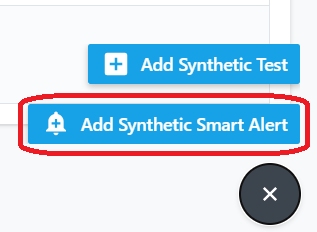
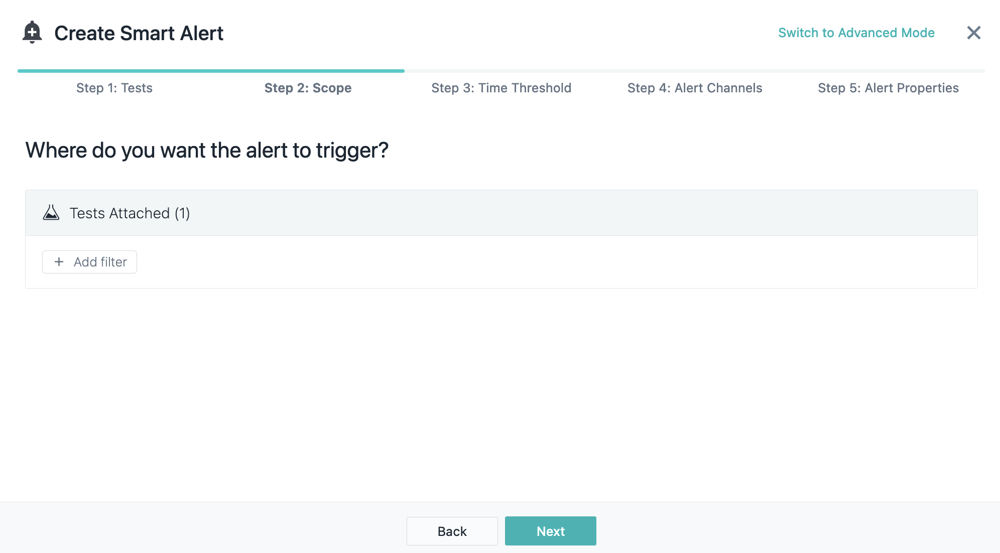

# Synthetic Monitoring

In this Lab exercise we will create synthetic tests to check services availability with Instana and notify responsible contacts. First, we will install Synthetic Point of Presence component and enable it in Instana backend. In the second exercise we will create token in Instana backend to interogate Instana via REST. The third exercise will guide us to create a test of two probes. As example we will monitor number of managed objects. Final exercise is about creating Smart Alert to notify responsible teams.

## Install Synthetic Point of Presence component

Access to bastion node.

:::tip

If you are unsure how to get access to the Bastion host (Guacamole) see
[Accessing a Lab Environment](/waiops-tech-jam/labs/jam-in-a-box/#accessing-a-lab-environment)

:::

From the Bastion host (Guacamole), open a terminal window by selecting
**Activities** at the top left of the screen and then the terminal icon.


Navigate to "instana-core" namespace and edit core component of Instana backend cluster by commands:
```bash
oc project instana-core
oc edit core
```

add the following 5 feature flags in spec -> featureFlags section to enable Synthetics features:
```yaml
spec:
  featureFlags:
  - enabled: true
    name: feature.synthetics.enabled
  - enabled: true
    name: feature.synthetic.smart.alerts.enabled
  - enabled: true
    name: feature.synthetic.create.test.advance.mode.enabled
  - enabled: true
    name: feature.synthetic.browser.create.test.enabled
  - enabled: true
    name: feature.synthetic.browser.script.enabled
```
Pay attention to indentation.
Save and exit. 

Ensure synthetic pods have started sucessfully:
```text
[root@localhost ~]# oc get pods | grep synthetic
synthetics-acceptor-558ff84bbb-g2wxq           1/1     Running   0          5m
synthetics-health-processor-5c8c8c57fb-5fwvb   1/1     Running   0          5m
synthetics-reader-5f59b6df4f-8kn9r             1/1     Running   0          5m
synthetics-writer-579d5cf458-7tx7q             1/1     Running   0          5m
[root@localhost ~]# 
```

If Helm wasn't installed on previous labs, install it on bastion node now using:
```bash
curl https://raw.githubusercontent.com/helm/helm/main/scripts/get-helm-3 | bash
```

Click on "Synthetic Monitoring" and then on "Deploy a PoP" button:


Use "Simple" tab for Helm command. For Synthetic Point of Presence we need to provide certain parameters, for example:
```bash
helm install synthetic-pop \
    --repo https://agents.instana.io/helm  \
    --namespace instana-synthetic \
    --create-namespace \
    --set downloadKey="***" \
    --set controller.location="Local;on Instana cluster;Serbia;Belgrade;39.54;116.23;A test Synthetic Point of Presence" \
    --set controller.instanaKey="***" \
    --set controller.clusterName="MyInstanaCluster" \
    --set controller.instanaSyntheticEndpoint="https://instana.apps.***.ibm.com/synthetics" \
    --set redis.tls.enabled=false \
    --set redis.password="a1fc5d01bcbb" \
    synthetic-pop
```

Where:
* controller.location - includes Name; Display name; Country; City; Latitude; Longitude; Description. This information is used to differentiate this Synthetic Point of Presence from others.
* controller.instanaSyntheticEndpoint - address of a Synthetic acceptor on Instana backend server, that we configured previously.
* redis.password - redis password that will be established by Synthetic Point of Presence upon redis deployment.

Adjust values:
- controller.location
- controller.clusterName
- redis.password
and Install Synthetic Point of Presence using the command :

```text
[root@localhost ~]# helm install synthetic-pop \
>     --repo https://agents.instana.io/helm  \
>     --namespace instana-synthetic \
>     --create-namespace \
>     --set downloadKey="***" \
>     --set controller.location="Local;on Instana cluster;Serbia;Belgrade;39.54;116.23;A test Synthetic Point of Presence" \
>     --set controller.instanaKey="***" \
>     --set controller.clusterName="MyInstanaCluster" \
>     --set controller.instanaSyntheticEndpoint="https://instana.apps.***.ibm.com/synthetics" \
>     --set redis.tls.enabled=false \
>     --set redis.password="a1fc5d01bcbb" \
>     synthetic-pop
NAME: synthetic-pop
LAST DEPLOYED: Thu Jul 13 07:49:37 2023
NAMESPACE: instana-synthetic
STATUS: deployed
[root@localhost ~]#
```


After the Synthetic point of presence is installed verify its appearence in the interface:


## Using script for REST API check
In the exercise we will follow creating a test of series of probes and as example will monitor number of managed objects. 

We will interrogate Instana backend as an example of external application.

### Creating personal API token

As soon as we will check availability of Instana backend, we need a token to request data from backend. Token is a part of authentication and authorization mechanism, that allows access to certain kinds of data. Requests we are planing to place during the lab do not require special rights, we will create a basic token.

Create token by selecting "Settings" -> "Team Settings" -> "API Token" -> "Add API Token":


Give it a name:


There are no extra permissions needed for the lab, basic set is enough.

Click "Save" at the bottom of the page. 


### Creating REST API test

Synthetic scripts may include several calls and different types GET/POST/PUT/DELETE in the same test. During the lab we will be doing two GET requests:
- Checking if Instana backend as a target application returns positive code (200)
- Checking the number of currently reporting agents is less than threshold

Right click on "Synthetic Monitoring" and open it in a new browser tab:


To create synthetic test switch to just created browser tab with "Synthetic Monitoring" and click "+ ADD" button on the right bottom corner:


Choose "Add Synthetic Test"

Select "Script API" and click "Next" button:


1. Paste the script into a field as shown below:
```javascript
var assert=require('assert');

// Address that Synthetic PoP will use to access target host to interrogate:
var INSTANA_ADDR = 'https://unit0-tenant0.instana.apps.XXXXXXXX.ibm.com';

// Target system token that allows to serve the request (As soon as we
// interrogate Instana backend, it is Instana token):
var TOKEN = "0GKMs6mpSXqK9WMByM5lbg";

// ======================================================================
// First call
// create Object option with details of request including URI and header:
var options = {
    uri: INSTANA_ADDR+'/api/instana/health',
    strictSSL: false,
    headers: {
                   'Content-type': 'application/json',
                   'Authorization': 'apiToken ' + TOKEN
           }
};

// Send request and check if the response code is 200
$http.get(options, function(error, response, body) {
    assert.ok(response.statusCode==200, "GET status should be 200. Instead it's " + response.statusCode);
});

// ======================================================================
// Second call
// create Object option with details of request including URI and header:
var options = {
    uri: INSTANA_ADDR+'/api/infrastructure-monitoring/monitoring-state',
    strictSSL: false,
    headers: {
                   'Content-type': 'application/json',
                   'Authorization': 'apiToken ' + TOKEN
           }
};

$http.get(options, function(error, response, body) {
    var bodyObj = JSON.parse(body);
    assert.ok(bodyObj.hostCount < 2, "We bought license to monitor 2 hosts and we have reached " + bodyObj.hostCount + " already!");
});
```

As follows:


2. For the test we need Instana token, created on previous step. 
   - Switch to previous browser tab with Tokens: 
   - Click on eye on the right from the token and copy text.
   - Switch back to browser tab with script
   - Paste Token as value for TOKEN variable (line 9 on screenshot above)
   - Correct address for Target system (in our case it is Instana backend, so we named the variable appropriately: INSTANA_ADDR, line 5 on screenshot above)

3. Instana will run the script from previously installed Synthetic Point of Presence, they can be placed at multiple places across available infrastructure. The one we will use is deployed on the same cluster with Instana, it may have different name. Select it for our test.
   
4. Click Next


Adjust time slider to run test every minute:


and click "Next" button.


Give the test meaningful name and description:


At the dialog under "Select an Application" you may specify the list of existing applications for which the test is relevant. The result of the test will appear at the "Synthetic Monitoring" tab of the Application dashboard and you will be able to filter tests by application on Synthetic Monitoring dashboard.

Click "Create" button.

It may take up to minute for Instana to perform the first test and show the line with results. You can refresh browser window and changing time duration for the dashboard on right top of the window to speed up the line to appear before the results of first test will be processed.

By now you should see a list of tests:


Click on the test name to access the dashboard of the synthetic test:


At the moment we have 1 agent reporting to the backend, so the assert of the last check has been passed. We will adjust threshold of the assert to 1 so we can trigger the synthetic test to fail.

Repeat the creation step for additional "Failing test" with the script adjusted as `assert.ok(bodyObj.hostCount < 1,` at the last request instead of `< 2` as below:

```javascript
...
$http.get(options, function(error, response, body) {
    var bodyObj = JSON.parse(body);
    assert.ok(bodyObj.hostCount < 1, "We bought license to monitor 2 hosts and we have reached " + bodyObj.hostCount + " already!");
});
```

In the case the result will indicate that the parameter is out of the desired amount (monitored systems number threshold has been reached):


## Create smart Alert for test

Smart Alerts allow to escalate determined violation to umbrella monitoring systems like Watson AIOps or Email, Slack, Service Now, etc. in Instana it is called channel. 

Click "Synthetic Monitoring" -> "Smart Alerts" -> "ADD SYNTHETIC SMART ALERT":


Click "Add Synthetic Test" -> checkmark the failing test -> hit button "Add 1 Test"


Click "Next"

On step 2 you may add filter for monitored objects, click "Next"



On step 3 we choose 1 consecutive occurrence to fire an alert, click Next:


On step 4 select "Select Alert Channels", "Create Alert Channel" to create new channel, then populate name of the channel and the list of email addresses (we will not send emails to real addresses, so just populate the field with any email address):


and click "Create Alert Channel", click "Cancel" to finish channel creation procedure.

Select created channel and click "Add 1 Channel":


And click "Next":


On step 5 configure the alert that will be visible when the threshold violated. Set meaningful values for Title, Alert Level and Description, then click "Create" button:


Refresh page to have the alert appeared:


Check Events appeared:


## Summary

During the lab we:
- Configured target monitored system (created Token to request parameters)
- Created Synthetic test with script to call REST endpoint
- Created Smart Alert for the test