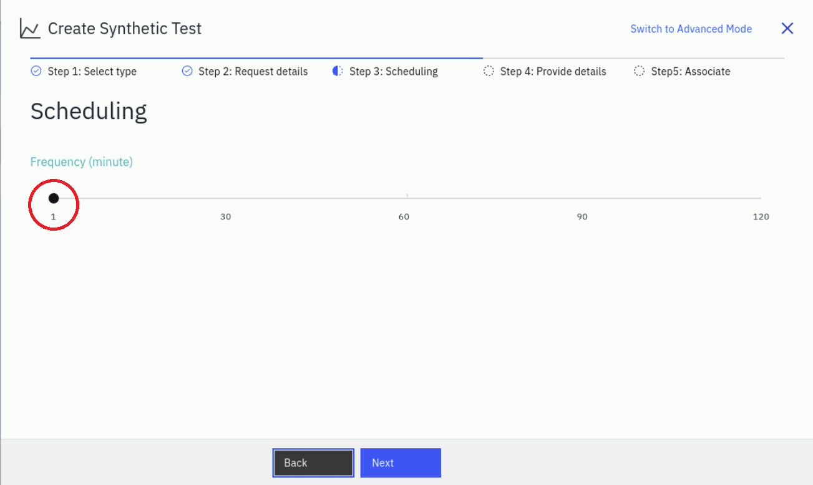
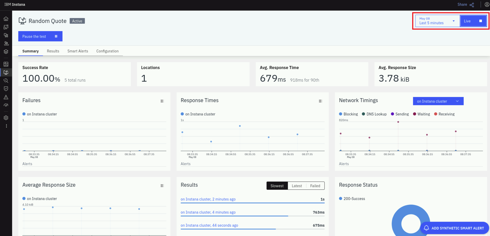

# Synthetic Monitoring

:::warning Work In Progress

This lab is currently under development.

:::

This lab focuses on new Instana features - synthetic monitoring.

Key capabilities that will be exercised are:

- Setting up the synthetic "Point of Presence" This is the component that
  executes the synthetic test.
- Single REST API synthetic test
- Using javascript to execute a scripted synthetic test that exercises multiple
  REST calls
- Setup Smart Alerts against synthetic tests

Before we can create any synthetic tests, we must first setup a synthetic "Point
of Presence" or "PoP server" to playback our synthetic tests. Many customers
deploy two or more "Points of Presence" so that they can compare the response
time and availability from different network zones. For example, if a PoP server
running in the LAN network performs well, but a PoP server located on a WAN
network is performing poorly, it is clear indication that the problem is the
network or load balancer rather than the application.

In the lab, we will begin by installing the "Synthetic Point of Presence".

## Install Synthetic Point of Presence component

We will be installing the Synthetic Point of Presence into the OpenShift (OCP)
cluster. In order to do that, we'll need access to a CLI will access to the OCP
cluster.

From the student VM, open a terminal window and type"

```sh
ssh root@bastion
```

When prompted, enter the password for the Bastion node.

Make sure you are logged into the OCP cluster by typing "oclogin"

In addition, some features must be enabled in the Instana server in order for
you to use the synthetic features. Follow the steps below to enable the
synthetics feature within the Instana server.

Change projects to the "instana-core" namespace and edit core component of
Instana backend cluster by commands:

```bash
oc project instana-core
oc edit core
```

## Features flags

Add the following 5 feature flags into the existing spec -> featureFlags section
to enable Synthetics features:

```yaml
spec:
  featureFlags:
    - enabled: true
      name: feature.synthetics.enabled
    - enabled: true
      name: feature.synthetic.smart.alerts.enabled
    - enabled: true
      name: feature.synthetic.create.test.advance.mode.enabled
    - enabled: true
      name: feature.synthetic.browser.create.test.enabled
    - enabled: true
      name: feature.synthetic.browser.script.enabled
```

You can copy/paste the yaml from the lab guide into the the Instana "core"
object.

Pay attention to indentation since this is yaml. All entries must be indented by
0, 2, 4, 6 spaces, etc. Save and exit by typing:

```sh
:wq
```

Ensure synthetic pods have started sucessfully:

```text
[root@localhost ~]# oc get pods | grep synthetic
synthetics-acceptor-558ff84bbb-g2wxq           1/1     Running   0          5m
synthetics-health-processor-5c8c8c57fb-5fwvb   1/1     Running   0          5m
synthetics-reader-5f59b6df4f-8kn9r             1/1     Running   0          5m
synthetics-writer-579d5cf458-7tx7q             1/1     Running   0          5m
[root@localhost ~]#
```

At this point, the Instana server is capable of running and displaying synthetic
tests, but you still need to setup the "Synthetic Point of Presence".

## Helm

If Helm wasn't installed during previous labs, install it on bastion node now
with command:

```bash
curl https://raw.githubusercontent.com/helm/helm/main/scripts/get-helm-3 | bash
```

Click on "Synthetic Monitoring" and then on "Deploy a PoP" button:


Use **Simple** tab for Helm command.

You will need to edit the information contained in the helm command, so copy and
paste the text into a temporary file where you can use an editor such as **vi**
to edit the content.

The default helm command will look as follows. Some of the parameters have been
replace with "xxx" for security reasons.

```sh
helm install synthetic-pop \
	--repo "https://agents.instana.io/helm" \
	--namespace <namespace> \
	--create-namespace \
	--set downloadKey="xxx" \
	--set controller.location="<yourLocationName>;<yourLocationDisplayName>;<yourLocationCountry>;<yourLocationCity>;0;0;<yourLocationDescription>" \
	--set controller.clusterName="<yourClusterName>" \
	--set controller.instanaKey="xxx" \
	--set controller.instanaSyntheticEndpoint="https://xxx" \
	--set redis.tls.enabled=false \
	--set redis.password="<yourPassword>" \
	synthetic-pop
```

For Synthetic Point of Presence we need to modify some of the parameters and
provide one additional parameter.

- **_Add `--set seccompDefault=true \`_**. This parameter is required for
  OpenShift versions 4.11 and above
- Then, modify the **controller.clusterName** parameter and provide a meaningful
  name.
- In the **controller.location**, specify a name, display name, country, etc.
  for your "Point of Presence". The "0;0" parameter represents the longituded
  and latitude of the "Point of Presence". These parameters help identify the
  Point of Presence when there multiples deployed.
- Finally, enter a redis password. This can be any value since you are setting
  the password.

The helm chart should now look similar the following:

```text
helm install synthetic-pop \
     --repo https://agents.instana.io/helm  \
     --namespace instana-synthetic \
     --create-namespace \
    --set downloadKey="xxx" \
     --set controller.location="Local;on Instana cluster;Serbia;Belgrade;39.54;116.23;A test Synthetic Point of Presence" \
     --set controller.instanaKey="xxx" \
     --set controller.clusterName="MyInstanaCluster" \
     --set controller.instanaSyntheticEndpoint="https://xxx/synthetics" \
     --set redis.tls.enabled=false \
     --set redis.password="a1fc5d01bcbb" \
     --set seccompDefault=true \
     synthetic-pop
```

Copy the helm command from the text file and paste it into a terminal window on
the Bastion node. This will execute the helm chart.

You should see an output similar to the following:

```sh
[sysadmin@bastion ~]$ helm install synthetic-pop \
>     --repo https://agents.instana.io/helm  \
>     --namespace instana-synthetic \
>     --create-namespace \
>     --set downloadKey="xxx" \
>     --set controller.location="Local;on Instana cluster;Serbia;Belgrade;39.54;116.23;A test Synthetic Point of Presence" \
>     --set controller.instanaKey="xxx" \
>     --set controller.clusterName="MyInstanaCluster" \
>     --set controller.instanaSyntheticEndpoint="https://xxx/synthetics" \
>     --set redis.tls.enabled=false \
>     --set redis.password="a1fc5d01bcbb" \
>     --set seccompDefault=true \
>     synthetic-pop
NAME: synthetic-pop
LAST DEPLOYED: Thu Jul 13 07:49:37 2023
NAMESPACE: instana-synthetic
STATUS: deployed
```

## Verify installation

After the Synthetic point of presence is installed verify its appearence in the
interface:


You can also confirm that the Synthetic Point of Presence is running by typing:

```sh
oc get pods -n instna-synthetic
```

Confirm that the pods are all running.

## REST API Synthetic Tests

In the exercise we will follow creating a test of series of probes and as
example will monitor number of managed objects.

We will interrogate Instana backend as an example of external application.

### Simple REST API test

Let's begin by executing a simple REST API test. This will be a single REST GET
request.

Begin by selecting **Synthetics** and then **+ ADD** as seen below.


Then, click the **Add Synthetic Test** button.


On the dialog that opens, you will see that you have the option of an **API
Simple** test or an **API Script** test. Leave the default of **API Simple** and
click the **Next** button.


A new dialog will open prompting for the REST API **GET** URL. Enter the
following URL:

```sh
http://10.100.1.60:32000/random
```

This could be any REST request. In this case, we are testing the **Random** API
call within the **Quote of the Day** application.

Then, select your **Point of Presence** location and click **Next**. This allows
you to choose the location(s) where you want your synthetic script to execute.
In the lab, you only have 1 location that you can select.


The next screen allows you to specify the scheduling interval for your synthetic
test. Drag the time slider to 1 minute. Then, select **Next**



On the next screen you will give your syntetic test a name and description.
Then, optionally, associate the synthetic test with an application. In this
case, select the checkbox next to the **Quote of the Day** application since we
are testing the **Random** API call for the **Quote of the Day ** application.

Finally, click the **Create** button to finish creating your synthetic test.


At this point, you should see a synthetic test named **Random Quote**.


Click on the **Random Quote** link to drill down into the details of the
synthetic test.

It will take a couple of minutes for the synthetic tests to begin executing.

On the screen, you can see a summary of the synthetic results. You can also
click on the **Results** tab and see the detailed results of each synthetic
test.



You have now created a synthetic test against a single REST API. Next, we will
be learning how to create more complex synthetics using javascript.

The example we will be using will actually be executing against the Instana
server. In order to access the Instana REST APIs, you must first generate an API
token. That will be our next step.

### Creating an API token

Since we will be using the Instana REST APIs to test the availability of Instana
backend, we need an API token to request data from Instana server. API Tokens
are a part of authentication and authorization mechanism, that allows access to
certain kinds of data. We will create a basic token since the APIs we are
planning to use do not require special permissions.

Create token by selecting "Settings" -> "Team Settings" -> "API Token" -> "Add
API Token":


Give it a name:


You will notice that there are many toggles that allow you to assign additional
permissions. But, we are only accessing REST APIs with read-only permissions
that do not require any additional permissions.

You will need to save your REST API Token so that you can use it in the
javascript In order to save the API Token, click on the **eye** icon.


After clicking the **eye** icon, you will see the **API Token** and you'll see
an icon that allows you to copy the API Token. Click on the **copy** icon and
see the API Token. The API Token is now in your clipboard, but it probably makes
sense to save it to a file so that you can access it later.


Click "Save" at the bottom of the page.

### Creating a scripted REST API test

**Scripted REST API synthetic tests** may include several calls and different
types GET/POST/PUT/DELETE in the same test. During the lab we will be doing two
GET requests:

- First, we will check if Instana backend as a target application returns
  success code of **200**
- Next, the script will check the number of currently reporting agents and
  confirm that it is less than a threshold.

Right click on "Synthetic Monitoring" and open it in a new browser tab:


To create synthetic test switch to just created browser tab with "Synthetic
Monitoring" and click "+ ADD" button on the right bottom corner:


Choose "Add Synthetic Test"

Select "Script API" and click "Next" button:


Paste the script into a field as shown below:

```javascript
var assert = require("assert")

// Address that Synthetic PoP will use to access target host to interrogate:
var INSTANA_ADDR = "https://dev-aiops.apps.ocp.ibm.edu"

// Target system token that allows to serve the request (As soon as we
// interrogate Instana backend, it is Instana token):
var TOKEN = "0GKMs6mpSXqK9WMByM5lbg"

// ======================================================================
// First call
// create Object option with details of request including URI and header:
var options = {
  uri: INSTANA_ADDR + "/api/instana/health",
  strictSSL: false,
  headers: {
    "Content-type": "application/json",
    Authorization: "apiToken " + TOKEN,
  },
}

// Send request and check if the response code is 200
$http.get(options, function (error, response, body) {
  var bodyObj = JSON.parse(body)
  assert.ok(
    response.statusCode == 200,
    "GET status should be 200. Instead it's " + response.statusCode,
  )
})

// ======================================================================
// Second call
// create Object option with details of request including URI and header:
var options = {
  uri: INSTANA_ADDR + "/api/infrastructure-monitoring/monitoring-state",
  strictSSL: false,
  headers: {
    "Content-type": "application/json",
    Authorization: "apiToken " + TOKEN,
  },
}

$http.get(options, function (error, response, body) {
  var bodyObj = JSON.parse(body)
  assert.ok(
    bodyObj.hostCount < 3,
    "We have license to monitor 2 hosts and we have reached " +
      bodyObj.hostCount +
      " already!",
  )
})
```

In the javascript, you will need to replace the API Token shown above
(0GKMs6mpSXqK9WMByM5lbg) with the API Token you generated earlier.

As follows:


For the test we need the Instana token that we created on previous step. If you
didn't save the API Token, you can use the following steps to retrieve the
token.

- Switch to previous browser tab with Tokens: 
- Click on eye on the right from the token and copy text.
- Switch back to browser tab with script
- Paste Token as value for TOKEN variable (line 9 on screenshot above)

Instana will run the script from previously installed Synthetic Point of
Presence, they can be placed at multiple locations across available
infrastructure. The one we will use is deployed on the same cluster with
Instana, it may have different name. Select it for our test.

Click Next

Adjust time slider to run test every minute: 

and click "Next" button.

Give the test meaningful name and description: 

At the dialog under "Select an Application" you may specify the list of existing
applications for which the test is relevant. The result of the test will appear
at the "Synthetic Monitoring" tab of the Application dashboard and you will be
able to filter tests by application on Synthetic Monitoring dashboard.

Click "Create" button.

It may take up to minute for Instana to perform the first test and show the line
with results. You can refresh browser window and changing time duration for the
dashboard on right top of the window to speed up the line to appear before the
results of first test will be processed.

By now you should see a list of tests: 

Click on the test name to access the dashboard of the synthetic test:


At the moment we have 2 agents reporting to the backend. In the javascript, the
assert parameter is checking whether there are more than 2 Hosts connected, so
the check has passed.

Next let's adjust threshold of the assert hostCount so that it fails if there
are more than 1 host connected.

Now, let's edit the synthetic test and adjust the
`assert.ok(bodyObj.hostCount < 2,` to cause the test to fail as shown below:

```javascript
...
$http.get(options, function(error, response, body) {
    var bodyObj = JSON.parse(body);
    assert.ok(bodyObj.hostCount < 2, "We bought license to monitor 1 host and we have reached " + bodyObj.hostCount + " already!");
});
```

To edit the existing test, click on the **Configuration** tab and then select
the **edit** pencil.


Next, click on **Edit Script**. You may need to scroll down slightly on the
page.


You can now edit the javascript and change the hostCount.


When you have finished editing the javascript, click **Save** to save the
javascript and then **Save** again to save the synthetic test.

Click on the **Results** tab and then click the **Live** button to view the
results of the synthetic tests as they become available.


Now, wait a minute or two and you will see new test results that have a failure
status.

Click on one of the failed tests and you will see text similar to the following:

```sh
Failed Run(Exception)
Error Message
We have license to monitor 1 host and we have reached 2 already!
```

## Create smart Alert for test

Smart Alerts allow you to identify a threshold violation. Then, if desired,
Alert people via external systems like Watson AIOps or Email, Slack, Service
Now, etc. in Instana the notification mechanism is called an **Alert Channel**

Click "Synthetic Monitoring" -> "Add" 

Then, select "ADD SYNTHETIC SMART ALERT": 

Click "Add Synthetic Test" 

Find the test you created earlier and select the **checkbox**. Then, click **Add
1 Test**


Click **Next** to go to the next screen on the dialog.


Click "Next"

You may optionally add filters for monitored what is being monitored. In this
case, we will not be adding any filters. Simply click "Next".


We choose 1 consecutive occurrence to fire an alert, click Next:


In the next step, we will be selecting an Alert Channel. Alert Channels allow
you to notify people and teams various **channels** such as email, slack,
ServiceNow, etc.

Select "Select Alert Channels", "Create Alert Channel" to create new channel,
then populate name of the channel and the list of email addresses (we will not
send emails to real addresses, so just populate the field with any email
address): 

Then, click "Create Alert Channel", click "Cancel" to finish channel creation
procedure.

Select created channel and click "Add 1 Channel":


And click "Next":


Configure the alert that will be visible when the threshold violated. Set
meaningful values for Title, Alert Level and Description, then click "Create"
button:


Refresh page to have the alert appeared:


Check Events appeared:


When new Events trigger on the synthetic test, an e-mail will be sent out via
the **Alert Channel** notifying the people of the failure.

## Summary

During the lab we:

- Configured target monitored system (created Token to request parameters)
- Created a simple synthetic test using a REST GET call.
- Created a complex synthetic test that uses javascript to exercise multiple
  REST calls and perform an evaluation.
- Created Smart Alert for a synthetic test
