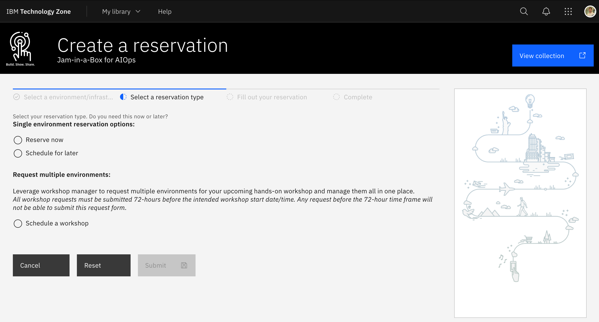

## Access an Environment

Each lab is backed by an environment that can be automatically provisioned
though IBM TechZone which means you can start at the lab of your choice. Simply
follow the instructions in the respective labs _Lab Environment_ section to
provision the environment for that Lab.

Once you start a lab you should execute the tasks in the numbered order that you
see on the left side of the screen.

---

## Requesting a Lab Environment

Each lab will provide you with a link to a TechZone collection that will allow
you to request a lab environment. You will need to sign in with your IBM ID to
request an environment.

:::tip

You can browse all lab environments by navigating to the
[Jam-in-a-Box](https://techzone.ibm.com/collection/jam-in-a-box-for-aiops)
TechZone collection.

:::

1. Use the link supplied in the labs **Lab Environment** section to navigate to
   the TechZone collection.

   Sign in with your IBM ID when prompted.

Select when you would like to reserve the environment for.



import TechZoneStatus from "../\_common/components/tech-zone-status.tsx"

:::info

When requesting your environment it would be wise to select the region that has
the most capacity available. Below is a live chart showing Tech Zone capacity in
each available region. Keep this in mind when completing your reservation.

<TechZoneStatus />

:::

Fill in the reservation details and select **Submit**

:::caution Required Fields

Pay close attention to the values you are asked to enter in the reservation
form. Credentials and licenses you are prompted for are required. Automations
will not provision correctly without them.

:::


## Accessing a Lab Environment

Once your requested environment has been provisioned successfully by Tech Zone
you will receive an email letting you know provisioning has completed along with
your environment details.

Within the details you should see a URL for **OCP Console** that looks similar
to the following:

```sh
https://remote.cloud.techzone.ibm.com/guacamole/#/?username=000-000000-0000&password=00000
```

:::tip

If you do not see an email from TechZone you can also try checking your spam
folder.

If you no longer have the email you can also
[view your reservation details in Tech Zone](https://techzone.ibm.com/my/reservations).

:::

Click on the **OCP Console** URL.

You will be taken to a page that looks similar to the below. Expand the
_twisties_ and select the **Remote Desktop** connection to connect to your
_Apache Guacamole_ Bastion host.


All access to the lab environment is behind this RHEL Bastion host named
**bastion-gym-lan**.


---

## Important Tips

### Copy & Paste

If you are a **Windows user** be mindful that there are no new lines inserted
unintentionally when copying and pasting commands to the Terminal. If you have
this issue consider opening the lab guide within Guacamole or use the **gedit
Text Editor** to remove any extra new lines before pasting the command in the
terminal.

You can open a new **Text Editor (gedit)** document by:

1. Selecting **Activities** at the top left of the screen on the _Guacamole_
   host.
1. Entering the search term `text`
1. Selecting the **Text Editor** application


### Default Text Editor

Throughout the lab you will be required to edit kubernetes manifests. By default
you will use the **vi** editor. If you would prefer use the graphical text
editor **gedit** you can do so by:

- Setting your default kubernetes editor on the _Guacamole_ host
  (admin@bastion-gym-lan):

  ```sh
  # For the current shell
  export KUBE_EDITOR=/bin/gedit

  # More permanent change (open a new tab or window after making the change)
  echo "export KUBE_EDITOR=/bin/gedit -w" >> ~/.bashrc
  ```

## Troubleshooting
