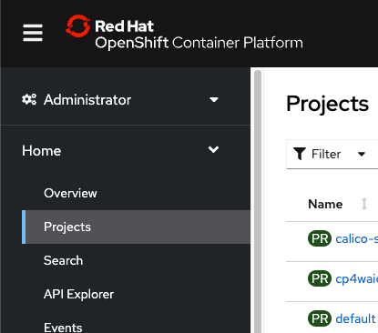
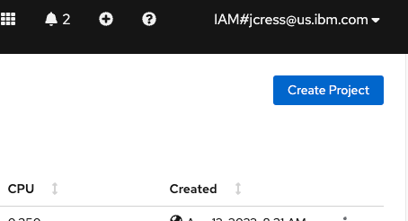
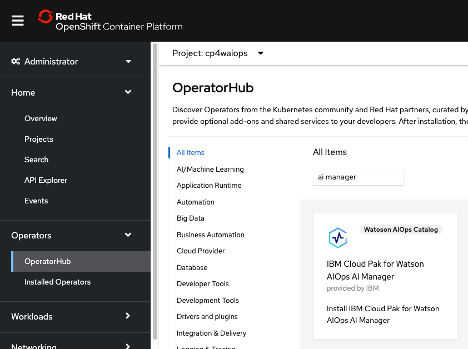
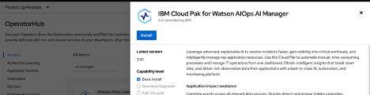
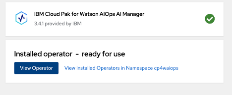
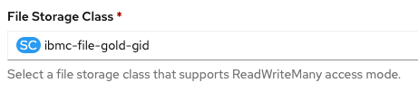
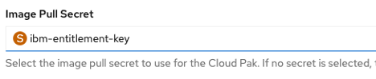
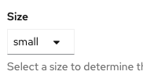
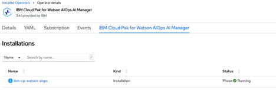

## 2-1: Introduction

Before we begin with Metric Manager, we will start the installation of AI
Manager, as this can take 90 minutes or so to complete.

If you missed yesterday's Event Manager labs, you will need to log in to your
cluster and follow the first part of **step 5** of **Lab 2**, where you import
the yaml to create the catalog source:

https://ibm.github.io/waiops-tech-jam/tutorials/aiops/installation#2-5:-install-the-cloud-pak-for-watson-aiops-event-manager-operator

If your cluster already has the catalog source installed, you may proceed.

## 2-2: Create a namespace for the Watson AIOps AI Manager install

In the OpenShift UI, navigate to Projects:



Then, in the upper-right corner click "Create Project":



Call your project "cp4waiops":


Once your project is created, you will need to go to the command line of your
control node and change the project to 'cp4waiops', then create an entitlement
secret so the images for the AI Manager can be pulled. First, login to the
following link and copy your entitlement key:

[https://myibm.ibm.com/products-services/containerlibrary](https://myibm.ibm.com/products-services/containerlibrary)

Change your project to 'cp4waiops':

```sh
oc project cp4waiops
```

Next, issue the following command to create the secret:

**Important:** Do not change the name of the secret, you **MUST** use the name
_ibm-entitlement-key_

```sh
oc create secret docker-registry ibm-entitlement-key \
--docker-username=cp \
--docker-password='<Your Entitlement Key>' \
--docker-server=cp.icr.io \
--namespace=cp4waiops
```

## 2-3: Install the Watson AIOps AI Manager Operator

Navigate to "Operator Hub", and change the project at the top of the page to
your 'cp4waiops' project. Then, in the search box under "All Items", type in "ai
manager":



Click on the "IBM Cloud Pak for Watson AIOps AI Manager" tile:


** NOTE: DO NOT USE THE WATSION AIOPS AI MANAGER TILE, THE TILE MUST BE TITLED
"IBM Cloud Pak for Watson AIOps AI Manager"**

Next, double-check that the "Project" you are in is 'cp4waiops', and click the
"Install" button:



In the next screen, you will leave the version at 3.4, but change the
Installation mode to "A specific namespace on the cluster". Verify that the
Installed Namespace says cp4waiops. If not, using the drop down box select
'cp4waiops'. Then click "Install".

When the operator installation is complete, select "View Operator":



## 2-4: Install an instance of AI Manager

Now that the operator is installed, you can create instances of the AI Manager.
From the Operator view, click on the "Create instance" Link in the AI Manager
tile:


You will be in the "Create Installation" configuration window. In this window,
you will edit 4 entries:

Accept the license:


Set File Storage Class to 'ibmc-file-gold-gid'



Set Large Block Storage Class to 'ibmc-block-gold'


Image Pull Secret set to 'ibm-entitlement-key':



Set the size to "Small"



When all of the options are configured, select the 'create' button.

Next, You will be brought back to the installations view, where you will see a
new entry called 'ibm-cp-watson-aiops' and will be able to watch the status as
the creation of your new instance proceeds. After about 5-7 minutes, it should
complete and you should see the "Phase" change to "Running":



The install will take around 90 minutes, and will be ready for you when you come
to Lab 6 - working with Metric Anomaly Detection in Watson AIOps.
