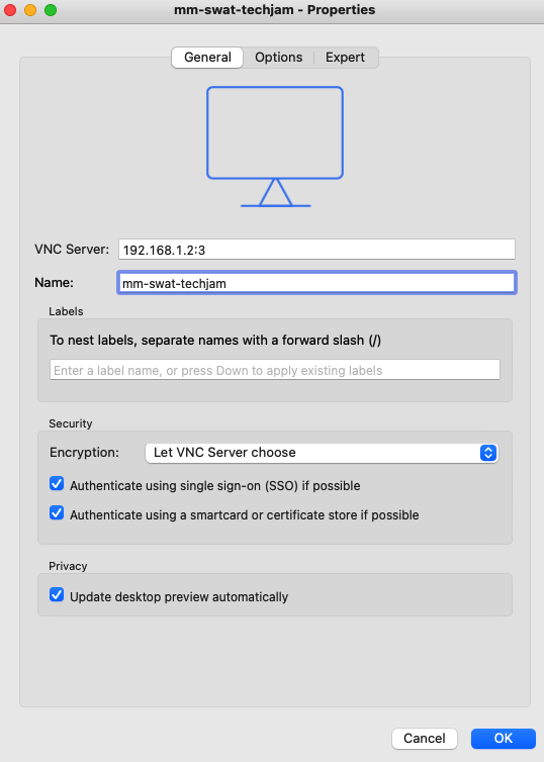
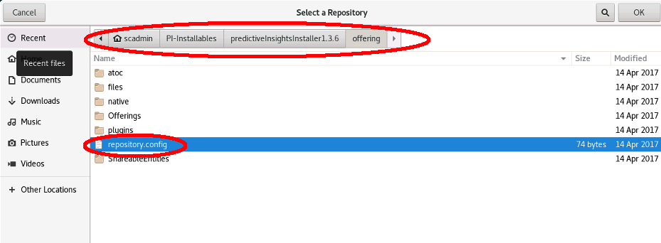
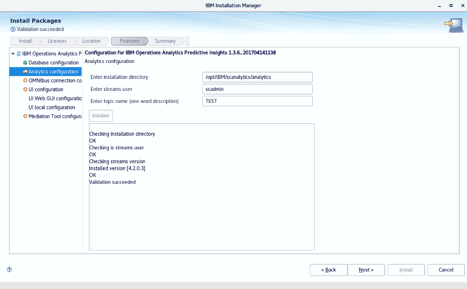
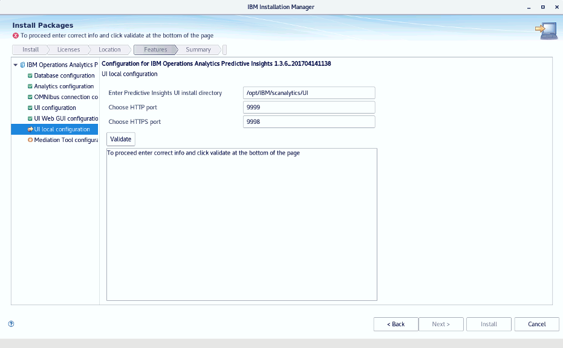
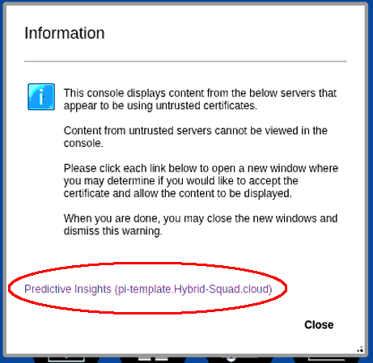

## 3.1: Lab Introduction

In this lab, you will be installing the various components that make up the
VM-based Metric Manager (formerly Predictive Insights) solution, as well as
installing the latest Interim Fix (IFIX5), and the REST Mediation Service, which
will be used in an upcoming lab.

:::caution Prerequisite

You will need to use VNC to access the UI of your VM. If you don't already have
VNC installed, you can download the RealVNC VNC Viewer for your MacOS, Windows
or Linux OS at
[RealVNC Downloads](https://www.realvnc.com/en/connect/download/viewer/).

:::

:::caution Prerequisite

For the execution of the labs, you will need the following passwords, provided
to you by your lab proctor at the beginning of the session: <br/>

- **<VNC PASSWORD\>**
- **<LAB PASSWORD\>**
- **<DEFAULT CASSANDRA PASSWORD\>**
- **<CASSANDRA PASSWORD\>**

:::

## 3.2: Accessing your Metric Manager lab environment

Open your VNC Viewer and create a new connection (File -> New Connection)

Use your lab machine's IP address (the 'pi-template' ip address you used
yesterday for the probe lab), and display #3 as shown in the example below (e.g.
<IPADDR\>:3 - your lab machine's IP address will differ). Leave everything else
default. Click OK when complete.



Double-click on your new connection in the main VNC Viewer interface. You will
be presented with a window asking you for the password. Use <span
style={{color: "green"}}>**<VNC PASSWORD\>**</span>.

You may next be presented with another login screen asking you to login as the
'scadmin' user to the desktop. If it asks, use the scadmin user password:
**<span style={{color: "green"}}><LAB PASSWORD\></span>**.

You will be logged into the desktop for the 'scadmin' user. Next, right-click in
the desktop background and select **Open Terminal** to open a terminal session.


You are now prepared to proceed with the installation of Metric Manager.

## 3.3: Installing IBM Streams

Metric Manager uses IBM Streams as its core ingestion/analytics engine. As such,
the Streams software must be installed prior to installing the Metric Manager.
The Streams install is very straightforward and only takes a couple of minutes.

From your terminal command line, run the following command to start the Streams
install:

```sh
./PI-Installables/CNH5LEN/StreamsInstallFiles/IBMStreamsSetup.bin
```

Select your preferred language, and click "OK". Next, ensure you select the IBM
Streams install:


Click through the Introduction screen, and accept the license agreement. When
you come to the installation directory screen, change the installation path from
the scadmin home directory to " **/opt/IBM/InfoSphere_Streams**":


Click **Next**, review the install summary, and if everything looks ok, select
**Install**:


When install is complete, **uncheck the "Open Domain Manager"** and click next,
then "done" to complete the install.


Next, you will need to add some entries into the scadmin user's .bashrc file to
ensure that the Predictive Insights software knows where Streams is installed
and uses the proper version of java. To do this, add the following lines to the
scadmin user's .bashrc file using your text editor of choice. Both **vi** and
**nano** are installed on the system, or you can use the GUI version of the text
editor by running:

```sh
gedit ~/.bashrc
```

Place these lines at the bottom of the .bashrc file, save the file, then exit

```sh
if [ -f /opt/IBM/InfoSphere_Streams/4.2.0.3/bin/streamsprofile.sh ]; then
 . /opt/IBM/InfoSphere_Streams/4.2.0.3/bin/streamsprofile.sh
fi

PATH=/opt/IBM/InfoSphere_Streams/4.2.0.3/java/bin:$PATH

JAVA_HOME=/opt/IBM/InfoSphere_Streams/4.2.0.3/java

export PATH JAVA_HOME
```

:::tip

Alternatively, you can run the following command to append these lines to the
scadmin user's .bashrc file. Be careful here and make a backup in case you
accidentally overwrite the file instead of append:

```sh
cp ~/.bashrc ~/.bashrc-BAK
cat /home/scadmin/PI-Installables/bashrc >> ~/.bashrc
```

:::

Once you have modified the scadmin user's .bashrc, re-source the new .bashrc by
issuing the following command (or close/re-open the terminal window). You should
receive a confirmation message indicating that the streams environment has been
set up:

```sh
source ~/.bashrc
```

You should receive the following message indicating that the environment has
been set up:

`IBM Streams environment variables have been set.`

## 3.4: Installing Metric Manager (Predictive Insights)

To install Metric Manager, DB2 needs to be running. From the command line
window, issue the following command to start DB2:

```sh
db2start
```

Next, issue the following command to start the installation manager:

```sh
/home/scadmin/IBM/InstallationManager/eclipse/launcher
```

The main IBM Installation Manager screen is presented:


You must first add the Predictive Insights installation files to the
Installation manager repositories. To do that, click on the
**File-\>Preferences** menu item in the Installation Manager UI, and select "Add
Repositories":


Click the "Browse" button, and navigate to
"Home-\>PI-Installables-\>predictiveInsightsInstaller1.3.6-\>offering…. Select
"repository.config" and click "OK", and "OK" again to add the repository to
Installation Manager.



Your repositories list should look like this, and you can click **Ok** to go
back to the main menu and continue to install:


From the main menu, click **Install** and select Predictive Insights as
illustrated, then click **Next**:


Accept the license agreement and click **Next**:


Leave the defaults for creating the package group and click **Next**:


The Metric Manager is a distributed application, and various components can be
installed on separate servers. For our purposes, however, we will be installing
all components of MM/PI, so leave everything checked as default and click
**Next**:


The next screen is DB2 configuration. Since DB2 is installed and running
locally, you can leave most as defaults, but change the password to **<span
style={{color: "green"}}><LAB PASSWORD\></span>**. Click the **Validate**
button. The installer will login to the DB2 instance to verify that the
credentials are proper. If the verify fails, double-check that you typed the
proper password.

When the validation succeeds you will be able to click on the **Next \>** button
to move to the next section, as shown below:


The next screen is the Analytics configuration. This allows you to define a
starting PI topic. Modify the **Topic Name** box to add **TEST** as a topic and
click **Validate**. When Validation succeeds, click **Next**:



Next, you will be presented with the configuration for OMNIbus integration. This
ensures that any anomaly alerts are sent to the OMNIbus event processor. For
this lab, we will be integrating with an existing OMNIbus that is running on the
local server. As such, **leaving these options as default** and selecting
**Validate** should succeed so you can continue to the next installation panel:


_NOTE: If you get an error indicating that port 4100 is not reachable, open up a
separate window and start up the following services, using **<span
style={{color: "green"}}><LAB PASSWORD\></span>** as the authentication
password:_

```sh
systemctl start nco
systemctl start netcoolwebgui
```

And click **Validate** again. If you continue to have issues, consult a lab
proctor.

:::note

It is possible to integrate the on-prem version of MM with NOI/Watson AIOps
Event Manager running on OCP. Contact Jason Cress /
[jcress@us.ibm.com](mailto:jcress@us.ibm.com) for instructions on how this
integration is achieved.

:::

The next screen, "UI Configuration", will require the following changes:

username and password that installed dash: **scadmin** / **<span
style={{color: "green"}}><LAB PASSWORD\></span>** Enter DASH install dir :
**/home/scadmin/IBM/JazzSM** Enter DASH profile dir :
**/home/scadmin/IBM/JazzSM/profile/** Enter DASH Profile user/password :
**piadmin** / **<span style={{color: "green"}}><LAB PASSWORD\></span>**

Leave the rest of the entries as default.

Once you have edited the proper variables, click **Validate**. A little patience
is required on this step - validation will take some time to complete, as it
does several things to verify that it can log into the DASH profile as an admin,
extract keys, etc. If the validation fails, verify your entries and try again.


Once validation succeeds, click Next and you will be presented with the
configuration panel for WebGUI. Some critical changes need to be made:

Change the "Enter WebGUI Install dir" to:
**/home/scadmin/IBM/netcool/gui/omnibus_webgui**

Enter the WebGUI user password for the ncoadmin user: **<span
style={{color: "green"}}><LAB PASSWORD\></span>**

Leave everything else as default, including leaving the OMNIbus password blank.


Click **Validate** and you should be able to click **Next** after validation. If
validation fails, double check the install directory
(/home/scadmin/IBM/netcool/**gui**/omnibus_webgui), the user (ncoadmin), and the
password (**<span style={{color: "green"}}><LAB PASSWORD\></span>**) and try
again.

The next installation screen shows the local MM UI configuration screen. Leave
these as default and click **Validate**. When the validation succeeds, click
**Next**:



Next, the installation screen will show the Mediation Tool options. You may
leave these as they are and click **Validate**. Once validation completes, click
**Next**:


Finally, you will be presented with the install screen. Click **Install** to
perform the installation:


Take a break. After about 7 to 10 minutes you should be presented with the
following screen indicating that the installation was successful:


:::note

If you see an orange icon with a message indicating the install completed with
warnings, please continue the labs. We will be rebuilding the topic after the
install of _ifix5_.

:::

Click **Finish** to, and then select **File -\> Exit** to exit the installer and
return to your terminal.

The installation makes updates to the environment variables in the scadmin
user's .bashrc file, so you \*MUST\* re-source the new bashrc as such:

```sh
source ~/.bashrc
```

Delete the TEST topic that we created during the installation:

```sh
/opt/IBM/scanalytics/analytics/bin/admin.sh delete_topic TEST
```

You have completed the installation of Metric Manager. In the next section, you
will install the latest update.

## 3.5: Installing Metric Manager Interim Fix 5

:::info

The latest fix pack for Metric Manager is always available on the IBM Fix
Central site. As of this writing, the latest available fix is IFIX5. It provides
fixes for the core analytics, the UI, and installs a new version of Streams.
Finally, it provides an update to the REST/Kafka mediation components, which we
will work with in an upcoming lab.

:::

To install the latest IFIX, you will run the updates from the command line using
the following steps:

Open up a terminal and change your working directory to the directory
**/opt/IBM/software/predictiveInsights1.3.6_iFix5_el7_x86_64:**

```sh
cd /opt/IBM/software/predictiveInsights1.3.6_iFix5_el7_x86_64
```

Run the update script to patch the core analytics components:

```sh
./patch_PI_core_analytics_136_iFix5.sh
```

You will be prompted to enter the passwords for the DB2 database and the OMNIbus
root user. Use the following:

DB2 database password: **<span style={{color: "green"}}><LAB PASSWORD\></span>**
OMNIbus root user is blank, so just hit **enter**


Accept the license agreement, and the Streams portion of the update will
proceed.

When the Streams update completes, you will be prompted to display and accept
the license agreement. Enter "S" to skip the license display, and enter "Y" to
accept the license.


You will once more be prompted to enter the OMNIbus root user password. Just hit
**Enter** again.

The installation will complete. Next, you will need to restart the VNC daemon
and re-open your VNC session. To perform this action, restart the VNC service
using the following command, and authenticating with as the authentication
**<span style={{color: "green"}}><LAB PASSWORD\></span>** password.

```sh
sudo systemctl restart vncserver@:3
```

After a minute or two, your VNC session should reconnect to the scadmin user's
desktop. If it doesn't automatically reconnect, close the VNC session window and
reconnect from the VNC Viewer connections list.

Next, we will test to make sure that the update installed properly.

Open a terminal, and change your working directory to the analytics binary
directory, and run the admin.sh command to show the version:

```sh
cd /opt/IBM/scanalytics/analytics/bin
./admin.sh show_version
```

If the update was installed successfully, you should see the following result:

**VERSION 1.3.6.5_20211124**

Additionally, we will test the software to ensure the database connection is
still good. Run the following command to verify:

```sh
./admin.sh create_topic TEST
```

If there are any errors, particularly with regards to database connectivity, try
re-sourcing your .bashrc:

```sh
source ~/.bashrc
```

And try to create your topic again. If the issue persists, consult the lab
proctor.

Now that the core analytics components have been successfully updated, you will
next install the IFIX5 User Interface (UI) update. From your terminal window,
change your working directory to:

```sh
cd /opt/IBM/software/predictiveInsights1.3.6_iFix5_el7_x86_64
```

And run the update UI script:

```sh
./patch_PI_UI_136_iFix5.sh
```

<br />
<br />

:::danger

## ** !!! DANGER, WILL ROBINSON !!! **

The next portion of the installation will prompt you for 14 values. You must be
_deliberate_ in entering these values, and you must enter them as shown below.
The interim fix installation script does not verify the values you enter here,
and even though the prompts suggest default values, the defaults will not be
accepted.

:::

**Please ensure that you enter the correct values as listed below!**

- JazzSM/WebGUI host: `pi-template.Hybrid-Squad.cloud`
- JazzSM base directory: `/home/scadmin/IBM/JazzSM`
- JazzSM profile directory: `/home/scadmin/IBM/JazzSM/profile`
- permission to start JazzSM: `Y`
- JazzSM/WAS server: `server1`
- WebGUI base directory: `/home/scadmin/IBM/netcool/gui/omnibus_webgui`
- JazzSM/WebGUI non-secure port: `16310`
- JazzSM/WebGUI secure port: `16311`
- WebGUI Admin username: `ncoadmin`
- ncoadmin's password: `<LAB PASSWORD>`
- Predictive Insights UI host: `pi-template.Hybrid-Squad.cloud`
- Predictive Insights UI base folder: `/opt/IBM/scanalytics/UI`
- Predictive Insights installer folder: `/opt/IBM/scanalytics/install_scadmin`
- Predictive Insights UI non-secure port: `9999`


Once all information is entered, you will be prompted for the type of upgrade
you want to perform. Select "1" to perform a full UI upgrade:


The script will update the UI components and will complete in a few minutes.
Once it is complete, use the following command to ensure the UI is up and
running:

```sh
/opt/IBM/scanalytics/UI/bin/pi.sh -status
```

The output should indicate that the UI is up and running.


If it shows down, wait a minute, and try the status command again. If it still
shows down after a couple of minutes, perform a manual restart of the UI by
running:

```sh
/opt/IBM/scanalytics/UI/bin/pi.sh -start
```

Next, we will verify that the UI is accessible from the web browser. From the
desktop, click on the Red Hat application menu and select "Firefox" from the
drop-down menu:


You should be presented with the IBM Dashboard Application Services Hub login
window. Login as "ncoadmin" with a password of **<span
style={{color: "green"}}><LAB PASSWORD\></span>**.

After logging in, you'll be presented with an "Information" window indicating
that Predictive Insights is using a self-signed certificate. **!! DO NOT CLICK
CLOSE !!**



Click on the link "Predictive Insights (pi-template.Hybrid-Squad.cloud)"

In the pop-up window, click "Advanced", and click "Accept the Risk and
Continue". This will allow you to access the PI UI despite having a self-signed
certificate.


Next, click on the "Snowflake" icon in the left navigation pane, and select
"Service Diagnosis Metric Search":


You should be presented with the following window:


If you receive an error, consult your lab proctor.

## 3.6: Installing the REST Mediation Service

Now that both the Core and UI components of Metric Manager are updated, our last
step for install is to install the REST mediation service. Close firefox, return
to your terminal, and follow these steps to install:

Change your working directory to the IFIX extracted directory

```sh
cd /opt/IBM/software/predictiveInsights1.3.6_iFix5_el7_x86_64/REST_Mediation_utility
```

Extract Cassandra and move the directory to /opt/IBM:

```sh
tar -xzf apache-cassandra-3.11.10-bin.tar.gz
mv apache-cassandra-3.11.10 /opt/IBM/
```

Extract kafka, move the directory to /opt/IBM, and change ownership to 'piadmin'
(sudo password is **<span style={{color: "green"}}><LAB PASSWORD\></span>**):

```sh
tar -xvzf kafka_2.13-2.6.2.tgz
mv kafka_2.13-2.6.2 /opt/IBM
sudo chown -R piadmin:piadmin /opt/IBM/kafka_2.13-2.6.2
```

Extract spark, move the directory to /opt/IBM, and change ownership to
'piadmin':

```sh
tar -xzf spark-3.1.2-bin-hadoop3.2.tgz
mv spark-3.1.2-bin-hadoop3.2 /opt/IBM
sudo chown -R piadmin:piadmin /opt/IBM/spark-3.1.2-bin-hadoop3.2
```

Copy the PI mediation directory to /opt/IBM, and change its ownership to
piadmin:

```sh
cp -R pi-mediation-1.0.4 /opt/IBM
sudo chown -R piadmin:piadmin /opt/IBM/pi-mediation-1.0.4
```

The latest REST mediation service requires a later version of Python. Unzip the
Python package and build/compile it. Use **<span style={{color: "green"}}><LAB
PASSWORD\></span>** if prompted for the sudo password:

```sh
tar -xzf Python-2.7.18.tgz
cd Python-2.7.18
./configure
make
sudo make install
```

Once the build completes, restart the VNC service:

```sh
sudo systemctl restart vncserver@:3
```

After a moment or two, your VNC session should reconnect to a blank desktop. If
it doesn't automatically reconnect after a minute or two, close the VNC session
window and reconnect from the VNC Viewer connections list.

Once you are back into your VNC session, open a terminal and verify that the
Python version on the system has been updated by running:

```sh
python --version
```

It should return with "Python 2.7.18"

Installation and update of the Metric Manager components is now complete!
Proceed to the next lab to learn how to model and ingest CSV data.
