## 4.1: **Introduction**

The Metric Manager can consume data in four primary ways: Modelling/Mediating
data that is in CSV format, Modelling/Mediating data that resides in a database
via JDBC connection, and ingesting pre-formed JSON through either the REST
mediation service or Kafka.

This lab will be showing you how to consume data from CSV files. There are CSV
files located in the _/home/scadmin/BookInfoDemo/data/bookinfo/data_ directory.
These files contain metrics for Application response time (APP), CPU utilization
(CPU), Database transaction volume (DB), and disk utilization (DISKBUSY). This
data spans a time period of 17 days.

We will create a Metric Manager topic to receive this data, create a model for
this data with the Mediation Tool, deploy that model, then start the topic and
start ingesting the data.

## 4.2: **Creating a topic**

To create a topic, open a terminal window and run the following commands as user
**scadmin** on pi VM:

```sh
cd /opt/IBM/scanalytics/analytics/bin
./admin.sh create_topic BIGBLUE
```

This will take a minute or two while the Metric Manager builds the topic tables
in the DB2 database and creates the appropriate analytics/streams configuration.

Once the **create_topic** command completes, you can list the topics that are
configured on the system by issuing the following command. You should see your
new BIGBLUE topic, along with the TEST topic that we created to verify the iFix
install:

```sh
./admin.sh show_topics
TEST
BIGBLUE
```

You may delete the TEST topic you created earlier to verify that the update
completed successfully if you wish.

```sh
./admin.sh delete_topic TEST
```

## 4.3: **Topic configuration**

### Topic configuration considerations

_Aggregation interval_

There are considerations for topic configuration that need to be accounted for
based on the data that the Metric Manager will be ingesting. One of the more
important aspects of topic configurations is the system aggregation interval.
The aggregation interval defines the rate, in minutes, of the metric data that
Metric Manager will be consuming. This is largely dictated by the source of the
metric data (e.g. an APM tool, network performance monitor, etc). The supported
PI intervals are 5, 10, 15, and 60 minutes. If the source that is generating
metrics for MM ingestion is collecting at 5 minutes, it is best to set the
aggregation interval for the topic to 5. If the metrics are generated at 1
minute intervals, set the topic to 5 minutes, and PI will automatically
aggregate the data to the 5 minute interval.

For 5 minute data, time intervals in minutes/seconds are:

00:00 – 04:59 05:00 – 09:59 10:00 – 14:59 … … 50:00 – 54:59 55:00 – 55:50

Likewise, 10 minute intervals are:

00:00 – 09:59 10:00 – 19:59 … … 40:00 - 49:49 50:00 – 59:59

Investigate the data that we will model and ingest. Change your directory to
where our CSV files are located and list the contents of the directory:

```sh
cd /home/scadmin/BookInfoDemo/data/bookinfo/data
ls
```

_CSV file naming_

You'll note that there are a number of csv files in that directory that look to
adhere to a standard naming convention. There are rules that you must follow for
naming these files, and those rules are documented in the "IBM Operations
Analytics Predictive Insights" documentation at this link:

<a
  href="https://www.ibm.com/docs/en/oapi/1.3.6?topic=SSJQQ3_1.3.6/com.ibm.scapi.doc/admin_guide/r_tasp_csvrules.html"
  target="_blank"
>
  Rules for using CSV data sources
</a>

In short:

- the file name must start with a group name, and contain a delimiter
- next, the file name must contain the start date for the data residing in the
  csv file, and another delimiter
- the end date is optional if the data that resides in the CSV file is for a
  single interval, but if data within the CSV file spans multiple intervals, it
  is required
- the file name must end in .csv

The files names that we have created for execution of this lab have the format:

`<GROUP>__<STARTDATE>-<STARTTIME>__<ENDDATE>-<ENDTIME>.csv`

You will note that some groups have individual daily files (CPU, Diskbusy), and
others have one csv file for the entire span of data (APP, DB). The Metric
Manager extraction process is smart enough to read data for each of its
intervals from the files simply based on the timestamp of the files that exist,
as well as the timestamps within the files. Since we will be ingesting files in
'backlog' historical mode, and not live, having daily files or a file that spans
17 days is fine. If we were ingesting live data for anomaly detection, Metric
Manager would expect to have a single file that contains all metric data for
each aggregation interval. In live ingestion, the extractor instance will pick
up the latest file for the previous aggregation interval (e.g. 00:00-04:59) and
process it.

So in looking at the file names, we can see that the data in this directory
starts at October 1st at midnight, 2020, and ends on October 17th, noon, or
about 17 days. Next, let's look at the interval of the data contained in the
files.

_Resources within Metric Manager_

Any data sent into Metric Manager (whether it be CSV, or REST/Kafka) must
contain enough information to properly classify the component that the metric is
related to. For example, you may be collecting metrics for a router. That router
may have multiple interfaces. There are metrics that are applicable to the
router **node** itself (e.g. CPU utilization, buffer utilization), and there are
metrics that are applicable to an **interface** on that router (e.g. packet
drops, in bits per second, out bits per second, etc).

Run the following command to page through the data contained in the APP file:

```sh
more APP__20201001-0000__20201017-1200.csv
```

Note that the file has the required CSV header, which must be the first entry of
the CSV file:

**_Time,RESOURCE,ResponseTime_**

In looking at the file, it's clear that the timestamp is the first column, and
looking at the times they are timestamped at 5 minute intervals. Look at the
other files and confirm that they are also in 5 minute intervals with the
exception of DISKBUSY, which appear to be in minute intervals. That is fine as
MM will aggregate our data for us (more on this later).

Also note that the timestamps are in a different format than the file name. It
is in the format "Day/Month/Year Hour:Minute", using literal slashes, space, and
colon as delimiters. Additionally the Year is in 2 digit format, rather than
four. So during our model creation, we must use the notation "dd/MM/yy HH:mm".
It is important to be cognizant of timestamp formats whether they be in the file
name, or within the CSV file itself. They may not always be the same, and we
will take this into account when we create our model for the CSV data.

### Configuring topic options

Given the velocity of the data contained in these CSV files, we will need to
configure the Metric Manager topic aggregation interval to 5 minutes. To set the
aggregation interval, first check to see what it is currently set to:

```sh
cd /opt/IBM/scanalytics/analytics/bin
./admin.sh show -t=BIGBLUE
```

This will show all of the configurable options for the BIGBLUE topic.

:::caution

If the above command does not show an entry for **system.aggregation.interval**,
and only shows a couple of entries, delete the topic and re-create it. There
appears to be an environmental problem where the topic sometimes does not get
created properly.

:::

The aggregation interval is "system.aggregation.interval". You can see it is
currently set to 15 minutes. To change it to 5 minutes, issue the following
command:

```sh
./admin.sh set -t=BIGBLUE system.aggregation.interval 5
```

To verify the change, run the following command:

```sh
./admin.sh show -t=BIGBLUE |grep system.aggregation.interval
```

... you should see that the system.aggregation.interval property is 5 minutes:

`system.aggregation.interval: 5`

When ingesting historical data, it's important to configure the topic such that
it doesn't automatically delete the data you ingest. Metric Manager is not meant
to be used as a long-term metric data repository... it is meant to keep the data
long enough to successfully identify changes in behavior, and to keep a small
amount of historical for short-term review. By default, a topic's metric data is
cleared out after 15 days, while anomaly alarm data is kept for 180 days. Since
we have data originating from 2020, we need to set a couple more topic
parameters to ensure the system doesn't age out our data. Set the following
options for the topic BIGBLUE:

```sh
./admin.sh set -t=BIGBLUE sta.corr.retention.days 1095
./admin.sh set -t=BIGBLUE system.alarm.history.retention.days 1095
./admin.sh set -t=BIGBLUE system.metric.retention.days 1095
```

Another thing you may need to do during a proof of concept is disable alarm
clearing. This is required to be disabled if you are analyzing past data and
need to demonstrate what the anomaly alerts that arrive in Event Manager look
like, without having them clear when the anomaly occurrence stops. Since we'll
be viewing Event Manager events as part of our labs, we'll disable it:

```sh
./admin.sh set -t=BIGBLUE system.alarm.autoclear false
```

Finally, double-check and verify the topic configuration by running the show
topic command:

```sh
./admin.sh show -t=BIGBLUE
```


Topic configuration is complete!

## 4.4: **Creating a model to ingest CSV**

The Mediation Tool is the component you will use to model the data contained
within the CSV files so that Metric Manager can ingest, process, learn, and
identify anomalies within the data. The tool allows you to create a 'model' of
the structure of the CSV files you'll be working with, from within a
user-friendly Eclipse interface. You can start the Mediation Tool by issuing the
following commands from your VNC session terminal:

```sh
cd /opt/IBM/scanalytics/mediationtool/eclipse
./eclipse
```

You will be presented with the initial config screen. Leave the default and
click "Ok".


You will be presented with the main window. In this step we will create a new
Predictive Insights project. A project is simply a folder that contains one or
more model definitions. From the main window select **File-\>New-\>Project**
from the menu bar:

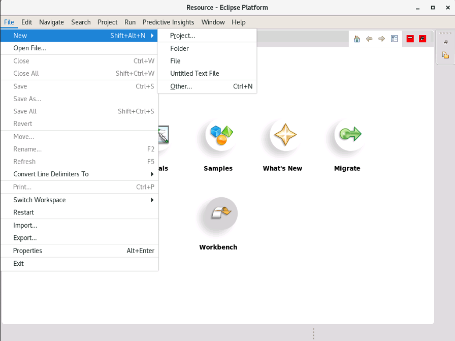

In the next screen, open the **Predictive Insights Wizards** tree, select
**Predictive Insights Project**, and click **Next**:

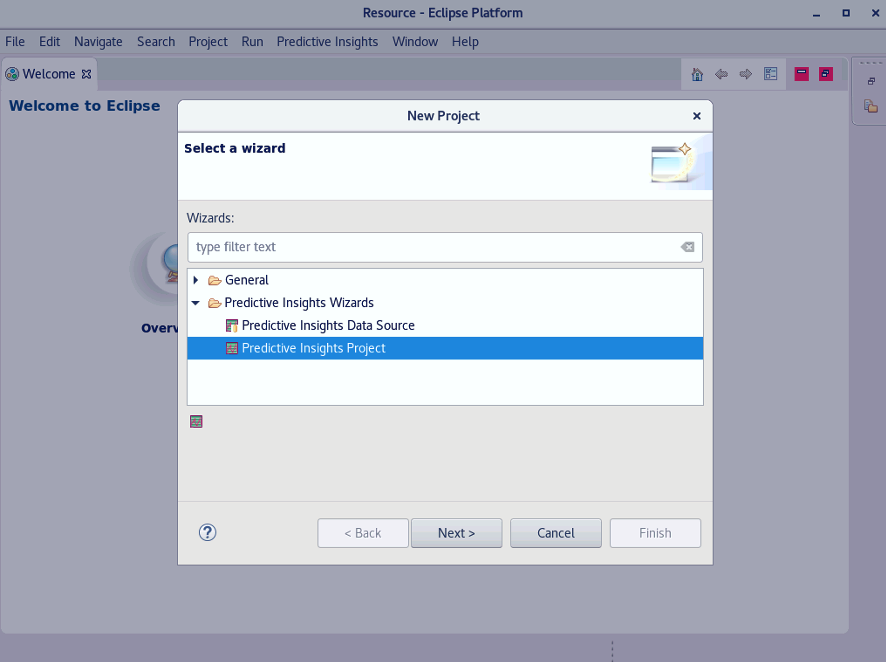

The next screen will prompt you for a project name. Enter **TECHJAM2022** and
click the **Finish** button.


Next, you will be asked to switch the perspective to Predictive Insights. Click
**Yes**.


Next, close the welcome screen by clicking on the X in the tab above the text
**Welcome to Eclipse**:


Finally, you will be in your modelling view. Maximize the window to take up the
full screen, you will need the real estate:


### Create a data source

Next, we will create a data source. Right click on your **TECHJAM2022** project
in the navigator, and select **New -\> Predictive Insights Data Source**


In the dialog window that appears, change the **Filename** parameter to
**BIGBLUE.pamodel** and click **Next**.


In the next screen, you will select **File System** from the drop-down box, and
select **Metric names in column headers**.


Click **Finish**. You now have a data source that we will configure to ingest
our csv files.

_A note about CSV structure: CSV files can be in either **wide** or **skinny**
format. **Wide** format specifies the metric name in the CSV header. For
example, in our data the CPU group has the following header:_

`"TIME","RESOURCE","User%","Wait%"` `01/10/20 00:00,"details",84.9,0` `…` `…`

_Above we can see there are two metric definitions in the csv header, "User%"
and "Wait%". That indicates that a single CSV line contains multiple metric
definitions per resource. Hence, we selected **Metric names in column
headers**._

_You may come across a situation where the metric name appears in the csv file
data rather than the header. Compare the previous example with the following:_

`"TIME","RESOURCE","METRICNAME"` `01/10/20 03:20,details,User%,84.9`
`01/10/20 03:20,details,Wait%,0` `…` `…`

_The CSV contains a generic "METRICNAME" indicator, and the various metric name
appears within the csv lines, rather than the header. This is **skinny** format,
and each line contains only one metric. When you model the CSV file, and select
the metric column, it will show all of the available unique metric names as
available, and you can include/exclude metrics as needed._

:::note

If you need to ingest files in both skinny and wide format, you must create
separate data sources for each type, as you cannot match skinny and wide formats
in a single project. You can deploy multiple CSV data sources to a single topic,
but they must be done as the same deployment action – that is you must
multi-select the data sources, then select "deploy model".

:::

### Configure the filesystem details.

The file system details define where the files are located and the structure and
date format of the file names.

You will be at the following screen:


First, under **File System Details**, change the **File Path** to:

**/home/scadmin/BookInfoDemo/data/bookinfo/data**

This tells the mediation tool where to expect the CSV files.

Next, modify the name pattern. As we learned previously, a CSV file name must
start with a **group reference**, followed by a **delimiter**, followed next by
a **start time** and an **end time** (with the end time only strictly necessary
when the file contains data for a span of multiple intervals). When defining the
name pattern, we use regular expressions to match. To keep it simple, use the
following regex to define the name pattern:

**(.\*)\_\_(.\*)\_\_(.\*)\\.csv**

The mediation tool, as well as the Metric Manager extractor, uses the first
regex match as the metric group identifier, the second as the Start Time, and,
if defined, the third regex match as an end time.

Next we will change the time format. The time format uses standard Java time
format notation. Looking at our CSV file timestamps, we see that they are
formatted as such:

20201001-0000

Which, in Java time format notation, is:

yyyyMMdd-HHmm

As such, change the time format to "yyyyMMdd-HHmm"

The files provided are in GMT already so we can leave the timezone as it is.

:::info

It is important to be cognizant of the timezone of the data and configure this
appropriately, so that the analytics can properly learn the differences between
weekday and weekend behavior patterns, as well as proper correlation of metrics
across all CSV files. In many cases the timezone of the data you work with will
be GMT, but you may run into cases where they are provided in some local time
zone. Make sure that you verify with the customer what timezone the data
timestamps are in.

:::

Once all the File System Details options have been configured, click the "Test
Matching". You should get green checkmarks for the files in our directory
indicating that the name pattern and time format worked properly:

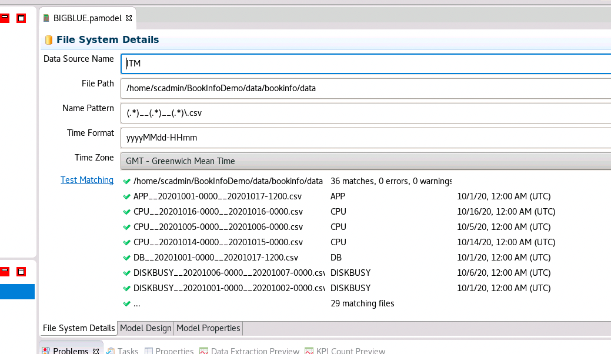

If you see errors indicating 'pattern mismatch', or do not see the green
checkmarks, double-check your configuration and try again. If you sill have
difficulty consult a lab proctor.

### Defining the model from the data

The next step is to actually build the model from the CSV file structures. Below
the **File System Details** window that we just finished configuring and
testing, you will see three tabs. Select the **Model Design** tab and click
**Ok** in the dialog window that pops up.


The model design window shows the configured data source (ITM) that we just
finished configuring. Right-click on **ITM**, and select **Synchronize Schema**.
This will cause the mediation tool to examine the structure and contents of the
CSV files that match the pattern we defined in the previous section:


The mediation tool will then churn through the available files in our defined
directory, analyze the CSV structure, and present us with the metric groups it
found in our directory. In the preview window, select **Add New Elements**, and
it will select all of the CSV file structures it found in that directory.


select all of the tables and click **Ok**.

Next, for our ITM data source, open up the tree view that is now available:


Expanding the tree view **fully** shows all of the available tables and columns
in our CSV files.:

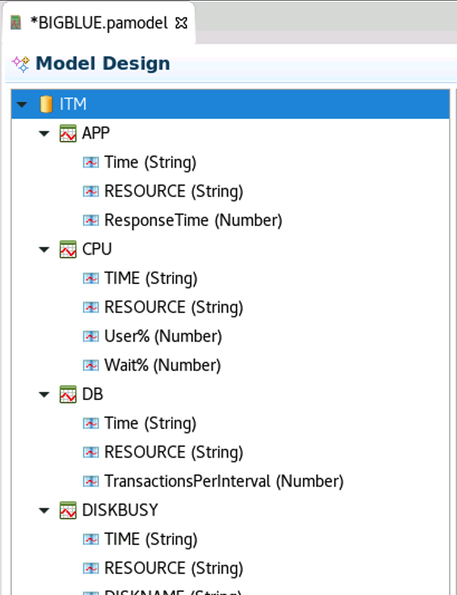

Next, we will create metric groups for each of these. Right-click on **APP**,
and select **New metric group**:

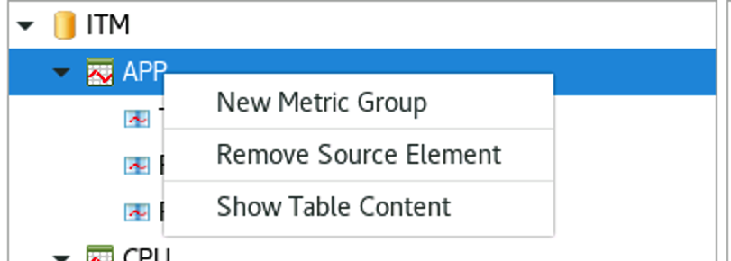

You have the option of naming the metric group to anything that is descriptive
of the type of data in the respective group. In our case, we'll call it
**ApplicationPerformance**, and click **Ok**:

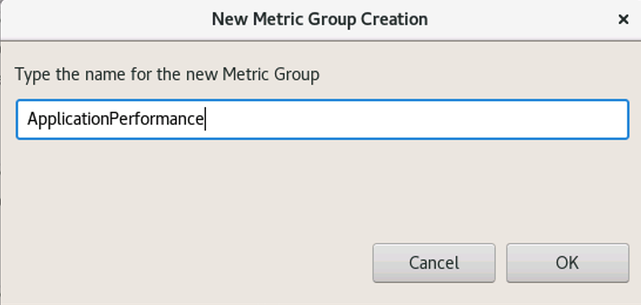

The next screen will show an attempt by the modelling tool to create a model
based on the composition of the CSV header:

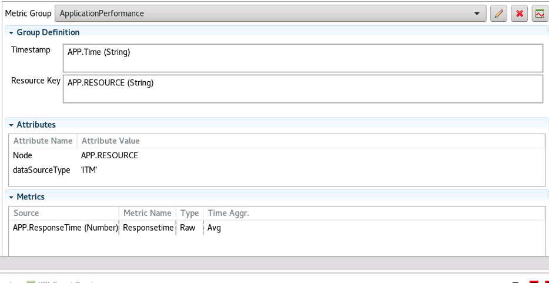

The mediation tool did a good job of providing a model based on the structure
for this instance. It selected the proper CSV column for the **Timestamp
(Time)**, the proper CSV column for the **Resource Key (RESOURCE)**, and the
proper column for the **Metric Name (ResponseTime)**. So in this case, there
isn't any additional work we need to do to define the model. But we do need to
configure the timestamp format (as we did in the File Details definition). To do
this, click select the **Model Properties** tab below the **Model Design**
window. Open up the **Model -\> ApplicationPerformance -\> Timestamp** entry,
and change the **Data Type** to **String** if it isn't already.

Recall our earlier examination of the CSV file content. We discovered that the
time format of the timestamp within the CSV file is different that it is in the
filename. As such we must define **Time Format** as **dd/MM/yy HH:mm** (don't
forget the space between the date and time). When you are finished entering the
Time Format field, hit the **enter** key so that the entry is saved.


Finally, click on the **Model Design** tab to return to the model design window,
and click on the **preview data** icon to verify that the model is working:


You should see a preview of the data extraction in the **Data Extraction
Preview** tab:

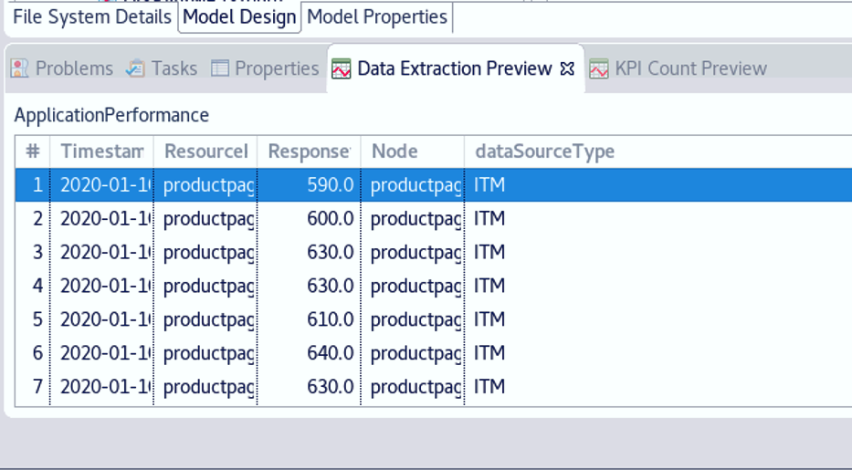

If you do not see data in the preview after clicking on the **Preview
extraction** icon, verify the configuration of your timestamp in the model
properties tab. If you feel you have verified everything and are still having
issues, consult a lab proctor.

Finally, take a moment to save the work we have done so far for modelling the
csv data in case we should lose connection or some other unavoidable disaster
occurs. In the Menu, select **File -\> Save**:


Next, we will configure a model for the **CPU** data. From the **Model Design**
window, right-click on **CPU** under the ITM data source, and select **New
Metric Group**.

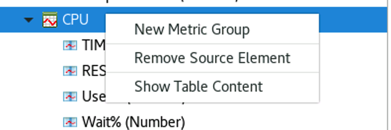

Name the metric group **CpuUtilization**:


Again, we see that the mediation tool did a good job of identifying which CSV
columns should be used for the timestamp, resource, and even identified that
there are two metric columns in the file:


So next, define the timestamp format by selecting the **Model Properties** tab,
opening up the **CpuUtilization** model definition, selecting **Timestamp**, and
selecting **String** as the Data Type and entering **dd/MM/yy HH:mm** for the
time format, ensuring to hit **Enter** when done typing in the time format.

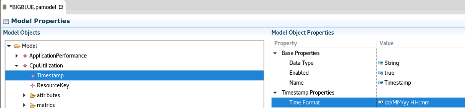

Return to the **Model Design** tab and test the model design by clicking on the
**preview extraction** button.

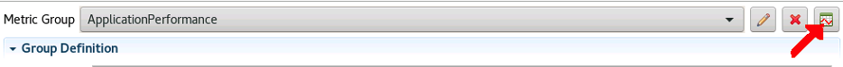

Verify data in extraction preview:

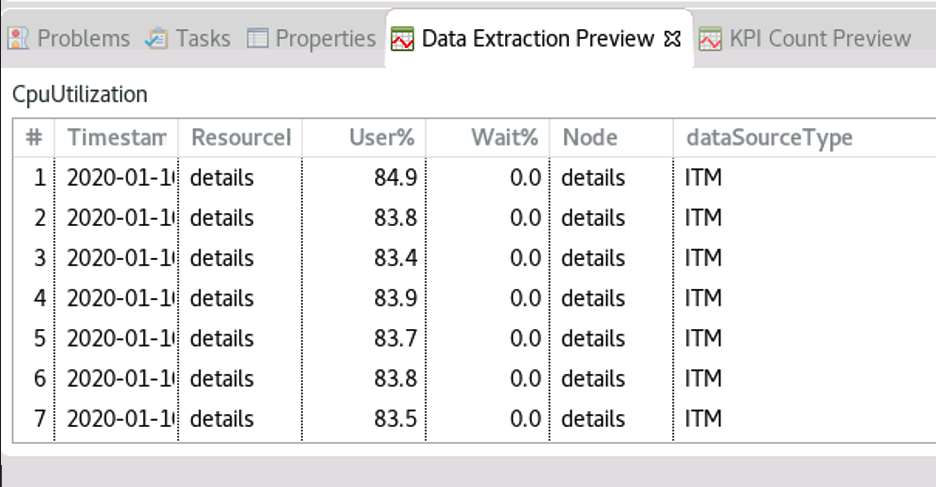

Ensure that you have both metrics **User%** and **Wait%** in the preview.

Again, save your model progress by clicking on

**File -\> Save**

Next, create a metric group for database data. Right-click on "DB" and select
"New Metric Group":


Call your metric group **DatabasePerformance** and click **Ok**:


As with the previous two groups, we again see that the mediation tool has done a
good job of classifying which fields are the timestamp, resource, and metric.

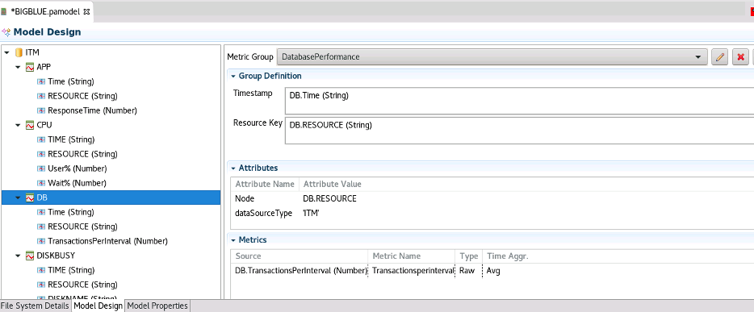

Define your timestamp format in Model Properties tab, making sure you select the
timestamp definition under **DatabasePerformance**, setting it to **dd/MM/yy
HH:mm**.


Again, return to the Model Design tab and click on the extraction preview icon
to preview the extraction:


Save the model progress by selecting

**File -\> Save**

Lastly, we will model the DISKBUSY csv. Right-click on DISKBUSY under the ITM
data source, and select "New Metric Group":

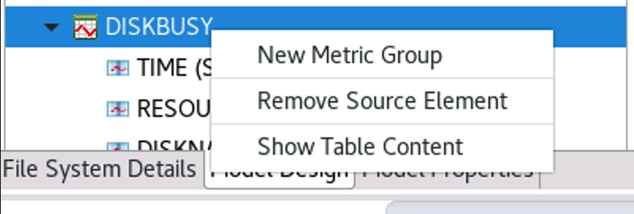

Call the metric group **DiskPerformance**


Review the model definition:

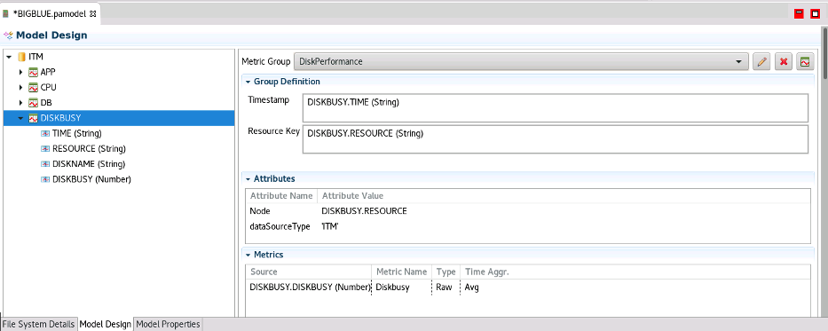

Note that in the CSV file, we have four columns: TIME, RESOURCE, DISKNAME, and
DISKBUSY. The mediation tool did a good jo of defining the Timestamp and
identifying the metric name. However, for the resource key, it only used the
RESOURCE field in the CSV file. If we don't add the DISKNAME field to the
resource key, the Metric Manager will just aggregate/average the data for all
disks to a single metric (DISKBUSY) at the Node level, which is certainly not
what we want.

The resource key is important for metrics that may be specific to a component or
set of components on a node or device. For example, if Metric Manager is
receiving network utilization metrics from a server that has **2 network
interface cards**, you need to define the resource not as simply the Node, but
the **Node + network interface card name**… e.g. "server1:eth0 and
server1:eth1".

The mediation tool does this for us when we define multiple columns as the
**Resource Key**.

In our case, what we need to do is include the **DISKNAME** as part of the
Resource Key, so we don't just aggregate/average all values for all disks at the
Node level. To do this, select **DISKNAME** from the ITM data tree with the left
mouse button, hold down the button and drag it into the Attributes window to add
DISKNAME as an attribute. Alternatively you can right-click on **DISKNAME** and
select **Add Attribute**:


You'll notice that it automatically gives it **Application** as an Attribute
name. You can leave it as is or change it to **Disk** or something descriptive
if you wish.

Next, repeat the same process to add the DISKNAME field to the resource key. In
the ITM data tree, select **DISKNAME** with your left mouse button, hold down
the button and drag it to the Resource Key. Alternatively you can right-click on
DISKNAME and select **Add Resource Key**:

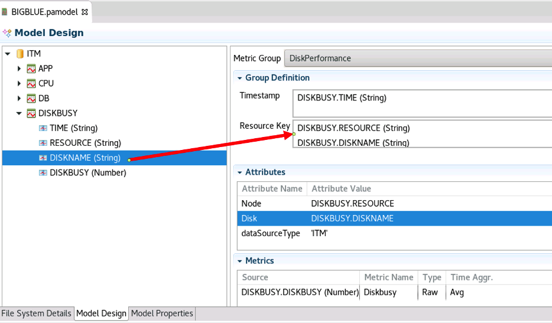

Finally, go to the **Model Properties** tab and define the timestamp format as
**dd/MM/yy HH:mm**:


Return to the **Model Design** tab and click on the **preview extraction** icon.
A Warning window will pop up:


What this is telling us is that there are multiple entries for values in each
time interval defined in the file.

This could be a data quality issue. Minimize the mediation utility and open up a
new terminal window, and issue the following commands:

```sh
cd /home/scadmin/BookInfoDemo/data/bookinfo/data
cat DISKBUSY__20201001-0000__20201002-0000.csv |head -n 20
```

You'll notice that indeed there are multiple entries for a given time stamp.

If this were a data quality issue, it may be due to the exclusion of another
component from the csv file that would make the resource more unique, that would
be needed to be included in the resource key. Or perhaps there is something not
right with how the data is being extracted and written.

In our case, upon further investigation and a discussion with the team that
manages the tool that measures DIKSBUSY, we discover the DISKBUSY metric is
measured and written every 10 seconds, but the time format as written has left
off the seconds column. This isn't a problem in this case, because the smallest
aggregation interval Metric Manager supports is 5 minutes, and these values will
be all aggregated up to 5 minutes anyway… even if the seconds column were
included. So in our case, we can safely ignore the error.

Data quality is paramount to ensure maximum value from Metric Manager. Be aware
of the format of the data, and if there is something you come across that
doesn't seem right, consult the owners of the tool that's generating the data
for Metric Manager and verify that it is correct.

To continue the lab, return to the Mediation Tool window and click **Ok** and
verify that your extraction preview shows data:


Now that we have completed the data modelling, we are ready to "Deploy" our
model to the BIGBLUE topic that we created earlier. Before doing that, select

**File -\> Save**

To save the model:


## 4.5: Deploying the model

Next, to deploy the model, right-click on the BIGBLUE.pamodel title under the
TECHJAM2022 project, and select **Deploy Model**:


And change the following items in the configuration window:

`JDBC URL: jdbc:db2://pi-template.Hybrid-Squad.cloud:50000/SCAPIDB` `Password:`
**<span style={{color: "green"}}><LAB PASSWORD\></span>**
`<CHECK "Save as Project Defaults">`


Click **Ok** when finished:


If there are multiple topics configured in the Metric Manager install, you will
need to select the appropriate topic from the drop-down list. Select "BIGBLUE"
and click "Ok":

If there is just a single topic, it will deploy straight away.

After the KPI count is complete, click **Yes** to deploy the model to the topic:

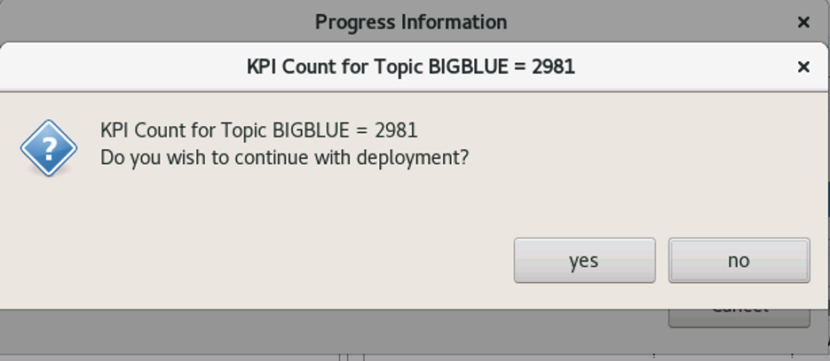

After the deployment completes successfully, exit the mediation tool to return
to the command line.

## 4.6: **Ingesting CSV data for machine learning**

### Start the topic

Now that we have successfully created and deployed a model to our topic, we can
extract the data for analysis and see how the Metric Manager learns the behavior
of the data and identifies situations where the data has acted contrary to the
learned behavior. We must first start the topic. Exit the mediation tool to
return to the command line and run the following command to start the topic:

```sh
/opt/IBM/scanalytics/analytics/bin/start.sh -t=BIGBLUE
```

After about 2 minutes you should see a message indicating that the topic is
running:

_ **Instance AnalyticsBIGBLUE running** _

If you see an error message, rather than the above message, try stopping the
Streams instance, and then start the topic using the following commands:

```sh
/opt/IBM/scanalytics/analytics/bin/stop.sh -s
/opt/IBM/scanalytics/analytics/bin/start.sh -t=BIGBLUE
```

If you still have problems starting up the topic, ask a lab proctor for
assistance.

### Verify required services are running

Before we start the extraction, verify that the Netcool services are up and
running by issuing the following command, using the password **<span
style={{color: "green"}}><LAB PASSWORD\></span>** as the password:

```sh
sudo systemctl status nco
```

The Active line should say active. If it is not showing an active status, start
it up by running:

```sh
sudo systemctl stop nco
sudo systemctl start nco
```

Next verify the Netcool GUI is up and running by issuing the following command:

```sh
sudo systemctl status netcoolwebgui
```

If the "Active" line is showing any status other than "active (exited)", start
it up by running:

```sh
sudo systemctl stop netcoolwebgui
sudo systemctl start netcoolwebgui
```

Ensure that the DB2 database is running by running:

```sh
db2pd -
```

The "Database Member 0" should show active. If it is not active, start DB2 by
running:

```sh
db2start
```

Finally, verify that the Metric Manager UI is running by issuing the following
command:

```sh
/opt/IBM/scanalytics/UI/bin/pi.sh -status
```

If the IBM Websphere Liberty Profile is DOWN, run the following command to start
it:

```sh
/opt/IBM/scanalytics/UI/bin/pi.sh -start
```

and verify the status again to ensure the profile is UP.

### Run extraction

Once the Netcool core, Web GUI, DB2, and Metric Manager UI components are
running, we are ready to extract the data. Run the following command to start
extraction:

```sh
$PI_HOME/bin/admin.sh run_extractor_instance -t=BIGBLUE -s=20201001-0000 -e=20201017-1200
```

This will initiate the ingestion process, and start the extraction from October
1st, 2020 at midnight, and end the extraction when it has ingested data all the
way up to October 17

To monitor the ingestion,

```sh
cd ~/BookInfoDemo/data/bookinfo/data
ls
```

If you list the directory, you will see as the ingestion process proceeds, files
that are being read are changed to prepend the filename to INUSE.\<filename\> a
such:

_INUSE.DISKBUSY\_\_20201002-0000\_\_20201003-0000.csv_

Next, list the files in the 'good' directory. You will see files that have
completed ingestion arrive in the 'good' directory.

```sh
ls good
```

By watching both the data directory and the good directory, you will be able to
see which files are being processed (INUSE), and which files are complete and
end up in the 'good' directory.

Take a break. In about 12 to 15 minutes, the data directory will be empty of all
CSV files, which have been moved to the good directory. Machine learning and
anomaly detection of the ingested data will complete. The next lab will walk
through navigating the UI and viewing the results.
