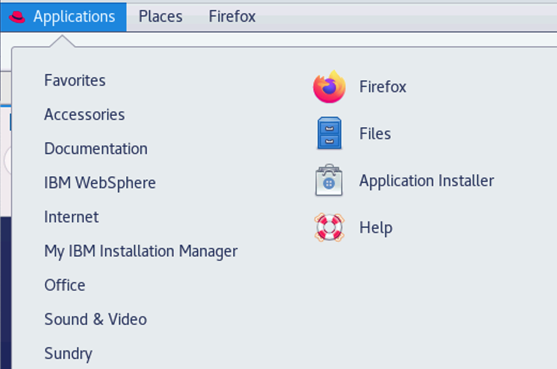
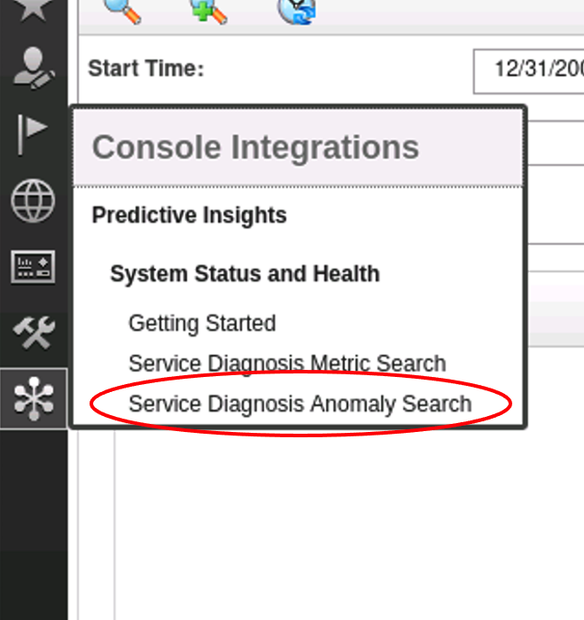
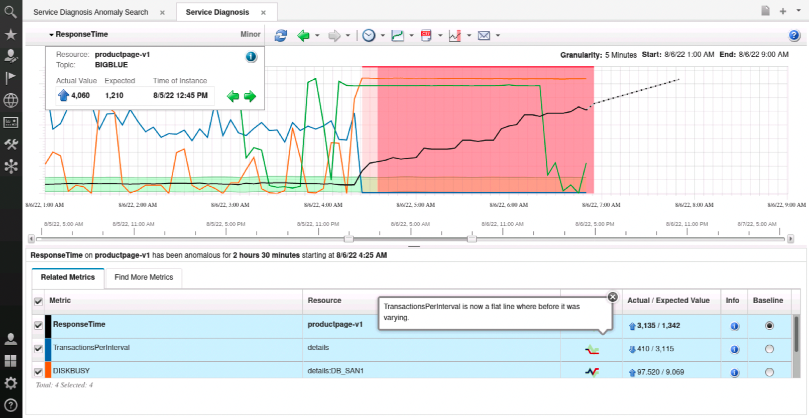
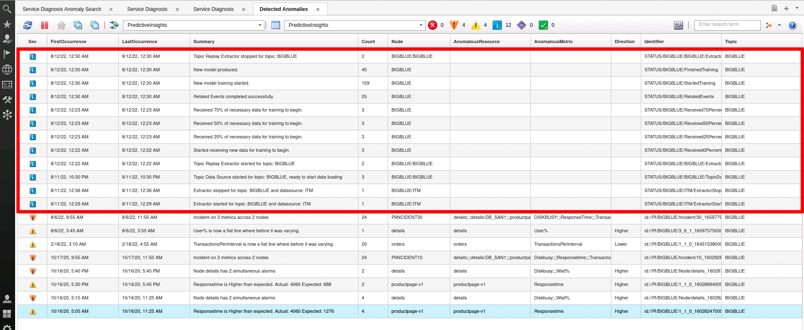
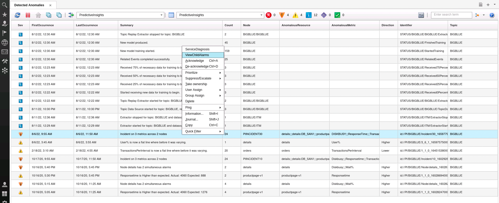
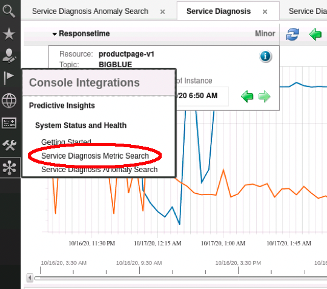
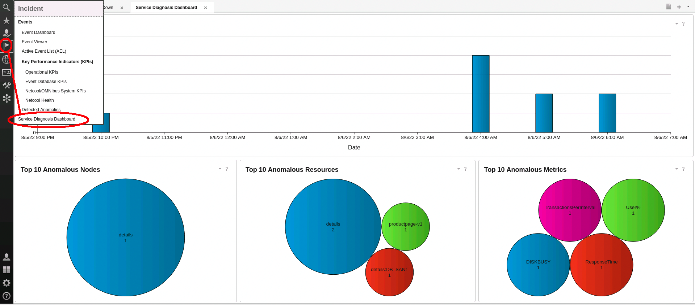

## 5.1: Lab Introduction

In our previous lab, we configured a Metric Manager topic to receive data, we
built a data model based on CSV files, we deployed the model to our topic, and
we ran extraction to allow the Metric Manager to ingest the data and learn the
behavior. Now that we have run our data through the system for analysis and
machine learning, we will review the results of the metric analysis.

## 5.2: Accessing the dashboard

To view the results of the ingestion and analysis, open Firefox from the Desktop
menu:

Login as **ncoadmin** / **<LAB
PASSWORD\>**:

:::note

If you don't see the above login screen when opening up Firefox, click on the
"IBM Dashboard Application Services Hub" bookmark in the bookmarks bar.

:::

## 5.3: The anomaly search view

From the main Dashboard window, find the "Snowflake" icon in the left menu pane,
click on it, and select "Service Diagnosis Anomaly Search":

You will be presented with the anomaly search screen, which defaults to the
latest anomalies that exist across all topics in the Metric Manager instance.
Note that at the top you can do arbitrary date range searches by selecting a
start date/time and an end/date time:

You can also filter down the anomaly list by entering a resource name, with the
UI doing a live search for resources as you type. Try this by typing in
"details" in the "resource" box:

Take note of how it auto-fills the resource information per the resources that
are in the system. In this case, we have two resources:

- "**details**" which would likely have "node-level", metrics (aggregate CPU
  utilization, for example).
- "**details:DB_SAN1**" is a more specific component of the node "details", and
  indicates metrics for that particular sub-component (in this case, the disk
  DB_SAN1).

You can also filter by metric name as well.

Next, let's take a look at the anomalies that were generated. Click on the "Show
Current Anomalies" icon. This will bring you back to the last set of anomalies
that exist in the system:

Notice the anomaly that indicates there was an incident on 3 metrics across two
nodes. This is a grouping of related anomalies. Open up the tree view to expose
all of the multi-level, grouped anomaly alerts:

## 5.4: Launching anomaly details

Next, find the anomaly that indicates **ResponseTime is Higher than expected**
for the **productpage-v1** resource, and select **Launch** (may be in a
different location that what is shown below):

This will launch you into the anomaly diagnosis screen for the Response Time
anomaly:

Here, you can see the general pattern of the metric, and the training period
leading up to our anomaly. By default, the robust bounds algorithm training
period, which provides the high/low bounds of a given metric, is set to 28 days.
You do have control over the training period for each of the algorithms employed
in Metric Manager. In MAD, the default training period is 14 days, and we'll see
how that differs in the MAD lab, where we catch each of the three spikes seen
above in the 28-day training period.

For this view, let's zoom into the latest time leading up to this anomaly. You
can do this by hovering your mouse over the graph at a time previous to the red
area… hold down your left mouse button, then drag right to capture the time
period, then release the left mouse button. When you release the left mouse
button, it will change the graph into a zoomed view:

Here we can hover over the first box of the red area and see the exact time that
this metric went out of its learned baseline. We see the anomalous area in red,
with the actual values of the metrics continuing up.

Note the light pink section of the box. That area indicates the "grace period"
before we generate an alert to Watson AIOps Event Manager. By default, if any
**three** of **six** consecutive data points of a resource/metric combination
are found to be anomalous, then Metric Manager will generate an alert, and
continue to generate those alerts for each consecutive anomalous data point.
Anomalies that don't reach this threshold are still generated, but are
**suppressed**. They can still be viewed in the anomaly search window by
selecting "Include suppressed alarms" but these are not forwarded to the Event
Manager. This behaviour is configurable by modifying the following pair of topic
configuration items:

`nofm.error.count.min.size: 3` - the number of anomalies within...
`nofm.error.count.window.size: 6` - any X consecutive time intervals

For 5-minute interval data, using the default configuration, that means that the
earliest we would see an anomaly alert is within 15 minutes of the
resource/metric going anomalous (e.g. 3 consecutive anomalous periods), and the
longest we might see an alert is 30 minutes (e.g. first data point is anomalous,
followed by 3 normal data points, then followed by 2 more anomalous data points,
as an example). The properties could both be set to 1, which would result in
immediate alarms for all detected anomalies.

At the right-hand side of the graph, you can see a dotted line illustrating the
general trend and forecast of the anomaly.

At the bottom of this view, you can see a list of metrics, with Response time
selected. Crucially, there are additional related metrics that are contributing
to this Response time issue, and they are included as **Related Metrics**. In
the bottom section of the window, add the related metrics to the view by
clicking on the respective check boxes:

The graph will build out to include the related metrics, to give you a full
picture of the situation.

Hover your mouse over the graph, and note that, for any point in time on the
graph, you can see the metric names, values, and time:

In the "Related Metrics" section below, you see six columns: Metric, Resource,
Anomalous, Actual/Expected Value, Info, and Baseline.

The Metric and Resource columns indicate the metric name and the resource
associated with that metric that is anomalous.

The **Anomalous** icon tells you which algorithm has deemed this particular
resource/metric combination anomalous. Using your mouse, hover over the
**Anomalous** icon for the **ResponseTime** entry for the **productpage-v1**
resource. Note that the hover text notes **ResponseTime has gone outside of its
normal expected value**. This indicates that the Robust Bounds algorithm has
deemed this metric to be anomalous. That fact is also evidenced by the graph,
where we see the baseline of the metric, and when it went outside of the
baseline.

In contrast, hover over the **Anomalous** icon for the
**TransactionsPerInterval** for the **details** resource. Note the hover text
indicating that the **TransactionsPerInterval** metric for the details database
has flat-lined … that is, where before it was varying, now it is no longer
varying. This is an algorithm that identifies an unusual change in behaviour
that would very likely describe a problematic situation. In this case, the
number of database transactions have not been able to exceed 410, where normally
we would see it around 2500.

To the right of the Anomalous column is the **Actual/Expected Value**. Looking
at the response time metric for the productpage-v1 application, we see its
actual value is just over five times slower than expected for this time of day
(6638/1290).

The **Info** column provides information with regards to why a metric has been
included in the group of metrics. For example, hover over the blue information
icon for the "TransactionsPerInterval" metric. It is indicating that there are
two reasons why this metric was included:

**When ResponseTime on productpage-v1 is anomalous, 100% of the time
TransactionsPerInterval on details is also anomalous** They are very strongly
correlated from an anomaly occurrence prespective.

**This metric is causally related to the target metric you launched**. This
indicates that the behavior of these two metrics (productpage-v1/ResponseTime,
which is the metric we launched to, and details/TransactionsPerInterval) tend to
act in concert.

Looking at the overall related anomalies gives cross-silo visibility that would
otherwise not be possible by only looking at the specific monitoring tools that
are collecting this data. We have brought together performance data from our APM
solution, which provides response time information for the productpage-v1
application. We have brought in database transaction information from our
database monitoring tool. And we have brought in disk performance metrics from
our infrastructure monitoring tool. In seeing these anomalies together, we can
surmise that the disk saturation is limiting the number of database
transactions, which is, in turn, causing a serious performance problem for the
application.

## 5.5: Viewing alarms in Event Manager

Next, we will look at the alarms in Event Manager that were generated for these
anomalies. Anomaly alerts are generated through the use of a stdin probe that is
installed and configured during the installation of the Metric Manager. There
are default views and filters that are also installed into DASH, and a
pre-configure event list that shows metric related events. To access this event
list, click on the flag icon in the left pane, then select **Detected
Anomalies** :

At the top of this list, you can see a number of alerts that indicate general
progress of the topic, including when the topic was started, when the extractor
was started/stopped, when we started receiving data, the amount of data received
required for training, when the model training started, and when the model was
produced:

The anomaly alerts are shown below, including "summarized" anomaly alerts.
Right-click on the alert indicating "Incident on 3 metrics across 2 nodes", and
select the "ServiceDiagnosis"

Much like from the Anomaly Search window, you are launched into the anomaly
graph:

One thing that's a little bit different than looking at the anomaly search, is
that you must click on the "View Child Alarms" tool to see anomaly events that
make up the the incident:

..which brings us the child alarms. You may need to again run the tool to see
sub-groups of metrics as well:

## 5.6: Metric search

You can perform arbitrary searches for resource / metric combinations.

Click on the "Snowflake" icon in the left menu, and select **Service Diagnosis
Metric Search**.

The Metric Search screen appears, and here you can search for an arbitrary
resource / metric combination by starting with the resource name (in this case
search for **productpage-v1**), then the metric group (ApplicationPerformance),
and finally the metric name (ResponseTime). When you have the metric of
interest, click on "Add" to add the metric to the graph:

gives way to...

Searching for arbitrary metrics allows you to view the behaviour of metrics
**without** them necessarily being anomalous, which can come in handy if you
want to ensure that a given metric is being collected, and also in situations
where someone needs evidence that a metric or set of metrics of interest are
acting within their learned baselines.

## 5.7: Anomaly distribution dashboard

Finally, there is also an anomaly distribution dashboard that shows the time
frame of anomalies received, the number of anomalies that occurred for each time
frame in a bar graph, and top 10 anomalous nodes, resources, and metrics. Its
more useful for large datasets to be able to identify the when, over time, the
most anomalies occur, and the top origin of those anomalies. You can access it
by clicking on the **Flag** icon in the left navigation bar, then selecting the
**Service Diagnosis Dashboard** menu item:

