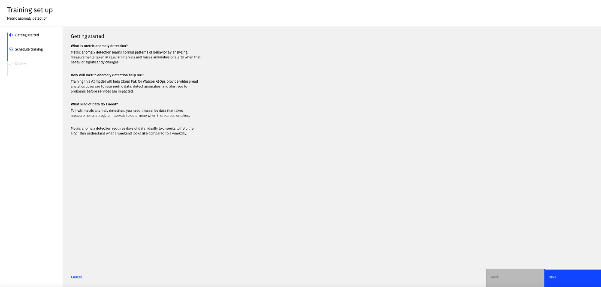
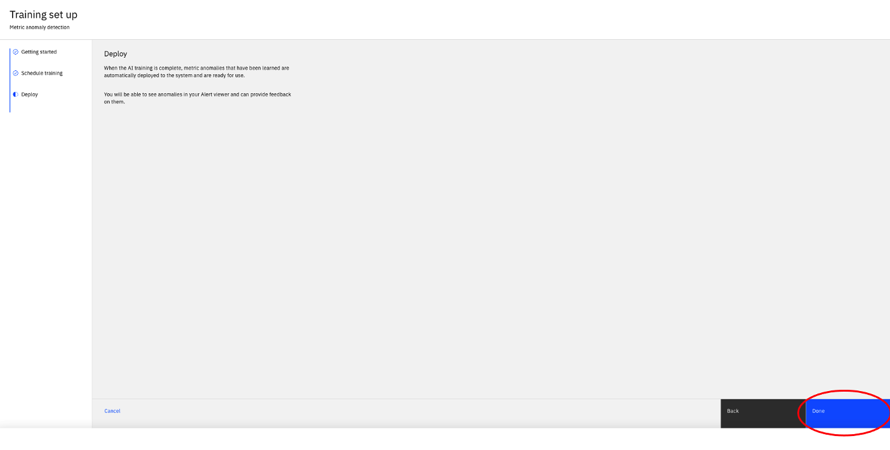
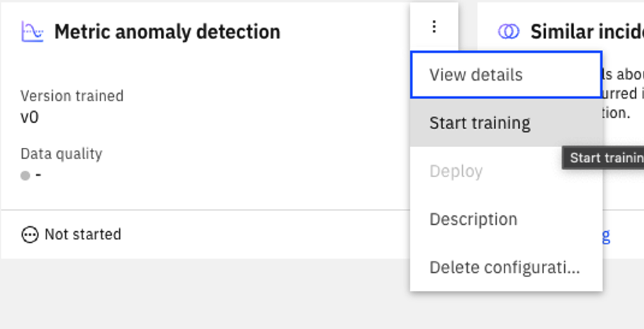
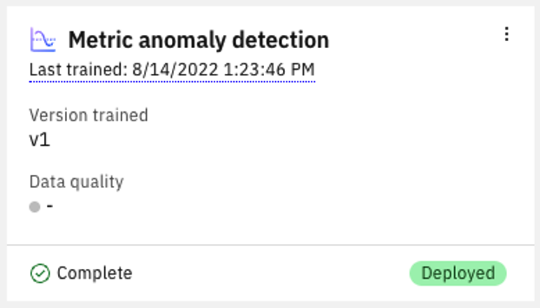
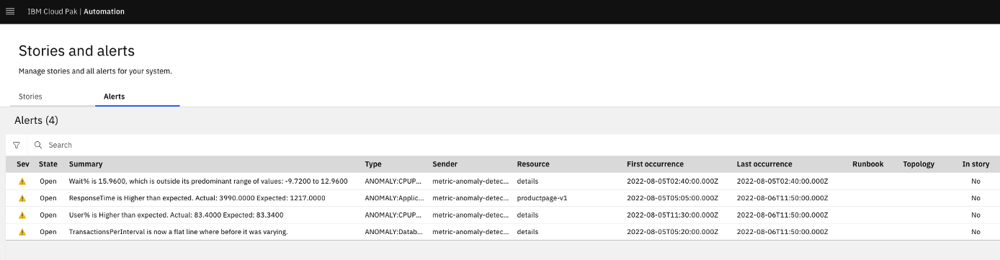
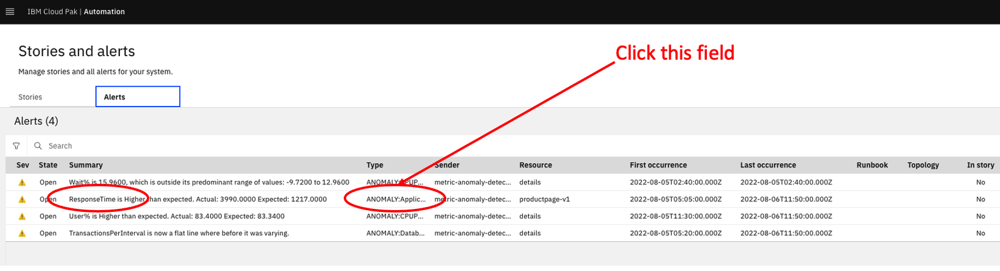
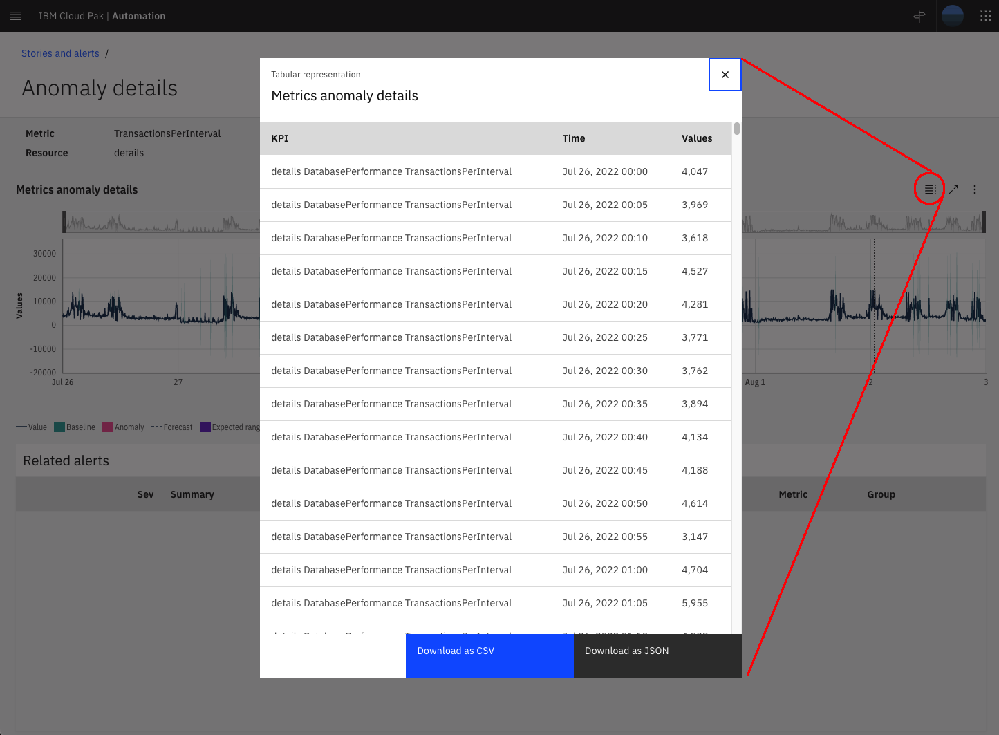

## 7.1: Introduction

The Watson AIOps Metric Anomaly Detection feature is intended to be the
replacement for the VM-based Metric Manager. While it doesn't quite have feature
parity with the VM based solution currently,

Some of the items that the MAD component will improve on over the VM solution
are:

- **_Current GA release (3.4.1)_**
  - High Availability
  - Support multiple aggregation interval
  - Runs on OpenShift
  - Horizontally scalable
  - Easy install
  - Off-the-shelf Instana connector
  - Seamless, modern user experience
- **_Future releases_**
  - Multi-tenancy
  - Data quality analysis<br/>

Features that are currently missing in MAD vs. VM Metric Manager:

- Metric search (future enhancement)
- Anomaly search (future enhancement)<br/> Current off-the-shelf
  mediators/integrations are incompatible (future enhancement)<br/>

:::info

It is possible to install MAD in either Watson AIOps Event Manager deployment,
or in Watson AIOps AI Manager deployment. We went with AI Manager to give you
exposure to that installation and to allow you to familiarize yourselves with
the UI.

:::

## 7.2: Verify the Watson AIOps AI Manager installation

At the beginning of the day, you started an install of Watson AIOps AI Manager.
In general, a deployment of AI Manager runs around 90 minutes or so. Before we
proceed with these labs, we will verify that the AI Manager install completed
successfully.

Open a shell on your control node, switch context to your 'AIOps' environment,
then verify that your AI Manager installation has completed successfully:

```sh
oc project cp4waiops
oc get installations.orchestrator.aiops.ibm.com -A && echo "" && oc get ircore,AIOpsAnalyticsOrchestrator -A -o custom-columns="KIND:kind,NAMESPACE:metadata.namespace,NAME:metadata.name,STATUS:status.conditions[?(@.type==\"Ready\")].reason" && echo "" && oc get lifecycleservice -A -o custom-columns="KIND:kind,NAMESPACE:metadata.namespace,NAME:metadata.name,STATUS:status.conditions[?(@.type==\"Lifecycle Service Ready\")].reason" && echo "" && oc get BaseUI -A -o custom-columns="KIND:kind,NAMESPACE:metadata.namespace,NAME:metadata.name,STATUS:status.conditions[?(@.type==\"Ready\")].reason" && echo "" && oc get AIManager,aiopsedge,asm -A -o custom-columns="KIND:kind,NAMESPACE:metadata.namespace,NAME:metadata.name,STATUS:status.phase"
```

The status of the components should be "Ready", and Completed, Configured, and
OK for AIManager, AIOpsEdge, and ASM respectively:


## 7.3: Generating an API key

For this lab we will be sending in metric data through the Watson AIOps REST
API. Any interaction with the Watson AIOps API must be authenticated by either a
bearer token or an API key. In this section, we will generate an API key that we
will use to send in our data.

First, we need to login to the Watson AIOps interface. To do that, we need to
obtain the UI route (URL) for your Watson AIOps installation UI. Run the
following command and copy the output:

```sh
oc get route -n cp4waiops cpd -o jsonpath='{.spec.host}'; echo
```

Open up your browser on your laptop and paste the URL. You will be presented
with the main login screen. Click on "IBM provided credentials (admin only):


Obtain the password for the admin user by running the following command, and
copy the resulting output:

```sh
oc -n ibm-common-services get secret platform-auth-idp-credentials -o jsonpath='{.data.admin\_password}' | base64 -d ; echo
```

Login to the Cloud Pak as user 'admin', and paste the password in the Password
field:


Click "Maybe Later" if the "take a tour" window pops up. You will be presented
with the main Cloud Pak window. In the upper-right corner of this window you
will see a blue user circle, click on this circle, and select "Profile and
settings":


In the admin user configuration interface, in the upper-right corner of the
window you will see a link titled "API key". Select that link, and from the
drop-down click "Generate new key":

 

Copy the key, and save it some place where you won't lose it. Note that once you
close this window, you will never be able to obtain that key again. So if you
lose it, you will need to generate another key.

Return to the console on your control node and create a Basic Authentication
token, which will be used to authenticate with the Metrics REST API. Save the
Basic Authentication as an environment variable named ZENAPIKEY. Run the
following command, being sure to replace <YOUR API KEY\> with the api key you
copied in the previous step:

```sh
ZENAPIKEY=$(echo "admin:<YOUR API KEY>" |base64); echo $ZENAPIKEY
```

## 7.4: Sending training data to the Watson AIOps API

First we will obtain the training/display files we will use to demonstrate
training/anomaly detection. SCP the following training and display files. Use
\<LAB PASSWORD\> as the password:

```sh
wget http://150.238.93.118/BookInfoJson-training-20220721-0000__20220804-0000.json
wget http://150.238.93.118/BookInfoJson-display-20220804-0000__20220806-1200.json
```

The metrics REST API is exposed via an OpenShift route. Obtain the route and
store it in an environment variable named 'METRICROUTE':

```sh
export METRICROUTE=$(oc get route | grep ibm-nginx-svc | awk '{print $2}')
```

Next, send in the training data to the Watson AIOps REST API using the following
curl POST command:

```sh
curl -k -v -X POST "https://${METRICROUTE}/aiops/api/app/metric-api/v1/metrics" --header 'Content-Type: application/json' --header "Authorization: ZenApiKey ${ZENAPIKEY}" --header 'X-TenantID: cfd95b7e-3bc7-4006-a4a8-a73a79c71255' --data @BookInfoJson-training-20220721-0000\_\_20220804-0000.json
```

The key response lines that you will see when the load is successful are:

_< HTTP/1.1 100 Continue_

_\* We are completely uploaded and fine_

_\* Mark bundle as not supporting multiuse_

_< HTTP/1.1 200 OK_

Followed by several lines summarizing the completed session.

## 7.5: Confirm that the training data was received

Much like we saw in the on-prem Metric Manager, data that is send in via the
REST interface is placed on a Kafka topic and inserted into a Cassandra
database. We can verify that our training data made it into Cassandra by logging
into the Cassandra pod, running cqlsh, and querying the tararam.dt_metric_value
table. The following steps describe this process.

First, obtain the Watson AIOps Cassandra password and place it into an
environment variable called **CASSANDRA_PASSWORD**. This can be achieved with
the following command:

```sh
export CASSANDRA_PASSWORD=$(oc get secret aiops-topology-cassandra-auth-secret --template={{.data.password}} |base64 -d)
```

Next, run cqlsh using 'oc exec' command:

```sh
oc exec -it aiops-topology-cassandra-0 -- /opt/ibm/cassandra/bin/cqlsh -u admin -p $CASSANDRA_PASSWORD --ssl
```

If you describe keyspaces, you will see our tararam keyspace. Switch context to
that keyspace with the 'use tararam' command, and query the dt_metric_value
table:

```sh
describe keyspaces;
use tararam;
select * from dt_metric_value;
```

You will see that, much like we saw with the on-prem REST service, we see our
metric data.


You can also view the unique resource/metric combinations that are in the
dataset by running:

```sh
select * from md_metric_resource;
```


In the above output, you can see the unique metric/resource combinations that
were found within the data that we sent to the REST interface. The mr_id is the
link between the resource/metric combination, and the metric value in the
dt_metric_value table.

## 7.6: Running the training job

Now that we have data in the system, we can kick off a training job. Return to
the Watson AIOps interface in your browser, and from the main screen, click on
AI model management:


In the next window, you'll see a tile for "Metric anomaly detection". Select
"Set up training" from this tile:


Click "Next" on the description page:



The next screen allows you to define a schedule for ongoing
re-training/re-learning. In general, it is recommended that this be scheduled on
a daily basis, which is how the on-prem Metric Manager works as well. For our
purposes though, we're going to manually train on the data, so you can leave
this Off for now. Click "Next"


The final screen explains where to find anomalies. Click "Done"



Once your training configuration is complete, you will be brought back to the
model management screen. Select the 3 icons at the top right of the Metric
anomaly detection tile and select "Start training". This will kick off a
training job, and Watson will ingest the training data, analyze and model the
data based on its behavior, and be ready to look for instances where future
metrics act contrary to the behavior learned in this training job:



After a minute or two, training should complete and you should see the model
deployed:



## 7.7: Sending anomalous data

We split the data into two parts to illustrate training and anomaly generation.
In this step, we will send our anomalous data in. This will be in the same
manner that we did for the training data… using curl. The following command will
send our "display" metric data into the REST API of MAD.

```sh
curl -k -v -X POST "https://${METRICROUTE}/aiops/api/app/metric-api/v1/metrics" --header 'Content-Type: application/json' --header "Authorization: ZenApiKey ${ZENAPIKEY}" --header 'X-TenantID: cfd95b7e-3bc7-4006-a4a8-a73a79c71255' --data @BookInfoJson-display-20220804-0000\_\_20220806-1200.json
```

## 7.8: Viewing the results

To view the results of our analysis, return to the Watson AIOps interface, and
from the main menu click on "Stories and Alerts".


Click on the Alerts tab to see our anomalies:



Select the "Type" Field for the "ResponseTime" anomaly for the productpage-v1
resource. Then, in the Alerts Details window on the right, click on "Metrics
anomaly details".



This will bring up a historical chart that shows the time leading up to the
anomalous period, with the anomalous period displayed in a red shaded area:


To get an expanded view of this chart, click on the "View expanded chart" link
below the chart. This will give you an expanded time period leading up to the
anomaly, and also provide a list of any related alerts in the pane below, were
there any at the time. The Metric Anomaly Detection feature currently leverages
CNEA temporal events to do its event correlation. Future versions of Metric
Anomaly Detection will also be able to show multiple related metrics on the same
graph, whether the resources are related by temporal events, topology, or scope.


Also note that it is clear where the training period has ended, and we have a
persisted baseline that started on 8/4/2022. If you hover your mouse over the
graph, you can see the details of the time period and the actual value of the
metric for that specific time period. You can see three instances where the
response time went anomalous for short periods of time, then at the very right
of the graph, we see where it went anomalous for a long period of time.

Much like we saw with Metric Manager, in MAD you can zoom in on any time period
by holding your left mouse button down and dragging it across the time period
that you want to zoom in:


To return to the expanded page, click anywhere in the top mini histogram bar.
You will return to the expanded view.

Next, zoom in on the latest anomaly section to the right:


Hover your mouse over the beginning of the red box, and you can see this
situation started at 8/6/2022 at around 4:25 am., where the response time
clearly started behaving contrary to the learned behavior. You can also see, on
the right, where the data set ends. In live ingestion, this would likely be
indicative of the "current time", but in our case this is historical data and
that happens to be when the data set ends. Note the forecast of where that
metric is headed based on Watson's forecasting algorithm. By default, we plot 20
intervals into the future… so if the data is 5 minute data, that would be 100
minutes into the future. You will notice that the forecast gets wider and wider
farther into the future. This indicates that the further you go into the future,
the less confident Watson is in terms of where it will be.

At the top of the histogram, you will see two black bars that let you move the
start/stop time of the graph. Move the left one by clicking on it and dragging
it to the left to include the time period where we saw the other anomalies:


At the top of the graph, note the three dots. This will bring up a menu that
allows you to export the data in the current graph. You can export the data in
CSV format, or you can export the graph as an image in PNG or JPG format.


You can also display the values in the current graph in a tabular view by
clicking on the tabular view icon:



Finally, you can bring up any arbitrary day in the past by clicking on the
"Date" drop-down. A calendar view will pop up allowing you to select a day to
view the metric data for the current metric for that date:


## 7.9: Lab summary

In this lab, you verified the installation of Watson AIOps, learned how to send
metric data into the Watson AIOps metric API, learned how to perform training,
and viewed the results of the anomalies generated from the training model.

That concludes the labs for Metric Anomaly Detection, and Metric Management as a
whole for the Watson AIOps solution.
