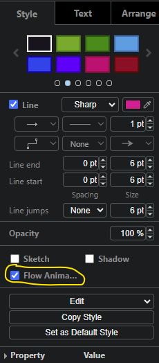

:::info

Whilst the examples below focus on AIOps as the subject, this guide is meant as
a generic recommendation for planning any product or solution deployment
project.

:::

A successful deployment involves communicating important details to multiple
teams across an organization in good time to avoid miscommunication, e.g.

- The team who will deploy and manage AIOps.
- The Operations or SRE team(s) who will leverage AIOps to manage their
  applications and services.
- The data source and integration tooling teams.
- The Network team who will ensure required networking configuration, firewall
  rules and IP capacity is in place.
- The Security team who will guide and ensure secure processes and design are
  followed.

Miscommunication of requirements can lead to overall deployment and go-live
delays, e.g.

- Incorrectly sized or specified infrastructure requirements.
- Incomplete network planning.
- Misconfigured platform or software based on scope of requirement.

We recommend beginning any AIOps deployment project with a collaborative
planning exercise including SMEs from all the disciplines and teams that will
contribute to a successful delivery.

This can also facilitate and expedite knowledge transfer to new team members, or
teams members who came in after certain designs and decisions were put in place.

:::tip Helps cluster network design

One of the early benefits of taking time to visualize the environment and
capturing network boundaries, e.g. subnets, is that it directly feeds into the
next stage of planning, which is cluster design.

As you build up your diagram, think about outbound connections initiated from
AIOps software in particular. This will help network SMEs plan cluster internal
network subnets to help ensure there are no subnet overlaps with the target
system. Overlaps can cause network communication failures.

Finding out about outbound connection problems after you have installed your
cluster and AIOps can result in expensive rework and project delays.

:::

To that end, a picture paints a thousand words:

A diagram like this conveys a lot of contextual information in one go, and
allows all stakeholders to work together on a single overarching view of the
solution:

- Data source and integration SMEs can communicate key bits of data such as:
  - the types of data being integrated.
  - where it is coming from.
  - the flow of the data (direction), which helps us see if it is being pulled,
    or pushed.
  - port and protocol connection information to expedite network configuration.
- Network engineers can understand what is being asked for in terms of firewall
  rules.
- Infrastructure engineers can communicate platform and other information
  relevant to the solution.
- Infrastructure and network engineers can plan subnet information for the
  cluster based on identified outbound connection details upfront.

:::info Diagram tooling

These diagrams were built using [draw.io](http://draw.io/) which also has a nice
flow animation option, amongst a large pallete of shapes and other useful
customizations.

Flow animation screenshot

:::

## Identifying potential monitoring gaps

The goal at the end of the day is to ensure your business critical applications
and services are up, running and serving the end users without incidents. If
something does go wrong, you want to first try to detect it proactively so you
can potentially remediate issues before they become user impacting. In the
situation a user impacting incident occurs, you want to identify probable cause
so the right actions can be taken and service restored as fast as possible.

For that reason, taking the time to try and capture some key high-level
information about the applications and services, including the technology or
platform in use, is very beneficial:

This can be as detailed as you like, however it is not necessary to depict every
instance or detail of the stack. Rather, focus on information that can help you
understand and convey to stakeholders:

- What the overall app or service environment looks like.
- What type of data you are collecting for each applicable layer that makes up
  the app or service stack.
- How the data is flowing, both direction and path it takes from source to AIOps
  (e.g. via an intermediary tool).
- Network boundaries the data traverses.

Using colour coding adds extra visual context to easily see data types and
associated flows into the system.

### Can you spot any potential gaps?

In the example above, it is pretty easy to see 2 immediate areas of concern that
need further investigation:

1. Whilst we may be getting metric data for `App3` running on `Server X` near
   the bottom of the stack, we don't appear to be getting any monitoring data
   for `Server X` itself.
1. We seem to have no monitoring data for `Storage Infrastructure` right at the
   bottom.

Since `App2` at the top has a relationship to `App3` as seen by the connection
to `Load Balancer`, and `App3` has dependencies on `Server X` and
`Storage Infrastructure`, how could you tell if an issue with the server or
storage was causing a problem with either of the 2 applications. Operations /
SREs may be treating symptoms in the applications without being aware of
underlying issues further down the stack.

Seeing this quickly on paper can really help steer planning and implementation
in the right direction quickly, helping you get the most from your monitoring
solution.

## Identifying data volume and filtering needs

In an ideal world, compute resource would be infinite and you could simply
integrate all data from all systems into AIOps.

However, there are some important points to keep in mind:

1. Adding data that may not be relevant to the scope of your project will add
   noise to the system.
1. The more data you want to add, the more compute resources that will be
   required, at certain scale points.

So the question becomes, what data do you need to give IT Operations / SRE
teams, all they need to manage their environments?

Visualizing your environment like this upfront, and collaborating with various
SMEs across different teams, helps you reason about what data to focus your
project on. You can start to:

- Identify the important data points and the tools they will come from.
- Identify data filtering characteristics.
- Understand and quantify projected data volumes.
- Understand how data will be correlated and which correlation keys will be
  used:
  - This can help guide naming convention discussions and other data related
    best practices which can help improve the quality and value of your
    monitoring solution.

## Tips on what is useful to capture

- Data center / cloud environment boundaries and resources.
- Subnet and firewall boundaries.
- OpenShift version, installation method, and image registry connectivity
  (online vs disconnected).
- Hardware or virtualization platform details.
- Storage details.
- Container registry details (especially in case of a private registry).
- Data feeds, data types and connector types.
- Integrations and connector types.
- Authentication integration details.
- Data flows, protocols, ports using flow animations.

## Conclusion

Think back to the last time you tried to get a project off the ground. How long
did it take you to:

- Understand the environment.
- Identify what was needed.
- Communicate key information to multiple stakeholders.
- Gather information to help you size your deployment.

Taking a little time upfront to drive a handful of targeted, collaborative
sessions with cross-team SME participation, can really expedite your planning
and ultimately delivery process.

Firewall rules and infrastructure requirements can be satisfied in good time.
Communication between teams, including with IBM, can be expedited. Targeted
information based on your needs can be gathered more quickly.

The diagram can also be useful as you build out the environment to remind
yourself of any specific implementations that were made in your deployment that
may differ from standard documented flows, e.g. perhaps you deployed a proxy or
intermediary processing application between a data feed and an AIOps connector:

- This information can be very useful when debugging and contacting support as
  it helps everyone quickly understand exactly how the data is flowing and where
  to look for any potential issues.

At the end of the day, a picture will always convey much more information
quickly than trying to verbalize an environment. Ultimately helping your project
progress more efficiently.

Feel free to get started using this
[starter template](https://github.com/IBM/waiops-tech-jam/tree/main/labs/practitioner-basics/1-solution-design/resources)
today.
