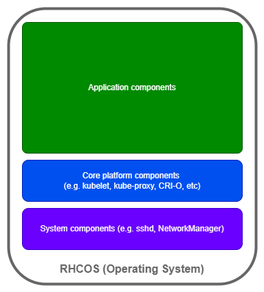
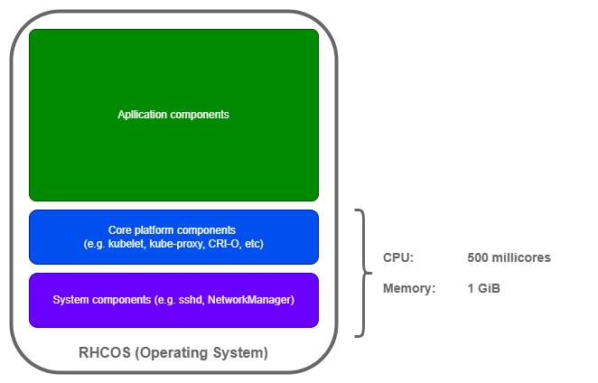
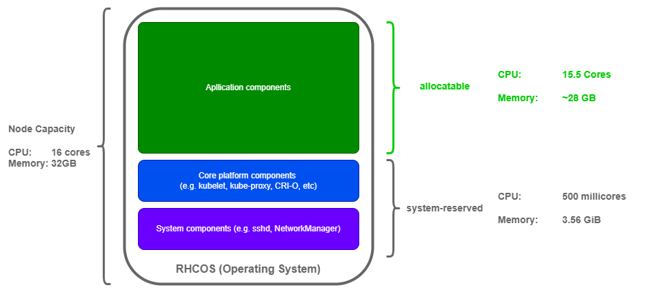

# Node Sizing

Ever wondered why your application running on your Kubernetes or OpenShift
cluster: appears to run slowly or less performant than expected? Or perhaps your
cluster is experiencing one of the following, but you can't understand why?

- Out-of-Memory (OOM) events both at the application and core platform layers.
- Higher than normal Pod evictions or throttling.
- General node instability.

This article is intended to help you build a stable OpenShift platform for your
AIOps deployment. It is meant to provide enough knowledge of the basics to plan
clusters for AIOps, not as a deep technical dive into Red Hat CoreOS and core
components.

**By the end of this guide, you will have good basic understanding of:**

- the importance of system reservations for CPU and memory on a node.
- what happens when the core, foundational platform (i.e. the node) suffers from
  resource starvation, and what it means for your AIOps deployment.
- how to calculate OpenShift node system reservations.
- how to configure adequate system reservations for your cluster nodes.

:::info

This guide focuses on OpenShift, however the same concepts apply to Kubernetes
in general:

- See
  [Reserve compute resources](https://kubernetes.io/docs/tasks/administer-cluster/reserve-compute-resources/)
  for more details.

:::

## Why is this important?

Let's start with an analogy.

Think about building a house. It is common to dream about:

- what you want your decor in a room to look like.
- what sofas or furniture you want to place, and where.
- what fixtures you want to hang from or secure onto your walls.

Before you purchase your furniture or fixtures, have you planned for and
ensured:

- your joists supporting your floors have been adequately specified and spaced
  by a structural engineer to guarantee they can take the weight of your
  furniture?
- your foundation has been laid to the right depth, thickness and cement mixture
  ratio to achieve the desired strength for holding up your house?

:::danger Don't let your bathtub end up in your downstairs living room.

So, you purchased a luxury steel bathtub, but your builder spaced out your floor
joists too far apart to achieve the required strength to support your bathtub.

Before you know it, your bathtub has fallen through the floor and is now sitting
in the middle of your living area.

Probably not where you intended it to be right?

_(No house, person or animal was hurt in the making of this analogy)_.

:::

One of the most overlooked aspects of any deployment is ensuring the base
Operating System or platform has the necessary resources for its core components
to function properly. Building a stable and performant foundation for
applications to run on. Avoiding resource starvation at a base level, which
could bring down your application.

## Anatomy of a node

So, what exactly is a node made up of?

As you can see, there is more running on the node beyond the application(s).

These core platform and system components, let's call them **core components**,
are the forgotten heroes of a cluster, working diligently in the background to
ensure your cluster supports your applications.

Just like any other software components, they require system resources to
operate efficiently. By default, OpenShift reserves the following system
resources for these core components:

What is often overlooked is, there is a relationship between how much CPU and
memory your node has been provisioned with **AND** how much of those resources
should be reserved relative to the overall capacity for these core components.

:::tip Car engine analogy

Generally speaking, the bigger and more powerful your car, the bigger your car
engine. Therefore, the more fuel it will use in comparison to a smaller, less
powerful car.

The engine is fundamentally what is transforming your fuel into energy to power
your car. If it does not receive enough fuel relative to its energy conversion
expectations, your car will underperform and eventually stop.

The core components are like the engine of your node. If there is an imbalance
between the capacity of the node and how much relative resource is reserved for
the core components, your node, therefore your application underperforms.

:::

## How does this affect Pod scheduling?

:::note What is the scheduler?

The
[scheduler](https://kubernetes.io/docs/reference/command-line-tools-reference/kube-scheduler/)
is a process running on the cluster's control plane which is responsible for
assigning Pods to Nodes.

Full details of how the scheduler works is out of scope for this guide.

:::

As per the
[OpenShift documentation](https://docs.openshift.com/container-platform/4.14/nodes/nodes/nodes-nodes-resources-configuring.html#allocate-scheduler-policy_nodes-nodes-resources-configuring):

> The scheduler uses the value of `node.Status.Allocatable` instead of
> `node.Status.Capacity` to decide if a node will become a candidate for Pod
> scheduling.
>
> **By default, the node will report its machine capacity as fully schedulable
> by the cluster.**

So, if the node is reporting that all its capacity is available, how does the
scheduler really know how much of the node's capacity is available for Pod
allocation?

It
[calculates](https://docs.openshift.com/container-platform/4.14/nodes/nodes/nodes-nodes-resources-configuring.html#computing-allocated-resources_nodes-nodes-resources-configuring)
it based on other parameters, including `system-reserved` values, then compares
it against any Pod _requests_:

- **Note:**
  - `kube-reserved` is not used directly in OpenShift, the values for core
    Kubernetes components is added into the `system-reserved` values.
  - See
    [Understanding eviction thresholds](https://docs.openshift.com/container-platform/4.14/nodes/nodes/nodes-nodes-resources-configuring.html#allocate-eviction-thresholds_nodes-nodes-resources-configuring)
    for more information on that element.

Once it understands what is _allocatable_, it further filters nodes based on
criteria such as resource utilization (basically how many other Pods are
utilizing the node's allocatable resources already), affinity rules, etc.

### Key scheduling takeaway

If the values for `system-reserved` are not updated in line with how much CPU
and memory you allocate to a node, this calculation is skewed, resulting in many
downstream performance or instability issues.

:::caution Debugging and maintenance cost.

Since many different symptoms can be experienced as a result of this type of
core component resource starvation, most teams enter into a continuous reactive
cycle. Tackling symptoms without resolving the root cause of the issues.

Understanding this core element of node sizing helps alleviate and deflect many
downstream issues in your cluster, including perceived application-level issues.

:::

## How do I calculate what to reserve for core components?

The formula for how system reserves are calculated in OpenShift are documented
in a [knowledge article](https://access.redhat.com/solutions/5843241), captured
here for convenience:

### Example

If we consider a node with 16 CPU cores and 32 GB RAM, how much node capacity is
**_really_** available for AIOps (or other application) Pods?

There are a few things to note in this example:

- Allocatable memory is shown in `GB`, having subtracted the converted
  `system-reserved` memory from `GiB`.
- The `system-reserved` CPU based on the formula would actually be
  `110 millicores`, however since that is below the default, I've left the
  default value in place. More on that later.

Each node actually has `15.5 cores` and `~28GB RAM` allocatable for AIOps,
having ensured enough relative resources are reserved for the core components.

### So how many nodes do I really need for my application?

When you size your applications in terms of CPU and RAM requirements and try to
calculate how many nodes you need to support your application, don't forget to
calculate node count based on what is **_allocatable_** on each node, not total
capacity.

Otherwise, your deployment will suffer performance and instability issues.

## How do I update node `system-reserved` settings?

There are 2 options:

1. [Manually allocating resources for nodes](https://docs.openshift.com/container-platform/4.14/nodes/nodes/nodes-nodes-resources-configuring.html#nodes-nodes-resources-configuring-setting_nodes-nodes-resources-configuring).
1. [Automatically allocating resources for nodes](https://docs.openshift.com/container-platform/4.14/nodes/nodes/nodes-nodes-resources-configuring.html#nodes-nodes-resources-configuring-auto_nodes-nodes-resources-configuring).

Both procedures are very well documented in the OpenShift documentation so I
won't repeat them here.

In essence they involve a 2-step process:

1. Edit the `machineconfigpool` for the type of node you want to update and
   labels for node selection.
1. Create a custom resource (CR) with your configuration change.

## SWAT Recommendations

1. Regardless of which update method you select (manual or automatic), it is
   highly advisable to understand the calculations, reasons and impact of
   `system-reserved` values in relation to your node profiles and cluster
   requirements:

   - Do the calculation manually anyway as it is crucial during any planning
     phase so you know how much resource you really need for your use case(s).
   - Understand what the impact would be of updating values post application
     deployment.

1. If your calculations show a value fall below the default, to be on the safe,
   stick with the default value:

   - It may be tempting to squeeze resources further, however going below the
     defaults may be counterproductive.

1. Calculate node count based on:

   - Allocatable resources per node.
   - Plan for additional 2-3 nodes and related resources such as IP addresses
     for OpenShift and software updates.

1. If you are deploying a new cluster from scratch, then automatic resource
   allocation for core system components is advised.

1. If you are updating an existing cluster, especially in production, then we
   would recommend:
   1. Perform the calculations to understand if your current cluster capacity is
      really enough for your workload.
   1. Plan to add compute capacity based on **_allocatable_** numbers and node
      counts.
   1. Perform a manual canary rollout of changes to observe behaviour in a safe
      manner.
   1. Complete node updates once things stabilize.
   1. Update any automation or GitOps configuration for your nodes to use
      automatic reservation updates for future rollouts.

## Conclusion

So hopefully now you have a better understanding of what really happens on a
compute node, and why you might be experiencing performance or instability
symptoms in your cluster or application.

Ensuring your node's core components are adequately resourced in relation to
your node profile, and not being starved by application Pods incorrectly being
scheduled onto a node, is critical to ensuring application and cluster
performance and stability.

Check your clusters today and plan updates to configuration accordingly.
