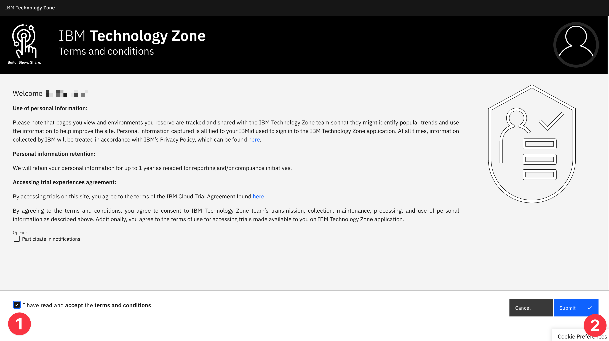
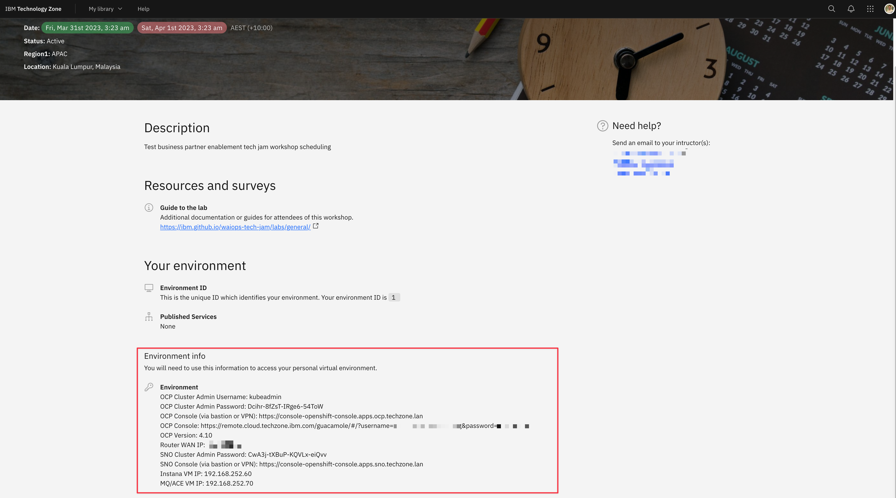
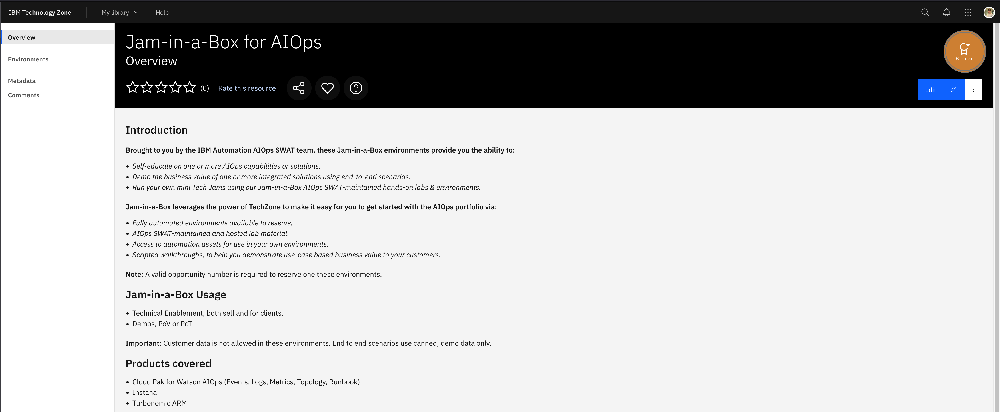
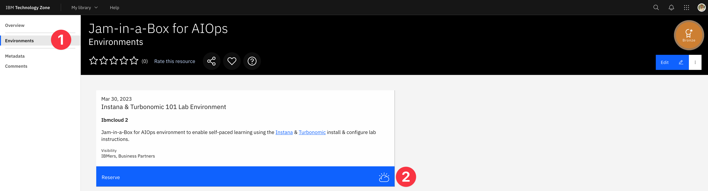
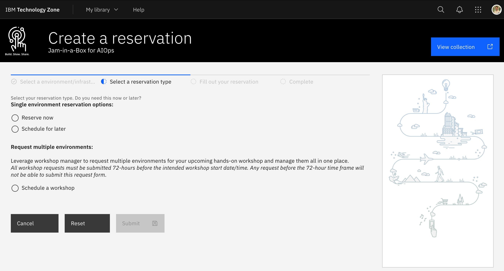
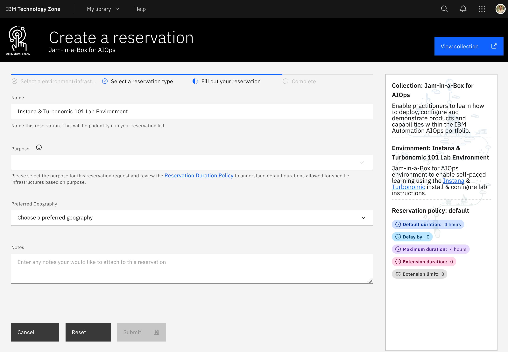

To complete the labs on this site you will need access to an
[IBM Tech Zone](https://techzone.ibm.com) environment, for this you are required
to have an
[IBM ID](https://www.ibm.com/account/reg/signup?formid=urx-19776&target=https%3A%2F%2Flogin.ibm.com).

You can get access to an environment in two ways:

- [Participating in a SWAT Workshop](#participating-in-a-swat-workshop)
- [Requesting an environment as an Individual](#requesting-an-environment-as-an-individual)

## Participating in a SWAT Workshop

As a participant of a workshop you should have received an email with an
attendee link. You can now **click the attendee link** and **sign in with your
IBM ID**.

:::note

If this is your first time logging in you can **accept the terms and
conditions** and proceed by submitting.



:::

You will be taken to the Workshop Attendee page that looks similar to the below
image.


Once your lab proctors give you the workshop password you can **enter the
password** and select **Submit password**.

The page will refresh and you will see the **details of your assigned
environment**.

:::tip

You may want to take a copy of the environment details for easy reference later.
You will need the **OCP Console** URL, the **OCP Cluster Admin Password** and
the **SNO Cluster Admin Password**.

:::



Copy the **OCP Console** URL and navigate to it in your browser.

:::tip

We recommend using Google Chrome to access the bastion host.

When prompted by your browser to allow copy/paste we recommend allowing.

:::

You will see a page similar to the below. Expand the _twisties_ and select the
**Remote Desktop** connection to connect to your _Apache Guacamole_ bastion
node.


All access to the environment is behind this RHEL Guacamole Bastion host named
**bastion-gym-lan**.


If you see the bastion hosts desktop environment you can proceed to
[the labs](/waiops-tech-jam/labs/general/).

## Requesting an environment as an Individual

If you are an IBMer or IBM Business Partner you can request an environment for
yourself on [IBM Tech Zone](https://techzone.ibm.com).

Navigate to the
[Jam-in-a-Box](https://techzone.ibm.com/collection/jam-in-a-box-for-aiops)
collection. You will need to Sign in with your IBM ID.



Select **Environments** from the left navigation menu and select **Reserve**.



Select when you would like to reserve the environment for.



Fill in the reservation details and select **Submit**



You will receive an email with your environment details provisioning has
completed.

Once you have your environment details, navigate to the **OCP Console** URL that
looks similar to:

```sh
https://remote.cloud.techzone.ibm.com/guacamole/#/?username=000-000000-0000&password=00000
```

You will see a page similar to the below. Expand the _twisties_ and select the
**Remote Desktop** connection to connect to your _Apache Guacamole_ bastion
node.


All access to the environment is behind this RHEL Guacamole Bastion host named
**bastion-gym-lan**.


If you see the bastion hosts desktop environment you can proceed to
[the labs](/waiops-tech-jam/labs/general/).
