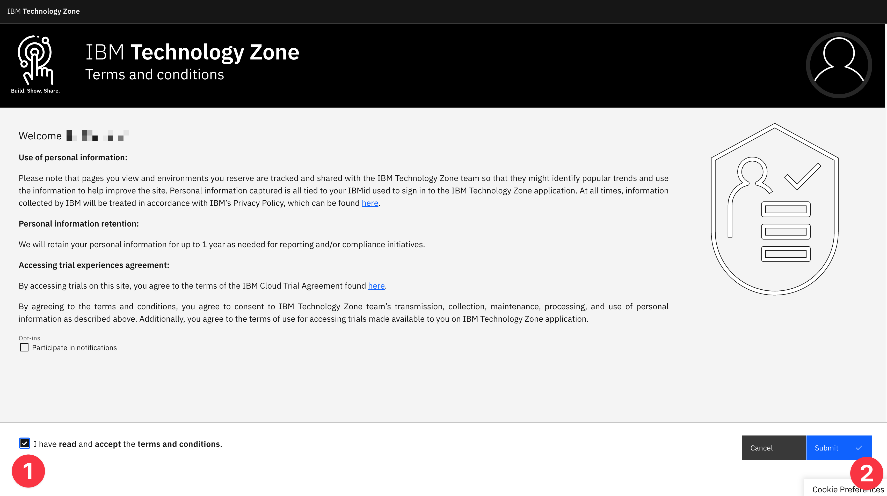
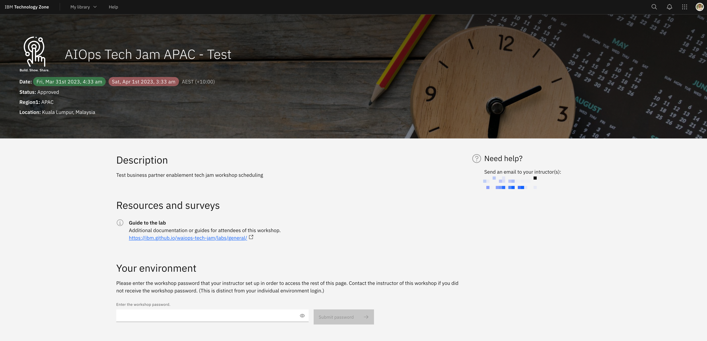
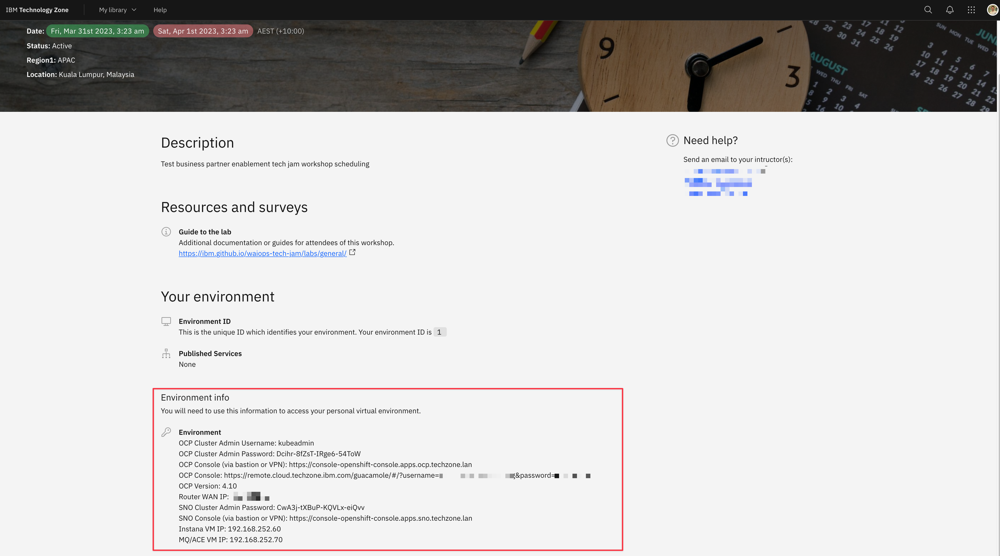
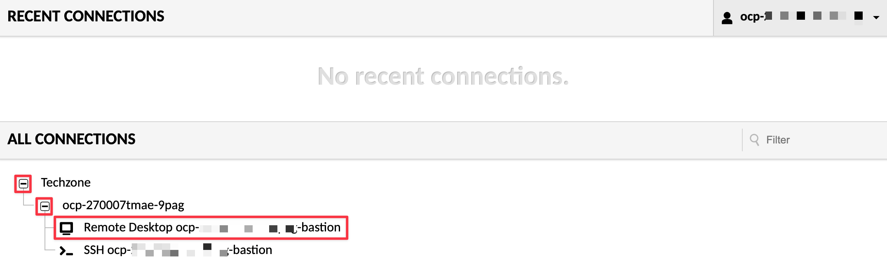
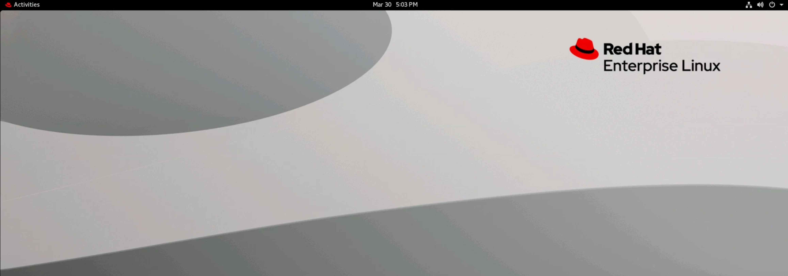

As a participant of a workshop you should have received an email with an
attendee link. You can now **click the attendee link** and **sign in with your
IBM ID**.

:::note

If this is your first time logging in you can **accept the terms and
conditions** and proceed by submitting.

:::

You will be taken to the Workshop Attendee page that looks similar to the below
image.

Once your lab proctors give you the workshop password you can **enter the
password** and select **Submit password**.

The page will refresh and you will see the **details of your assigned
environment**.

:::tip

You may want to take a copy of the environment details for easy reference later.
You will need the **OCP Console** URL, the **OCP Cluster Admin Password** and
the **SNO Cluster Admin Password**.

:::

Copy the **OCP Console** URL and navigate to it in your browser.

:::tip

We recommend using Google Chrome to access the bastion host.

When prompted by your browser to allow copy/paste we recommend allowing.

:::

You will see a page similar to the below. Expand the _twisties_ and select the
**Remote Desktop** connection to connect to your _Apache Guacamole_ bastion
node.

All access to the environment is behind this RHEL Guacamole Bastion host named
**bastion-gym-lan**.

If you see the bastion hosts desktop environment you can proceed to
[the labs](/waiops-tech-jam/labs/general/).
