# Taking Actions

## 4.1: Manage Performance of Your Application

1. Open a new Firefox tab and open the Instana dashboard by selecting the
   **Instana** bookmark and login.

   - Username: `admin@instana.local`
   - Password: `Passw0rd`

1. Navigate to **Kubernetes**.

   :::tip

   Depending on the platform you have enabled in your environment, you may need
   to navigate to **Kubernetes** under **Platform**.

   :::

   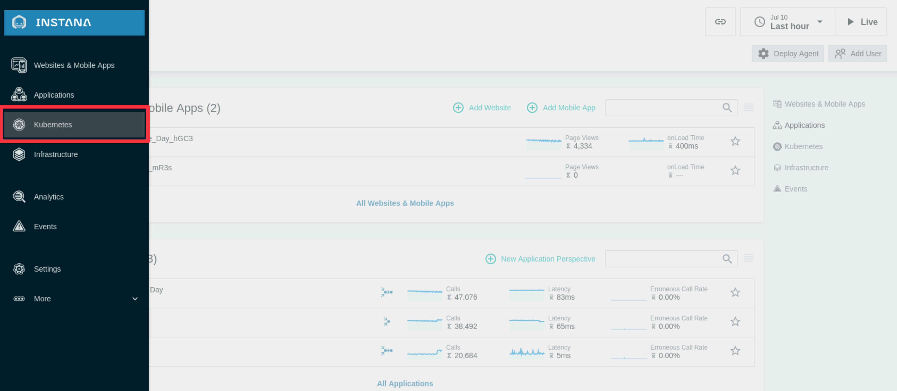

1. Select your Single Node OpenShift Apps cluster called **apps_cluster**.

   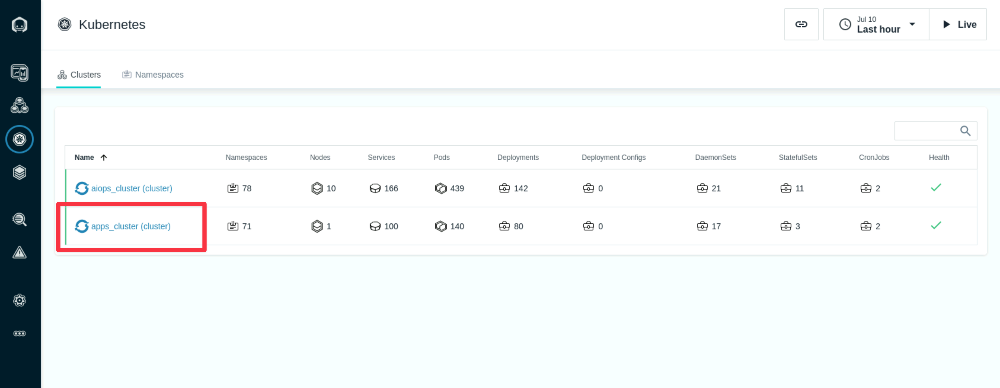

1. Under the **Namespaces** tab, select **robot-shop**.

   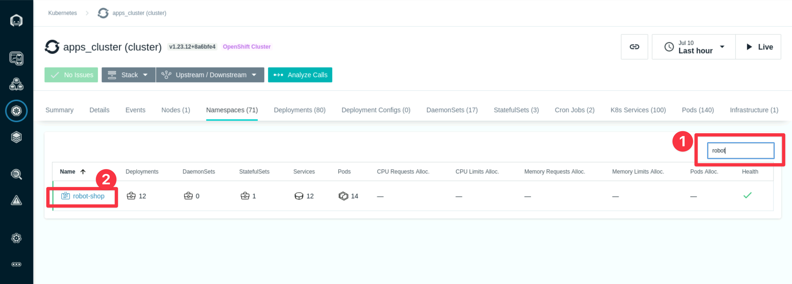

1. Click on the **Pods tab** and choose the **Map** view:

   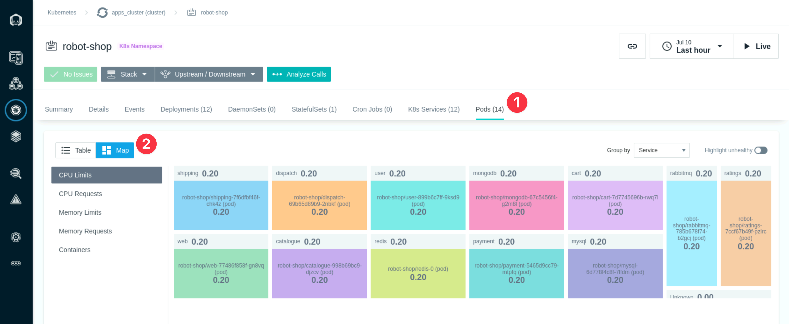

1. Analyze the CPU Limits, CPU Requests, Memory Limits, and Memory Requests. You
   could also take a screenshot for comparison later.

   Lets focus on the CPU Limits for now. Here is what the CPU Limits look like
   for Robot Shop app before taking any Turbonomic ARM recommended actions, take
   notice of the **payment** pod which is configured with 0.2 CPU or 200m:

   :::note

   The pod you choose to scale with a Turbonomic action in your environment may
   not be the **payment** pod.

   :::

   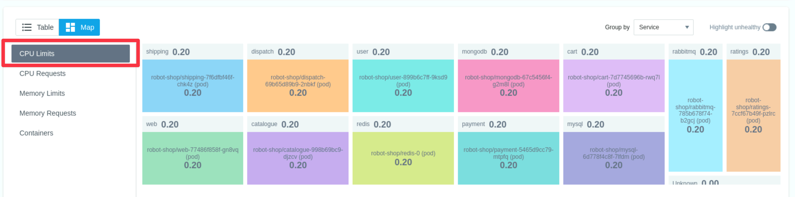

1. Navigate back to the Turbonomic ARM dashboard and navigate to the **Robot
   Shop** application:

   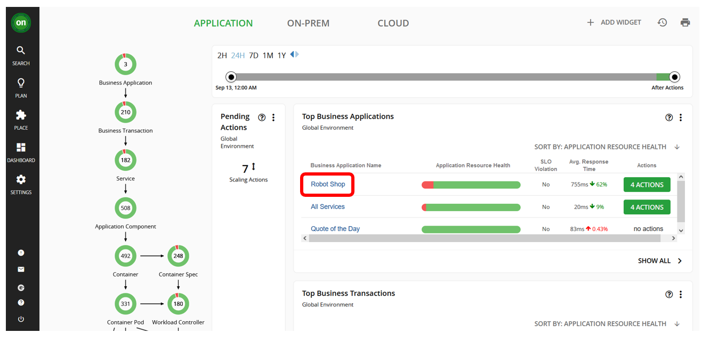

1. Here, we can see some key application metrics provided by Instana, e.g.
   response time and transactions and how they have evolved over time.

   - Turbonomic uses this data to provided actionable insights in the form of
     recommended actions you could take to improve performance and/or improve
     efficiency.

   - You will notice either green, red or yellow segments of the circles on the
     **Container Cluster** section of the Robot Shop Suppy Chain to the left
     side of the screen.

   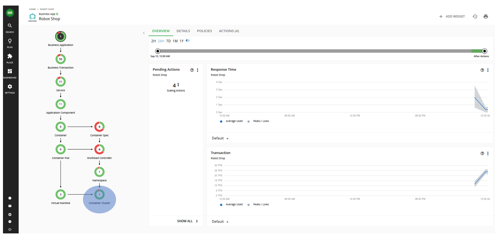

1. Click the **Container Cluster** entity and it will take you to a screen like
   below:

   - You will notice that there are **Pending Actions** that Turbonomic suggests
     will improve the performance and efficiency of the application:

     :::note

     Your pending actions will likely look different to the below screenshot
     because each demo environment can be slightly different.

     :::

   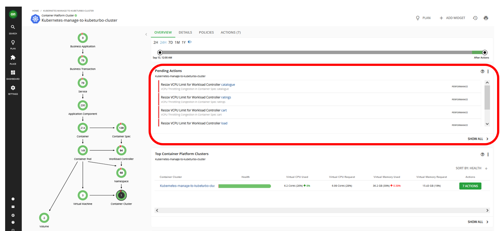

   :::info

   Turbonomic does not recommend actions for a Business Application,
   Transactions, or Services, but it does recommend actions for the underlying
   Application Components and infrastructure entities, thus providing visibility
   into the risks that have a direct impact on the Business Application's
   performance.

   :::

1. Click **SHOW ALL** in the **Pending Actions** section:

   

1. Pick one action and select **Details** to see what the action is suggesting.

   In this case the action is suggesting to increase the CPU limit from 200m to
   300m.

   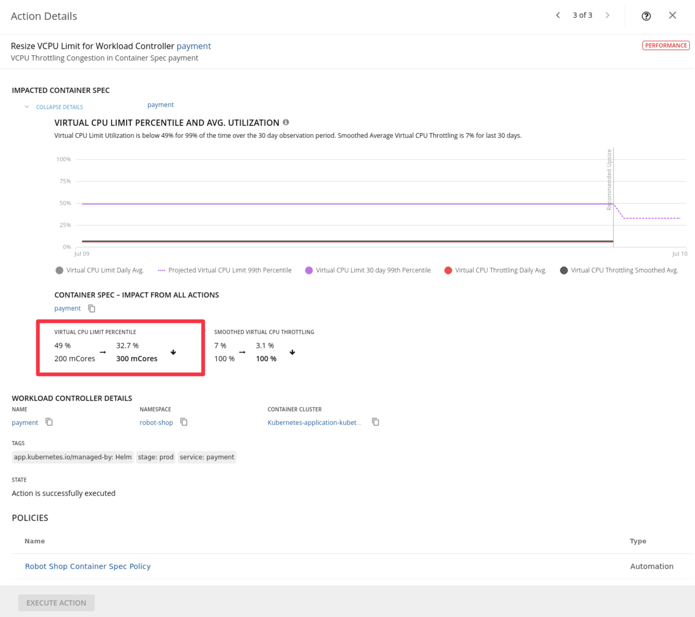

1. Select the checkbox for the pending action you just viewed the details for.
   Once selected, click on **EXECUTE ACTIONS** to apply the actions:

   

1. Click on **EXECUTE NOW** on the resulting pop up window:

   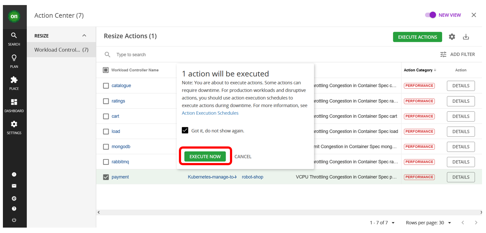

1. You should see the action has successfully executed - a green checked mark:

   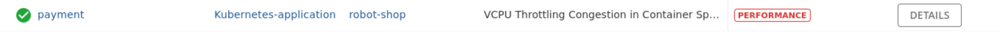

1. After a few minutes, you can go back to the Instana dashboard to view the
   result of taking the actions:

   - Repeat steps 2 through 6 to view the changes. In this example previously
     the **payment** pod was configured with 200m.

   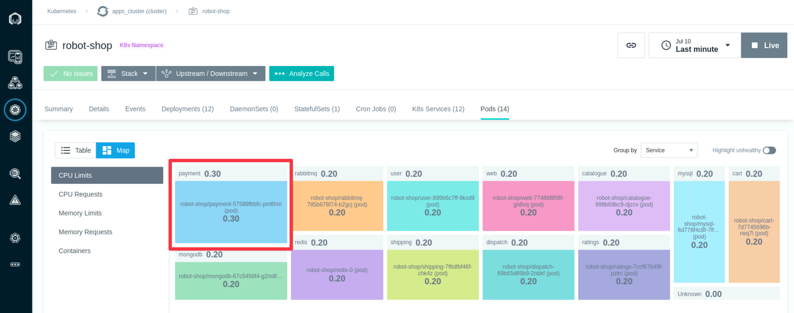

   This is one small example of a manually triggered action. The real power of
   Turbonomic ARM is the ability to automatically execute large volumes of
   actions to ensure you applications get the optimal amount of resources to
   assure performance.

---

## 4.2: Summary

In this lab, you have learned how to execute actions based on Turbonomic ARM
recommendations.

There is much more to actions that we will cover in future labs.

For now, you can experiment with your environment to increase web traffic or
otherwise generate load on the application or cluster and observe the
recommendations made by Turbonomic ARM.

---
