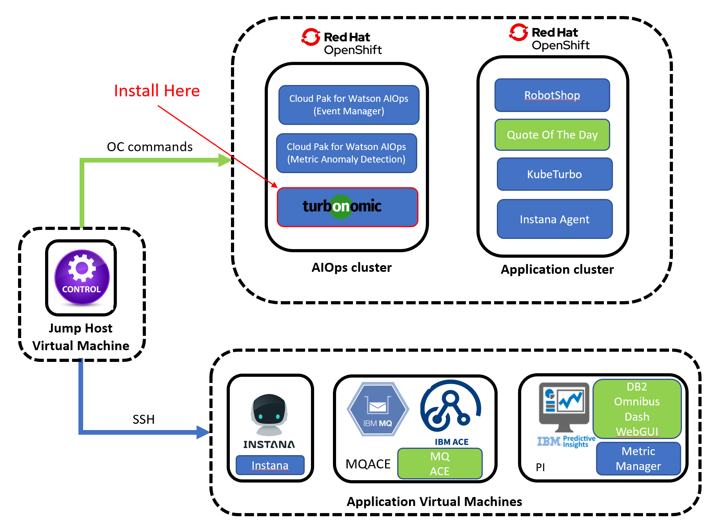
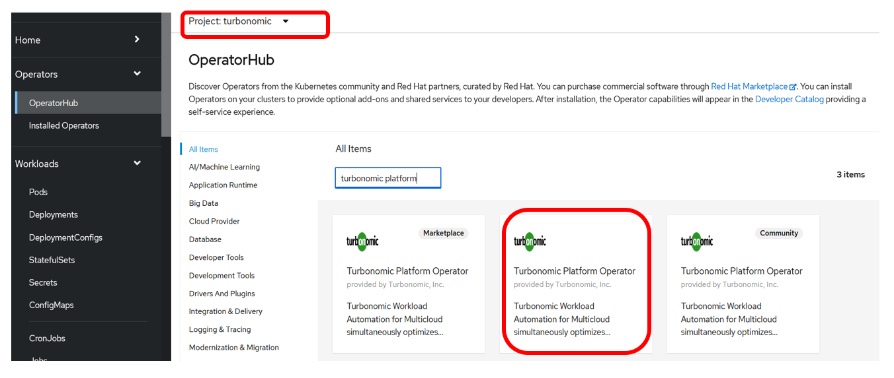
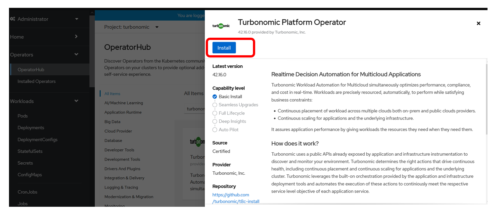
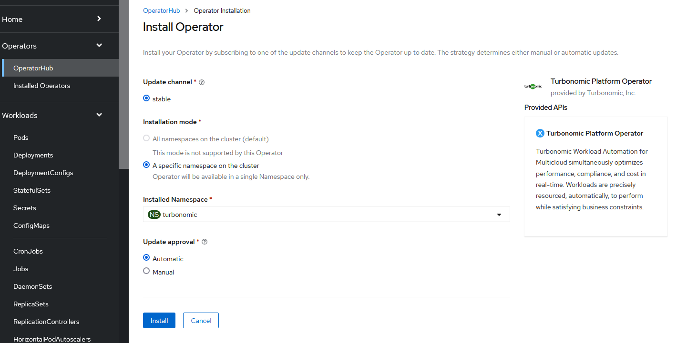
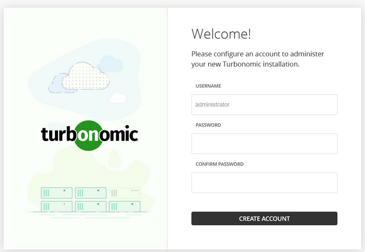
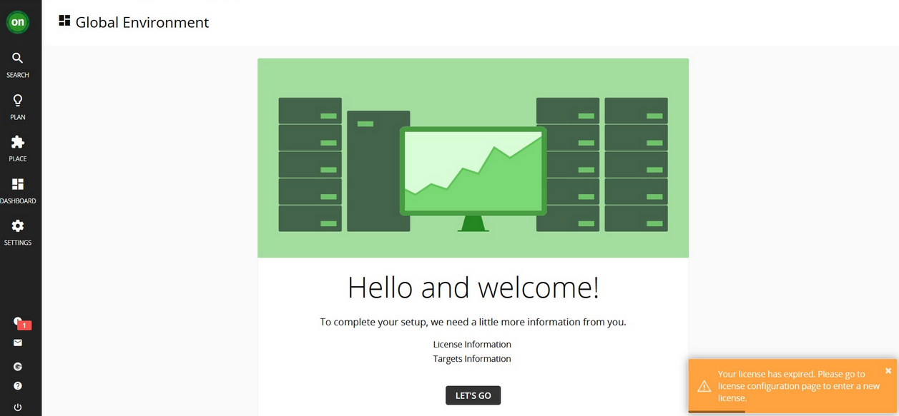
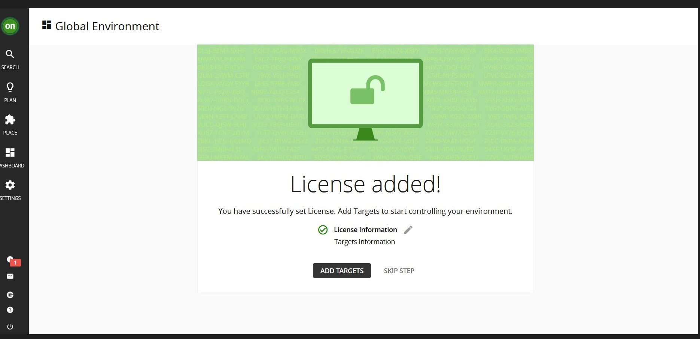

## 2.1: Introduction

Installing Turbonomic platform in your OpenShift cluster:



The [t8c-install](https://github.com/turbonomic/t8c-install/wiki) repository
contains information about installation methods, sizing, architecture and more.

The instructions in this lab are streamlined and contextual versions of the
information from the above repository, designed to get up and running quickly
and build out a lab or demo environment in OpenShift running in IBM Cloud.

---

## 2.2: Prerequisites

:::caution Important

Perform this installation procedure from your **control** node as the **jammer**
user.

:::

1. Login into the **AIops** OpenShift Console UI and get your login token:

   - From the OpenShift console, click your username in the top-right.
   - Select the _Copy login command_ menu item.
   - From the new tab that opens, copy the login command from the **Log in with
     this token** section.
   - Paste the copied command into your SSH terminal on your control node and
     press enter to login.

   Validate you are logged into the correct cluster - you should see **6
   nodes**:

   ```sh
   oc get nodes
   ```

1. From your command prompt, issue the following command to create the
   namespace:

   ```sh
   export NS=turbonomic
   oc create namespace ${NS}
   ```

1. The Turbonomic application will create PVs. To have the services access their
   PVs, we will use the UID value of the `sa.scc.uid-range` of the project:

   ```sh
   export FSGROUP=$(
       oc get ns ${NS} -o yaml | \
       grep uid-range | \
       awk '{print $2}' | \
       awk -F '/' '{print $1}'
   )
   ```

1. Create the Custom Resource Definition (CRD) to allow Turbo operator to deploy
   all the necessary resources

   - For Kubernetes version 1.22 and higher (To check the Kubernetes version,
     you can run `oc version` command):

     ```sh
     oc create -f https://raw.githubusercontent.com/turbonomic/t8c-install/master/operator/config/crd/bases/charts.helm.k8s.io_xls.yaml
     ```

You are now ready to deploy the operator

---

## 2.3: Deploy the Operator

1. Create the operator service account:

   ```sh
   oc create -f https://raw.githubusercontent.com/turbonomic/t8c-install/master/operator/deploy/service_account.yaml -n ${NS}
   ```

1. Create the cluster role:

   ```sh
   oc create -f https://raw.githubusercontent.com/turbonomic/t8c-install/master/operator/deploy/cluster_role.yaml -n ${NS}
   ```

1. Create the role binding:

   ```sh
   oc create -f https://raw.githubusercontent.com/turbonomic/t8c-install/master/operator/deploy/cluster_role_binding.yaml -n ${NS}
   ```

1. Launch the operator pod:

   Go to your OpenShift Console UI, and click on `Operators -> OperatorHub`. Ensure the `turbonomic` project
   is selected in the dropdown. Search for `turbonomic platform` and select the `Certified` operator
   
   

1. Select and click on the `Install` button:

   

1. Select options as below:

   - Ensure `Installed Namespace` is set to `turbonomic`
     - Click the `Install` button.

   

1. Wait for the operator to become available (status = running with 1/1 ready).
   Check the status using:

   ```sh
   oc get pods -n ${NS} -w
   ```

   Example output:

   ```
   NAME                           READY   STATUS    RESTARTS   AGE
   t8c-operator-fdd8b8c94-dhrt4   1/1     Running   0          72s
   ```

   :::note

   Type `Ctrl-C` to exit the watch loop.

   :::

Next, we are going to configure the Turbonomic instance.

---

## 2.4: Configure the Turbonomic Instance: Custom Resource

1. Set the storage class:

   :::note

   The lab instructions assume you using
   [Red Hat OpenShift on IBM Cloud](https://cloud.ibm.com/docs/openshift?topic=openshift-getting-started).
   For other OpenShift environments, use `oc get storageclass` to select a
   storage class that is available in your environment.

   :::

   ```sh
   export STORAGE_CLASS=ibmc-block-gold
   ```

1. Apply a custom resource file to launch Turbonomic:

   ```sh
   cat << EOF | oc -n ${NS} apply -f -
   apiVersion: charts.helm.k8s.io/v1
   kind: Xl
   metadata:
     name: xl-release
     namespace: ${NS}
   spec:
     global:
       customImageNames: false
       repository: registry.connect.redhat.com/turbonomic
       securityContext:
         fsGroup: ${FSGROUP}
       storageClassName: ${STORAGE_CLASS}
       storageSelector: false
       tag: 8.6.2
     openshiftingress:
       enabled: true
     kubeturbo:
       enabled: true
     nginx:
       httpsRedirect: false
       nginxIsPrimaryIngress: false
     nginxingress:
       enabled: false
     instana:
       enabled: true
   EOF
   ```

1. Deployment will begin for all the Turbonomic pods. Depending on the
   environment, this may take some time to complete, anywhere from 5 to 20
   minutes. Use the command below to check the status of the deployment.

   ```sh
   oc get pods -n ${NS} -w
   ```

   :::note

   Type `Ctrl-C` to exit the watch loop.

   :::

   Ensure all the pods:

   - are in a `Running` state (`STATUS` column) and
   - show `1/1` in the `READY` column.

   **Example output only (Do not copy and paste into your terminal):**

   ```sh
   NAME                                   READY   STATUS    RESTARTS      AGE
   action-orchestrator-55bbb96fd8-bxv59   1/1     Running   2 (14m ago)   17m
   api-6d876bd5c8-ntpc9                   1/1     Running   0             17m
   auth-57d95cdc4f-7x7jq                  1/1     Running   0             17m
   clustermgr-5bff4bc746-9fvz4            1/1     Running   2 (14m ago)   17m
   consul-6b979f7d9d-ncb9f                1/1     Running   0             17m
   cost-679689bcb8-9r8h7                  1/1     Running   2 (14m ago)   17m
   db-5547b8bb9c-xjlk8                    1/1     Running   0             17m
   group-7c66b96cd6-jf69l                 1/1     Running   2 (14m ago)   17m
   history-75c89bdcdb-vcsv4               1/1     Running   2 (14m ago)   17m
   kafka-54b458c5ff-25tkp                 1/1     Running   0             17m
   kubeturbo-6b7568cbd-8gdqp              1/1     Running   0             17m
   market-784cd4f9fb-26879                1/1     Running   2 (14m ago)   17m
   plan-orchestrator-5fb588cdc6-wsz4l     1/1     Running   2 (14m ago)   17m
   repository-85bb8b95c4-w85nv            1/1     Running   2 (14m ago)   17m
   rsyslog-64c7fb4467-qcj9v               1/1     Running   0             17m
   t8c-operator-fdd8b8c94-jwwj8           1/1     Running   0             18m
   topology-processor-77f7f95c8-lmpzr     1/1     Running   0             17m
   ui-6d4ff8787d-6zhm4                    1/1     Running   0             17m
   zookeeper-57658f68c6-6qdgb             1/1     Running   0             17m
   ```

---

## 2.5: Launch the Turbonomic User interface

You are now ready to open a browser and login to the Turbonomic user interface.

1. Get the Turbonomic UI route after the deployment completes:

   ```sh
   oc get route -n ${NS} | grep api | awk '{print $2}'
   ```

1. Open the Turbonomic UI in your browser using the URL retrieved from the
   previous step.

1. The first time you log in to Turbonomic, you will be prompted to create a
   password for the `administrator` user:

   

   - Set this to something secure and memorable.
   - Save the password for future logins.
   - Click on the `Create Account` button.

---

## 2.6: License Configuration

Once logged in, the setup wizard will prompt you to import the license key:



:::note

- If attending a scheduled Tech Jam, your lab proctors will provide you the
  license file.
- If following these instructions offline outside a scheduled Tech Jam, the
  license file can be found within your downloaded software archive.

:::

1. Click on `LET'S GO` button.

1. Click on `IMPORT LICENSE` button and drag the license file provided by your
   lab proctors into `Enter License` box.

1. Then click on `Save` button. You will see the page below if it's successful:

   

---

## 2.7: Summary

In this portion of the lab, you have learned how to install Turbonomic on
OpenShift.

Navigate to the next section to integrate Instana for application performance
data ingestion and start assuring the performance of your critical business
applications.

---
