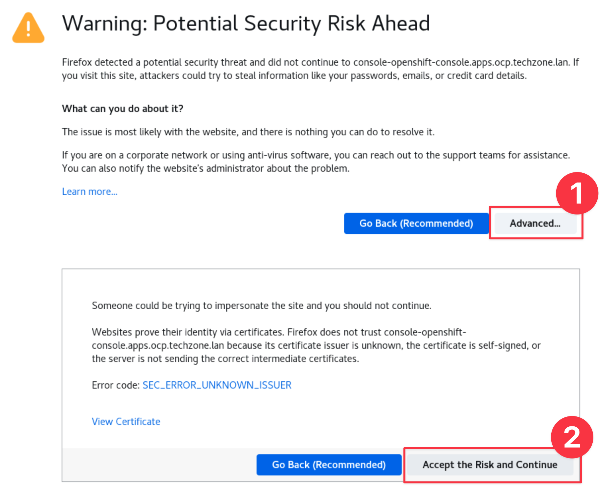

## 2.1: Introduction

Installing Turbonomic platform in your **AIOps** OpenShift cluster.


The [t8c-install](https://github.com/turbonomic/t8c-install/wiki) repository
contains information about installation methods, sizing, architecture and more.

The instructions in this lab are streamlined and contextual versions of the
information from the above repository, designed to get up and running quickly
and build out a lab or demo environment in OpenShift.

---

## 2.2: Prerequisites

:::caution Important

Perform this installation procedure from the bastion host (Guacamole) as the
admin user. If you are unsure you can open a new terminal tab or terminal
window.

The instructions in this guide use environment variables so it is important that
you use the same terminal prompt for the duration of the guide.

:::

1. Run the following commands to check you are in the right place:

   ```sh
   cd ~
   export KUBECONFIG=kubeconfig-aiops
   oc get nodes --kubeconfig kubeconfig-aiops
   ```

   You should see output like the below with multiple master and worker nodes

   

1. From your command prompt, issue the following command to create the
   namespace:

   ```sh
   export NS=turbonomic
   oc create namespace ${NS} --kubeconfig kubeconfig-aiops
   ```

1. The Turbonomic application will create PVs. To have the services access their
   PVs, we will use the UID value of the `sa.scc.uid-range` of the project:

   ```sh
   export FSGROUP=$(
       oc get ns ${NS} -o yaml --kubeconfig kubeconfig-aiops | \
       grep uid-range | \
       awk '{print $2}' | \
       awk -F '/' '{print $1}'
   )
   ```

1. Create the Custom Resource Definition (CRD) to allow Turbo operator to deploy
   all the necessary resources

   :::tip

   This is for Kubernetes version 1.22 and higher. When performing this step on
   another cluster you can check the Kubernetes version of OCP using the
   `oc version` command.

   :::

   ```sh
   oc create -f https://raw.githubusercontent.com/turbonomic/t8c-install/master/operator/config/crd/bases/charts.helm.k8s.io_xls.yaml --kubeconfig kubeconfig-aiops
   ```

You are now ready to deploy the operator

---

## 2.3: Deploy the Operator

1. Create the operator service account, cluster role and cluster role binding:

   ```sh
   oc create -f https://raw.githubusercontent.com/turbonomic/t8c-install/master/operator/deploy/service_account.yaml -n ${NS} --kubeconfig kubeconfig-aiops
   oc create -f https://raw.githubusercontent.com/turbonomic/t8c-install/master/operator/deploy/cluster_role.yaml -n ${NS} --kubeconfig kubeconfig-aiops
   oc create -f https://raw.githubusercontent.com/turbonomic/t8c-install/master/operator/deploy/cluster_role_binding.yaml -n ${NS} --kubeconfig kubeconfig-aiops
   ```

1. Go to your OpenShift AIOps Console UI by either selecting the bookmark
   **AIOps OCP Dashboard** or navigating to
   `https://console-openshift-console.apps.ocp.techzone.lan`

   :::note

   Advance through the certificate warnings, on for the ocp-console and another
   for the OAuth server.

   

   :::

1. Login to the OCP Console using the credentials provided in IBM Tech Zone.

   The username will be **kubeadmin** and the password is the value of **_OCP
   Cluster Admin Password_**

1. Launch the operator pod:

   Click on `Operators -> OperatorHub`. Ensure the `turbonomic` project is
   selected in the dropdown. Search for `turbonomic platform` and select the
   `Certified` operator

   

1. Select and click on the `Install` button:

   

1. Select options as below:

   - Ensure `Installed Namespace` is set to `turbonomic`
     - Click the `Install` button.

   

1. Wait for the operator to become available (status = running with 1/1 ready).
   Check the status using:

   ```sh
   oc get pods -n ${NS} -w --kubeconfig kubeconfig-aiops
   ```

   Example output:

   ```
   NAME                           READY   STATUS    RESTARTS   AGE
   t8c-operator-fdd8b8c94-dhrt4   1/1     Running   0          72s
   ```

   :::note

   Type `Ctrl-C` to exit the watch loop.

   :::

Next, we are going to configure the Turbonomic instance.

---

## 2.4: Configure the Turbonomic Instance: Custom Resource

1. Set the storage class:

   :::note

   You can view your available storage classes using `oc get storageclass`. For
   this lab we will be using `ocs-storagecluster-ceph-rbd`.

   :::

   ```sh
   export STORAGE_CLASS=ocs-storagecluster-ceph-rbd
   ```

1. Apply a custom resource file to launch Turbonomic:

   ```sh
   cat << EOF | oc -n ${NS} --kubeconfig kubeconfig-aiops apply -f -
   apiVersion: charts.helm.k8s.io/v1
   kind: Xl
   metadata:
     name: xl-release
     namespace: ${NS}
   spec:
     global:
       customImageNames: false
       repository: registry.connect.redhat.com/turbonomic
       securityContext:
         fsGroup: ${FSGROUP}
       storageClassName: ${STORAGE_CLASS}
       storageSelector: false
       tag: 8.6.2
     openshiftingress:
       enabled: true
     kubeturbo:
       enabled: true
     nginx:
       httpsRedirect: false
       nginxIsPrimaryIngress: false
     nginxingress:
       enabled: false
     instana:
       enabled: true
   EOF
   ```

1. Deployment will begin for all the Turbonomic pods. Depending on the
   environment, this may take some time to complete, anywhere from 5 to 20
   minutes. Use the command below to check the status of the deployment.

   ```sh
   oc get pods -n ${NS} -w --kubeconfig kubeconfig-aiops
   ```

   :::note

   Type `Ctrl-C` to exit the watch loop.

   :::

   Ensure all the pods:

   - are in a `Running` state (`STATUS` column) and
   - show `1/1` in the `READY` column.

   **Example output only (Do not copy and paste into your terminal):**

   ```sh
   NAME                                   READY   STATUS    RESTARTS      AGE
   action-orchestrator-55bbb96fd8-bxv59   1/1     Running   2 (14m ago)   17m
   api-6d876bd5c8-ntpc9                   1/1     Running   0             17m
   auth-57d95cdc4f-7x7jq                  1/1     Running   0             17m
   clustermgr-5bff4bc746-9fvz4            1/1     Running   2 (14m ago)   17m
   consul-6b979f7d9d-ncb9f                1/1     Running   0             17m
   cost-679689bcb8-9r8h7                  1/1     Running   2 (14m ago)   17m
   db-5547b8bb9c-xjlk8                    1/1     Running   0             17m
   group-7c66b96cd6-jf69l                 1/1     Running   2 (14m ago)   17m
   history-75c89bdcdb-vcsv4               1/1     Running   2 (14m ago)   17m
   kafka-54b458c5ff-25tkp                 1/1     Running   0             17m
   kubeturbo-6b7568cbd-8gdqp              1/1     Running   0             17m
   market-784cd4f9fb-26879                1/1     Running   2 (14m ago)   17m
   plan-orchestrator-5fb588cdc6-wsz4l     1/1     Running   2 (14m ago)   17m
   repository-85bb8b95c4-w85nv            1/1     Running   2 (14m ago)   17m
   rsyslog-64c7fb4467-qcj9v               1/1     Running   0             17m
   t8c-operator-fdd8b8c94-jwwj8           1/1     Running   0             18m
   topology-processor-77f7f95c8-lmpzr     1/1     Running   0             17m
   ui-6d4ff8787d-6zhm4                    1/1     Running   0             17m
   zookeeper-57658f68c6-6qdgb             1/1     Running   0             17m
   ```

---

## 2.5: Launch the Turbonomic User interface

You are now ready to open a browser and login to the Turbonomic user interface.

1. Open the Turbonomic UI in your browser by using either the bookmark called
   **Turbonomic Inc.** or get the Turbonomic UI route after the deployment
   completes:

   :::note

   Advance through any certificate warnings you may get.

   :::

   ```sh
   oc get route -n ${NS} --kubeconfig kubeconfig-aiops | grep api | awk '{print $2}'
   ```

1. The first time you log in to Turbonomic, you will be prompted to create a
   password for the `administrator` user:

   

   - Set the password to `Passw0rd`
   - Save the password for future logins.
   - Click on the `Create Account` button.

1. If you are prompted with a _Share Analytics and usage information_ modal you
   can leave it unchecked and select **SAVE AND CONTINUE**.

---

## 2.6: License Configuration

Once logged in, the setup wizard will prompt you to import the license key:


:::note

- If attending a scheduled Tech Jam, your lab proctors will provide you the
  license file.
- If following these instructions offline outside a scheduled Tech Jam, the
  license file can be found within your downloaded software archive.

:::

1. From the **Guacamole** host create a file called `turbo-license` and copy the
   contents of the license file provided by your lab proctors into it.

   ```sh
   cat << EOF > ~/turbo-license.lic
   <license file contents>
   EOF
   ```

1. Click on `LET'S GO` button.

1. Click on `IMPORT LICENSE` button and browse for the newly created license
   file in the Home directory.

   

1. Then click on `Save` button. You will see the page below if it's successful:

   

---

## 2.7: Summary

In this portion of the lab, you have learned how to install Turbonomic on
OpenShift.

Navigate to the next section to integrate Instana for application performance
data ingestion and start assuring the performance of your critical business
applications.

---
