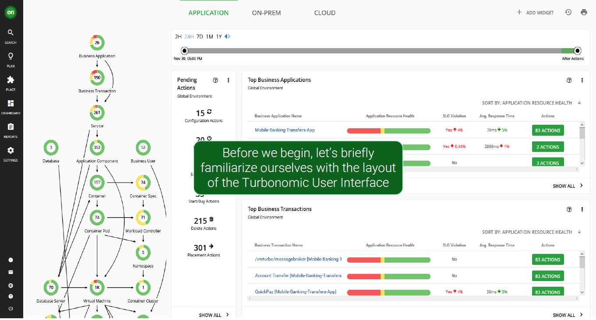
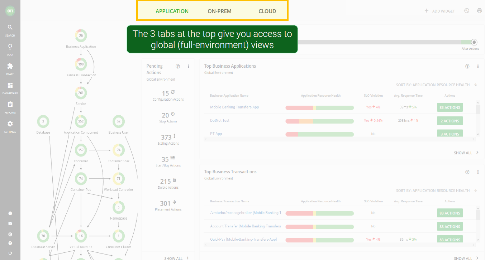
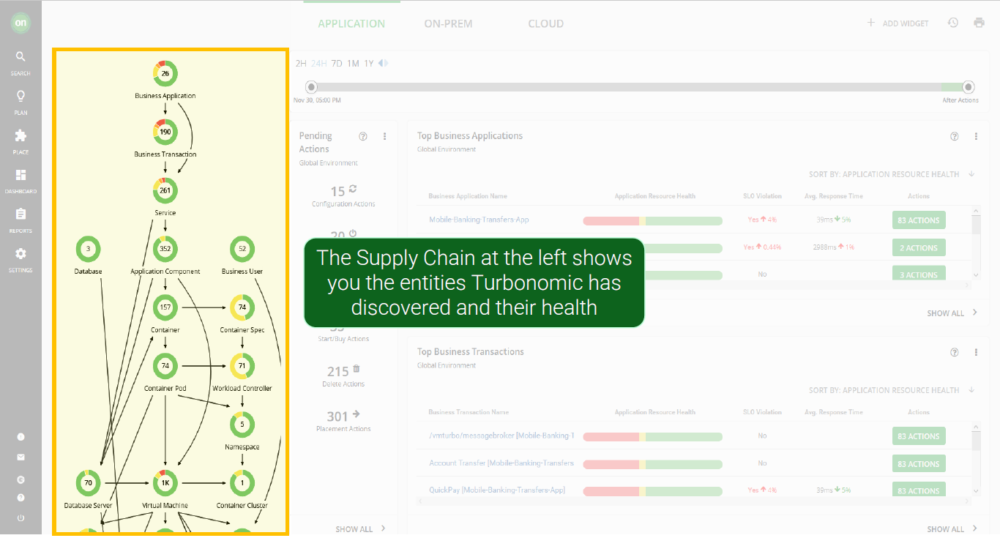
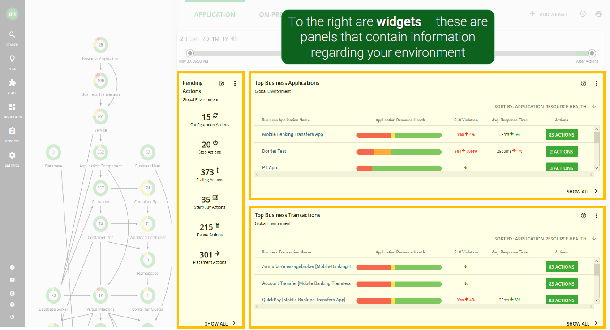
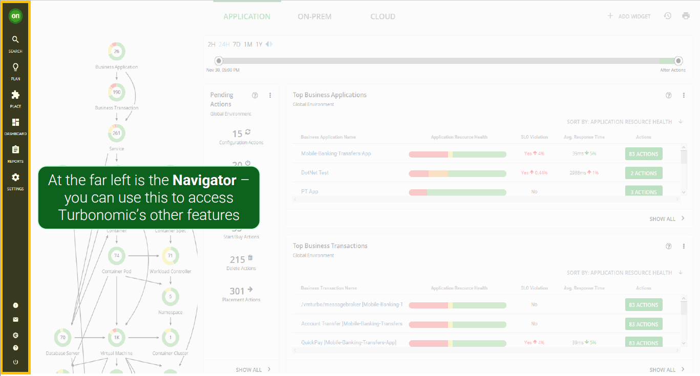
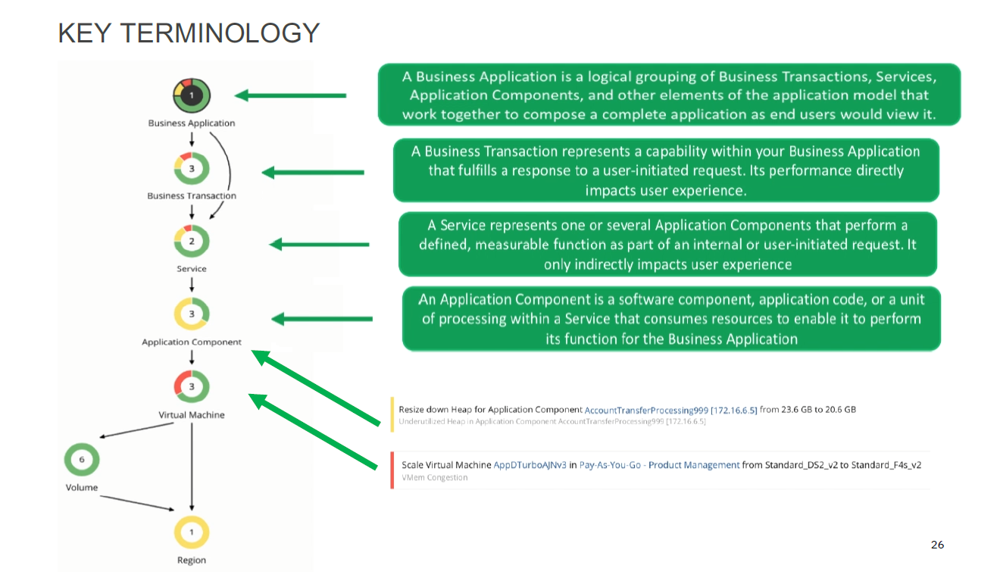
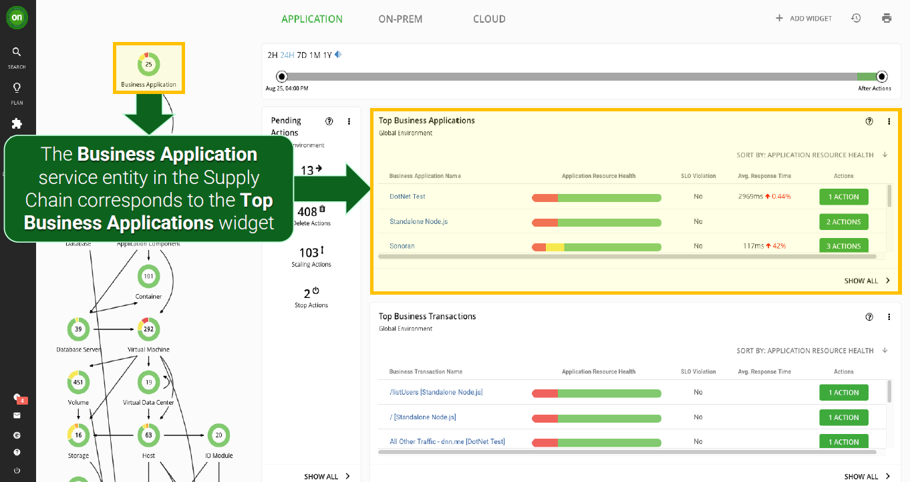
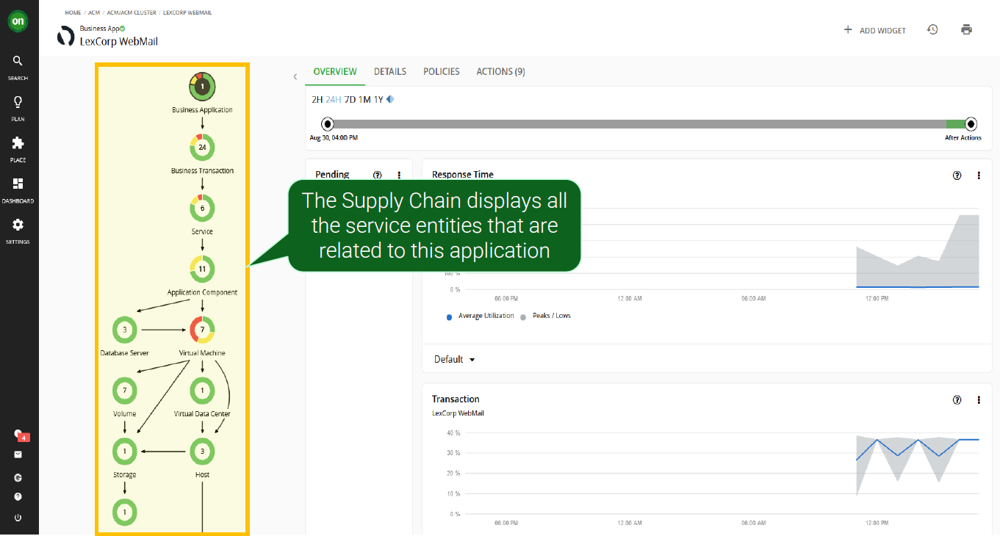
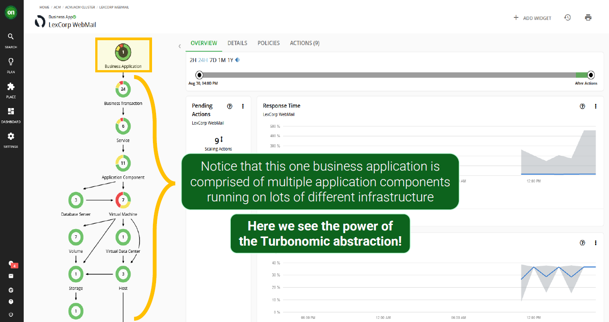

## 4.1: Introduction

This section of the lab is intended to get familiar with the Turbonomic ARM user
interface. You are invited to interactively navigate through the user interface
in your deployed instance of Turbonomic ARM as we walk through this section.

:::info

The screenshots in the lab documentation may not look identical to your
individual environment. The aim of this section is to get familiar with the key
UI points of interest.

:::

---

## 4.2: Turbonomic UI

1. Navigate to the Turbonomic UI home page:

   :::tip

   To get back to the homepage, you can click the green **ON** icon in the
   top-left (left navigation pane):

   

   :::

   

   

1. When Turbonomic ARM is deployed and selected environments are targeted,
   Turbonomic discovers all of the entities in the targeted environments. It
   then builds out this graphic you see here called the **supply chain**:

   

   The **supply chain** stitches together all of the entities from the top-level
   business application down through to the supporting infrastructure.

1. Notice that the entities have different colors, where:

   - **red** indicates performance risk, e.g. where entities need to be moved to
     a more optimal host or scaled up because of resource congestion or
     under-provisioning.
   - **yellow** indicates efficiency opportunities, e.g. where resources can be
     reclaimed due to overprovisioning, or potentially turned off / deleted.
   - **green** indicates entities in their desired, optimal state, which is what
     we are after. Green means no recommended actions at this time.

    

   :::info

   Cost is a by-product of assuring application performance. If actions can be
   safely taken for efficiency gains without impacting application performance
   and therefore user experience, Turbonomic ARM will recommend, and if enabled
   to, take the automated actions to proactively ensure application performance
   whilst making the most efficient use of your infrastructure, resources and
   cloud budget.

   :::

1. Also on this home page, there are widgets for `Top Business Applications`,
   `Top Business Transactions`, and `Top Services` that allow you to quickly
   assess the risk to the running applications. Not only can you quickly see the
   applications with the highest risk, but you can also click `Show All` to see
   the complete list of Business Applications and relevant metrics:

   

1. Finally, you can find your main navigation bar on the left hand side of the
   user interface:

   

---

## 4.3: Key Terminology

Some terminology which we should be familiar with when discussing Turbonomic:

In addition to the terms defined in the diagram above, **Actions** are
recommended for _Application Components_ or underlying _Infrastructure_ and
propagated up the stack.

These actions are determined by Turbonomic ARM's patented analytics and take
into consideration all elements of the stack holistically to **ensure that the
application performance is assured at all times** when these actions are
executed.

:::info Key Takeaway

Fundamentally, that is the key point of ARM. No actions are recommended in
isolation and always have the business critical application's performance in
mind. In this way, proactive, automated steps can be taken to ensure the
applications have the resources they need, when they need them.

Ultimately, these actions can mitigate against SLO breaches, which may then
result in poor user experience and potentially SLA violations.

:::

---

## 4.4: Business Application Drill Down

1. Click on your `Robot Shop` application from the `Top Business Applications`
   widget.

   

1. When you scope to this business application, note the supply chain has
   changed from showing all of the entities in the global environment to only
   the entities that are relevant to this specific application.

   

1. This business application consists of `X` business transactions, `X` services
   and `X` application components.

   

---

## 4.5: Summary

In this section, you have explored the Turbonomic UI at a high level.

Navigate to the next section to install the `Kubeturbo` agent to be able to
assure performance in a Kubernetes / OpenShift environment.

---
