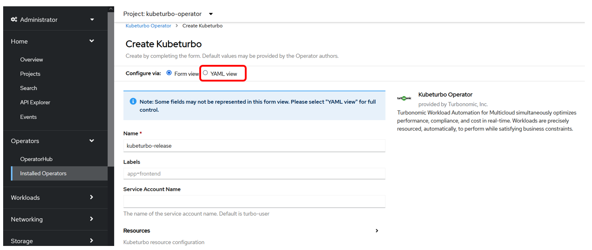
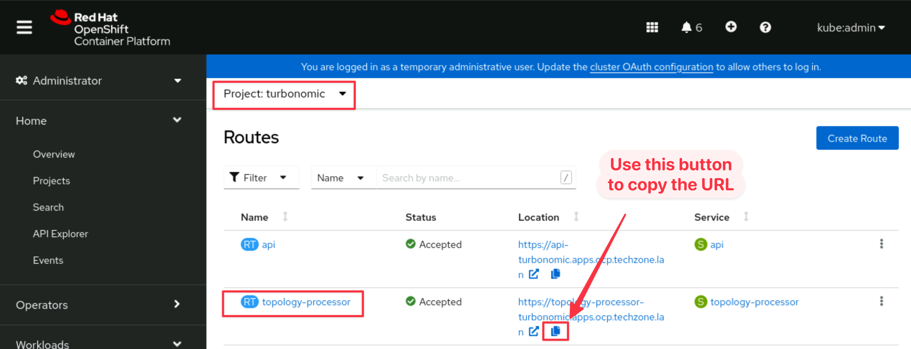
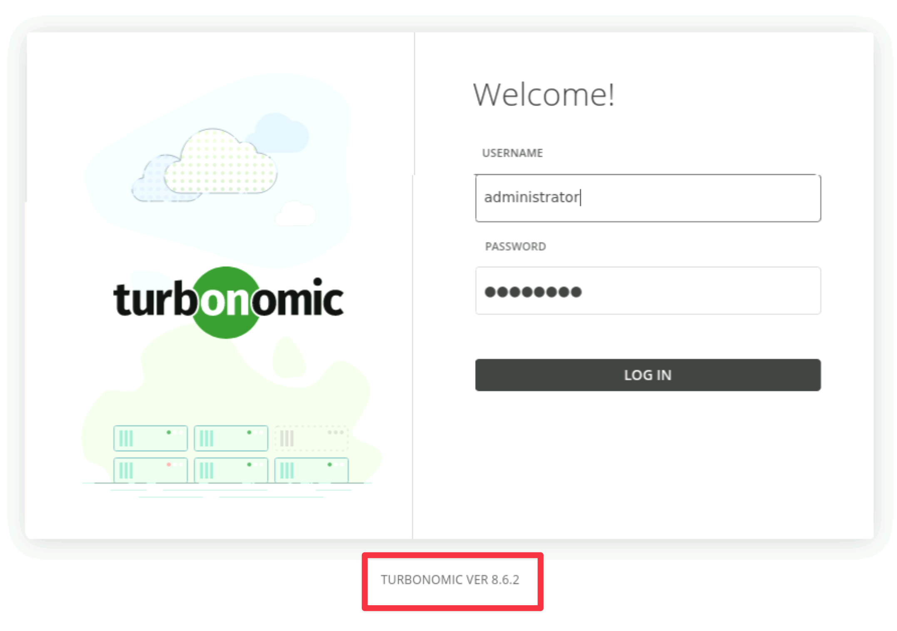
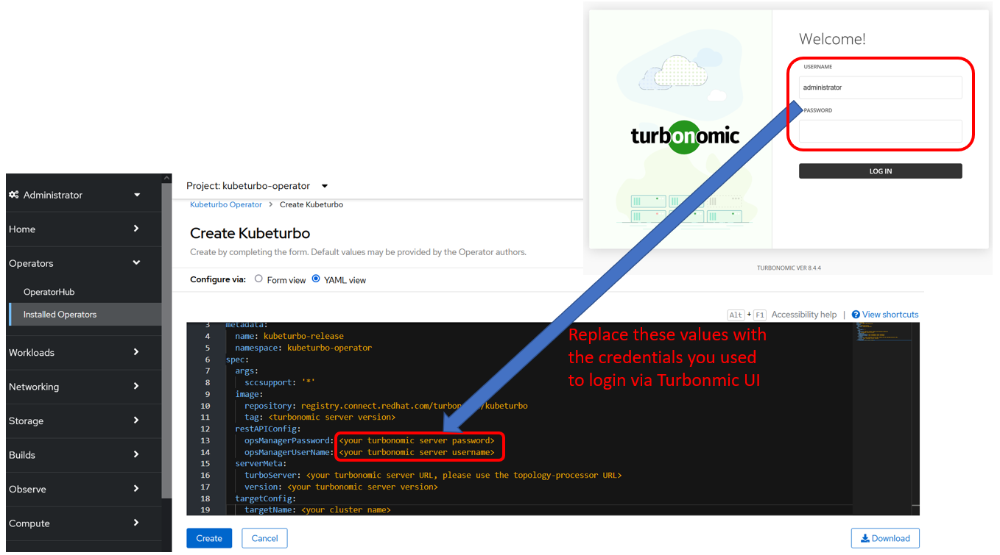
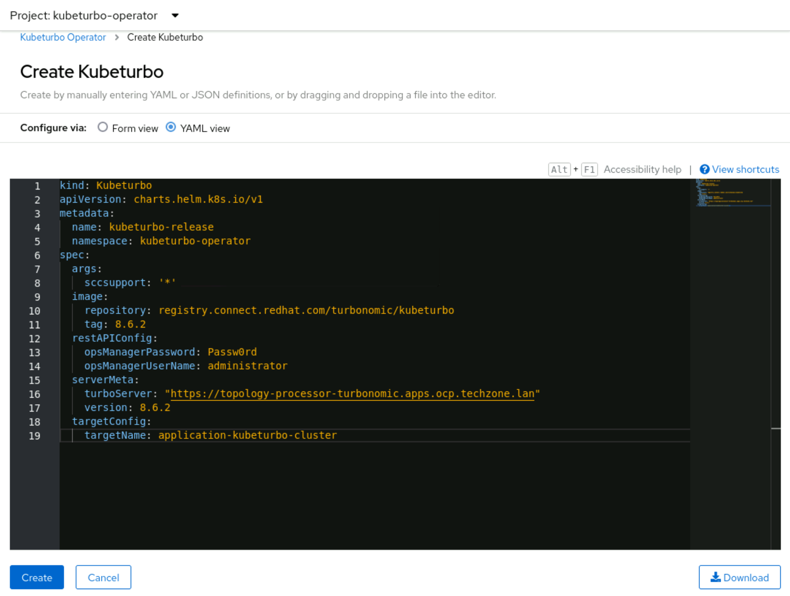
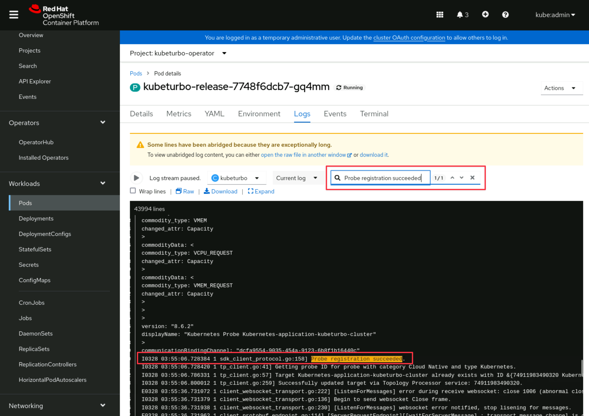
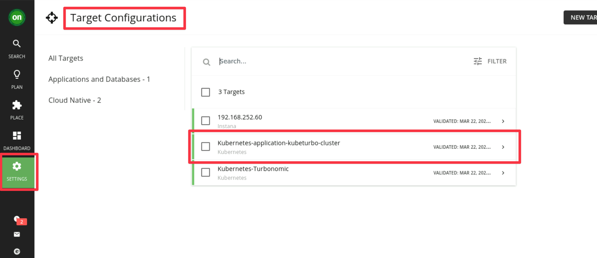
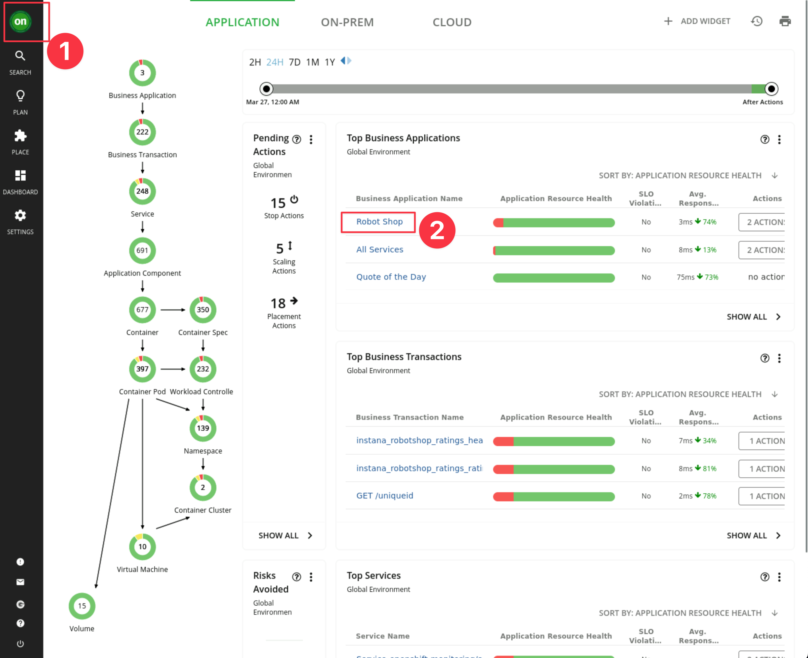

## 5.1: Introduction

Turbonomic ARM is generally agentless and pulls data from configured targets
using APIs.

The exception to this is the Kubernetes platform. Since Kubernetes is highly
complex and dynamic environment, an agent component is deployed onto target
Kubernetes and OpenShift cluster which then send data to the Turbonomic ARM
server, this agent is called **Kubeturbo**.

The [kubeturbo GitHub wiki](https://github.com/turbonomic/kubeturbo/wiki)
contains a wealth of information about installation, configuration,
troubleshooting, and more.

The content of this section follows the recommended
[OpenShift deployment](https://github.com/turbonomic/kubeturbo/wiki/OpenShift-Operator-Hub-Details)
procedure and provides contextual instruction in relation to the lab environment
being built out within this site.

---

## 5.2: Prerequisites

The steps in this lab should be performed on the **Apps** OpenShift cluster to
install the **KubeTurbo** agent. It will be configured to connect to the
Turbonomic server.


1. In your browser, navigate to your **Apps** Single Node OpenShift console:

   :::tip

   You can use the bookmark called **Apps SNO Dashboard** or use the URL
   `https://console-openshift-console.apps.sno.techzone.lan`

   Double check and make sure you see the text **sno** in your URL.

   :::

1. Login to the OCP Console using the credentials provided in IBM Tech Zone.

   The username will be **kubeadmin** and the password is the value of **_SNO
   Cluster Admin Password_**

1. Create a project in the OCP cluster where KubeTurbo will be deployed:

   1. Navigate to **Home** -> **Projects** and click on the **Create Project**
      button.
   1. Fill in details as below:
      - **Name**: `kubeturbo-operator`
      - **Display Name**: `Operator Hub based deployment of kubeturbo`
   1. Click the `Create` button.

   

---

## 5.3: Deploy the Operator

1. Click on **Operators** -> **OperatorHub**. Ensure the **kubeturbo-operator**
   project is selected in the dropdown.

1. Search for `kubeturbo` and select the **Certified** KubeTurbo operator:

   :::warning

   You must use the **Certified Kubeturbo Operator**.

   :::

   

1. Select and click on the **Install** button:

   

1. Select options as below:

   - Select **A specific namespace on the cluster**
   - Set the **Installed Namespace** to **kubeturbo-operator**
   - Set **Update approval** to **Manual**:

     :::tip

     Automatic updates are not recommended if you are not also automatically
     updating the Turbonomic Server

     :::

   - Click the **Install** button.

   

1. Click on the **Approve** button when the _Manual approval required_ prompt
   appears:

   

1. The operator will install and when it's ready you can view the operator
   (Click on **View Operator**) to create an instance, which will be your
   KubeTurbo agent (or probe) that will monitor and manage this cluster:

   

---

## 5.4: Configure Kubeturbo Instance

1. When viewing the deployed operator, click on **Create instance**:

   

1. To configure this instance click on the **YAML view** option:

   :::info

   Refer to
   [Configure KubeTurbo Instance](https://github.com/turbonomic/kubeturbo/wiki/OpenShift-Operator-Hub-Details#configure-a-kubeturbo-instance)
   for more information on the `Form view` option.

   For this lab, use the **YAML view** option.

   :::

   

1. Replace all the content in the YAML editor view with the YAML config below

   :::warning

   **DO NOT CLICK CREATE YET!!**

   :::

   ```
   kind: Kubeturbo
   apiVersion: charts.helm.k8s.io/v1
   metadata:
     name: kubeturbo-release
     namespace: kubeturbo-operator
   spec:
     args:
       sccsupport: '*'
     image:
       repository: registry.connect.redhat.com/turbonomic/kubeturbo
       tag: <turbonomic server version>
     restAPIConfig:
       opsManagerPassword: <your turbonomic server password>
       opsManagerUserName: <your turbonomic server username>
     serverMeta:
       turboServer: <your turbonomic server URL, please use the topology-processor URL>
       version: <your turbonomic server version>
     targetConfig:
       targetName: <your cluster name>
   ```

   

1. Now, replace the text **<your turbonomic server URL, please use the
   topology-processor URL>** with the actual turbonomic server URL:

   **How to get the Turbonomic Server URL:**

   1. Go to the **AIOps OCP Dashboard** bookmark or browse to
      `https://console-openshift-console.apps.ocp.techzone.lan` in another
      browser tab:

   1. Navigate to **Networking** -> **Routes**, ensure the **turbonomic**
      project is selected from the dropdown and and copy the **Location** for
      the **topology-processor** route by clicking the _copy_ icon:

      

   1. Go back to your YAML editor view in Step 3 earlier. Assign it as the
      **turboServer** value:

      

1. Next, replace the text `<your turbonomic server version>` with the actual
   turbonomic server version:

   **How to get the Turbonomic Server Version?**

   1. Go back to the **AIOps OCP Dashboard** where turbonomic is installed:

   1. Navigate to **Networking** -> **Routes**, select the **turbonomic
      project** and **click** the **Location** value for the **api** route:

      

   1. It will bring up the Turbonomic UI page as below. Check the version listed
      at the bottom of the page.

      

   1. Go back to your YAML editor view in Step 3 earlier. Assign the value to:

      - **image** -> **tag** value
      - **serverMeta** -> **version** value

      

1. Next, replace the values of `<your turbonomic server password>` and
   `<your turbonomic server username>` with the credentials that you have used
   to log into the Turbonomic UI:

   

1. Then set a cluster name for the **targetName**, e.g.

   - `application-kubeturbo-cluster`.

   Your config should now look similar to the below:

   

1. Finally, click on the **Create** button.

1. When you have applied your configuration you will see that you have created
   an instance, or custom resource, called **kubeturbo-release**:

   

---

## 5.5: Validate Deployment

You can now check to see that you have two deployments and two running pods in
the **kubeturbo-operator** namespace:

- One is the operator
- The other is the Kubeturbo probe (release)

1. On your **Apps SNO** OpenShift cluster, navigate to **Workloads** ->
   **Deployment** and select the **kubeturbo-operator** project:

   

1. Navigate to **Workloads** -> **Pods** again in the **kubeturbo-operator**
   project:

   

1. Then click on the **kubeturbo-release** pod.

   

1. Then click on **Logs** to validate that the probe has successfully registered
   by searching the logs for `Probe registration succeeded`

   

1. Validate the target in the Turbonomic Server UI

   - Go to your **Turbonomic Server UI** -> **Settings** -> **Target
     Configuration** and you will see a new target listed with the name
     **Kubernetes-{your_cluster_name}**

     

1. Finally validate that **Kubeturbo** is discovering the **SNO Cluster VM** and
   that the **Robot Shop** application is running on it.

   - Navigate to the **Robot Shop** _Business Application_

     

   - Confirm the SNO **Virtual Machine** is discovered and displayed in the
     Turbo Supply Chain.

     :::note

     If you don't see it yet give the system some time to process. This can take
     up to 10 minutes to show. In the meantime you can read the Kubeturbo
     container logs to view the current status.

     :::

     

---

## 5.6: Summary

In this portion of the lab, you have learned how to install the KubeTurbo agent
or probe in a target cluster, which communicates with the remote Turbonomic
server.

Navigate to the next section to configure a policy for your business
application.

---
