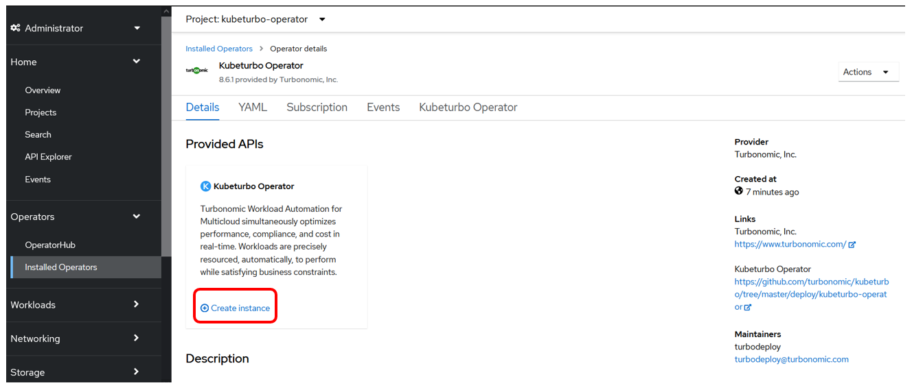

## 5.1: Introduction

Turbonomic ARM is generally agentless and pulls data from configured targets
using APIs.

The exception to this is the Kubernetes platform. Since Kubernetes is highly
complex and dynamic environment, an agent component is deployed onto target
Kubernetes and OpenShift cluster which then send data to the Turbonomic ARM
server.

The [kubeturbo GitHub wiki](https://github.com/turbonomic/kubeturbo/wiki)
contains a wealth of information about installation, configuration,
troubleshooting, and more.

The content of this section follows the recommended
[OpenShift deployment](https://github.com/turbonomic/kubeturbo/wiki/OpenShift-Operator-Hub-Details)
procedure and provides contextual instruction in relation to the lab environment
being built out within this site.

---

## 5.2: Prerequisites

The steps in this lab should be performed on the **Application** OpenShift
cluster:


1. In your browser, navigate to your **Application** OpenShift console:

   :::tip

   You can find and open your OpenShift console from the
   [IBM Cloud clusters](https://cloud.ibm.com/kubernetes/clusters?platformType=openshift)
   page.

   :::

1. As a cluster administrator, create a project in the OCP cluster where
   KubeTurbo will be deployed:

   1. Navigate to `Home -> Projects` and click on the `Create Project` button.
   1. Fill in details as below:
      - **Name**: `kubeturbo-operator`
      - **Display Name**: `Operator Hub based deployment of kubeturbo`
   1. Click the `Create` button.

   

---

## 5.3: Deploy the Operator

1. Click on `Operators -> OperatorHub`. Ensure the `kubeturbo-operator` project
   is selected in the dropdown.

1. Search for `kubeturbo` and select the `Certified` KubeTurbo operator:

   :::warning

   Do not use Community edition.

   :::

   

1. Select and click on the `Install` button:

   

1. Select options as below:

   - Set `Update approval` as `Manual`:

     - **Automatic update is not recommended if you are not also automatically
       updating the Turbonomic Server.**
     - Click the `Install` button.

   

1. Click on the `Approve` button when the `Manual approval required` prompt
   appears:

   

1. The operator will install and when it's ready you can view the operator
   (Click on `View Operator`) to create an instance, which will be your
   KubeTurbo agent (or probe) that will monitor and manage this cluster:

   

---

## 5.4: Configure Kubeturbo Instance

1. When viewing the deployed operator, click on `Create instance`:

   

1. To configure this instance click on the `YAML view` option:

   :::info

   Refer to
   [Configure KubeTurbo Instance](https://github.com/turbonomic/kubeturbo/wiki/OpenShift-Operator-Hub-Details#configure-a-kubeturbo-instance)
   for more information on the `Form view` option.

   For this lab, use the `YAML view` option.

   :::

   

1. Replace all the content in the YAML editor view with the YAML config below

   :::warning

   **DO NOT CLICK CREATE YET!!**

   :::

   ```
   kind: Kubeturbo
   apiVersion: charts.helm.k8s.io/v1
   metadata:
     name: kubeturbo-release
     namespace: kubeturbo-operator
   spec:
     args:
       sccsupport: '*'
     image:
       repository: registry.connect.redhat.com/turbonomic/kubeturbo
       tag: <turbonomic server version>
     restAPIConfig:
       opsManagerPassword: <your turbonomic server password>
       opsManagerUserName: <your turbonomic server username>
     serverMeta:
       turboServer: <your turbonomic server URL, please use the topology-processor URL>
       version: <your turbonomic server version>
     targetConfig:
       targetName: <your cluster name>
   ```

   

1. Now, replace the text
   `<your turbonomic server URL, please use the topology-processor URL>` with
   the actual turbonomic server URL:

   **How to get the Turbonomic Server URL:**

   1. Go to the **AIops** OpenShift cluster console, where turbonomic is
      installed **in another browser tab**:

      

   1. Navigate to `Networking -> Routes`, select the `turbonomic` project and
      copy the `Location` for `topology-processor`:

      

   1. Go back to your YAML editor view in Step 3 earlier. Assign it as the
      `turboServer` value:

      

1. Next, replace the text `<your turbonomic server version>` with the actual
   turbonomic server version:

   **How to get the Turbonomic Server Version?**

   1. Go back to the **AIops** OpenShift cluster where turbonomic is installed:

      

   1. Navigate to `Networking -> Routes`, select the `turbonomic` project and
      copy the `Location` value for the `api` route:

      

   1. It will bring up the Turbonomic UI page as below. Check the version listed
      at the bottom of the page.

      

   1. Go back to your YAML editor view in Step 3 earlier. Assign the value to:

      - `image` -> `tag` value
      - `serverMeta` -> `version` value

      

1. Next, replace the values of `<your turbonomic server password>` and
   `<your turbonomic server username>` with the credentials that you have used
   to log into the Turbonomic UI:

   

1. Then set a cluster name for the `targetName`, e.g.

   - `application-kubeturbo-cluster`.

1. Finally, click on the `Create` button.

   

1. When you have applied your configuration you will see that you have created
   an instance, or custom resource, called `kubeturbo-release`:

   

---

## 5.5: Validate Deployment

You should now see two deployments and two running pods in the namespace:

- One is the operator
- The other is the Kubeturbo probe (release)

1. On your **Application** OpenShift cluster, navigate to
   `Workloads -> Deployment` and select the `kubeturbo-operator` project:

   

1. Navigate to `Workloads -> Pods` and select the `kubeturbo-operator` project:

   

1. Then click on the `kubeturbo-release` pod.

   

1. Then click on `Logs` to validate that the probe has successfully connected,
   registered with the Turbo Server, and a full discovery has occurred:

   

1. Validate the target in the Turbonomic Server UI

   - Go to your Turbonomic Server UI -> `Settings` -> `Target Configuration` and
     you will see a new target listed with the name
     `Kubernetes-<your cluster name>`

     

---

## 5.6: Summary

In this portion of the lab, you have learned how to install the KubeTurbo agent
or probe in a target cluster, which communicates with the remote Turbonomic
server.

Navigate to the next section to configure a policy for your business
application.

---
