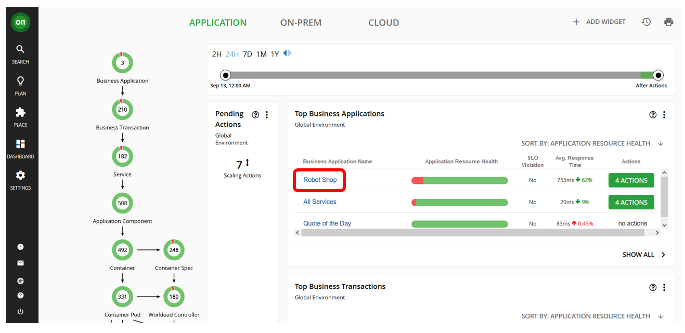

## 7.1: Manage Performance of Your Application

1. Open your Instana dashboard. Navigate to `Platform -> Kubernetes`.
   

1. Select your Robot Shop cluster.

1. Under the `Namespaces` tab, select `robot-shop`.

   

1. Click on the `Pods` tab and choose the `Map` view:

   - Analyze the CPU Limits, CPU Requests, Memory Limits, and Memory Requests.

   For example, here's what the CPU Limits look like for Robot Shop app before
   taking any Turbonomic ARM recommended actions:

   

1. Then go to the Turbonomic ARM dashboard and navigate to the `Robot Shop`
   application:

   

1. Here, we can see come key application metrics provided by Instana, e.g.
   response time and transactions and how they have evolved over time.

   - Turbonomic uses this data to provided actionable insights in the form of
     recommended actions you could take to improve performance and/or improve
     efficiency.

   - You will notice either green, red or yellow segments of the circles on
     `Container Cluster` section of the Business Application Tree on the left
     side of the screen (the **supply chain**).

   

1. Click that circle and it will take you to a screen like below:

   - You will notice that there are `Pending Actions` that Turbonomic suggests
     will improve the performance and efficiency of the application:

   

   > **Note:** Turbonomic does not recommend actions for a Business Application,
   > Transactions, or Services, but it does recommend actions for the underlying
   > Application Components and infrastructure entities, thus providing
   > visibility into the risks that have a direct impact on the Business
   > Application's performance.

1. Click `SHOW ALL` in the `Pending Actions` section:

   

1. Then select the pending actions that are for the Robot Shop application. Once
   they are selected, click on `EXECUTE ACTIONS` to apply the actions:

   

1. Click on `EXECUTE NOW` on the resulting pop up window:

   

1. You should see the action has successfully executed - a green checked mark:

   

1. After a few minutes, you can go back to the Instana dashboard to view the
   result of taking the actions:
   - Repeat step 4 to view the changes.

---

## 7.2: Summary

In this section, you have learned how to execute actions based on Turbonomic ARM
recommendations.

There is much more to actions that we will cover in future labs.

For now, you can experiment with your environment to increase web traffic or
otherwise generate load on the application or cluster and observe the
recommendations made by Turbonomic ARM as various layers of the **supply
chain**.

---
