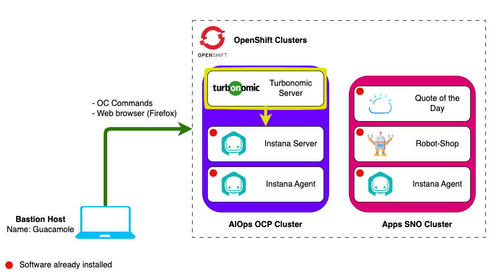

# Lab Environment

In this lab you will have access to two Openshift clusters:

1. **AIOps cluster** - A full installation of OCP that will be used to install
   Turbonomic.
2. **Apps cluster** - An instance of Single Node OpenShift that has an Instana
   Agent and the demo applications _RobotShop_ and _Quote Of The Day_
   pre-installed and integrated with Instana.

You will install the Turbonomic Server on the AIOps OCP Cluster and integrate
Turbonomic with the Instana Server also running on the AIOps Cluster.

## Prerequisites

To complete this lab you will need:

- Instana Agent key - Required when requesting lab environment
- Instana Sales key - Required when requesting lab environment
- Turbonomic License key - Required during lab

## Requesting a Lab Environment

For this lab we will be using the
[Jam-in-a-Box: Turbonomic - Install](https://techzone.ibm.com/my/reservations/create/64461a3fe7d57c0017bd85ce)
collection.

:::info

You can follow
[these instructions](/waiops-tech-jam/labs/jam-in-a-box/#requesting-a-lab-environment)
if you need guidance on how to request a lab.

:::
