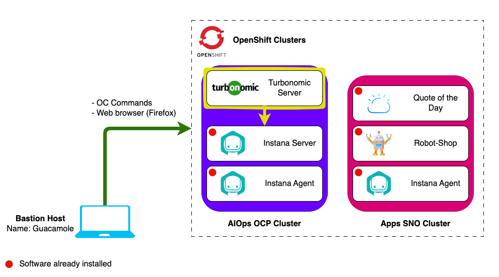

The lab environment includes 2 Openshift clusters.

Openshift clusters:

1. **AIOps cluster** - A full installation of OCP that will be used to install
   Turbonomic.
2. **Apps cluster** - An instance of Single Node OpenShift that has an Instana
   Agent and the demo applications _RobotShop_ and _Quote Of The Day_
   pre-installed and integrated with Instana.

## Lab Environment Diagram

In this lab you will be installing the Turbonomic Server on the AIOps OCP
Cluster and connecting it to the Instana Server also running on the AIOps
Cluster.

