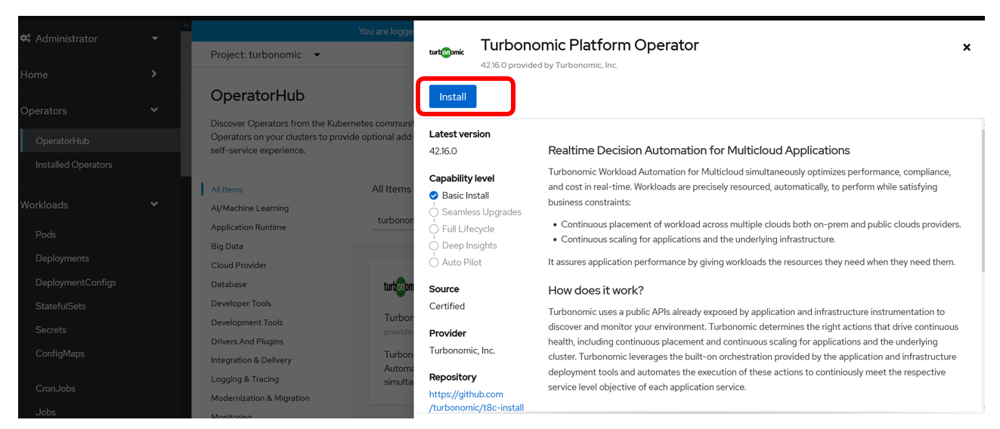
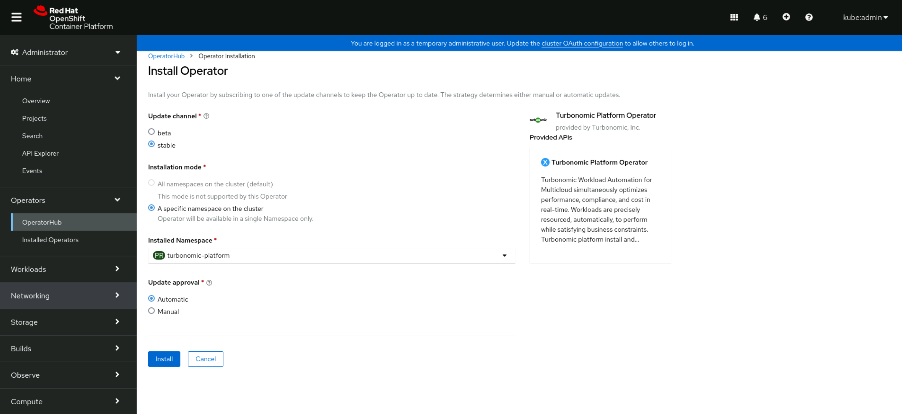

# Turbonomic Server Installation

## 3.1: Introduction

In this lab you will be installing the Turbonomic Platform (highlighted in
yellow) on your **AIOps OpenShift cluster**.


The [t8c-install](https://github.com/turbonomic/t8c-install/wiki) repository
contains information about installation methods, sizing, architecture and more.

The instructions in this lab are a streamlined and contextual version of the
information from the above repository, designed to get up and running quickly
and build out a lab or demo environment in OpenShift.

---

## 3.2: Prerequisites

:::tip

If you are unsure how to get access to the Bastion host (Guacamole) see
[Accessing a Lab Environment](/waiops-tech-jam/labs/jam-in-a-box/#accessing-a-lab-environment)

:::

From the Bastion host (Guacamole), open a terminal window by selecting
**Activities** at the top left of the screen and then the terminal icon.


:::caution Important

This installation procedure will be completed from the bastion host (Guacamole)
as the admin user. Ensure your prompt in the terminal looks something like
`admin@bastion-gym-lan`. If you are unsure you can open a new terminal tab or
terminal window.

The instructions in this guide use environment variables so it is important that
you use the same terminal prompt for the duration of the guide.

:::

1. Run the following commands to check you are in the right place:

   ```sh
   cd ~
   export KUBECONFIG=kubeconfig-aiops
   oc get nodes --kubeconfig kubeconfig-aiops
   ```

   You should see output like the below with multiple master and worker nodes
   which indicates that you are connecting to the **AIOps OpenShift cluster**.

   

1. From your command prompt, issue the following command to create the
   namespace:

   ```sh
   export NS=turbonomic-platform
   oc create namespace ${NS} --kubeconfig kubeconfig-aiops
   ```

1. The Turbonomic application will create PVs. To have the services access their
   PVs, we will use the UID value of the `sa.scc.uid-range` of the project:

   ```sh
   export FSGROUP=$(
       oc get ns ${NS} -o yaml --kubeconfig kubeconfig-aiops | \
       grep uid-range | \
       awk '{print $2}' | \
       awk -F '/' '{print $1}'
   )
   ```

1. Create the Custom Resource Definition (CRD) to allow Turbo operator to deploy
   all the necessary resources

   :::tip

   This is for Kubernetes version 1.22 and higher. When performing this step on
   another cluster you can check the Kubernetes version of OCP using the
   `oc version` command.

   :::

   ```sh
   oc create -f https://raw.githubusercontent.com/turbonomic/t8c-install/master/operator/config/crd/bases/charts.helm.k8s.io_xls.yaml --kubeconfig kubeconfig-aiops
   ```

You are now ready to deploy the operator

---

## 3.3: Deploy the Operator

1. Create the operator service account and cluster role and cluster role
   binding:

   ```sh
   oc create -f https://raw.githubusercontent.com/turbonomic/t8c-install/master/operator/deploy/service_account.yaml -n ${NS} --kubeconfig kubeconfig-aiops
   oc create -f https://raw.githubusercontent.com/turbonomic/t8c-install/master/operator/deploy/cluster_role.yaml -n ${NS} --kubeconfig kubeconfig-aiops
   ```

1. Create the cluster role binding:

   ```sh
   cat << EOF | oc -n ${NS} --kubeconfig kubeconfig-aiops apply -f -
   kind: ClusterRoleBinding
   apiVersion: rbac.authorization.k8s.io/v1
   metadata:
   name: t8c-operator
   subjects:
   - kind: ServiceAccount
   name: t8c-operator
   namespace: turbonomic-platform
   roleRef:
   kind: ClusterRole
   name: t8c-operator
   apiGroup: rbac.authorization.k8s.io
   EOF
   ```

1. Open a Firefox browser window

   

1. Use the Firefox Bookmark **OCP Dashboard** to open your OpenShift AIOps OCP
   Console.

   :::info

   You can safely ignore the warning about the certificate being untrusted.

   

   :::

1. Login to the OCP Console using the credentials provided in IBM Tech Zone.

   - Username: **kubeadmin**
   - Password: The value of _"OCP Cluster Admin Password"_ from your
     [IBM Tech Zone reservations](https://techzone.ibm.com/my/reservations) or
     the _environment ready_ email you received from IBM Tech Zone.

1. Launch the operator pod:

   Click on `Operators -> OperatorHub`. Ensure the `turbonomic-platform` project
   is selected in the dropdown. Search for `turbonomic platform` and select the
   **Certified** operator

   

1. Select and click on the `Install` button:

   

1. Select options as below:

   - Ensure **Installed Namespace** is set to **turbonomic-platform**
     - Click **Install**.

   

1. Wait for the operator to become available (status = running with 1/1 ready).
   Check the status by running the following command in the Terminal:

   ```sh
   oc get pods -n ${NS} -w --kubeconfig kubeconfig-aiops
   ```

   Example output:

   ```
   NAME                           READY   STATUS    RESTARTS   AGE
   t8c-operator-fdd8b8c94-dhrt4   1/1     Running   0          72s
   ```

   :::tip

   Type `Ctrl-C` to exit the watch loop once you see _Running_.

   :::

---

## 3.4: Configure the Turbonomic Instance: Custom Resource

1. Set the Storage Class by running the following in the Terminal:

   :::info

   You can view your available storage classes using `oc get storageclass`.

   The Tech Zone environment has already configured a class called
   **ocs-storagecluster-ceph-rbd** that we will be using.

   :::

   ```sh
   export STORAGE_CLASS=ocs-storagecluster-ceph-rbd
   ```

1. Ensure you have values set for the following environment variables:

   ```sh
   echo ${NS} && \
   echo ${FSGROUP} && \
   echo ${STORAGE_CLASS}
   ```

   The output should look like this (the FSGROUP value will likely be
   different):

   ```sh
   turbonomic-platform
   1000320000
   ocs-storagecluster-ceph-rbd
   ```

1. Apply a custom resource file to launch Turbonomic:

   ```sh
   cat << EOF | oc -n ${NS} --kubeconfig kubeconfig-aiops apply -f -
   apiVersion: charts.helm.k8s.io/v1
   kind: Xl
   metadata:
     name: xl-release
     namespace: ${NS}
   spec:
     global:
       customImageNames: false
       repository: registry.connect.redhat.com/turbonomic
       securityContext:
         fsGroup: ${FSGROUP}
       storageClassName: ${STORAGE_CLASS}
       storageSelector: false
       tag: 8.6.2
     openshiftingress:
       enabled: true
     kubeturbo:
       enabled: true
     nginx:
       httpsRedirect: false
       nginxIsPrimaryIngress: false
     nginxingress:
       enabled: false
     instana:
       enabled: true
   EOF
   ```

1. Deployment will begin for all the Turbonomic pods. Depending on the
   environment, this may take some time to complete, anywhere from 5 to 20
   minutes. Use the command below to check the status of the deployment.

   ```sh
   oc get pods -n ${NS} -w --kubeconfig kubeconfig-aiops
   ```

   :::note

   Type `Ctrl-C` to exit the watch loop.

   :::

   Ensure all the pods:

   - are in a `Running` state (`STATUS` column) and
   - show `1/1` in the `READY` column.

   **Example output only (Do not copy and paste into your terminal):**

   :::info

   You can safely ignored the pods **prometheus-server**,
   **server-power-modeler** & **suspend** if they are in _ImagePullBackOff_ or
   _Pending_ state.

   :::

   ```sh
   NAME                                   READY   STATUS    RESTARTS      AGE
   action-orchestrator-55bbb96fd8-bxv59   1/1     Running   2 (14m ago)   17m
   api-6d876bd5c8-ntpc9                   1/1     Running   0             17m
   auth-57d95cdc4f-7x7jq                  1/1     Running   0             17m
   clustermgr-5bff4bc746-9fvz4            1/1     Running   2 (14m ago)   17m
   consul-6b979f7d9d-ncb9f                1/1     Running   0             17m
   cost-679689bcb8-9r8h7                  1/1     Running   2 (14m ago)   17m
   db-5547b8bb9c-xjlk8                    1/1     Running   0             17m
   group-7c66b96cd6-jf69l                 1/1     Running   2 (14m ago)   17m
   history-75c89bdcdb-vcsv4               1/1     Running   2 (14m ago)   17m
   kafka-54b458c5ff-25tkp                 1/1     Running   0             17m
   kubeturbo-6b7568cbd-8gdqp              1/1     Running   0             17m
   market-784cd4f9fb-26879                1/1     Running   2 (14m ago)   17m
   plan-orchestrator-5fb588cdc6-wsz4l     1/1     Running   2 (14m ago)   17m
   repository-85bb8b95c4-w85nv            1/1     Running   2 (14m ago)   17m
   rsyslog-64c7fb4467-qcj9v               1/1     Running   0             17m
   t8c-operator-fdd8b8c94-jwwj8           1/1     Running   0             18m
   topology-processor-77f7f95c8-lmpzr     1/1     Running   0             17m
   ui-6d4ff8787d-6zhm4                    1/1     Running   0             17m
   zookeeper-57658f68c6-6qdgb             1/1     Running   0             17m
   ```

---

## 3.5: Launch the Turbonomic User interface

You are now ready to open a new browser tab and login to the Turbonomic user
interface.

1. Open the Turbonomic UI in a new browser tab by using the bookmark called
   **Turbonomic**. Advance through any certificate warnings you may get.

   :::tip

   If you did not have a Bookmark available you can get the Turbonomic UI route
   after the deployment completes by running the following command:

   ```sh
   oc get route -n ${NS} --kubeconfig kubeconfig-aiops | grep api | awk '{print $2}'
   ```

   :::

1. The first time you log in to Turbonomic, you will be prompted to create a
   password for the `administrator` user:

   

   - Set the password to `Passw0rd`
   - Save the password for future logins.
   - Click on the `CREATE ACCOUNT` button.

1. If you are prompted with a _Share Analytics and usage information_ modal you
   can leave it unchecked and select **SAVE AND CONTINUE**.

---

## 3.6: License Configuration

Once logged in, the setup wizard will prompt you to import the license key:


1. From the **Guacamole** host create a file called `turbo-license` and copy the
   contents of the
   [turbonomic license file](/waiops-tech-jam/labs/turbonomic/install-lab/lab-environment/#prerequisites).

   :::note

   It is recommended to use a text editor to modify the following command before
   pasting it into the Terminal.

   :::

   ```sh
   cat << EOF > ~/turbo-license.lic
   <replace_this_with_license_file_contents>
   EOF
   ```

1. Click on `LET'S GO` button.

1. Click on `IMPORT LICENSE` button and browse for the newly created license
   file in the Home directory.

   

1. Then click on `Save` button. You will see the page below if it's successful:

   

---

## 3.7: Summary

In this portion of the lab, you have learned how to install and license
Turbonomic on OpenShift.

Move onto the next section to learn how to integrate Instana for application
monitoring data ingestion so Turbonomic can start assuring the performance of
your business applications.

---
