# Application Data Target

:::tip Note

This lab has a pre-installed Instana Server running. If you would like to learn
more about installing and configuring Instana yourself you can do so
[here](https://ibm.github.io/waiops-tech-jam/labs/instana/introduction/).

:::

## 4.1: Introduction

Turbonomic Application Resource Management (ARM) is all about ensuring your
critical business applications are getting the resources they need, when they
need them, to proactively mitigate against SLO breaches and SLA violations.

To do this, Turbonomic ARM ingests data from your existing tools to begin the
process of making recommendations and taking actions across your full stack,
using it's **patented analytics engine**.

:::info Keyword Alert

A **target** is the term used for your existing solutions and accounts from
which Turbonomic ARM will either pull data from, or integrate with to perform
actions.

:::

Data ingestion is typically agentless and conducted via REST APIs. There is an
exception to this, Kubernetes, we will look into this more let in the lab.

For business critical applications, application performance monitoring (APM)
data is pulled from your existing APM solution(s).

In this section, we are going to integrate Instana to pull application
performance data for applications being monitored using Instana, namely, the
Robot Shop demo application.

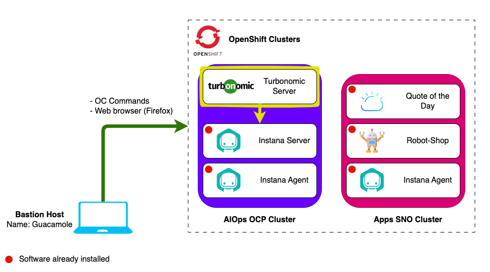

---

## 4.2: Ingest application performance data from Instana

1. Navigate to the Instana console by selecting the **Instana** bookmark from
   the bookmarks bar in Firefox and logging in.

   - Username: `admin@instana.local`
   - Password: `Passw0rd`

1. Create a new API token by selecting:

   - **Settings** -> **Team Settings** page -> **API Tokens**.
   - Click on **Add API Token** to create an API key from Instana.

   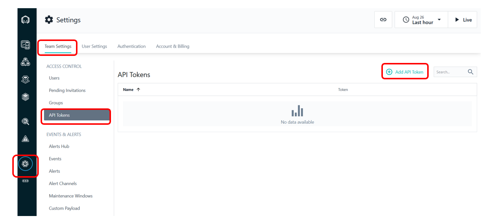

1. In the create API token page, enter a name for your token, e.g.
   `Turbonomic API Token` and scroll down to the **Permissions** section to
   enable the following permissions:

   - Access to audit log
   - Access to token and session timeout settings
   - Access to account and billing information

   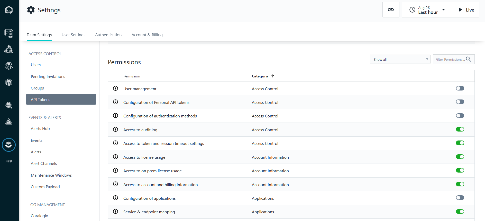

1. Copy the generated API token to be used in later steps:

   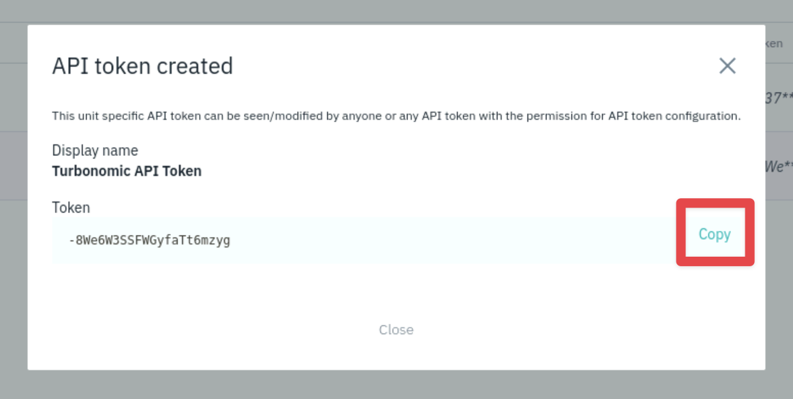

1. Click on the **Save** button. The API token is created.

   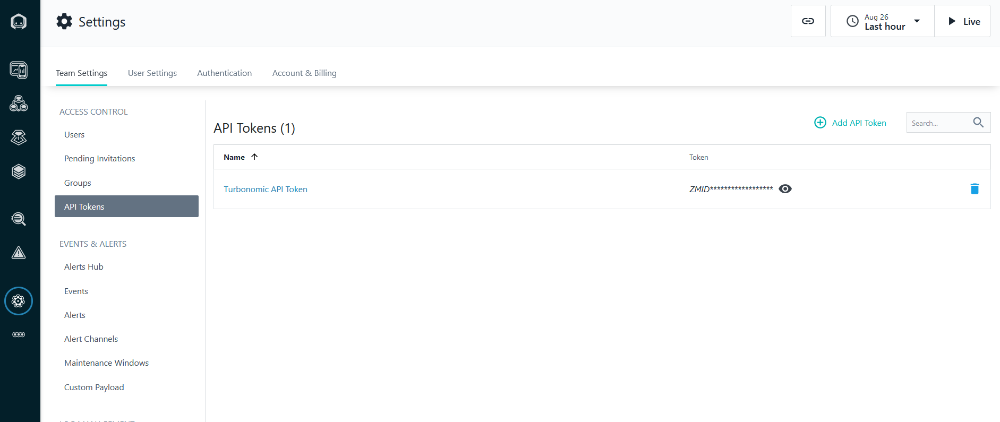

1. In the Turbonomic console, go to **Settings** -> **Target Configuration**:

   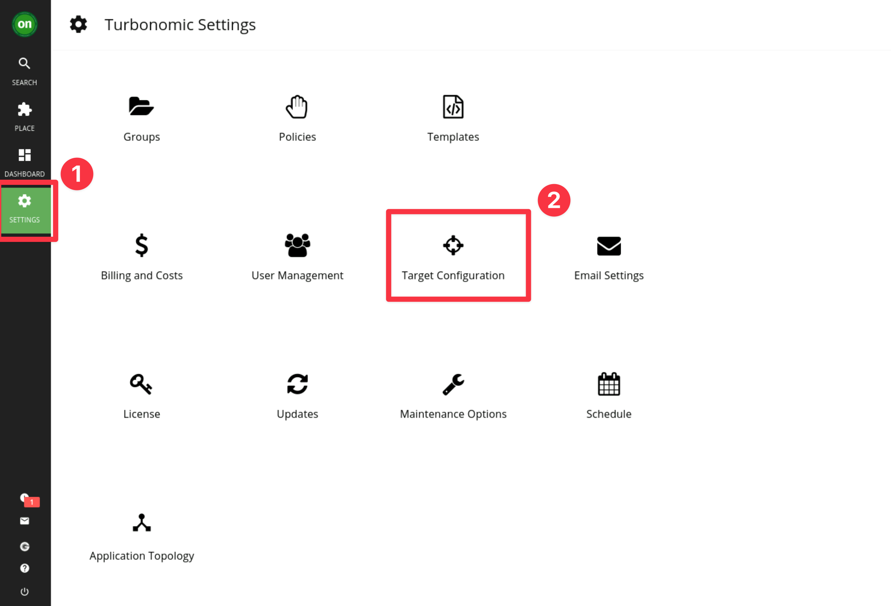

1. Click on the **NEW TARGET** button (top-right) and then select **Applications
   and Databases**:

   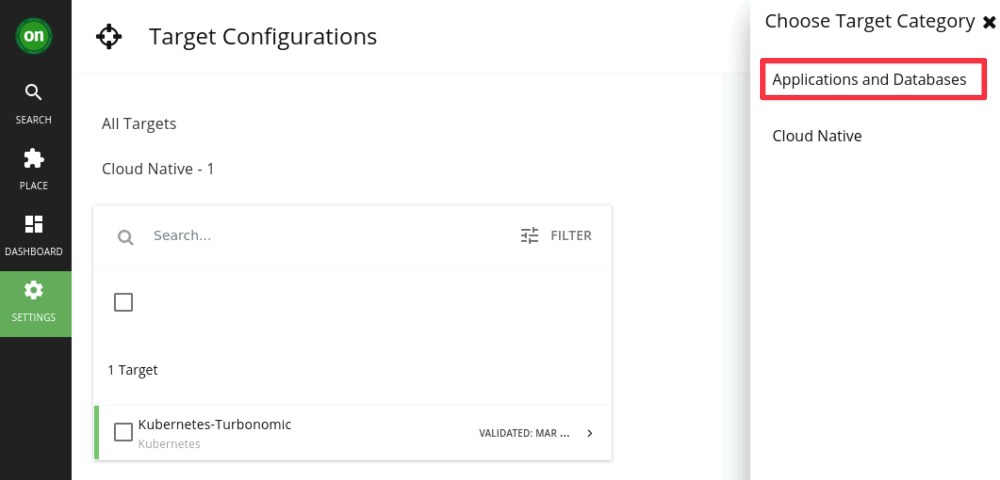

1. Click on **Instana**:

   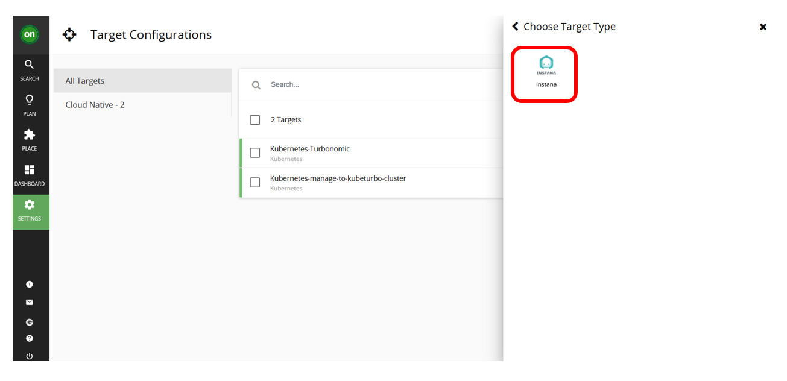

1. Add the Instana Target details:

   :::info

   Instana has been pre-installed in an Ubuntu VM using the standard
   installation method on K3s. Instana had been installed with the unit name
   `unit0` and tenant name `ibm`. This can change depending on the environment.
   In a kubernetes environment you can look at the configured routes to get a
   better understanding of what endpoints are available

   - K3s:
     - command: `kubectl get svc -n instana-core`
     - example: `unit0-tenant0.instana.techzone.lan`
   - Openshift:
     - command: `oc get route -n instana-core`
     - example: `unit0-tenant0.instana.apps.ocp.techzone.lan`

   :::

   - **Hostname** we will use for this lab: `unit0-ibm.instana.techzone.lan`
   - **API key**: The key you created and copied in Step 2 earlier

   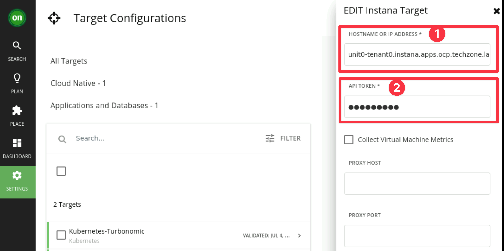

   Click **Add** and Turbonomic will begin to validate the Target.

   It can take some time for Turbonomic to discover and validate the target.
   Once it is validated, you should see:

   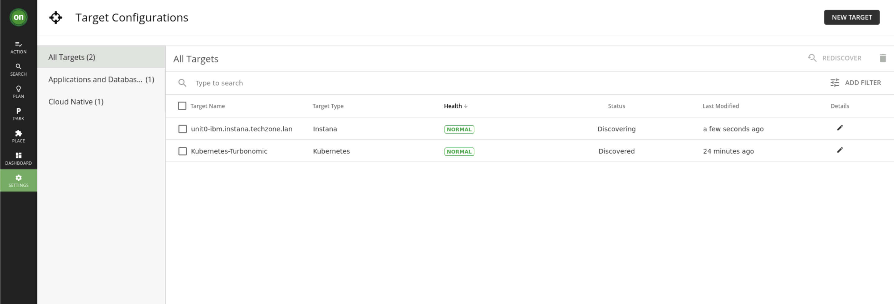

   You can now select the green **on** at the top left of the Turbonomic
   Dashboard. You will need to wait a little while to be able to see information
   on monitored applications coming into Turbonomic from Instana.

   :::caution

   It can take up to 15 minutes to start displaying data from Instana depending
   on the speed of the demo system.

   :::

   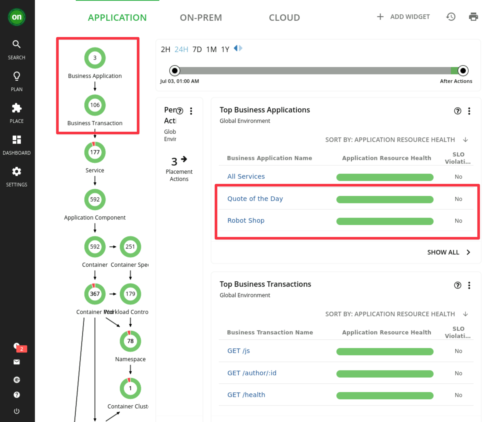

---

# 3.3: Summary

In this lab you have learned how to integrate your existing Instana APM software
to give Turbonomic ARM a view of your critical business applications.

Continue with the next lab to learn more about the Instana UI and how to ingest
Kubernetes data.

---
