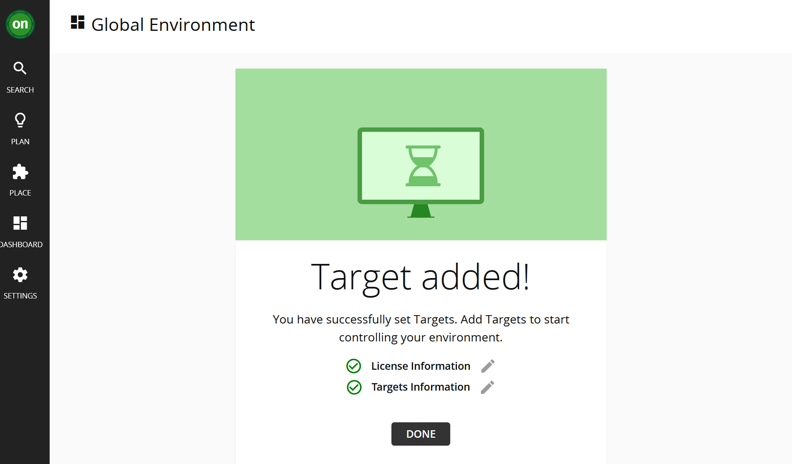

# Application Data Target

:::info Note

This lab has a pre-installed Instana Server running. If you would like to learn
more about installing and configuring Instana yourself you can do so
[here](https://ibm.github.io/waiops-tech-jam/labs/instana/introduction/).

:::

## 4.1: Introduction

Turbonomic Application Resource Management (ARM) is all about ensuring your
critical business applications are getting the resources they need, when they
need them, to proactively mitigate against SLO breaches and SLA violations.

To do this, Turbonomic ARM ingests data from your existing tools to begin the
process of making recommendations and taking actions across your full stack,
using it's **patented analytics engine**.

:::info Keyword Alert

A **target** is the term used for your existing solutions and accounts from
which Turbonomic ARM will either pull data from, or integrate with to perform
actions.

:::

Data ingestion is typically agentless and conducted via REST APIs. There is an
exception to this, Kubernetes, we will look into this more let in the lab.

For business critical applications, application performance monitoring (APM)
data is pulled from your existing APM solution(s).

In this section, we are going to integrate Instana to pull application
performance data for applications being monitored using Instana, namely, the
Robot Shop demo application.

---

## 4.2: Ingest application performance data from Instana

1. Navigate to the Instana console by selecting the **Instana** bookmark and
   logging in.

   - Username: `admin@instana.local`
   - Password: `Passw0rd`

1. Create a new API token by selecting:

   - **Settings** -> **Team Settings** page -> **API Tokens**.
   - Click on **Add API Token** to create an API key from Instana.

   

1. In the create API token page, enter a name for your token, e.g.
   `Turbonomic API Token`:

1. Copy the generated API token to be used in later steps:

   1. Click the _eye_ icon as in screen shot below. This will show the token.
   2. Click the _copy_ icon next to the token to actually copy the token:
      - Clicking the _eye_ icon alone does not copy the generated token, it just
        makes it visible.

   

1. Then scroll down to the **Permissions** section to enable the following
   permissions:

   - Access to audit log
   - Access to token and session timeout settings
   - Access to license usage
   - Access to on prem license usage
   - Access to account and billing information
   - Service & endpoint mapping

   

1. Click on the **Save** button. The API token is created.

   

1. In the Turbonomic console, go to **Settings** -> **Target Configuration**:

   

1. Click on the **NEW TARGET** button (top-right) and then select **Applications
   and Databases**:

   

1. Click on **Instana**:

   

1. Add the Instana Target details:

   :::info

   Instana has been pre-installed on OCP for this lab. Instana was installed
   with the unit name `unit0` and tenant name `tenant0`. This can change
   depending on the environment. In an OCP environment you can look at the
   configured routes to get a better understanding of what endpoints are
   available `oc get route -n instana-core`.

   :::

   - Hostname: `unit0-tenant0.instana.apps.ocp.techzone.lan`
   - API key: The key you created and copied in Step 2 earlier

   

   Click **Add** and Turbonomic will begin to validate the Target.

   It can take some time for Turbonomic to discover and validate the target.
   Once it is validated, you should see:

   

   You can now select the green **on** at the top left of the Turbonomic
   Dashboard. It can take up to 15 minutes to start displaying data from Instana
   depending on the speed of the demo system. After a short wait you will be
   able to see information on monitored applications coming into Turbonomic from
   Instana.

   

---

# 3.3: Summary

In this portion of the lab, you have learned how to integrate your existing APM
tools to give Turbonomic ARM a view of your critical business applications.

Navigate to the next section to start understanding the Turbonomic ARM user
interface.

---
