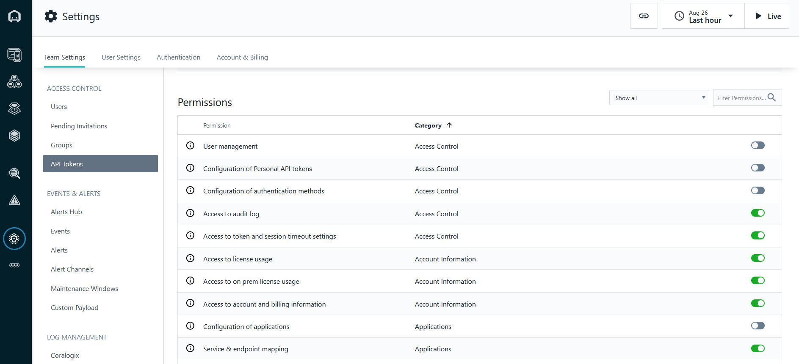
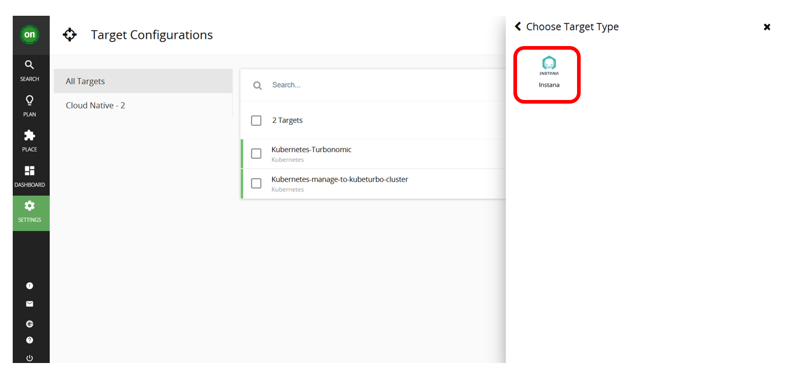

:::caution Prerequisite

If you have not already done so, please complete the
[Instana](https://ibm.github.io/waiops-tech-jam/labs/instana/introduction/) labs
first.

:::

## 5.1: Introduction

Turbonomic Application Resource Management (ARM) is all about ensuring your
critical business applications are getting the resources they need, when they
need them, to proactively mitigate against SLO breaches and SLA violations.

To do this, Turbonomic ARM ingests data from your existing tools to begin the
process of making recommendations and taking actions across your full stack,
using it's **patented analytics engine**.

:::info Keyword Alert

A **target** is the term used for your existing solutions and accounts from
which Turbonomic ARM will either pull data from, or integrate with to perform
actions.

:::

Data ingestion is typically agentless and conducted via REST APIs (with the
exception of Kubernetes - more on this in a later lab).

For business critical applications, application performance monitoring (APM)
data is pulled from your existing APM solution(s).

In this section, we are going to integrate Instana to get application
performance data for the Robot Shop application.

---

## 5.2: Ingest application performance data from Instana

1. In the Instana console:

   - Navigate to **Settings** -> **Team Settings** page -> **API Tokens**.
   - Click on **Add API Token** to create an API key from Instana.

   

1. In the create API token page, enter a name for your token, e.g.
   `Turbonomic API Token`:

1. Copy the generated API token to be used in later steps:

   1. Click the _eye_ icon as in screen shot below. This will show the token.
   2. Click the _copy_ icon next to the token to actually copy the token:
      - Clicking the _eye_ icon alone does not copy the generated token, it just
        makes it visible.

   

1. Then scroll down to the **Permissions** section to enable the following
   permissions:

   - Access to audit log
   - Access to token and session timeout settings
   - Access to license usage
   - Access to on prem license usage
   - Access to account and billing information
   - Service & endpoint mapping

   

1. Click on the **Save** button. The API token is created.

   

1. In the Turbonomic console, go to **Settings** -> **Target Configuration**:

   

1. Click on the **NEW TARGET** button (top-right) and then select **Applications
   and Databases**:

   

1. Click on **Instana**:

   

1. Add the Instana hostname, API key (which you have created in Step 2 earlier),
   and proxy username set as `administrator`:

   :::info

   For _Instana hostname_ use the Instana server's IP address if using a
   provisioned lab environment during a scheduled Tech Jam event.

   Normally, if your Instana server has a DNS resolvable name, you can use that.

   :::

   

   Click **Add**

   It can take some time for Turbonomic to discover and validate the target.
   Once it is validated, you should see:

   

   After it is validated successfully, it will be displayed as a validated
   target in the **_Target Configurations_** list in the Turbonomic console
   settings.

   

---

# 3.3: Summary

In this portion of the lab, you have learned how to integrate your existing APM
tools to give Turbonomic ARM a view of your critical business applications.

Navigate to the next section to start understanding the Turbonomic ARM user
interface.

---
