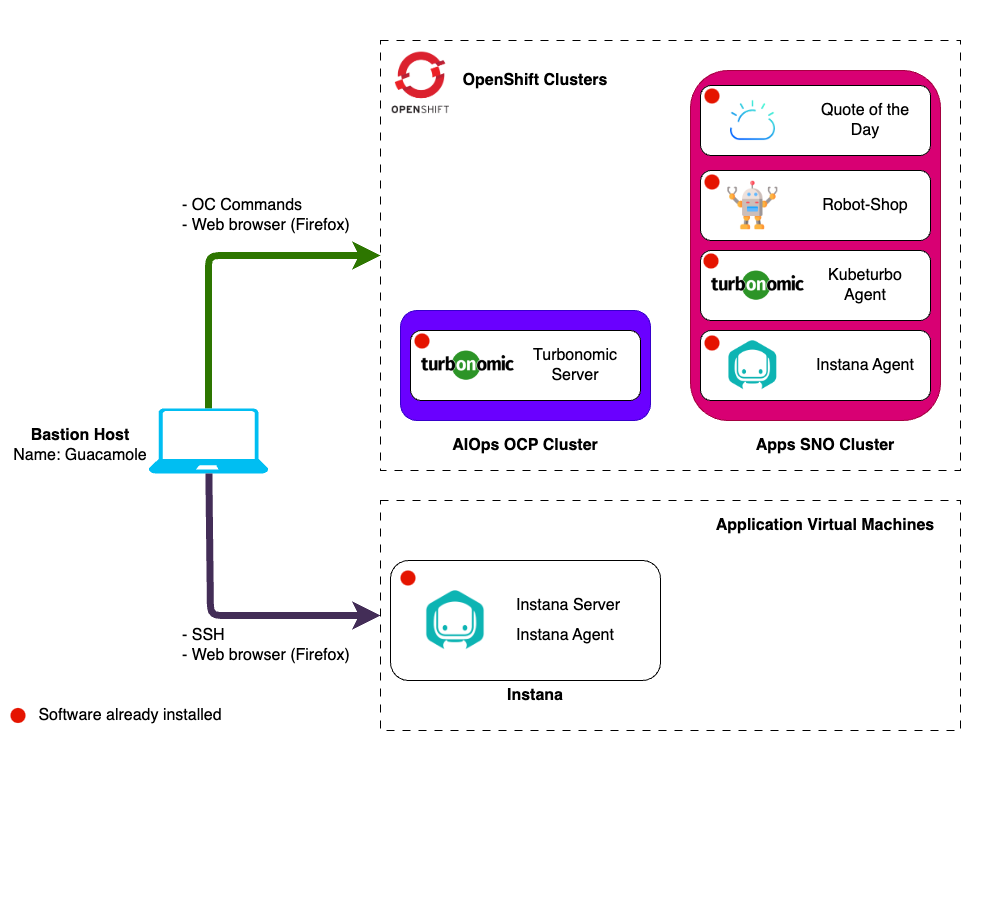

# Lab Environment

In this lab you will have access to two Openshift clusters:

1. **AIOps cluster** - A full installation of OCP that includes Instana, Instana
   Agent and Turbonomic all pre-installed Instana and Turbonomic Server.
2. **Apps cluster** - An instance of Single Node OpenShift that has Kubeturbo,
   Instana Agent and the demo applications _RobotShop_ and _Quote Of The Day_
   pre-installed.

You will be diving into Turbonomic and learning about Turbonomic Policies and
Actions. In the lab you will configure an SLO policy for the Robot Shop
application to understand how Turbonomic ARM uses target data already configured
to make action recommendations that will assure application performance.

## Prerequisites

To complete this lab you will need:

- Instana License
  - Download/Agent Key (Required when requesting lab environment)
  - Sales Key (Required when requesting lab environment)
- Turbonomic License key (Required when requesting lab environment)

## Requesting a Lab Environment

import TechZoneStatus from "../../../_common/components/tech-zone-status.tsx"

Below is a live chart showing Tech Zone capacity in each available region. When
requesting your environment it would be wise to select the region that has the
most capacity available.

<TechZoneStatus />

:::warning Required Fields

Tech Zone labels the Instana Keys as _optional_ but this is not correct, **the
Instana Keys are required inputs**. This is a known issue in Tech Zone.

:::

:::info

Follow
[these instructions](/waiops-tech-jam/labs/jam-in-a-box/#requesting-a-lab-environment)
for step by step guidance on requesting a lab environment in IBM Tech Zone.

:::

Request Tech Zone environment:

- [Jam-in-a-Box: Turbonomic - Policies & Taking Actions](https://techzone.ibm.com/my/reservations/create/64a3ba32b1a45b001790c4a7)
