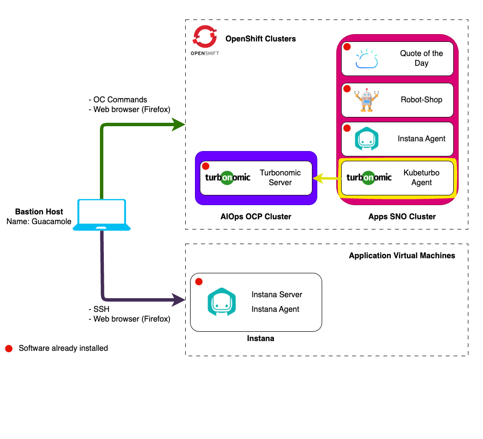

# Lab Environment

In this lab you will have access to two Openshift clusters:

1. **AIOps cluster** - A full installation of OCP that includes an pre-installed
   Instana and Turbonomic Server.
2. **Apps cluster** - An instance of Single Node OpenShift that has the demo
   applications _RobotShop_ and _Quote Of The Day_ pre-installed.

You will be exploring the UI of the Turbonomic Server running on the AIOps
cluster. You will also be installing the Turbonomic Kubeturbo agent on the Apps
Single Node OpenShift Cluster and connecting it to the Turbonomic Server running
on the AIOps Cluster (highlighted in yellow).

## Prerequisites

To complete this lab you will need:

- Instana Agent key - Required when requesting lab environment
- Instana Sales key - Required when requesting lab environment
- Turbonomic License key - Required when requesting lab environment

## Requesting a Lab Environment

For this lab we will be using the
[Jam-in-a-Box: Turbonomic - Explore the UI & Kubeturbo](https://techzone.ibm.com/my/reservations/create/64a3b270fdf8be0017755812)
collection.

:::info

You can follow
[these instructions](/waiops-tech-jam/labs/jam-in-a-box/#requesting-a-lab-environment)
if you need guidance on how to request a lab.

:::
