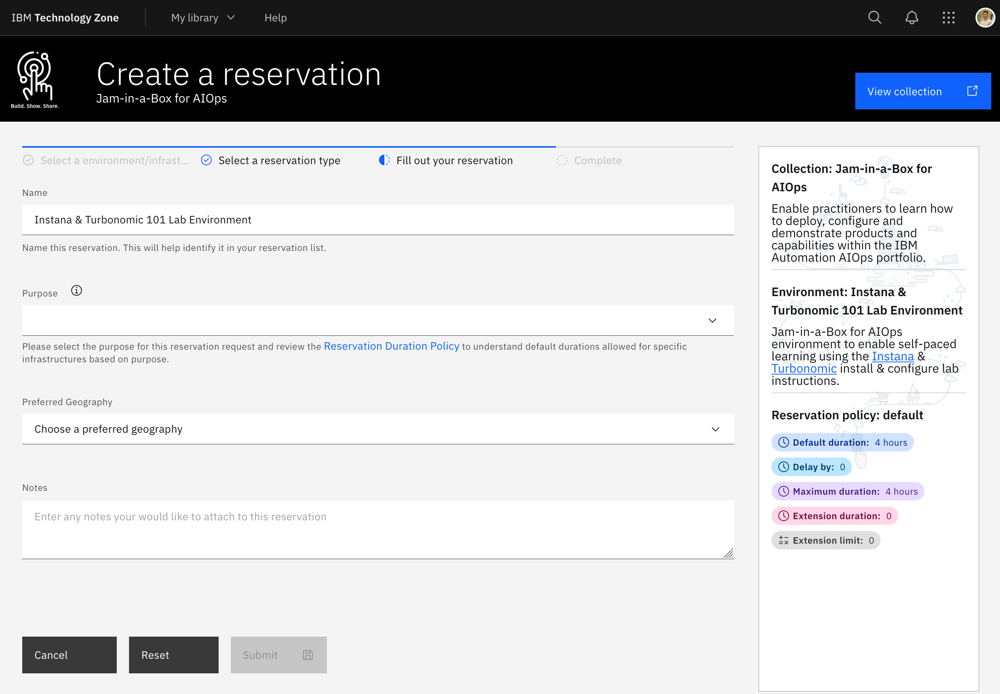
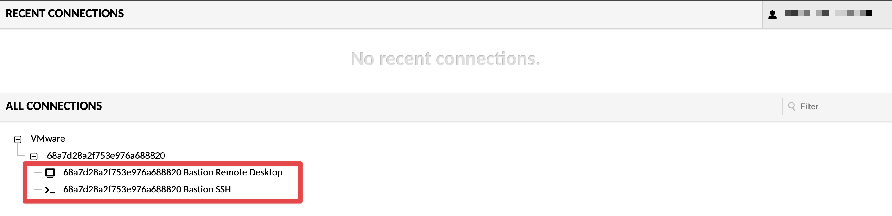
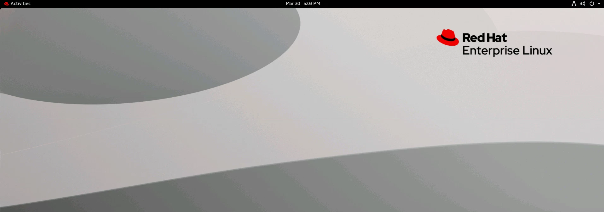

In this lab you will have access to two Openshift clusters:

1. **AIOps cluster** - A full installation of OCP that includes an pre-installed
   Instana and Turbonomic Server.
2. **Apps cluster** - An instance of Single Node OpenShift that has the demo
   applications _RobotShop_ and _Quote Of The Day_ pre-installed.

You will be exploring the UI of the Turbonomic Server running on the AIOps
cluster. You will also be installing the Turbonomic Kubeturbo agent on the Apps
Single Node OpenShift Cluster and connecting it to the Turbonomic Server running
on the AIOps Cluster (highlighted in yellow).


## Requesting an environment as an Individual

If you are an IBMer or IBM Business Partner you can request an environment for
yourself on [IBM Tech Zone](https://techzone.ibm.com).

Navigate to the
[Jam-in-a-Box](https://techzone.ibm.com/collection/jam-in-a-box-for-aiops)
collection. You will need to Sign in with your IBM ID.


Select **Environments** from the left navigation menu and select **Reserve**.


Select when you would like to reserve the environment for.


Fill in the reservation details and select **Submit**



You will receive an email with your environment details provisioning has
completed.

Once you have your environment details, navigate to the **OCP Console** URL that
looks similar to:

```sh
https://remote.cloud.techzone.ibm.com/guacamole/#/?username=000-000000-0000&password=00000
```

You will see a page similar to the below. Expand the _twisties_ and select the
**Remote Desktop** connection to connect to your _Apache Guacamole_ bastion
node.



All access to the environment is behind this RHEL Guacamole Bastion host named
**bastion-gym-lan**.



If you see the bastion hosts desktop environment you can proceed to
[the labs](/waiops-tech-jam/labs/general/).
