# Understanding the UI

:::info

The screenshots in the lab documentation may not look identical to your
individual environment. The aim of this section is to get familiar with the key
UI points of interest.

:::

## 3.1: Open the Turbonomic Dashboard

:::tip

If you are unsure how to get access to the Bastion host (Guacamole) see
[Accessing a Lab Environment](/waiops-tech-jam/labs/jam-in-a-box/#accessing-a-lab-environment)

:::

Open the Turbonomic ARM user interface in your browser:

1. Select **Activities** at the top left of the bastion host.

1. Select **Firefox**

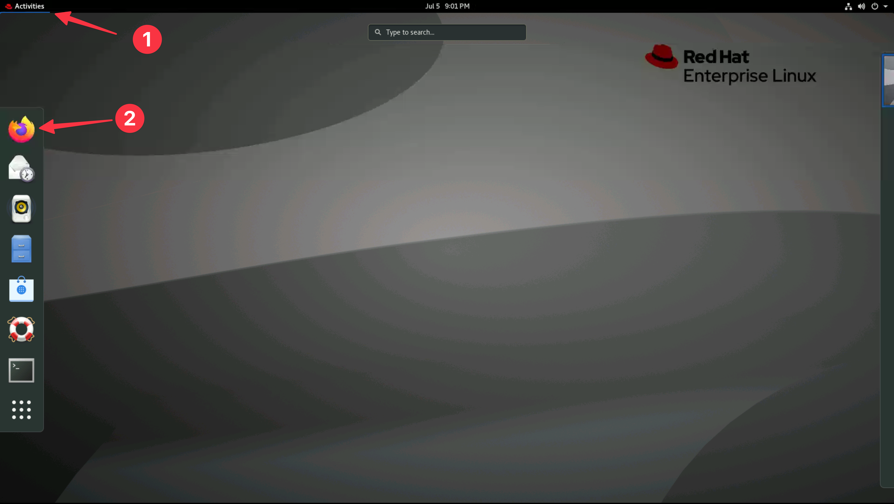

1. Navigate to the Turbonomic UI home page by selecting the **Turbonomic**
   bookmark

:::info

You can safely ignore the warning about the certificate being untrusted.

:::

## 3.2: Turbonomic UI

1. Login to Turbonomic

   - Username: `administrator`
   - Password: `Passw0rd`

   :::tip

   To get back to the homepage, you can click the green **ON** icon in the
   top-left (left navigation pane):

   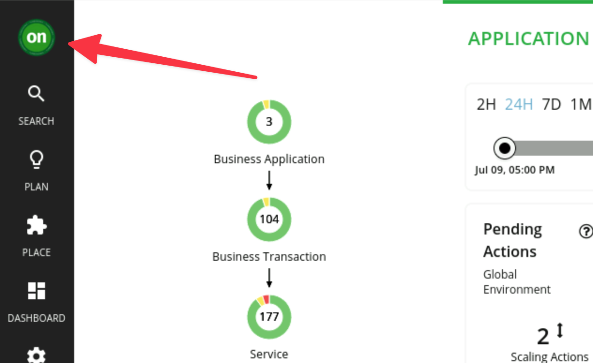

   :::

:::warning

There is currently a known issue with the integration between Turbonomic and
Instana in the lab environment preventing data ingest from Instana.

Until this is resolved the workaround is to **re-save** and **rediscover** the
Instana target. To do this:

1. Select **Settings** from the left navigation pane
2. Select **Target Configuration**
3. Edit the **Instana** target that is in a critical state. DO NOT change
   anything. Just click **Save**.
4. Check the checkbox next to the **Instana** target and click **Rediscover**

This will force a re-discovery of the Instana target and should resolve the
issue. The UI will begin to populate with data from Instana after a few minutes.

:::

1. Once logged in you will see the Turbonomic UI homepage. Lets start by
   familiarising ourselves with the UI.

   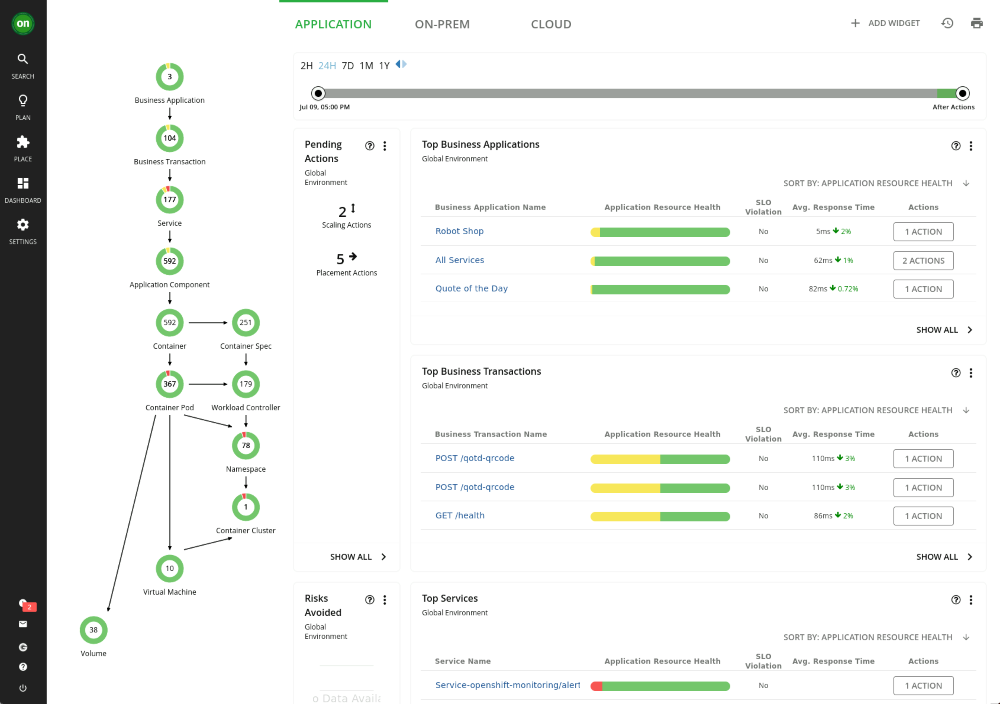

1. The three tabs at the top of the page allow you to navigate between different
   environmental views

   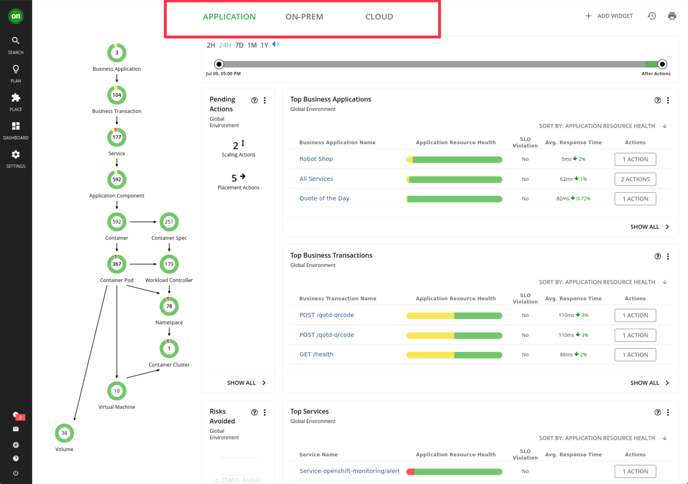

1. When Turbonomic ARM is deployed and selected environments are targeted,
   Turbonomic discovers all of the entities in the targeted environments. It
   then builds out this graphic you see here called the **Supply Chain**. This
   environment has already been pre-configured with an Instana integration, so
   you can see entities that have been imported from Instana in the supply
   chain:

   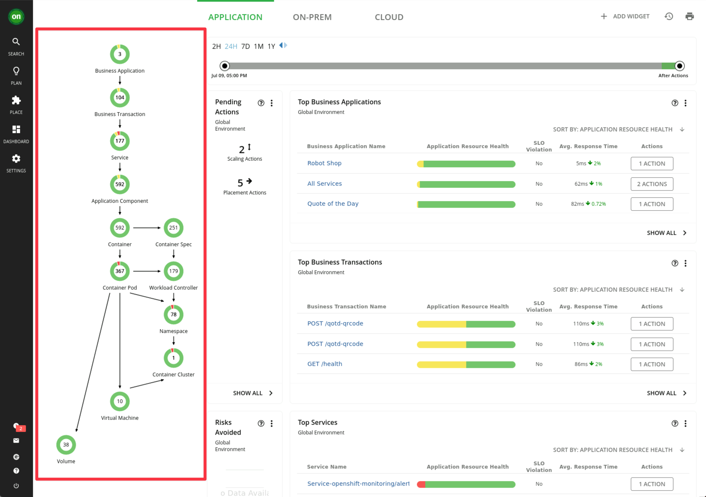

   The **Supply Chain** stitches together all of the entities from the top-level
   business application down through to the supporting infrastructure.

1. Notice that the entities have different colors:

   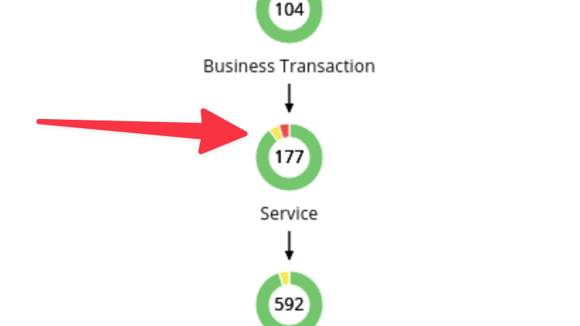

   - **red** indicates performance risk, e.g. where entities need to be moved to
     a more optimal host or scaled up because of resource congestion or
     under-provisioning.
   - **yellow** indicates efficiency opportunities, e.g. where resources can be
     reclaimed due to overprovisioning, or potentially turned off / deleted.
   - **green** indicates entities in their desired, optimal state, which is what
     we are after. Green means no recommended actions at this time.

    

   :::info

   Cost is a by-product of assuring application performance. If actions can be
   safely taken for efficiency gains without impacting application performance
   and therefore user experience, Turbonomic ARM will recommend, and if enabled
   to, take the automated actions to proactively ensure application performance
   whilst making the most efficient use of your infrastructure, resources and
   cloud budget.

   :::

1. Also on this home page, you have high level view via widgets for:

   - Top Business Applications
   - Top Business Transactions
   - Top Services
   - Pending Actions
   - Risks Avoided

   These widgets allow you to quickly assess the risk to the running
   applications in your environment. Not only can you quickly see the
   applications with the highest risk, but you can also click `Show All` to see
   the complete list of Business Applications and relevant metrics:

   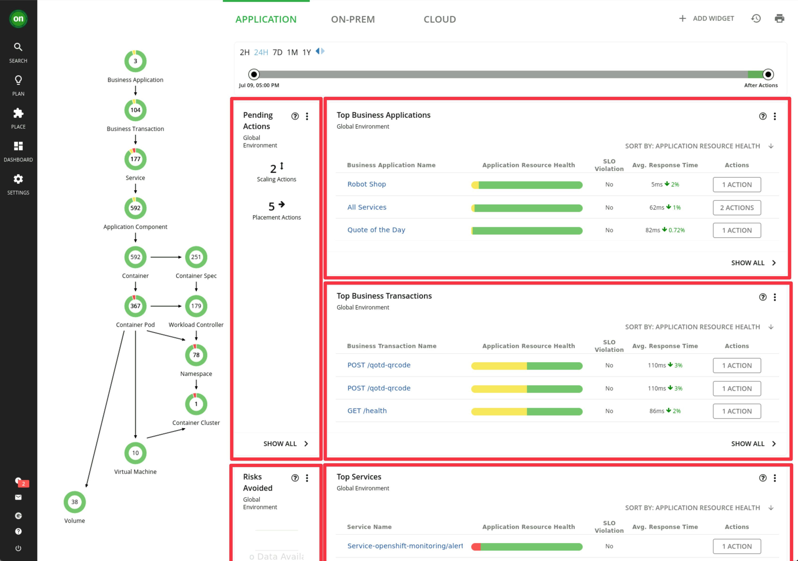

---

## 3.3: Key Terminology

Some terminology which we should be familiar with when discussing Turbonomic:

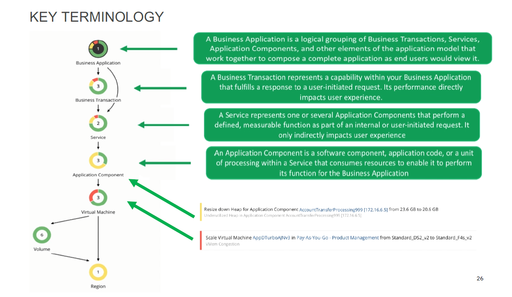

In addition to the terms defined in the diagram above, **Actions** are
recommended for _Application Components_ or underlying _Infrastructure_ and
propagated up the stack.

These actions are determined by Turbonomic ARM's patented analytics and take
into consideration all elements of the stack holistically to **ensure that the
application performance is assured at all times** when these actions are
executed.

:::info Key Takeaway

Fundamentally, that is the key point of ARM. No actions are recommended in
isolation and always have the business critical application's performance in
mind. In this way, proactive, automated steps can be taken to ensure the
applications have the resources they need, when they need them.

Ultimately, these actions can mitigate against SLO breaches, which may then
result in poor user experience and potentially SLA violations.

:::

---

## 3.4: Business Application Drill Down

1. Click on your **Robot Shop** application from the **Top Business
   Applications** widget.

   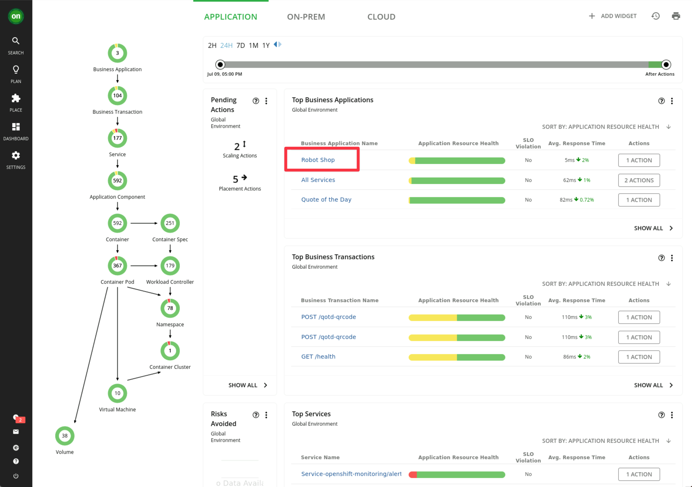

1. When you scope to this business application, note the supply chain has
   changed from showing all of the entities in the global environment to only
   the entities that are relevant to this specific application.

   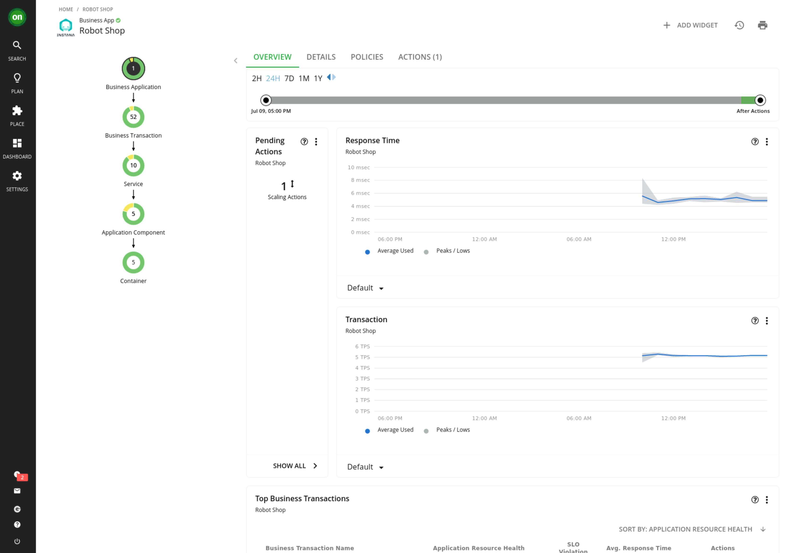

1. This business application consists of **52** business transactions, **10**
   services and **5** application components and **5** containers.

   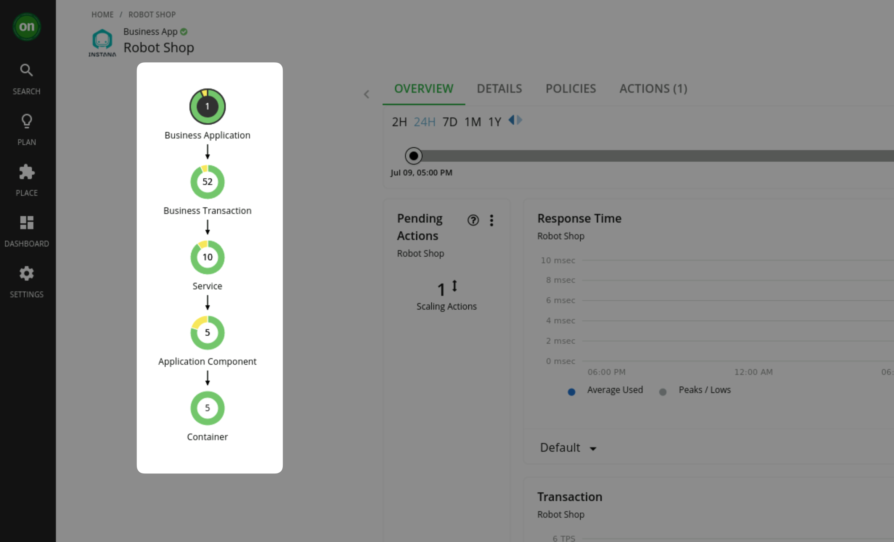

---

## 3.5: Summary

In this section, you have explored the Turbonomic UI at a high level.

Take some time and explore the UI further. When you are ready you can navigate
to the next section where you will learn to install the **Kubeturbo** agent to
be able to assure performance in a Kubernetes / OpenShift environment.

---
