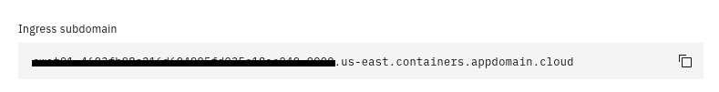

## 2.1: Overview

This module focuses on the initial deployment of the Watson for AIOps Event
Manager. This deployment scenario will assume you are deploying onto IBM Cloud
however the steps would generally apply to an OpenShift cluster deployed on
another cloud provider, or on-premises. The exception to this would be the setup
of the persistent storage needed by the Event Manager. On IBM Cloud, it is
recommended to simply use `ibmc-block-gold` for your storage class. If it is
another cloud provider, select their alternative block storage option. For
on-premises deployments, a good option would be VMware vSphere storage,
particularly if you are already a VMware shop. In any case, block storage is
recommended for performance reasons.

:::note

For more detailed notes on the topic of storage, see the documentation link:
https://www.ibm.com/docs/en/noi/1.6.5?topic=preparing-storage

:::

By the end of this module, you will have provisioned an OpenShift cluster,
prepared your cluster, installed the Cloud Pak for Watson AIOps Event Manager
Operator, and deployed an instance of Watson for AIOps Event Manager. You will
then appreciate just how convenient and easy it is to deploy and maintain the
next generation of operations management solutions from IBM.

## 2.2: Create your OpenShift cluster on IBM Cloud

:::caution

If your cluster has already been provisioned, you can skip to section 2.3.

:::

The Event Manager documentation specifies two sizes of deployment: trial and
production.

For a trial sized deployment, the recommended specification is as follows:

- 3 worker nodes
- each with 8 CPUs
- each with 24GB RAM
- each with 120GB disk

For a production deployment, the recommended specification is as follows:

- 6 worker nodes
- each with 14 CPUs
- each with 35GB RAM
- each with 120GB disk

:::tip

If your platform does not offer these exact specifications, then choose worker
node specifications that exceed these minimums.

:::

Documentation reference:
https://www.ibm.com/docs/en/noi/1.6.5?topic=preparing-sizing

As mentioned, these instructions use the IBM Cloud platform to create an
OpenShift cluster. Log into https://cloud.ibm.com and select Openshift →
Clusters from the hamburger menu in the top-left hand corner.

Next click on Create cluster and use the following to create and deploy your
cluster:

- Choose **Manual** setup with a **Classic** infrastructure.
- Leave the **Resource group** as **Default**.
- Choose the **Geography** closest to you, and choose **Single zone** for
  **Availability**.
- Choose the **Worker zone** in a city that is closest to you.
- Under **Worker pool**, click **Change flavor** and select a worker node
  configuration that matches or exceeds that listed above.
- Leave the **Worker pool name** as **default, Encrypt local disk** if you like,
  and you can leave **Master service endpoint** as **Public endpoint only**.
- Choose **OpenShift 4.8.x** or **OpenShift 4.10.x** for your **Orchestration
  service** type and version.
- Select your **OCP entitlement** from the drop-down, and modify your **Cluster
  name** if you like.
- Click **Create** to create your OpenShift cluster. Provisioning should take
  around 20 minutes or so.


## 2.3: Obtain your Entitlement key

Navigate to
[**ibm.com**](https://myibm.ibm.com/products-services/containerlibrary) to
obtain your **entitlement key** that is assigned to your IBM ID which will grant
you access to the IBM Entitled Registry. Copy this into a text editor in
preparation for the next step. This will be needed for deploying an instance of
Event Manager.

You can check your entitlement for Watson AIOPs by clicking **View Library**


:::info

If your entitlement key is not valid for Watson for AIOps Event Manager, you can
register for a 60 day trial using the following link:
[Request Watson AIOps trial](https://www.ibm.com/account/reg/us-en/login?formid=urx-51074).

:::

## 2.4: Prepare your OpenShift cluster

This step involves creating a namespace (also known as a "Project" on OpenShift)
to install the Watson for AIOps Event Manager Operator into, and setting up your
software entitlement key, so that you will be able to deploy an instance of
Event Manager.

This section involves the following tasks:

- Navigate to and open the **OpenShift UI**
- Connect to a "control" virtual machine that you can administer the cluster
  from, or install `oc` locallaly and use your own laptop
- Acquire an OpenShift login token and log in to the OpenShift cluster via the
  command line
- Create a **namespace** to deploy Event Manager into
- Create an **entitlement key secret**

During this module, you will need to log in a "control" virtual machine on which
the `oc` utility is already installed, so that you can run certain commands to
prepare the cluster. Alternatively you can download the `oc` command via the
OpenShift UI and run the commands locally on your laptop.

Open a web browser and log in to:
[https://cloud.ibm.com](https://cloud.ibm.com). In the top-right corner of the
screen, ensure that the right account is selected from the drop-down menu. Next,
click on the menu button in the top-left corner, select **OpenShift**, then
**Clusters**.

Click on your "AIops" OpenShift cluster, then click the blue **OpenShift web
console** button to open the main OpenShift UI:


If you want to install the `oc` client locally on your laptop, look on the
OpenShift UI for a button on the top-right corner of your screen with a question
mark on it (**?**). Click on it and select **Command line tools**. From here,
you can download and install the `oc` utility that corresponds to your operating
system. Windows users should use **Windows Powershell** for any terminal
sessions.

Next, we need to obtain the login command to connect to and authenticate with
the OpenShift cluster.

In the top-right corner of the OpenShift UI, click on your username, then select
**Copy Login Command**. You should get a new tab open with a link to **Display
Token**. Click on this link to reveal the cluster login command that you will
need to authenticate to the OpenShift cluster.


Copy the full **oc login** command displayed under **Log in with this token**
and save it into Notepad or a local text editor.

Go to your terminal session (either local or on a remote host) and paste the
full "oc login" command, and press Enter. This command will make a connection to
your cluster and authenticate you, so you will be ready to start preparing the
cluster by issuing various commands against it.

From your terminal session, issue the following command to create the namespace:

```sh
oc create namespace noi
```

:::info

This example uses **noi** as the name of the namespace. You can call it whatever
you like however. The rest of the tutorial commands are based on `namespace=noi`
so it's advisable to use it to avoid any errors.

:::

After you have created the namespace, switch to it using the following command:

```sh
oc project noi
```

:::info

It is important to know which project/namespace you are in when issuing `oc`
commands. All of the subsequent commands need to be run in the `noi`
project/namespace otherwise the various elements you create may not be available
to use in later steps.

:::

Prepare a command like the following, that uses your entitlement key to create a
registry secret.

```sh
oc create secret docker-registry noi-registry-secret \
--docker-username=cp \
--docker-password='<Your Entitlement Key>' \
--docker-server=cp.icr.io \
--namespace=noi
```

:::info

- You can call the secret anything you like however the suggested value is:
  **noi-registry-secret**
- The docker-username is always: **cp**
- The docker-password is your **entitlement key**, copied from ibm.com
- The docker-server should be: **cp.icr.io**
- The namespace is the one you created in the previous step - ie. **noi**

:::

You are now ready to install the Cloud Pak for Watson AIOps Event Manager
Operator, and then deploy an instance of Event Manager.

For further information on this topic, see the following documentation link:
[https://www.ibm.com/docs/en/noi/1.6.5?topic=preparing-your-cluster](https://www.ibm.com/docs/en/noi/1.6.5?topic=preparing-your-cluster)

## 2.5: Install the Cloud Pak for Watson AIOps Event Manager Operator

New OpenShift clusters are pre-configured with Red Hat software repositories
only. The next step of deploying Event Manager is to add a new software
repository to your new OpenShift cluster so that it knows where to go to get the
Event Manager software. Once the IBM software repository source has been added
to your system, you will be able to add the Event Manager Operator, which will
then pull down the Event Manager software images to the cluster, so that you can
deploy an instance of the Event Manager.

In your browser window, return to the OpenShift UI. In the top-right corner,
near your user ID, click on the plus icon (**+**). This will take you to a
"Import YAML" page.

Paste the following code block into the black box, and click **Create**:

```sh
apiVersion: operators.coreos.com/v1alpha1
kind: CatalogSource
metadata:
  name: ibm-operator-catalog
  namespace: openshift-marketplace
spec:
  displayName: ibm-operator-catalog
  publisher: IBM Content
  sourceType: grpc
  image: icr.io/cpopen/ibm-operator-catalog:latest
  updateStrategy:
    registryPoll:
      interval: 45m
```

:::caution

It is essential to ensure the indentation is correctly copied over.

:::

On the main left menu, navigate to **Administration > Cluster Settings**. Under
**Configuration > OperatorHub > Sources**, verify that the
`ibm-operator-catalog` CatalogSource object is present.

:::note

It can take a few minutes to pull down the entire catalogue list, but you should
end up with around 221 in the **# of Operators** column and show a READY status.

:::

Next, navigate to: **Operators > Operator Hub** and search for **Event
Manager**.

Click on **IBM Cloud Pak for Watson AIOps Event Manager** and then **Install**.

Use the following options:

- **Update channel**: choose the latest: **v1.9**
- **Installation mode**: select **A specific namespace on the cluster** and
  select your previously created namespace - ie. **noi**
- Leave **Update approval** set to **Automatic**
- Click **Install**

Installation of the Operator should take a few minutes, as it pulls down the
installation packages from the IBM software repository.

Navigate to: **Operators > Installed Operators** and you will be able to monitor
the progress of the Operator installation. When it has finished, it will look
like this:


:::note

Ensure your namespace, also referred to as **Project**, is selected from the top
drop-down menu - ie. **noi**

:::

The Cloud Pak for Watson AIOps Event Manager Operator is now installed and ready
for use.

For further information on this topic, see the following documentation link:
[https://www.ibm.com/docs/en/noi/1.6.5?topic=installing-olm-ui](https://www.ibm.com/docs/en/noi/1.6.5?topic=installing-olm-ui)

## 2.6: Deploy an instance of Watson for AIOps Event Manager

This final step of deployment involves deploying a running instance of Event
Manager onto the OpenShift cluster.

Before deploying an instance of Event Manager, you will need to know your
cluster's **Ingress subdomain**. To obtain this, return to your IBM Cloud
browser tab where you have the "AIops" cluster details open, and scroll down to
the **Networking** section. You will see a box labelled **Ingress subdomain**
that contains the domain value for your cluster:



Copy and paste this value into a text editor for use during the instance
deployment.

:::info

During the Event Manager deployment, you will be asked for your OpenShift
**Cluster Domain (FQDN)** as part of the configuration. You should use this
value you just copied from the **Ingress subdomain** box for this entry. Do not
prepend the value with `apps.` for instance, or modify it in any way; just use
it as-is.

:::

Navigate to: **Operators > Installed Operators** and click on **IBM Cloud Pak
for Watson AIOps Event Manager**.

Click on the **NOI** tab and click the button **Create NOI**. You will be
prompted to enter the configuration settings for your new instance of Event
Manager.

:::tip

NOI stands for **Netcool Operations Insight** and is the same thing as **Watson
for AIOps Event Manager** in this context.

:::

Use the following to guide you through the various configuration settings. Where
there is no note about any parameter given, you can leave it as its default
setting:

- Use the default value of `evtmanager` for the **Name**
- Choose **noi-registry-secret** for your **Entitlement Secret** (this is the
  one you created in step 2.4)
- Click on **License** and set License accept to **true**
- Ensure **Version** is set to the latest value
- Under **Cluster Domain (FQDN)**, enter the **Ingress subdomain** value you
  copied earlier
- Under **Deployment Type**, choose **trial**
- Click on **LDAP** and select **ibmc-block-gold** for the Storage Class
- Click on **Persistence** and set Persistence Enabled to **true** and select
  **ibmc-block-gold** for each **StorageClass** prompt
- Click on **Topology** and and select **ibmc-block-gold** for both StorageClass
  prompts
- Review the list of Topology Observers available - we just need the File
  Observer for these labs so you can leave the defaults
- Click on **Create** to begin deploying your Event Manager instance

:::danger

It is essential that you take your time entering all these values and checking
they are correct before clicking OK. If you make an error, you will likely have
to remove the instance and its associated persistent volume claims and start
again. Therefore it is worth taking the time to review the whole list of
settings before you create your instance.

:::

The deployment of your instance will normally take about 20 to 30 minutes. You
can monitor the deployment's progress both from Installed Operators page as well
as from: **Workloads > Pods** page. Ensure that the Project drop-down menu at
the top of the page is set to your namespace ("noi"). Once all the pods have
deployed and are showing with a Status of Running and 1/1 or 2/2, you will know
that your deployment has completed. You can sort your pods by "Ready" status,
and filter on all pods except for "Completed" jobs to monitor the deployment
progess.

:::tip

Don't worry if you see some pods report an error state during the course of the
deployment. This is simply because many pods are dependent on others, and so
complain if they come up before those others. The system will simply retry to
deploy these pods over and over, and so eventually everything will deploy and
come up in the end.

:::

This can also be confirmed by returning to the Installed Operators page and
seeing: **Phase: OK** next to your deployment:


Congratulations! You have successfully deployed an OpenShift cluster, installed
the Watson for AIOps Event Manager Operator, and deployed an instance of the
Event Manager.

## 2.7: Locate your login details and log in to Watson for AIOps Event Manager

Next you are going to locate your login credentials from your newly deployed
instance of Watson for AIOps Event Manager and log in to the console.

Return to the OpenShift UI in your web browser and navigate to: **Workloads >
Secrets**

In the search bar, type **icpadmin** and click on the secret labelled:
**evtmanager-icpadmin-secret**

:::tip

The name of the secret is based on the name of your NOI deployment. If you have
kept the default of **evtmanager**, it will be labelled per the above.

:::

Click on the secret, and scroll to the bottom of the page to the **Data**
section, and you will see a data item called: **ICP_ADMIN_PASSWORD**. On the
right-hand side of the page, click on **Reveal values**. This will cause the
password to be made visible. Copy this and save it in a local text file on your
laptop for later use. This is the password to your Watson for AIOps Event
Manager. Note that the username is: **icpadmin**

The access URL for your Event Manager instance is in the format:

`https://netcool-<deployment-name>.<ingress-subdomain>`

> `<deployment-name>` is the instance name when you create NOI instance in the
> step 2.6, default name is `evtmanager` if you didn't change it.

For example:

`https://netcool-evtmanager.tech-jam-dal12-08-manage-d8e5ccad3849ed39158bb0b911cc2b44-0000.us-south.containers.appdomain.cloud`

To get access URL for your Event Manager instance via command line:

```sh
export EVTMGR_NAMESPACE=noi
echo "
URL: https://$(oc get route -n $EVTMGR_NAMESPACE  evtmanager-ibm-hdm-common-ui -o jsonpath={.spec.host})
User: icpadmin
Pass: $(oc -n ${EVTMGR_NAMESPACE} get secret evtmanager-icpadmin-secret -o jsonpath='{.data.ICP_ADMIN_PASSWORD}' | base64 --decode)
"
```

Or to get the access URL for your Event Manager instance via UI:

Go to your OpenShift UI and navigate to `Networking -> Routes`, select `noi`
project and search for `evtmanager-ibm-hdm-common-ui`. Click on the `Location`
link to open up the Event Manager:


Go to your Event Manager login page and log in as **icpadmin**, using the
password you just obtained from the secret above.

By default, the **icpadmin** user does not have the full list of roles assigned
to it to operate Event Manager capabilities. It is necessary to assign all
administrative roles to the icpadmin user before continuing to the next module.

Use the following steps to set this up:

- Return to the Event Manager UI main screen in your web browser
- Click on the menu button in the top-left corner of the screen, and select
  **Netcool WebGUI** from the drop-down menu
- A new tab will open with the Netcool/WebGUI UI displayed
- Click on the cog wheel in the top-right hand corner of the screen, and select
  **User Roles** from the drop-down menu


- Click on the **Search** button to bring up all users (this instigates an
  unfiltered user search)
- From the list of returned users, click on **icpadmin**
- Check all available **Roles** in the list, then scroll to the bottom of the
  page, and click **Save**


Once granted:


- Close the Netcool/WebGUI browser tab, then log out of the Event Manager UI,
  and log back in again (as **icpadmin**)
- Click on the left menu again and you will now see the full list of menu items

You have now completed this module and are ready for module "Connect an
on-premises Probe to Watson for AIOps Event Manager"

[Reference Blog](https://community.ibm.com/community/user/aiops/blogs/zane-bray1/2022/04/01/getting-started-with-watson-aiops-event-manager-17)
