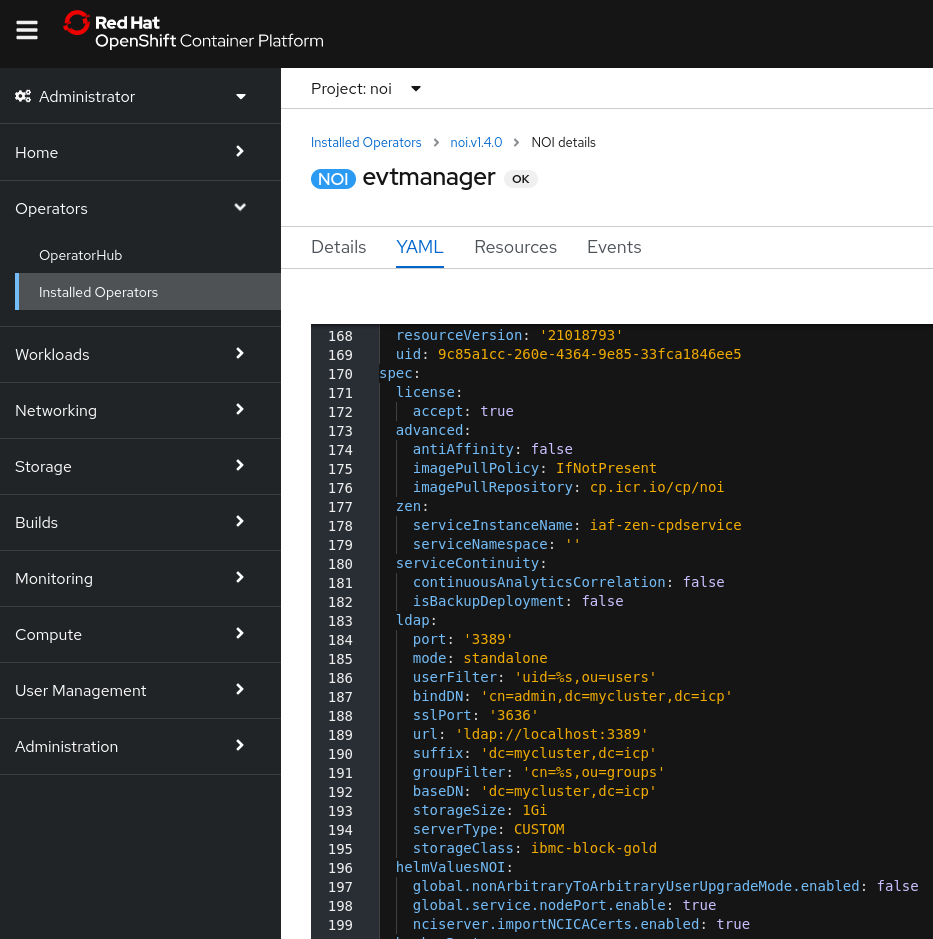

## 3.1: Overview

This module focuses on configuring and connecting an on-premises Netcool/Probe
to the Event Manager. In most scenarios, there will be an existing on-premises
Netcool deployment present, or there will be a need to deploy some Netcool
Probes, and so there will be a need to connect the on-premises components to the
Event Manager system running on OpenShift. Typically this will involve
connecting Probes or uni-directional ObjectServer Gateways into the Event
Manager, to provide a source of events.

:::note

This module uses on-premises OMNIbus Probe that you will connect to your Event
Manager system.

:::

:::info

For the SWAT tech jams, Netcool/OMNIbus is pre-installed on a virtual machine
(`pi-template`) in your environment which includes a Simnet Probe.
Netcool/OMNIbus (`$NCHOME`) is installed in the following location:
`/home/scadmin/IBM/tivoli/netcool` You can connect to this virtual machine using
`ssh pi-template` from your control node.

:::

This deployment scenario will assume you are deploying onto IBM Cloud however
the steps would generally apply to an OpenShift cluster deployed on another
cloud provider or on-premises.

By the end of this module, you will have enabled the ObjectServer NodePorts on
your cluster, configured your on-premises Netcool/OMNIbus system to connect to
the ObjectServer embedded within Event Manager, and connected a Probe.

## 3.2: Enable the NodePorts

Behind the scenes, the event stores in Watson for AIOps Event Manager are
Netcool/OMNIbus ObjectServers. These are running in containers and are not
accessible outside the cluster by default. This first step therefore involves
modifying your Event Manager deployment to activate the NodePorts so that the
ObjectServers can be accessed from outside the cluster.

Log in to your OpenShift UI and navigate to: **Operators > Installed Operators >
IBM Cloud Pak for Watson AIOps Event Manager > NOI**.

Next, click on your deployment - for example: **evtmanager** - and then click on
the **YAML** tab.

Add a new sub-section to the **spec**: section in your configuration with the
following text:

:::caution

Spacing and indentation is important.

:::

```sh
  helmValuesNOI:
    global.service.nodePort.enable: true
```

After you have added this sub-section and clicked Save, the resulting
configuration should look something like the following:



:::info

In this screenshot, other properties have also been added. The key added lines
are only lines **196** and **198**.

:::

After you have saved the configuration, OpenShift will detect the change, and
redeploy the relevant services.

:::note

For more information on this step, see the following documentation link:
[https://www.ibm.com/docs/en/noi/1.6.5?topic=service-identifying-proxy-listening-port](https://www.ibm.com/docs/en/noi/1.6.5?topic=service-identifying-proxy-listening-port)

:::

## 3.3: Gather the cluster connection information

This step involves compiling information about the cluster's certificate common
name (CN) and downloading the cluster certificate so that it can be imported
into the Probe server's trusted key store.

### 3.3.1 Find the IP address of the clusters Ingress subdomain

In the previous module 2-6, you identified the **Ingress subdomain** from the
IBM Cloud UI. Execute following command from your terminal session. Ping the
Ingress subdomain to find the **IP address** to use to communicate with the
cluster:

```sh

ping swat01-4693fb98e216XXXXXXXXXXX-0000.us-east.containers.appdomain.cloud

PING swat01-4693fb98e21XXXXXXXXXXXXx-0000.us-east.containers.appdomain.cloud (5X.XXX.XX.XXX) 56(84) bytes of data.
64 bytes from evtmanager-proxy.noi.svc (10.20.30.40): icmp_seq=1 ttl=46 time=89.2 ms
^C
--- swat01-4693fb98e216d6XXXXXXXXXXXXXX-0000.us-east.containers.appdomain.cloud ping statistics ---
2 packets transmitted, 2 received, 0% packet loss, time 1001ms
rtt min/avg/max/mdev = 89.216/93.100/96.985/3.896 ms
```

:::info

In this example, we would use the example IP address: 10.20.30.40 (from the
above output) to communicate with the cluster. You will need to use the IP
address returned by your ping.

:::

### 3.3.2 Find the NodePorts for proxy server

Next, log in to the OpenShift cluster via the terminal session (using
`oc login`), as you did in the previous module. To check that the NodePorts have
been successfully deployed, you can query the Proxy Service, and check its
output for the NodePort values:

```sh
oc get service -o yaml evtmanager-proxy -n noi | grep nodePort
```

The output will look something like:

```console
nodePort: 30846
nodePort: 31746
```

From the output above, you can see that the NodePorts have been deployed on
ports **30846** for the primary ObjectServer and **31846** for the backup. These
are the port numbers that are externally accessible to the cluster and are what
your Netcool Probe (or in-bound Netcool Gateway) will use to connect.

### 3.3.3 Extract the Openshift cluster certificate

Use the `openssl` command to retrieve the x.509 certificate that is returned by
the proxy and verify the certificate common name (CN). To do this, you again
need to use the Ingress subdomain value in conjunction with the NodePort value
you discovered in Step 1 - for example:

```bash
openssl s_client -showcerts -connect swat01-469XXXXXXXXXXXXXXXXXXXXXXXXXc049-0000.us-east.containers.appdomain.cloud:<NodePort>
```

```txt title="Example return:"
CONNECTED(00000003) depth=1 CN = openshift-service-serving-signer@1645115959
verify return:1 depth=1 CN = openshift-service-serving-signer@1645115959 verify
return:1 depth=0 CN = evtmanager-proxy.noi.svc verify return:1 Certificate chain
0 s:CN = evtmanager-proxy.noi.svc ...
```

Here you can see the proxy service name **evtmanager-proxy.noi.svc** being used
by the server at depth=0 is associated with the certificate, and that it matches
the hostname returned by the ping command earlier. This is important because the
hostname we use to connect to the cluster must match that referred to in the
certificate in order for the SSL connection to work correctly.

Finally, download the certificate from the cluster using the `oc` utility:

```sh
oc get secrets/signing-key -n openshift-service-ca -o template='{{index .data "tls.crt"}}' | base64 --decode > cluster-ca-cert.pem
```

Copy this file (cluster-ca-cert.pem) to the server where your Netcool/Probe is
installed in preparation for the next step.

```sh
scp cluster-ca-cert.pem jammer@pi-template:/tmp/
```

:::info

For more information on this step, see the following documentation link:
[https://www.ibm.com/docs/en/noi/1.6.5?topic=service-configuring-tls-encryption-red-hat-openshift](https://www.ibm.com/docs/en/noi/1.6.5?topic=service-configuring-tls-encryption-red-hat-openshift)

:::

## 3.4: Configure the Probe to connect to the cluster

Now that we have the proxy service hostname, the NodePort of the primary
ObjectServer, and the cluster's certificate, we are ready to configure the
on-premises Netcool/OMNIbus Probe to connect to the Event Manager running in
OCP.

### 3.4.1 Log in to the Netcool/OMNIbus Probe server

:::tip

Log in from the Control Node

:::

```sh
ssh pi-template
```

### 3.4.2 Update the /etc/hosts file

Add an entry to the `/etc/hosts` file with the cluster IP address and the proxy
service hostname obtained previously.

```sh
sudo vi /etc/hosts
```

Append following entry:

:::tip

You got the cluster IP in step 3.3.1

:::

```bash
<cluster IP> evtmanager-proxy.noi.svc
```

```bash title="For example:"
10.20.30.40 evtmanager-proxy.noi.svc
```

This is the hostname (evtmanager-proxy.noi.svc) that we are going to use in the
`omni.dat` interfaces file shortly.

### 3.4.3 Update the interfaces file

:::info

Switch to user scadmin to perform the following tasks.

:::

Edit the interfaces file located in `$NCHOME/etc/omni.dat` and add the
following:

```sh
sudo su - scadmin
export NCHOME=/home/scadmin/IBM/tivoli/netcool
vi $NCHOME/etc/omni.dat
```

Add the following entry to the end of the file:

```sh
[ROKS_AGG_P]
{
 Primary: evtmanager-proxy.noi.svc ssl <NodePort from section 3.3 (b)>
}
```

:::note

The entry contains the string ssl which indicates that an encrypted connection
should be used.

:::

### 3.4.3 Generate the interface file

Run `nco_igen`` to update the interfaces file information:

```sh
$NCHOME/bin/nco_igen
```

### 3.4.4 Create a keystore for the cluster certificate

If you haven't already created one previously, create a keystore on your Probe
server to import the certificate into:

```sh
export NCHOME=/home/scadmin/IBM/tivoli/netcool
$NCHOME/bin/nc_gskcmd -keydb -create -db "$NCHOME/etc/security/keys/omni.kdb" -pw password -stash -expire 1000
```

### 3.4.5 Import the certificate

Copy the certificate you downloaded in Step 3.3.3 to the Probe server, and
import it into your newly created keystore

```sh
$NCHOME/bin/nc_gskcmd -cert -add -file /tmp/cluster-ca-cert.pem -db $NCHOME/etc/security/keys/omni.kdb -stashed
```

### 3.4.6 Test the connection to the ObjectServer

Use the nco_ping utility to test the connection the ObjectServer\*\*

```sh
$NCHOME/omnibus/bin/nco_ping ROKS_AGG_P
```

```txt title="Example output:"
Output: `NCO_PING: Server available.`
```

You are now ready to connect your Probe.

:::info

For more information on this step, see the following documentation link:
[https://www.ibm.com/docs/en/noi/1.6.5?topic=service-configuring-tls-encryption-red-hat-openshift](https://www.ibm.com/docs/en/noi/1.6.5?topic=service-configuring-tls-encryption-red-hat-openshift)

:::

## 3.5: Start the Simnet Probe

The final step is to start the Probe and connect it to the primary ObjectServer
running in OpenShift.

Using the Simnet Probe as an example, run the Probe in debug mode to ensure that
the Probe can connect to the ObjectServer:

```sh
export OMNIHOME=/home/scadmin/IBM/tivoli/netcool/omnibus
$OMNIHOME/probes/nco_p_simnet -server ROKS_AGG_P -messagelevel debug -messagelog stdout
```

You can check events in Event Viewer sent via the Simnet Probe.

:::info

After verifying a successful connection to the ObjectServer, you can run the
Probe outside of debug mode, normally under Process Agent control.

[Reference Blog](https://community.ibm.com/community/user/aiops/blogs/zane-bray1/2022/04/13/getting-started-with-watson-aiops-event-manager-27)

:::
