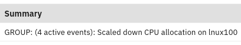

## 8.1: Overview

This module looks at grouping automation options that can be configured via
modifying properties in the ObjectServer table: **master.cea_properties**. We
will focus on the properties that are typically most useful to enable of modify.
This module also covers a few other final configuration points to consider when
setting up a new environment, including installing housekeeping automations,
setting up a few additional Filters and Views, and a couple of optional
ObjectServer trigger modifications.

By the end of this module, you will have reviewed and possibly modified some of
the grouping automation options, reviewed and installed housekeeping
automations, created Filters and Views, and optionally made a couple of
ObjectServer trigger modifications.

## 8.2: Review and modify grouping automation properties

The ObjectServer is the name for the event database embedded within Watson for
AIOps Event Manager that receives and stores events. It also provides
trigger-based automation to enable additional capabilities, as well as to
facilitate the implementation of custom automation. Part of the event grouping
capabilities provided by Event Manager are implemented as triggers. There is a
table in the ObjectServer called **master.cea_properties** that contains a
number of user-modifiable properties that tweak the behaviours of the event
grouping automation. This section highlights key ones that you may likely want
to modify.

The **master.cea_properties** table has three main fields: **Name**,
**IntValue**, and **CharValue**. Some of the properties refer to textual labels
whereas most of them are either a boolean value (ie. 0 or 1) or are a numeric
value. In the former case, the property will make use of the `CharValue` field,
and in the latter case, the property will make use of the `IntValue` field.

The following properties should be reviewed and considered for modification, if
desired.

**CEACKeyPrefix**

This property specifies the prefix to be prepended to the Summary field of
synthetic parent events. This property is of type CharValue and has a default
value of "GROUP", which causes synthetic parent events to look like this in the
Alerts view:

Default look like this: 

After Modifying this setting: 

To modify this setting in `master.cae_properties`, use the following command to
log in into the `evtmanager-ncoprimary` pod:

```sh
oc exec -it evtmanager-ncoprimary-0 bash
```

Next log in into Objectserver via the `nco_sql` utility:

```sh
/opt/IBM/tivoli/netcool/omnibus/bin/nco_sql -server AGG_P -user root -passwd $OMNIBUS_ROOT_PWD
```

Finally, execute the following SQL commands to update: **CEACKeyPrefix**

```sh
update master.cea_properties set CharValue = 'INCIDENT' where Name = 'CEACKeyPrefix';
go
```

**CEAUseNodeForCKeyParent**

By default, all synthetic parent events will use a unique group identifier in
its Node field. By enabling this property, the system will use the Node value of
the first received event into the group instead, for the Node field of the
synthetic parent.

The default looks like this: 

After enabling this setting: 

To modify this setting in `master.cae_properties`, use the following command to
log in into the `evtmanager-ncoprimary` pod:

```sh
oc exec -it evtmanager-ncoprimary-0 bash
```

Next log in into Objectserver via the `nco_sql` utility:

```sh
/opt/IBM/tivoli/netcool/omnibus/bin/nco_sql -server AGG_P -user root -passwd $OMNIBUS_ROOT_PWD
```

Finally, execute the following SQL commands to update:
**CEAUseNodeForCKeyParent**

```sh
update master.cea_properties set IntValue = 1 where Name = 'CEAUseNodeForCKeyParent';
go
```

**CEAUseCKeyCustomText**

By default, the Summary field of the synthetic parent event follows the format:

`<CEACKeyPrefix>: (N active events) <Summary-of-probable-cause-event>`

It is possible to append custom text to the end of this Summary string by first
populating the `CustomText field` of the synthetic parent event and then
enabling this property. By default it is disabled.

To modify this setting in `master.cae_properties`, use the following command to
log in into the `evtmanager-ncoprimary` pod:

```sh
oc exec -it evtmanager-ncoprimary-0 bash
```

Next log in into Objectserver via the `nco_sql` utility:

```sh
/opt/IBM/tivoli/netcool/omnibus/bin/nco_sql -server AGG_P -user root -passwd $OMNIBUS_ROOT_PWD
```

Finally, execute the following SQL commands to update: **CEAUseCKeyCustomText**

```sh
update master.cea_properties set IntValue = 1 where Name = 'CEAUseCKeyCustomText';
go

```

:::note

If the `CustomText` field value is blank, then enabling this field will visibly
have no effect.

:::

**CEAJournalToCKeyParent**

This property controls whether or child events are written to the journal of the
synthetic parent event. Enabling this property is very useful to capture the
events that pass through a group. This is important for forensic purposes, due
to the transient nature of events. It also means an accurate record is captured
for ticketing purposes. By default, all Netcool ticketing Gateways propagate
journals automatically to the associated ticket, hence enabling this property is
typically very useful indeed.

When enabled, the journal (or "Timeline") of the synthetic parent event will
look something like the following:


This property is of type IntValue and has a default value of 0 (ie. disabled).
It is disabled out-of-the-box because, although most likely this feature is
desirable, it does consume resources to store this additional meta data, hence
it must be enabled by the user.

To modify this setting in `master.cae_properties`, use the following command to
log in into the `evtmanager-ncoprimary` pod:

```sh
oc exec -it evtmanager-ncoprimary-0 bash
```

Next log in into Objectserver via the `nco_sql` utility:

```sh
/opt/IBM/tivoli/netcool/omnibus/bin/nco_sql -server AGG_P -user root -passwd $OMNIBUS_ROOT_PWD
```

Finally, execute the following SQL commands to update:
**CEAJournalToCKeyParent**

```sh
update master.cea_properties set IntValue = 1 where Name = 'CEAJournalToCKeyParent';
go

```

- **CEAJournalServerNameServerSerial**
- **CEAJournalNode**
- **CEAJournalAlertKey**
- **CEAJournalSummary**
- **CEAJournalCustomText**

When journalling to the synthetic parent event is enabled, the following
properties govern which of the default fields that are included for each
journalled child event. By default, the **ServerSerial**, **ServerName**,
**Node**, **AlertKey**, **Summary**, and **CustomText** fields are all included
for each child event. These can be disabled as desired per the following
example:

To modify this setting in `master.cae_properties`, use the following command to
log in into the `evtmanager-ncoprimary` pod:

```sh
oc exec -it evtmanager-ncoprimary-0 bash
```

Next log in into Objectserver via the `nco_sql` utility:

```sh
/opt/IBM/tivoli/netcool/omnibus/bin/nco_sql -server AGG_P -user root -passwd $OMNIBUS_ROOT_PWD
```

Finally, execute the following SQL commands to update the journal related
properties:

```sh
update master.cea_properties set IntValue = 0 where Name = 'CEAJournalServerNameServerSerial';
update master.cea_properties set IntValue = 0 where Name = 'CEAJournalNode';
update master.cea_properties set IntValue = 0 where Name = 'CEAJournalAlertKey';
update master.cea_properties set IntValue = 0 where Name = 'CEAJournalSummary';
update master.cea_properties set IntValue = 0 where Name = 'CEAJournalCustomText';
go

```

:::note

The `CustomText` field is empty by default and can be populated with any custom
content that needs to be included - for example from custom fields - using a
custom ObjectServer trigger.

:::

**CEAJournalMaxEventsPerEntry**

For efficiency, the Event Manager rolls multiple child events up into each
journal entry, rather than creating a journal entry for each event. Each journal
entry can hold a maximum of 4080 characters so care must be taken not to roll
too many events up into a single journal entry, to avoid truncation happening.
This property controls how many child events are rolled up into each journal
entry and is set to 20 by default. This means the details from up to 20 events
will be potentially added to each journal entry. For example, if 30 events need
to be journalled to a synthetic parent event in a single cycle, it will split
those across two journal entries therefore: 20 in one, and 10 in another.

This property may need to be tweaked, for example, if a large amount of
information is to be included from the `CustomText` field. You may find that you
need to reduce the number of events per journal entry to 10, for instance, where
you are including significant amounts of additional `CustomText` content.
Testing in a test environment will help you to optimise the value of this
setting, to both maximise the number of events per entry, while avoiding
truncation of entries at the same time.

To modify this setting in `master.cae_properties`, use the following command to
log in into the `evtmanager-ncoprimary` pod:

```sh
oc exec -it evtmanager-ncoprimary-0 bash
```

Next log in into Objectserver via the `nco_sql` utility:

```sh
/opt/IBM/tivoli/netcool/omnibus/bin/nco_sql -server AGG_P -user root -passwd $OMNIBUS_ROOT_PWD
```

Finally, execute the following SQL commands to update:
**CEAJournalMaxEventsPerEntry**

```sh
update master.cea_properties set IntValue = 10 where Name = 'CEAJournalMaxEventsPerEntry';
go
```

**CEAMaxCKeyJournals**

This property specifies the maximum number of child events to journal to each
synthetic parent event, and has a default value of 50. This property is
important to prevent potentially vast number of journal entries from being
created. Also, very often the probable cause events are going to be received
within the first 50 or so anyway, so the rest would simply be symptomatic, which
would not necessarily be very helpful in the context of a ticket. It may be that
the organisation decides that they would like to have more or fewer events
journalled for each group of events, for a variety of reasons.

To modify this setting in `master.cae_properties`, use the following command to
log in into the `evtmanager-ncoprimary` pod:

```sh
oc exec -it evtmanager-ncoprimary-0 bash
```

Next log in into Objectserver via the `nco_sql` utility:

```sh
/opt/IBM/tivoli/netcool/omnibus/bin/nco_sql -server AGG_P -user root -passwd $OMNIBUS_ROOT_PWD
```

Finally, execute the following SQL commands to update: **CEAMaxCKeyJournals**

```sh
update master.cea_properties set IntValue = 75 where Name = 'CEAMaxCKeyJournals';
go
```

For reference, the grouping configuration properties are documented here:

https://www.ibm.com/docs/en/noi/1.6.5?topic=analytics-configure-grouping-cloud-hybrid-deployments

## 8.3: Review, configure, and import event housekeeping automations

In an environment that is being used for a Proof-Of-Concept, it is likely there
will be a significant event flow into the Event Manager. For this reason, it is
important to consider housekeeping automations to keep the overall event numbers
under control. In this exercise, we will review, configure, and deploy a
housekeeping automation to do this.

The housekeeping automations that ship with Netcool/OMNIbus can be found in the
following directory location in the `evtmanager-ncoprimary` pod:

`/opt/IBM/tivoli/netcool/omnibus/extensions/housekeeping/`

Use the following command to log in into the `evtmanager-ncoprimary` pod:

```sh
oc exec -it evtmanager-ncoprimary-0 bash
cd /opt/IBM/tivoli/netcool/omnibus/extensions/housekeeping/
vim expiretime.sql
```

In this exercise, we will configure and deploy the event expiry housekeeping
automation. This automation will set **ExpireTime** for all events where it is
not already set, except for parent events. The `ExpireTime` field is essentially
a time-to-live (defined in seconds) and is used by the default expire automation
to clear the events once they reach their expiry time. Events that have a zero
value (ie. are unset) never expire, hence the need for such a housekeeping
automation.

The event expire automation also generates a synthetic self-monitoring event
into the ObjectServer, which can be viewed under the Database Table Usage bucket
of the Netcool Health dashboard, giving a summary of how many events it has set
`ExpireTime` for in the last cycle.

After opening the `expiretime.sql` file with `vim`, make the following changes:

- Change the **ENABLED** status of the **housekeeping_trigger** group to
  **TRUE**
- Change the **ENABLED** status of the **hk_set_expiretime** trigger to **TRUE**
- Add the following code of the **hk_set_expiretime** trigger as follows :

```sh
for each row unexpired in alerts.status where
    unexpired.ExpireTime = 0 and
    unexpired.Severity != 0 and
    unexpired.AlertGroup not in ('SiteNameParent', 'ScopeIDParent', 'Synthetic Event - Parent', 'CEACorrelationKeyParent')
  begin
```

These changes enable the trigger and its group for use, and excludes the Event
Manager parent events from consideration.

Save your changes, and then apply the modified **expiretime.sql** file contents
into your ObjectServer via the **nco_sql** utility.

To apply this trigger group and trigger to your system, log in into the
`evtmanager-ncoprimary` pod:

```sh
oc exec -it evtmanager-ncoprimary-0 bash
```

```sh
/opt/IBM/tivoli/netcool/omnibus/bin/nco_sql -server AGG_P -user root -passwd $OMNIBUS_ROOT_PWD  < /opt/IBM/tivoli/netcool/omnibus/extensions/housekeeping/expiretime.sql
```

You can verify that your automation is active by refreshing your **Alert** view,
selecting a non-parent event, clicking on the **Information** tab, and scrolling
down and verifying that the **ExpireTime** field is set to a non-zero value.

:::note

You can uninstall this automation by importing the **expiretime_remove.sql** SQL
file into your system in the same way.

:::

Further details of this and other out-of-the-box housekeeping automations can be
found in the documentation:

https://www.ibm.com/docs/en/netcoolomnibus/8.1?topic=netcoolomnibus-automating-housekeeping-tasks

## 8.4: Create new Filters and Views

One of the key value capabilities in Event Manager is its ability to perform
extensive event grouping. In order to better visualise the groupings that are
occurring, it is helpful to create a number of additional filters to show this.
It is also useful to modify the views to show additional fields that will come
in useful in the course of a POC or evaluation. In this exercise, we will create
two new Filters and amend the default View.

**CREATE A CHILDREN FILTER**

This filter will allow you to see all child events individually, without the
groupings being visible. This will give you a sense of the scale to which event
grouping is helping you better visualise the events. You can then calculate the
scale of the event reduction by comparing the number of groups versus the number
of grouped events that would be individuals, if event grouping was not enabled.

To create a new Filter, log in to the Event Manager console, navigate to the
**Alerts** view, and click on the **Edit filters** button.

Create a new Filter:

- Click on the **New Filter** button
- Make it globally available
- Name it: **Children**
- Set the **Default view** to: **Example_IBM_CloudAnalytics**
- Under **Filter Conditions**, click **Basic**
- Select from the **Field** drop-down menu: **ParentIdentifier**
- Select from the **Comparator** drop-down menu: **!=**
- Enter the following value into the **Value** box: **''**
- Click **Save and Close** to save your new Filter

:::caution Note

The Value box should contain two single quotes.

:::

**CREATE A GROUPS FILTER**

This filter will allow you to see all groups being created by the system,
without all the individual events clogging your view.

Create a new filter:

- Click on the **New Filter** button
- Make it globally available
- Name it: **Groups**
- Set the Default view to: **Example_IBM_CloudAnalytics**
- Under **Filter Conditions**, click **Advanced**
- Copy and past the following into the **SQL Where Clause** box:

```sh
AlertGroup = 'CEACorrelationKeyParent' or ParentIdentifier in (select Identifier from alerts.status where AlertGroup = 'CEACorrelationKeyParent')
```

- Click **Save and Close** to save your new Filter

This filter says to include parent events (ie. ones where the **AlertGroup** is
set to `'CEACorrelationKeyParent'`) or events where the **ParentIdentifier**
field is linked to a parent event via the **Identifier** field of the parent.

Click **Save and Close** to save your new filter

**AMEND YOUR VIEW TO INCLUDE TTNumber**

The final step is to amend the default View to include the **TTNumber** field.
This field is used by default by the Netcool ticketing Gateways to store ticket
numbers from the target systems. It is also used in the event grouping
automations in the propagation of ticket numbers from parent events down to
children. In anticipation of setting up such an integration therefore, it is
useful to add this field to the View.

To modify your View, log in to the Event Manager console, navigate to the
**Alerts** view, and click on the **Edit views** button.

- Select the **Example_IBM_CloudAnalytics** View from the **System Views**
- Select **TTNumber** from the **Available fields** and add it to the **Event
  list view**
- Move it up in the list of fields so it is positioned just above the **Node**
  field
- Change the **Column width** to 8 so it doesn't take up too much room in your
  Alerts view
- Click **Save and Close** to save your View


## 8.5: Review and import optional trigger automations

This final section covers the addition of two optional changes to the
ObjectServer. The first tweaks the behaviour of the generic clear automation and
the second addresses a journalling point-of-note for when super-grouping occurs.

**MODIFY GENERIC CLEAR**

The generic clear automation has been around since the foundations of
Netcool/OMNIbus more than two decades ago. It is a simple but effective
automation that automatically correlates problem events to resolution events and
many of the Probes use this mechanism to achieve this. The logic in the generic
clear will match a resolution event (Type = 2) to one or more problem events
(Type = 1) where the following are true:

- The Node field matches
- The AlertKey matches
- The AlertGroup matches
- The Manager matches
- The resolution event's timestamp is after the problem event's timestamp

There are many cases however where resolution events occur within the same
one-second window as the problem event. An example is where a Probe has gone
down but immediately been restarted by the Netcool Process Agent. In this case,
you will likely have a critical problem alert informing that the Probe has
disconnected, and a resolution event to say that the Probe has reconnected, both
with the same timestamp. In this scenario therefore, the resolution event will
not be matched to the problem event. In the course of processing, the resolution
event will get cleared and deleted, meanwhile the problem event will remain.

The remedy to this is to tweak the code of the generic clear (line 24 below) so
that instead of the **LastOccurrence** of the resolution event being
greater-than (ie. after) the problem event's LastOccurrence, it is changed to
be: greater-than-or-equal-to (ie. at the same time or after). This change means
that any problem and resolution events that happen to occur within the same
one-second window will still be correlated.

:::info

It is also possible that in fact a resolution event is received, followed by a
fresh problem event, but both in the same one-second window. In this case a
modified generic clear automation will match and clear the problem event. This
is the main reason why the default setting is the way it is, so that there is no
chance of a problem event being cleared down incorrectly. In practice however,
this scenario is extremely uncommon, whereas problem + resolution events being
received in that order, in the same one-second window is quite common indeed.

:::

If this alternative logic is preferable to the default, simply use the following
SQL to replace the existing generic clear automation in your ObjectServer, using
the method described earlier in this module:

Use the following command to log in into the `evtmanager-ncoprimary` pod:

```sh
oc exec -it evtmanager-ncoprimary-0 bash
```

Create a new file called: `/tmp/new_generic_clear.sql` and insert the following:

```sh title="/tmp/new_generic_clear.sql"
create or replace trigger generic_clear
group primary_only
priority 1
comment 'Generic Problem/Resolution'
every 5 seconds
begin
-- Populate a table with Type 1 events corresponding to any uncleared Type 2 events
for each row problem in alerts.status where
problem.Type = 1 and problem.Severity > 0 and
(problem.Node + problem.AlertKey + problem.AlertGroup + problem.Manager) in
( select Node + AlertKey + AlertGroup + Manager from alerts.status where Severity > 0 and Type = 2 )
begin
insert into alerts.problem_events values ( problem.Identifier, problem.LastOccurrence, problem.AlertKey, problem.AlertGroup, problem.Node, problem.Manager, false );
end;

-- For each resolution event, mark the corresponding problem_events entry as resolved
-- and clear the resolution
for each row resolution in alerts.status where resolution.Type = 2 and resolution.Severity > 0
begin
set resolution.Severity = 0;
update alerts.problem_events set Resolved = true where
LastOccurrence <= resolution.LastOccurrence and
Manager = resolution.Manager and Node = resolution.Node and
AlertKey = resolution.AlertKey and AlertGroup = resolution.AlertGroup ;
end;

-- Clear the resolved events
for each row problem in alerts.problem_events where problem.Resolved = true
begin
update alerts.status via problem.Identifier set Severity = 0;
end;

-- Remove all entries from the problems table
delete from alerts.problem_events;
end;
go

```

Use the the following command to import the SQL file that contains the tweaked
`generic_clear` trigger into your ObjectServer:

```sh
/opt/IBM/tivoli/netcool/omnibus/bin/nco_sql -server AGG_P -user root -passwd $OMNIBUS_ROOT_PWD  < /tmp/new_generic_clear.sql
```

:::info

In this lab, the job is done. In real world, you should make this change to both
**AGG_P** and **AGG_B** as it will not be automatically replicated, unlike other
properties covered in this module.

:::

**RESET JOURNALSENT FLAG WHEN SUPERGROUPING**

The event journalling feature covered in this module uses the **JournalSent**
field in each child event to mark whether or not the child event has been
written to the parent event's journal. When a child event is journalled, the
flag is set to ensure it is not inadvertently journalled repeatedly. The Event
Manager uses multiple methods for doing event grouping. One of the unique
capabilities of Event Manager its ability to correlate events using different
methods, and that an event can be a member of more than one event group at once.
When this happens, the Event Manager merges the two groups together, replacing
the existing synthetic parent events of the two groups to be merged with a new
one. The old parent events then become children of the new parent and eventually
disappear.

If events have already been written to the journal of the original parent event,
the `JournalSent` flag will be set, meaning it will not be journalled again to
the new parent to which it now belongs. The following trigger simply resets this
flag if the system detects that a child event has been reassigned to a new
parent event. This small tweak ensures that the new parent will get a copy of
the child event's details in its journal.

If this tweak is desirable, use the following SQL to import this new automation
into your ObjectServer.

Use the following command to log in into the `evtmanager-ncoprimary` pod:

```sh
oc exec -it evtmanager-ncoprimary-0 bash
```

Create a new file called: `/tmp/correlation_reset_journal_flag.sql` and insert
the following:

```sh title="/tmp/correlation_reset_journal_flag.sql"
CREATE OR REPLACE TRIGGER correlation_reset_journal_flag
GROUP correlation_triggers
PRIORITY 15
COMMENT 'Resets journal flag if parent changes'
BEFORE UPDATE ON alerts.status
FOR EACH ROW
WHEN get_prop_value('ActingPrimary') %= 'TRUE' and
old.ParentIdentifier != '' and
new.ParentIdentifier != '' and
old.ParentIdentifier != new.ParentIdentifier
begin

-- CHILD EVENT IS CHANGING PARENT SO RESET JournalSent FLAG
set new.JournalSent = 0;

end;
go
```

Use the the following command to import the SQL file that contains the new
`correlation_reset_journal_flag` trigger into your ObjectServer:

```sh title="correlation_reset_journal_flag"
/opt/IBM/tivoli/netcool/omnibus/bin/nco_sql -server AGG_P -user root -passwd $OMNIBUS_ROOT_PWD  < /tmp/correlation_reset_journal_flag.sql
```

:::info

You should import this trigger into both **AGG_P** and **AGG_B** as it will not
be automatically replicated.

:::

:::note

[Reference Blog](https://community.ibm.com/community/user/aiops/blogs/zane-bray1/2022/07/14/getting-started-with-watson-aiops-event-manager-77)

:::
