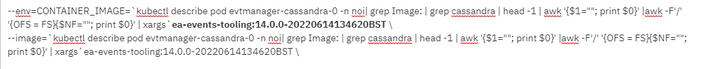
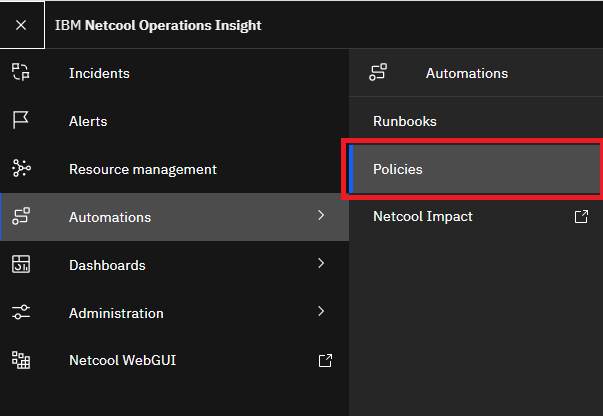
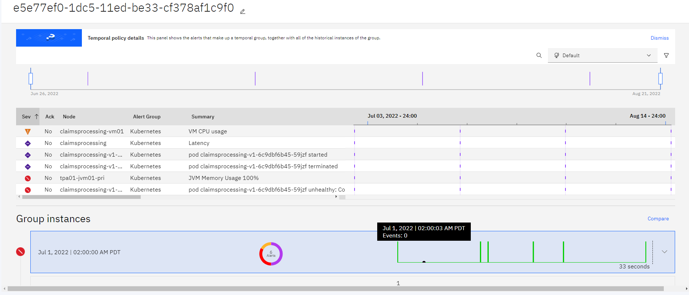
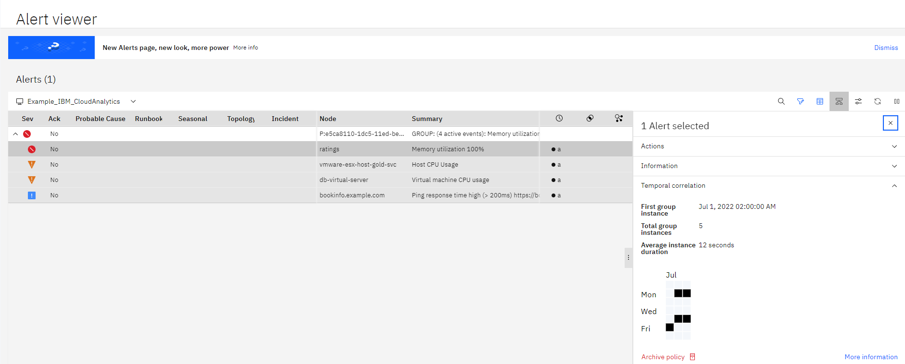

## 9.1: Overview

In this module we will learn about Temporal grouping  & Seasonality
functionality of Watson AIOps. This module assumes you have Watson AIOPs Event
manager instance deployed on the OpenShift cluster (releasename=evtmanager ,
namespace=noi).

**What is Temporal correlation?**

Temporal correlation helps you reduce noise by grouping events, that share a
time based relationship.

The temporal grouping analytic identifies related events based on their historic
co-occurrences. Subsequent events, which match the temporal profile are
correlated together. Temporal Policies for grouping related events are generated
when 2, or more, events occur together (i.e. each less then 20 mins apart).

In this module, we will learn how temporal and seasonal policies are created and
applied in Watson AIOps to create groups of related events. It is based on
machine learning using historical events data. In the customer environment
training is done on historical event data normally reporter db for existing
netcool deployments.

**How does it work?**

The temporal grouping analytics algorithm works on unique identifiers for the
alerts. To group, they need to be seen at least 3 times together within 20
mins(default) time window.


**Event Data Sanitation:**

The “Identifier” field in Netcool alerts uniquely identifies an alert from the
monitored resource. The identifier field controls the deduplication feature of
the ObjectServer, and also supports compatibility with the GenericClear
automation by ensuring resolution events are properly inserted into the
ObjectServer and not deduplicated with their respective problem events.

Temporal correlation uses Identifier to identify set of events that repeatedly
happen together, at least 3 times in the learning period.

Sometimes training on historical data do not return any groups, this can be due
to the unique Identifier among different occurrences of same problem. This makes
historical events unsuitable for temporal grouping. Some common examples are:

- Having timestamp in Identifiers
- Having Integer values appended to Identifier
- If tasks are scheduled every day but get a unique task id each time they run,
  it will create unique identifiers
- Unique message ids in Identifier
- UTC values for the timestamp in Identifier etc

---

## 9.2: Create historical data for learning

In order to understand how Watson AIOps learns temporal & seasonal relations, we
will simulate a sample set of events and train analytics engine on the simulated
historical dataset.

Login into OCP cluster using oc login.

Create test_events_historic.sh script (as below)  that simulates multiple
instances of set of events into the ObjectServer. starttime in script is EPOCH
conversion for the time in history (30 days in past) so we have a minimum 3-4
weeks of sample data generated for machine learning.

```sh title="test_events_historic.sh"
#!/bin/bash

today=`date +%s`
starttime=$today-30*86400

for (( i=0; i<=3; i++ ))
do
stamp_seasonal=$(($starttime+$i*7*86400))
stamp_temporal=$(($starttime+$i*4*71500))
stamp_random=$(($starttime+$i*8*60700))

echo "$i"  "$stamp_seasonal"

#Seasonal Events
/opt/IBM/tivoli/netcool/omnibus/bin/nco_sql -server AGG_P -user root -passwd $OMNIBUS_ROOT_PWD << EOF

insert into alerts.status (Identifier,Summary,Node,NodeAlias,Severity,AlertGroup,Class,Customer,Manager,Service,FirstOccurrence,LastOccurrence,StateChange,Type) values ('Library-ID1','Latency','ratings','ff5b55a1-de96-11e8-b739-00000a33043d',1,'Kubernetes',87722,'cfd95b7e-3bc7-4006-a4a8-a73a79c71255','ratings','bookinfo',$stamp_seasonal,$stamp_seasonal,$stamp_seasonal,1);
go

insert into alerts.status (Identifier,Summary,Node,NodeAlias,Severity,AlertGroup,Class,Customer,Manager,Service,FirstOccurrence,LastOccurrence,StateChange,Type) values ('Library-ID2','Ping response time high (> 200ms) https://bookinfo.example.com','bookinfo.example.com','bookinfo.example.com',2,'Kubernetes',87722,'cfd95b7e-3bc7-4006-a4a8-a73a79c71255','pingmon','bookinfo',$stamp_seasonal+3,$stamp_seasonal+3,$stamp_seasonal+3,1);
go

insert into alerts.status (Identifier,Summary,Node,NodeAlias,Severity,AlertGroup,Class,Customer,Manager,Service,FirstOccurrence,LastOccurrence,StateChange,Type) values ('Library-ID3','Memory utilization 100%','ratings','b2214f0d02bd2b7f45e7cd6dc7c756f5c58f96e13d419e4a581c3093c20fe31d',5, 'Kubernetes',87722,'cfd95b7e-3bc7-4006-a4a8-a73a79c71255','ratings','ratings',$stamp_temporal,$stamp_temporal,$stamp_temporal,1);
go

insert into alerts.status (Identifier,Summary,Node,NodeAlias,Severity,AlertGroup,Class,Customer,Manager,Service,FirstOccurrence,LastOccurrence,StateChange,Type) values ('Library-ID4','Host CPU Usage','vmware-esx-host-gold-svc','vmware-esx-host-gold-svc',4,'Kubernetes',87722,'cfd95b7e-3bc7-4006-a4a8-a73a79c71255','message_bus','ESX Host',$stamp_temporal+6,$stamp_temporal+6,$stamp_temporal+6,1);
go

insert into alerts.status (Identifier,Summary,Node,NodeAlias,Severity,AlertGroup,Class,Customer,Manager,Service,FirstOccurrence,LastOccurrence,StateChange,Type) values ('Library-ID5','Ping response time high (> 200ms) https://bookinfo.example.com','bookinfo.example.com','bookinfo.example.com',2,'Kubernetes',87722,'cfd95b7e-3bc7-4006-a4a8-a73a79c71255','pingmon','bookinfo',$stamp_temporal+7,$stamp_temporal+7,$stamp_temporal+7,1);
go

insert into alerts.status (Identifier,Summary,Node,NodeAlias,Severity,AlertGroup,Class,Customer,Manager,Service,FirstOccurrence,LastOccurrence,StateChange,Type) values ('Library-ID6','Virtual machine CPU usage','db-virtual-server','db-virtual-server',4,'Kubernetes',87722,'cfd95b7e-3bc7-4006-a4a8-a73a79c71255','message_bus','VM',$stamp_temporal+12,$stamp_temporal+12,$stamp_temporal+12,1);
go

exit
EOF

if test $today -gt $stamp_random
then

#Random Events
/opt/IBM/tivoli/netcool/omnibus/bin/nco_sql -server AGG_P -user root -passwd $OMNIBUS_ROOT_PWD << EOF

insert into alerts.status (Identifier,Summary,Node,NodeAlias,Severity,AlertGroup,Class,Customer,Manager,Service,FirstOccurrence,LastOccurrence,StateChange,Type) values ('Claims-ID1','VM CPU usage','claimsprocessing-vm01','claimsprocessing-vm01',4,'Kubernetes',87722,'cfd95b7e-3bc7-4006-a4a8-a73a79c71255','message_bus','InfrastructureService',$stamp_random+12,$stamp_random+12,$stamp_random+12,1);
go

insert into alerts.status (Identifier,Summary,Node,NodeAlias,Severity,AlertGroup,Class,Customer,Manager,Service,FirstOccurrence,LastOccurrence,StateChange,Type) values ('Claims-ID2','Latency','claimsprocessing','cc5b55a1-de96-11e8-b739-00000a33043d',1,'Kubernetes',87722,'cfd95b7e-3bc7-4006-a4a8-a73a79c71255','claimsprocessing','claimsprocessing',$stamp_random,$stamp_random,$stamp_random,1);
go

insert into alerts.status (Identifier,Summary,Node,NodeAlias,Severity,AlertGroup,Class,Customer,Manager,Service,FirstOccurrence,LastOccurrence,StateChange,Type) values ('Claims-ID3','JVM Memory Usage 100%','tpa01-jvm01-pri','tpa01-jvm01-pri',5, 'Kubernetes',87722,'cfd95b7e-3bc7-4006-a4a8-a73a79c71255','claimsprocessing','claimsprocessing',$stamp_random+18,$stamp_random+18,$stamp_random+18,1);
go

insert into alerts.status (Identifier,Summary,Node,NodeAlias,Severity,AlertGroup,Class,Customer,Manager,Service,FirstOccurrence,LastOccurrence,StateChange,Type) values ('Claims-ID4','pod claimsprocessing-v1-6c9dbf6b45-59jzf unhealthy: Container exceeded configured memory limit','claimsprocessing-v1-6c9dbf6b45-59jzf','ddd7d7ff-00fe-4d03-9c99-dcc955cc8b7c', 5,'Kubernetes',87722,'ccd95b7e-3bc7-4006-a4a8-a73a79c71255','kubernetes-observer','claimsprocessing',$stamp_random+33,$stamp_random+33,$stamp_random+33,1);
go

insert into alerts.status (Identifier,Summary,Node,NodeAlias,Severity,AlertGroup,Class,Customer,Manager,Service,FirstOccurrence,LastOccurrence,StateChange,Type) values ('Claims-ID5','pod claimsprocessing-v1-6c9dbf6b45-59jzf started','claimsprocessing-v1-6c9dbf6b45-59jzf','ddd7d7ff-00fe-4d03-9c99-dcc955cc8b7c',1,'Kubernetes',87722,'cfd95b7e-3bc7-4006-a4a8-a73a79c71255','kubernetes-observer','claimsprocessing',$stamp_random+22,$stamp_random+22,$stamp_random+22,1);
go

insert into alerts.status (Identifier,Summary,Node,NodeAlias,Severity,AlertGroup,Class,Customer,Manager,Service,FirstOccurrence,LastOccurrence,StateChange,Type) values ('Claims-ID6','pod claimsprocessing-v1-6c9dbf6b45-59jzf terminated','claimsprocessing-v1-6c9dbf6b45-59jzf','ddd7d7ff-00fe-4d03-9c99-dcc955cc8b7c',1,'Kubernetes',87722,'cfd95b7e-3bc7-4006-a4a8-a73a79c71255','kubernetes-observer','claimsprocessing',$stamp_random+11,$stamp_random+11,$stamp_random+11,1);
go
exit
EOF
fi

sleep 1m

/opt/IBM/tivoli/netcool/omnibus/bin/nco_sql -server AGG_P -user root -passwd $OMNIBUS_ROOT_PWD << EOF
update alerts.status set Severity = 0 where Class=87722;
go
exit
EOF

sleep  1m

/opt/IBM/tivoli/netcool/omnibus/bin/nco_sql -server AGG_P -user root -passwd $OMNIBUS_ROOT_PWD << EOF
delete from alerts.status where Class=87722;
go
exit
EOF

echo "Done." $i
done

echo "Finished Historic Replay"

```

---

## 9.3: Insert historical events into event manager

Copy historic event generating script to ObjectServer pod

```sh
cat test_events_historic.sh | oc exec -i evtmanager-ncoprimary-0 -- sh -c "cat > /tmp/test_events_historic.sh"
```

```sh
oc exec -it evtmanager-ncoprimary-0 bash -- sh -c "chmod +x /tmp/test_events_historic.sh"
```

Now execute this script to simulate historic data set replay.( It will take
approx 6 mins)

```sh
oc exec -it evtmanager-ncoprimary-0 bash -- /tmp/test_events_historic.sh
```

:::info

You can ignore the message: "Warning: Failed to find tar in the following
directories : /bin /usr/bin"

:::

Once replay is finished ( takes approx 5-6 mins), you can start training.

---

## 9.4: Run training for temporal and seasonal policies 

Get image for trainer pod:

```sh
oc get noi evtmanager -o yaml | grep ea-events-tooling
```



Run training with algorithm related-events to learn temporal policies from
historic data. This will generate temporal policies.

```sh
oc run trainer -it --command=true --restart=Never --env=LICENSE=accept --image=cp.icr.io/cp/noi/ea-events-tooling:15.0.0-20220913140046BST --overrides='{"apiVersion":"v1", "spec":{"imagePullSecrets":[{"name":"noi-registry-secret"}]}}' runTraining.sh -- -r evtmanager -a related-events
```


Run training with algorithm seasonal-events to learn seasonal policies from
historic data. This will generate seasonal policies.

```sh
oc delete pod trainer
```

```sh
oc run trainer -it --command=true --restart=Never --env=LICENSE=accept --image=cp.icr.io/cp/noi/ea-events-tooling:15.0.0-20220913140046BST --overrides='{"apiVersion":"v1", "spec":{"imagePullSecrets":[{"name":"noi-registry-secret"}]}}' runTraining.sh -- -r evtmanager -a seasonal-events
```


---

## 9.5: Check policies created by training

Training result in temporal and seasonal policies that user can review/deploy.

Launch **Event Viewer -> Insights -> Manage Policies **

or in new UI :



You will see all the policies in "Created by Analytics" Tab


Check details of Seasonal policy by clicking "Policy Details"


Check details of Temporal policy by clicking "Policy Details"



Now these policies are enabled by default and active to group live events.

## 9.6: Replay events

Next step we will simulate some live events to show how groups are created using
above learned policies.

Create test_events_live.sh script (as below)  that simulates a set of events
into the ObjectServer for which we have learned policies. starttime  is EPOCH
conversion for current time.

```sh title="test_events_live.sh"
#!/bin/bash

today=`date +%s`
starttime=$today-30*86400
stamp=$starttime

for (( i=4; i<=4; i++ ))
do
stamp_seasonal=$(($starttime+$i*7*86400))
stamp_temporal=$(($starttime+$i*4*71500))
stamp_random=$(($starttime+$i*8*160700))

echo "$i"  "$stamp_seasonal"

#Seasonal Events
/opt/IBM/tivoli/netcool/omnibus/bin/nco_sql -server AGG_P -user root -passwd $OMNIBUS_ROOT_PWD << EOF
insert into alerts.status (Identifier,Summary,Node,NodeAlias,Severity,AlertGroup,Class,Customer,Manager,Service,FirstOccurrence,LastOccurrence,StateChange,Type) values ('Library-ID1','Latency','ratings','ff5b55a1-de96-11e8-b739-00000a33043d',1,'Kubernetes',87722,'cfd95b7e-3bc7-4006-a4a8-a73a79c71255','ratings','bookinfo',$stamp_seasonal,$stamp_seasonal,$stamp_seasonal,1);
go

insert into alerts.status (Identifier,Summary,Node,NodeAlias,Severity,AlertGroup,Class,Customer,Manager,Service,FirstOccurrence,LastOccurrence,StateChange,Type) values ('Library-ID2','Ping response time high (> 200ms) https://bookinfo.example.com','bookinfo.example.com','bookinfo.example.com',2,'Kubernetes',87722,'cfd95b7e-3bc7-4006-a4a8-a73a79c71255','pingmon','bookinfo',$stamp_seasonal+3,$stamp_seasonal+3,$stamp_seasonal+3,1);
go

insert into alerts.status (Identifier,Summary,Node,NodeAlias,Severity,AlertGroup,Class,Customer,Manager,Service,FirstOccurrence,LastOccurrence,StateChange,Type) values ('Library-ID3','Memory utilization 100%','ratings','b2214f0d02bd2b7f45e7cd6dc7c756f5c58f96e13d419e4a581c3093c20fe31d',5, 'Kubernetes',87722,'cfd95b7e-3bc7-4006-a4a8-a73a79c71255','ratings','ratings',$stamp_temporal,$stamp_temporal,$stamp_temporal,1);
go

insert into alerts.status (Identifier,Summary,Node,NodeAlias,Severity,AlertGroup,Class,Customer,Manager,Service,FirstOccurrence,LastOccurrence,StateChange,Type) values ('Library-ID4','Host CPU Usage','vmware-esx-host-gold-svc','vmware-esx-host-gold-svc',4,'Kubernetes',87722,'cfd95b7e-3bc7-4006-a4a8-a73a79c71255','message_bus','ESX Host',$stamp_temporal+6,$stamp_temporal+6,$stamp_temporal+6,1);
go

insert into alerts.status (Identifier,Summary,Node,NodeAlias,Severity,AlertGroup,Class,Customer,Manager,Service,FirstOccurrence,LastOccurrence,StateChange,Type) values ('Library-ID5','Ping response time high (> 200ms) https://bookinfo.example.com','bookinfo.example.com','bookinfo.example.com',2,'Kubernetes',87722,'cfd95b7e-3bc7-4006-a4a8-a73a79c71255','pingmon','bookinfo',$stamp_temporal+7,$stamp_temporal+7,$stamp_temporal+7,1);
go

insert into alerts.status (Identifier,Summary,Node,NodeAlias,Severity,AlertGroup,Class,Customer,Manager,Service,FirstOccurrence,LastOccurrence,StateChange,Type) values ('Library-ID6','Virtual machine CPU usage','db-virtual-server','db-virtual-server',4,'Kubernetes',87722,'cfd95b7e-3bc7-4006-a4a8-a73a79c71255','message_bus','VM',$stamp_temporal+12,$stamp_temporal+12,$stamp_temporal+12,1);
go

exit
EOF

#Random Events
/opt/IBM/tivoli/netcool/omnibus/bin/nco_sql -server AGG_P -user root -passwd $OMNIBUS_ROOT_PWD << EOF

insert into alerts.status (Identifier,Summary,Node,NodeAlias,Severity,AlertGroup,Class,Customer,Manager,Service,FirstOccurrence,LastOccurrence,StateChange,Type) values ('Claims-ID1','VM CPU usage','claimsprocessing-vm01','claimsprocessing-vm01',4,'Kubernetes',87722,'cfd95b7e-3bc7-4006-a4a8-a73a79c71255','message_bus','InfrastructureService',$stamp_random+12,$stamp_random+12,$stamp_random+12,1);
go

insert into alerts.status (Identifier,Summary,Node,NodeAlias,Severity,AlertGroup,Class,Customer,Manager,Service,FirstOccurrence,LastOccurrence,StateChange,Type) values ('Claims-ID2','Latency','claimsprocessing','cc5b55a1-de96-11e8-b739-00000a33043d',1,'Kubernetes',87722,'cfd95b7e-3bc7-4006-a4a8-a73a79c71255','claimsprocessing','claimsprocessing',$stamp_random,$stamp_random,$stamp_random,1);
go

insert into alerts.status (Identifier,Summary,Node,NodeAlias,Severity,AlertGroup,Class,Customer,Manager,Service,FirstOccurrence,LastOccurrence,StateChange,Type) values ('Claims-ID3','JVM Memory Usage 100%','tpa01-jvm01-pri','tpa01-jvm01-pri',5, 'Kubernetes',87722,'cfd95b7e-3bc7-4006-a4a8-a73a79c71255','claimsprocessing','claimsprocessing',$stamp_random+18,$stamp_random+18,$stamp_random+18,1);
go

insert into alerts.status (Identifier,Summary,Node,NodeAlias,Severity,AlertGroup,Class,Customer,Manager,Service,FirstOccurrence,LastOccurrence,StateChange,Type) values ('Claims-ID4','pod claimsprocessing-v1-6c9dbf6b45-59jzf unhealthy: Container exceeded configured memory limit','claimsprocessing-v1-6c9dbf6b45-59jzf','ddd7d7ff-00fe-4d03-9c99-dcc955cc8b7c', 5,'Kubernetes',87722,'ccd95b7e-3bc7-4006-a4a8-a73a79c71255','kubernetes-observer','claimsprocessing',$stamp_random+33,$stamp_random+33,$stamp_random+33,1);
go

insert into alerts.status (Identifier,Summary,Node,NodeAlias,Severity,AlertGroup,Class,Customer,Manager,Service,
FirstOccurrence,LastOccurrence,StateChange,Type) values ('Claims-ID5','pod claimsprocessing-v1-6c9dbf6b45-59jzf started','claimsprocessing-v1-6c9dbf6b45-59jzf','ddd7d7ff-00fe-4d03-9c99-dcc955cc8b7c',1,'Kubernetes',87722,'cfd95b7e-3bc7-4006-a4a8-a73a79c71255','kubernetes-observer','claimsprocessing',$stamp_random+22,$stamp_random+22,$stamp_random+22,1);
go

insert into alerts.status (Identifier,Summary,Node,NodeAlias,Severity,AlertGroup,Class,Customer,Manager,Service,
FirstOccurrence,LastOccurrence,StateChange,Type) values ('Claims-ID6','pod claimsprocessing-v1-6c9dbf6b45-59jzf terminated','claimsprocessing-v1-6c9dbf6b45-59jzf','ddd7d7ff-00fe-4d03-9c99-dcc955cc8b7c',1,'Kubernetes',87722,
'cfd95b7e-3bc7-4006-a4a8-a73a79c71255','kubernetes-observer',
'claimsprocessing',$stamp_random+11,$stamp_random+11,$stamp_random+11,1);
go
exit
EOF

sleep 1m

echo "Done." $i
done
```

Now copy this script to Objectserver pod

```sh
cat test_events_live.sh | kubectl exec -i evtmanager-ncoprimary-0 -- sh -c "cat > /tmp/test_events_live.sh"
```

```sh
oc exec -it evtmanager-ncoprimary-0 bash -- sh -c "chmod +x /tmp/test_events_live.sh" 
```

Run this script to simulate some live events

```sh
oc exec -it evtmanager-ncoprimary-0 bash -- /tmp/test_events_live.sh
```

After replaying, these events get automatically grouped in Event viewer based on
the temporal and seasonal relations learned from historical data. When looking
at the results if using DASH based WebGUI use "All Events" Filter and
"Example_IBM_CloudAnalytics" View.


Click on "Investigate" to launch details of temporal group with Clock icon



Launch "More Information"


Similarly Events are marked seasonal if they happened at the same time as
learned policy.


That completes the "Temporal Grouping and Seasonality" lab. Proceed to the next
lab to learn how we build temporal patterns from temporal grouping policies to
enhance the grouping to next level.
