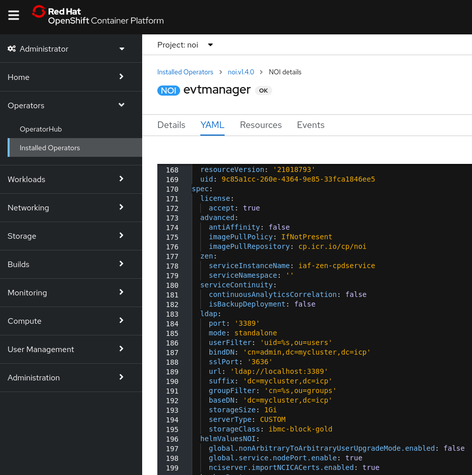
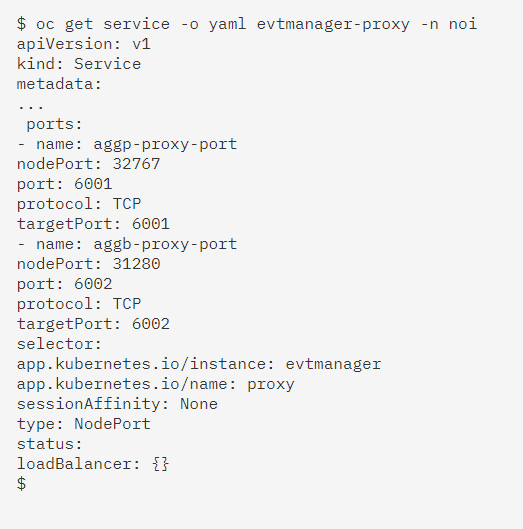

<AnchorLinks>
  <AnchorLink>3-1: Overview</AnchorLink>
  <AnchorLink>3-2: Enable Nodeports</AnchorLink>
  <AnchorLink>3-3: Gather the cluster connection information</AnchorLink>
  <AnchorLink>3-4: Configure probe to connect to the cluster</AnchorLink>
</AnchorLinks>


## 3-1: Overview

This module focuses on configuring and connecting an on-premise Netcool/Probe to the Event Manager.  In most demonstration or POC scenarios, there will be an existing on-premise Netcool deployment present, and there will be a need to connect that environment to the system running on OpenShift. Typically this will involve connecting Probes or uni-directional ObjectServer Gateways into the Event Manager, to provide a source of events.

**NOTE:** This module assumes you have an existing on-premise Netcool/OMNIbus deployment that you want to connect into your Event Manager system. If this is not the case, and you are using only webhook-based event feeds (configured via the GUI), you can skip this module and move on to module 3.

This deployment scenario will assume you are deploying onto IBM Cloud however the steps would generally apply to an OpenShift cluster deployed on another cloud provider or on-premise.

By the end of this module, you will have enabled the ObjectServer nodeports on your cluster, configured your on-premise Netcool/OMNIbus system to connect to the ObjectServer embedded within Event Manager, and connected a Probe.


## 3-2: Enable Nodeports

Behind the scenes, the event stores in Watson for AIOps Event Manager are Netcool/OMNIbus ObjectServers. These are running in containers and are not accessible outside the cluster by default. This first step involves modifying your Event Manager deployment to activate the nodeports.

Log in to your OpenShift UI and navigate to: **Operators → Installed Operators → IBM Cloud Pak for Watson AIOps Event Manager → NOI**.

Next, click on your deployment - for example: **evtmanager** - and then click on the **YAML** tab.

Add a new sub-section to the **spec**: section in your configuration with the following text:

```sh
  helmValuesNOI:
    global.service.nodePort.enable: true
```

**NOTE**: the spacing and indentation is important here.

After you have added this sub-section and clicked Save, the resulting configuration should look something like the following:



**NOTE:** In this screenshot, other properties have also been added. The key added lines are on lines **196** and **198**.

After you have saved the configuration, OpenShift will detect the change, and redeploy the relevant services.

Next, log in to the OpenShift cluster via the command line, as you did in the previous module. To check that the nodeports have been successfully deployed, you can query the Proxy Service, and check its output for the nodeport values:

```sh
$ oc get service -o yaml evtmanager-proxy -n noi
```
Output looks like :



From the output above, you can see that the nodeports have been deployed on ports **32767** for the primary ObjectServer and **31280** for the backup. These are the port numbers that are externally accessible to the cluster and are what your Netcool Probe (or in-bound Netcool Gateway) will use to connect.

**NOTE:** Make a note of these port numbers as you'll need them in subsequent steps.

For more information on this step, see the following documentation link: https://www.ibm.com/docs/en/noi/1.6.5?topic=service-identifying-proxy-listening-port

## 3-3: Gather the cluster connection information

This step involves compiling information about the cluster's certificate common name (CN) and acquiring the cluster certificate for import into the Probe server.

In the previous module, you identified the Ingress subdomain from the IBM Cloud UI, from the information relating to your cluster.

Ping the Ingress subdomain to identify the IP address to use to communicate with the cluster:

```sh

$ ping swat01-4693fb98e216XXXXXXXXXXX-0000.us-east.containers.appdomain.cloud

PING swat01-4693fb98e21XXXXXXXXXXXXx-0000.us-east.containers.appdomain.cloud (5X.XXX.XX.XXX) 56(84) bytes of data.
64 bytes from evtmanager-proxy.noi.svc (5X.XXX.XX.XXX): icmp_seq=1 ttl=46 time=89.2 ms
^C
--- swat01-4693fb98e216d6XXXXXXXXXXXXXX-0000.us-east.containers.appdomain.cloud ping statistics ---
2 packets transmitted, 2 received, 0% packet loss, time 1001ms
rtt min/avg/max/mdev = 89.216/93.100/96.985/3.896 ms
$
``
Two things to note from the example output above are the proxy service name: evtmanager-proxy.noi.svc - and the IP address: 5X.XXX.XX.XXX. These represent the hostname and IP address we will be using to communicate with the cluster.

**NOTE:** Make a note of the proxy service name and IP address as you need them shortly.

Next, log into your server where the Netcool/Probe is installed. Use the OpenSSL command to retrieve the x.509 certificate that is returned by the proxy and verify the certificate common name (CN). You need to again use the Ingress subdomain value in conjunction with the nodeport value you discovered in Step 1:

```sh
$ openssl s_client -showcerts -connect swat01-469XXXXXXXXXXXXXXXXXXXXXXXXXc049-0000.us-east.containers.appdomain.cloud:32767

CONNECTED(00000003)
depth=1 CN = openshift-service-serving-signer@1645115959
verify return:1
depth=1 CN = openshift-service-serving-signer@1645115959
verify return:1
depth=0 CN = evtmanager-proxy.noi.svc
verify return:1
---
Certificate chain
0 s:CN = evtmanager-proxy.noi.svc
...
```

Here you can see the proxy service name being used by the server, that is associated with the certificate, and that it matches the hostname returned by the ping command earlier. This is important because the hostname we use to connect to the cluster must match that referred to in the certificate in order for the SSL connection to work correctly.

Finally, download the certificate from the cluster using the oc utility:

```sh
oc get secrets/signing-key -n openshift-service-ca -o template='{{index .data "tls.crt"}}' | base64 --decode > cluster-ca-cert.pem 
```

Copy this file (cluster-ca-cert.pem) to the Probe server in preparation for the next step.

For more information on this step, see the following documentation link: https://www.ibm.com/docs/en/noi/1.6.5?topic=service-configuring-tls-encryption-red-hat-openshift

## 3-4: Configure probe to connect to the cluster

Now that we have the proxy service hostname, the nodeport of the primary ObjectServer, and the cluster's certificate, we are ready to configure the Probe to connect to the Event Manager.

Log in to the Probe server and add an entry to the /etc/hosts file with the cluster IP address and the proxy service hostname obtained previously:

5X.XXX.XX.XXX evtmanager-proxy.noi.svc

This is the hostname that will be used in the Netcool interfaces file.

If you haven't already created one previously, create a keystore on your Probe server to import the certificate into:

```sh
export NCHOME=/home/scadmin/IBM/tivoli/netcool
$NCHOME/bin/nc_gskcmd -keydb -create -db "$NCHOME/etc/security/keys/omni.kdb" -pw password -stash -expire 1000
```

Copy the certificate you downloaded in Step 2 to the Probe server, and import it into your newly created keystore:

```sh
$NCHOME/bin/nc_gskcmd -cert -add -file cluster-ca-cert.pem -db $NCHOME/etc/security/keys/omni.kdb -stashed
```

Create an interfaces file entry in $NCHOME/etc/omni.dat, representing the primary ObjectServer running in OpenShift:

```sh
[ROKS_AGG_P]
{
 Primary: noi-proxy.noi.svc ssl 32767
}
```

**NOTE:** The entry contains the string ssl which indicates that an encrypted connection should be used.

Run nco_igen to update the interfaces file information.

```sh
$NCHOME/bin/nco_igen
```

Use the nco_ping utility to test the connection the ObjectServer:

$ $OMNIHOME/bin/nco_ping ROKS_AGG_P
NCO_PING: Server available.
$ 

You are now ready to connect your Probe.

For more information on this step, see the following documentation link: https://www.ibm.com/docs/en/noi/1.6.5?topic=service-configuring-tls-encryption-red-hat-openshift

## 3.4: Configure and connect a Netcool/Probe

The fourth and final step is to configure the Probe to connect to the primary ObjectServer running in OpenShift. 

Using the Simnet Probe as an example, run the Probe in debug mode to ensure that the Probe can connect to the ObjectServer:

```sh
export OMNIHOME=/home/scadmin/IBM/tivoli/netcool/omnibus
$OMNIHOME/probes/nco_p_simnet -server ROKS_AGG_P -messagelevel debug -messagelog stdout
```

After verifying successful connect to the ObjectServer, you can run the Probe outside of debug mode, normally under Process Agent control.


[Reference Blog](https://community.ibm.com/community/user/aiops/blogs/zane-bray1/2022/04/13/getting-started-with-watson-aiops-event-manager-27)