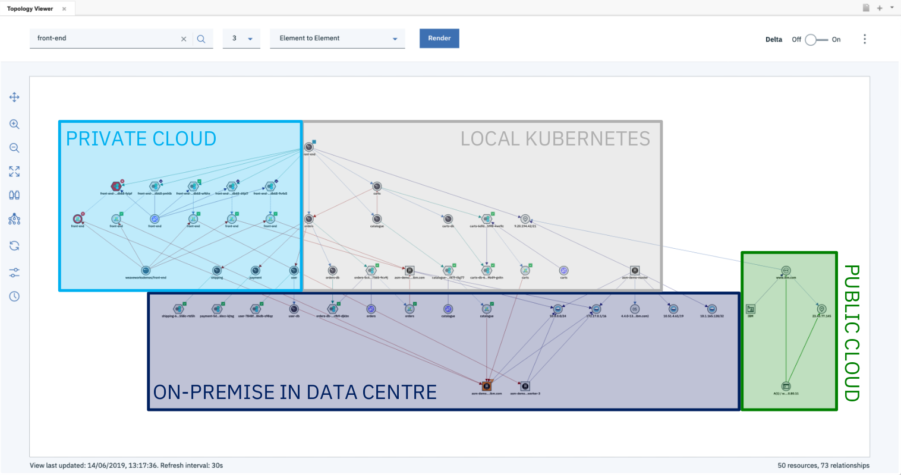
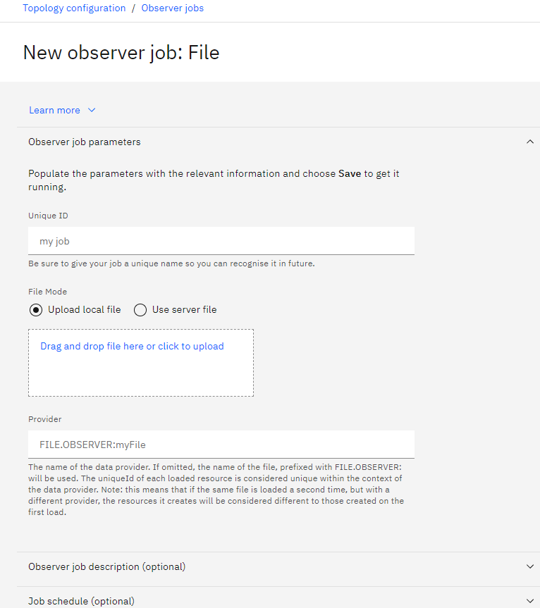
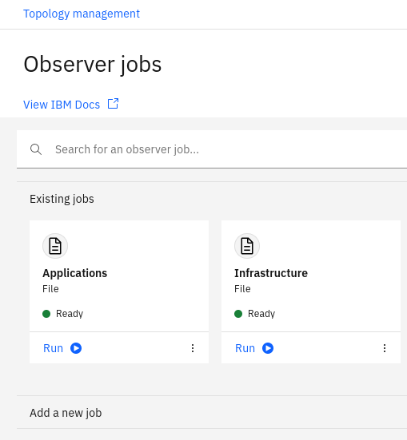
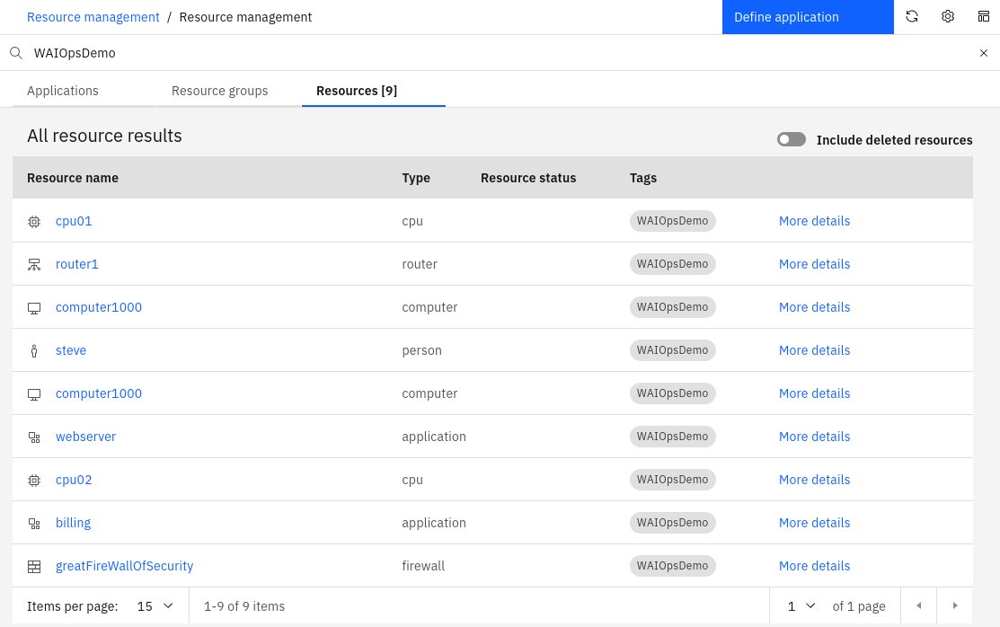
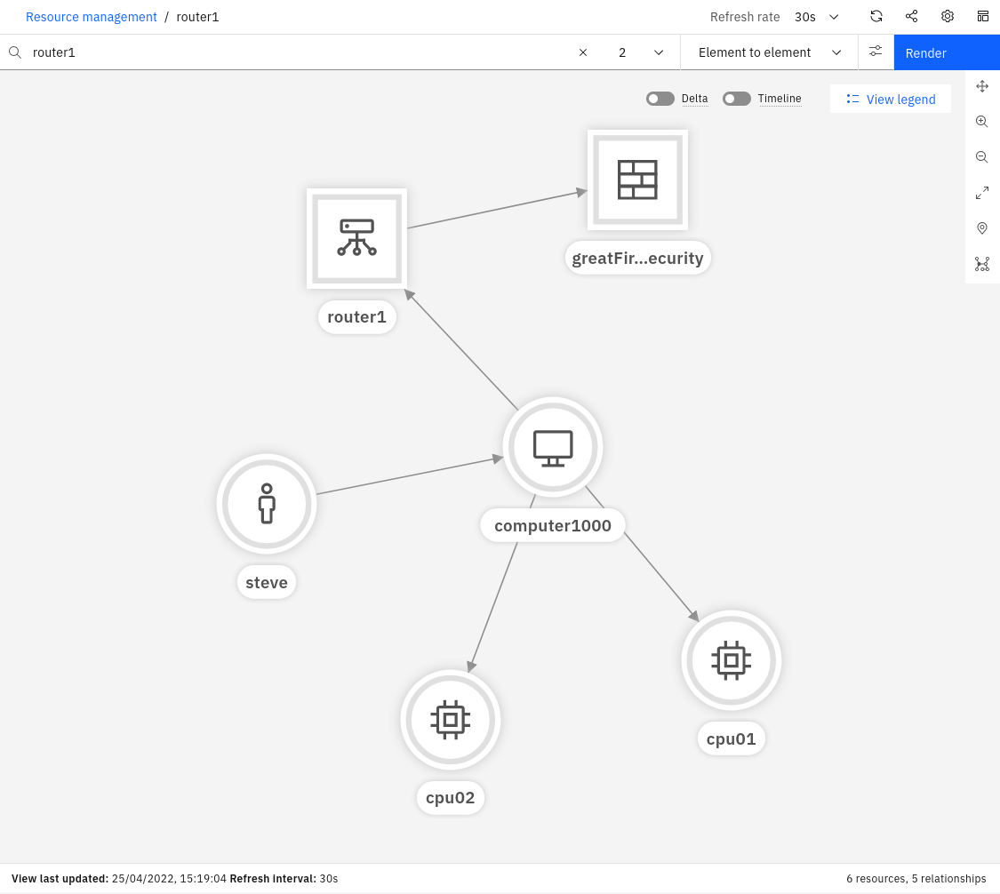
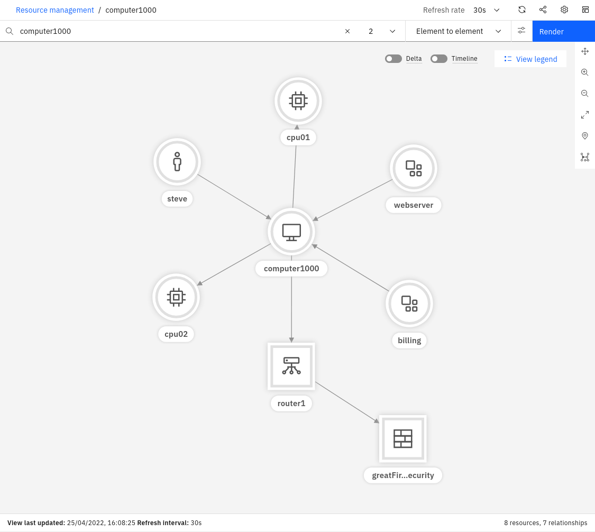

<AnchorLinks>
  <AnchorLink>5-1: Overview</AnchorLink>
  <AnchorLink>5-2: Create and copy two sample topology files to the File Observer pod </AnchorLink>
  <AnchorLink>5-3: Create two File Observer jobs</AnchorLink>
  <AnchorLink>5-4: Create a Merge Rule to tie the topology together</AnchorLink>
</AnchorLinks>

## 5-1: Overview

This module focuses on the initial creation of topology within the Event Manager. Topology adds enormous value to your deployment as it provides visibility into your environment and brings it to-life. With topology in your environment, you can:

* Visualise a seamless end-to-end view of your environment
* Create and view groups of resources that logically belong together
* Perform topology-based event correlation for events occurring within a group of related resources

The topology capability can ingest topology data from many different sources. The multiple disparate pieces of topology can then be stitched together, where it makes sense to do so, allowing you to see your end-to-end environment with all the logical and physical connections represented.



At the time of writing, the Event Manager comes with 30 different Observers. 28 of these are designed to connect to specific types of end-point, such as ServiceNow, Dynatrace, or VMware vCenter. Two of the Observers are generic ones: the File Observer (for ingesting file-based topology data) and the REST Observer (for ingesting topology data programmatically via an API).

**NOTE:** A full list of the topology Observers are documented here: https://www.ibm.com/docs/en/nasm/1.1.14?topic=jobs-defining-observer-manually

By the end of this module, you will have created two topology Observer jobs, ingested two sets of topology data, and tied them together via a Merge Rule.

## 5-2: Create and copy two sample topology files to the File Observer pod

This first step involves the following tasks:

* Create two sample files with topology data in them
* Copy them to the File Observer pod

In a real-world scenario, it is likely that you would be using a number of off-the-shelf Observers to get your topology data from your environment. It is also likely however that you would also leverage the File or REST Observers either to ingest data for which an off-the-shelf Observer doesn't exist, or to manually create relationships between Resources in your topology for which there is no import source. For example, you may wish to create connections between resources to represent logical connections or dependencies that aren't included in the data sets. In any case, this exercise will give you the skills to use the File Observer, which will also equip you with a little more knowledge of what's going on under the covers.

In this scenario, we will have one set of topology data that represents **physical infrastructure**, and a second set of topology data that represents some **applications** running on that physical infrastructure. An analogy to this might be physical topology data ingested from an orchestrator, such as OpenStack, and application data, coming from an application management tool, such as AppDynamics.

Create a new file called infrastructure.txt with the following contents:

```sh
V:{"_operation":"InsertReplace","uniqueId":"379177a8-0a6a-4068-817c-d6d6e870437e","matchTokens":["379177a8-0a6a-4068-817c-d6d6e870437e","router1"],"tags":["WAIOpsDemo"],"name":"router1","entityTypes":["router"]}
V:{"_operation":"InsertReplace","uniqueId":"9c1f90e0-7dc4-40d8-8721-40ea2f3af453","matchTokens":["9c1f90e0-7dc4-40d8-8721-40ea2f3af453","cpu01"],"tags":["WAIOpsDemo"],"name":"cpu01","entityTypes":["cpu"]}
V:{"_operation":"InsertReplace","uniqueId":"222-9c1f90e0-7dc4-40d8-8721-40ea2f3af453","matchTokens":["222-9c1f90e0-7dc4-40d8-8721-40ea2f3af453","cpu02"],"tags":["WAIOpsDemo"],"name":"cpu02","entityTypes":["cpu"]}
V:{"_operation":"InsertReplace","uniqueId":"7598a194-27a0-4d0b-9c49-cbc0070c99c9","matchTokens":["7598a194-27a0-4d0b-9c49-cbc0070c99c9","greatFireWallOfSecurity"],"tags":["WAIOpsDemo"],"name":"greatFireWallOfSecurity","entityTypes":["firewall"]}
V:{"_operation":"InsertReplace","uniqueId":"974d1788-1312-4151-8a62-73fa1854e807","matchTokens":["974d1788-1312-4151-8a62-73fa1854e807","computer1000"],"tags":["WAIOpsDemo"],"name":"computer1000","entityTypes":["computer"]}
V:{"_operation":"InsertReplace","uniqueId":"5c6f968a-2006-4b43-96b5-dd53df6b0afb","matchTokens":["5c6f968a-2006-4b43-96b5-dd53df6b0afb","steve"],"tags":["WAIOpsDemo"],"name":"steve","entityTypes":["person"]}
E:{"_toUniqueId":"379177a8-0a6a-4068-817c-d6d6e870437e","_edgeType":"connectedTo","_fromUniqueId":"974d1788-1312-4151-8a62-73fa1854e807"}
E:{"_toUniqueId":"7598a194-27a0-4d0b-9c49-cbc0070c99c9","_edgeType":"uses","_fromUniqueId":"379177a8-0a6a-4068-817c-d6d6e870437e"}
E:{"_toUniqueId":"974d1788-1312-4151-8a62-73fa1854e807","_edgeType":"uses","_fromUniqueId":"5c6f968a-2006-4b43-96b5-dd53df6b0afb"}
E:{"_toUniqueId":"9c1f90e0-7dc4-40d8-8721-40ea2f3af453","_edgeType":"contains","_fromUniqueId":"974d1788-1312-4151-8a62-73fa1854e807"}
E:{"_toUniqueId":"222-9c1f90e0-7dc4-40d8-8721-40ea2f3af453","_edgeType":"contains","_fromUniqueId":"974d1788-1312-4151-8a62-73fa1854e807"}
```

This JSON format is the type accepted by the File Observer, and contains topology directives, one per line. A line that begins with a **V** represents a "Vertex" (or Resource in UI terms). A line that begins with an **E** represents an "Edge" (or Relationship in UI terms).

Other format information can be found here: https://www.ibm.com/docs/en/nasm/1.1.14?topic=manually-defining-file-observer-jobs

Some notes about the Vertex (Resource) properties follow:

* _operation: A value of "InsertReplace" means that this Resource will be inserted into the topology if it does not already exist, and replace the current one if it does.

* uniqueId: This must be a globally unique identifier for the Resource. The off-the-shelf Observers will ensure uniqueness automatically. When using the File Observer, care must be taken to ensure uniqueness, otherwise you may inadvertently overwrite existing Resources with new ones.

* matchTokens: These values (comma separated list) are used to match the Resource against the incoming event stream, specifically against the Node and NodeAlias fields. Where there is a match, the event will be associated with the Resource and be visible from the topology view.

* tags: Tags can be handy to group Resources together, or for searching across resources that share a common tag. A resource can have multiple tags and represents a kind of group membership. One way that topology-based event correlation is across events that share a common tag. For example, you might tag all Resources that run an Oracle database with: "App:Oracle". Then you could create a tag-based correlation group template based on that tag.

* name: This is the primary identity of the Resource, and would normally be its most recognisable and human-readable name. The name attribute is normally the one shown in the topology viewer against a Resource.

* entityTypes: This defines what type of Resource is being created - for example: a computer or a database - and will also dictate which icon it will use in the topology view. A resource can have multiple values in the entityTypes field, although normally it would just have one entry.


Some notes about the Edge (Relationship) properties follow:

* _fromUniqueId and _toUniqueId: These parameters represent the start and end points for the Relationship - ie. which two Resources is it connecting. The values they have refer to the uniqueId parameters of the Vertex objects - ie. the Resources.

* _edgeType: This parameter specifies the type of Relationship this relates to. For example, is it indicating a "uses" type of relationship, or a "contains" type?


A list of default Edge types (for the parameter _edgeType) is documented here: https://www.ibm.com/docs/en/nasm/1.1.14?topic=reference-edge-types


Create a second new file called application.txt with the following contents:

```sh
V:{"_operation":"InsertReplace","uniqueId":"111-379177a8-0a6a-4068-817c-d6d6e870437e","matchTokens":["111-379177a8-0a6a-4068-817c-d6d6e870437e","billing"],"tags":["WAIOpsDemo"],"name":"billing","entityTypes":["application"]}
V:{"_operation":"InsertReplace","uniqueId":"111-9c1f90e0-7dc4-40d8-8721-40ea2f3af453","matchTokens":["111-9c1f90e0-7dc4-40d8-8721-40ea2f3af453","webserver"],"tags":["WAIOpsDemo"],"name":"webserver","entityTypes":["application"]}
V:{"_operation":"InsertReplace","uniqueId":"111-974d1788-1312-4151-8a62-73fa1854e807","matchTokens":["111-974d1788-1312-4151-8a62-73fa1854e807","computer1000"],"tags":["WAIOpsDemo"],"name":"computer1000","entityTypes":["computer"]}
E:{"_toUniqueId":"111-974d1788-1312-4151-8a62-73fa1854e807","_edgeType":"runsOn","_fromUniqueId":"111-379177a8-0a6a-4068-817c-d6d6e870437e"}
E:{"_toUniqueId":"111-974d1788-1312-4151-8a62-73fa1854e807","_edgeType":"runsOn","_fromUniqueId":"111-9c1f90e0-7dc4-40d8-8721-40ea2f3af453"}
```

## 5-3: Create two File Observer jobs

Log into the Event Manager UI, then navigate to: **Administration → Topology Configuration → Observer jobs → Configure**

**NOTE: If you can't find `Topology Configuration` option from the UI, please ensure you have enable the roles in [2.7 Locate your login details and log in to Watson for AIOps Event Manager](https://ibm.github.io/waiops-tech-jam/tutorials/aiops/installation/#2-7:-locate-your-login-details-and-log-in-to-watson-for-aiops-event-manager)**

Click on Add a new job and then choose File → Configure to create a new File Observer job.

Input a label to call your new job - eg. Infrastructure - and upload files that you created in step 5.2 - ie. infrastructure.txt and click Save:



**NOTE:** The Provider will be automatically populated when you click Save.

Repeat the process by creating a second File Observer job for the applications.txt file.

Each job will run the moment it is saved. After you have done this, your Observer jobs screen should look like the following:



You can verify your jobs ran successfully by first seeing the green Ready light on your job (above), and second by searching the topology for your newly added resources.

Choose Resource management from the left menu and search for WAIOpsDemo, which is the tag that all of your Resources in both your files were tagged with. You should see nine results come back under the Resources tab:



**NOTE:** There are two resources in the list called "computer1000". One is from the topology segment ingested from the infrastructure.txt file and the other one is from the topology segment ingested from the application.txt file. We will be merging these two Resources together shortly, via a Merge Rule.

Click on router1 and it will open the topology view. Increase the number of hops to 2 and click Render and you should see something like the following:



You can click Back on your browser window and click on one of the other Resources ingested via the Applications job - eg. billing. You will see a representation of the topology segment created by ingesting that file.

You are now ready to perform the final step, that being to create a Merge Rule to tie the two topology segments together via the common resource.

## 5-4: Create a Merge Rule to tie the topology together

This final step is where the topology data coming from the application topology source is mapped onto the topology data coming from the infrastructure orchestration topology source. In our hypothetical scenario, we know we have Resources of type "computer" in both sets of topology, and we know that they relate to the same servers. Corresponding instances across the two data sets are also labelled consistently and correctly, meaning that identifying the same Resource across the two data sets is possible.

In our case, we have a Resource called "computer1000" represented in our infrastructure topology data as well as in our application data. Our goal is to merge the two sets of topology together so that we can both visualise what applications are running on our servers, and more importantly, correlate hardware alarms with application alarms, something that is not possible otherwise. Note that the rule is created in a generic way so that if there were any other computers included in our two data sets, they too would be merged together automatically, so long as they met the criteria set out in the rule.

Navigate to **Administration → Topology Configuration -> Rules** and click on New to create a new Merge Rule.

Use the following to create your new Merge Rule:

* **Rule name:** Give your rule a name - eg: **InfrastructureApplications**

* Set **Status** to **Enabled**

* **Tokens**: The tokens refer to the parameters in your Resources that will be compared. In our case, the parameter that stores the computer name is called "name" in both sets of data, so we just need one token entry here called **name** therefore. If the parameters were named different things, you could simply add both of the parameter names here.

* Expand the **Conditions** drop-down.

* **Observers**: Add **File** to the list of Observers this rule should apply to. Since both job types are of type File, this is all that is needed in this case. Normally you would add all the Observer types that apply to your mapping. If this section was left empty, it would try to apply this rule to topology data coming from all Observer types.

* **Providers**: Add both of your jobs to the list - ie. **FILE.OBSERVER:infrastructure.txt** and **FILE.OBSERVER:application.txt**. This specifies that this rule should only apply to these particular jobs. If this section was left empty, it would try to apply this rule to topology data coming from all jobs specified in the Observers list above.

* **Resource types**: Add the Resource types that this rule should apply to - ie. **computer**. If this section was left empty, it would try to apply this rule to all Resource types in the Observers list and Providers list above.

* The **Token filter mode** and **Token** filters sections allow you to refine your rule mapping even further, by allowing you to specify regular expressions to either include or exclude the set of Resources from the rule. In this case, we will leave both of these sections blank.

**NOTE:** It is good practice to specify an appropriate set of Conditions for your rules, to ensure they only get applied to things they're meant to.

When finished creating your new Merge Rule, click Save and return to the Observer jobs page: Administration → Topology Configuration → Observer jobs.

Click on the Run (Play button icon) to run your two jobs again. The data will be reprocessed in light of the new rule information, and any Resources that match the rule will have the merge operation made against them.

**NOTE:** The merge will not happen unless the affected jobs are re-run.

To verify the merge was successful, navigate back to Resource management from the left menu, but this time search for computer1000. This time you will see just one instance in the list of Resources called computer1000 whereas before you would have seen two. Click on computer1000, change the hop view to 2 and click Render. You should see something like the following, showing the combined topology segments:




The Resource computer1000 is only shown once in the topology, but remains connected to all the resources it was connected to in both sets of topology data, prior to the merge. The Merge Rule has effectively merged the two sets of topology together, by merging the common Resources, according to the rule that we defined.

You have now completed this module and are ready for next module "Configure topology templates".

[Reference Blog](https://community.ibm.com/community/user/aiops/blogs/zane-bray1/2022/04/25/getting-started-with-watson-aiops-event-manager-47)

