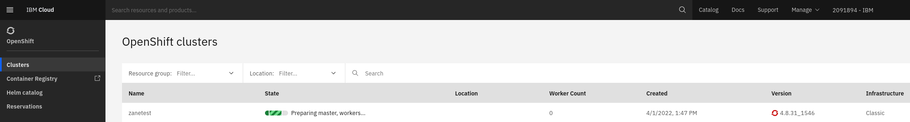
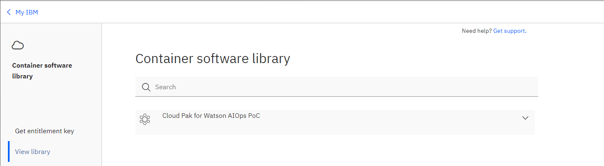
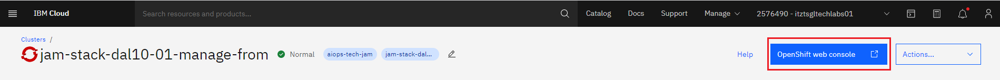
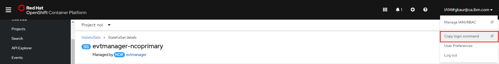
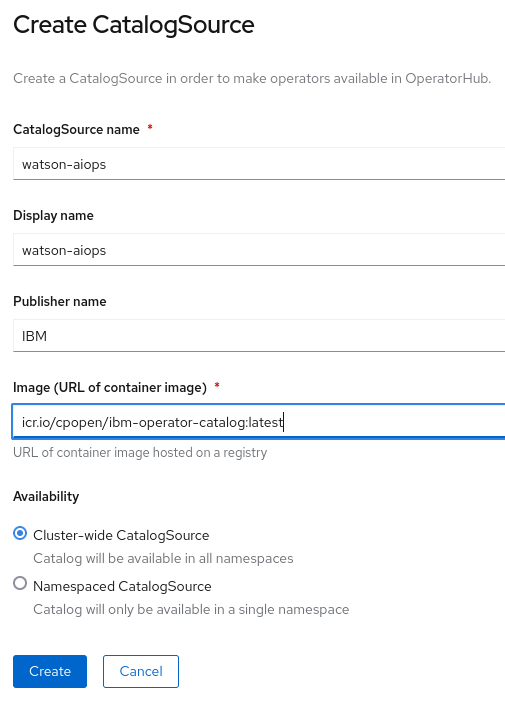
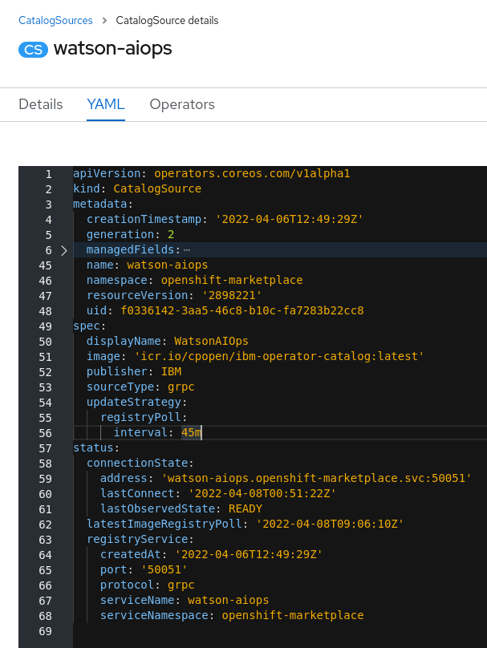
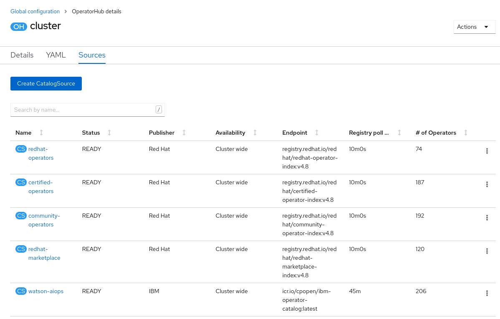
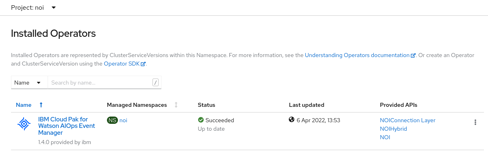
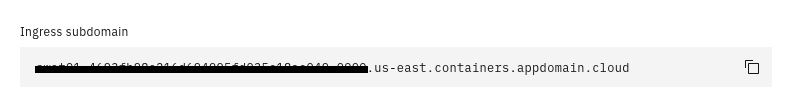
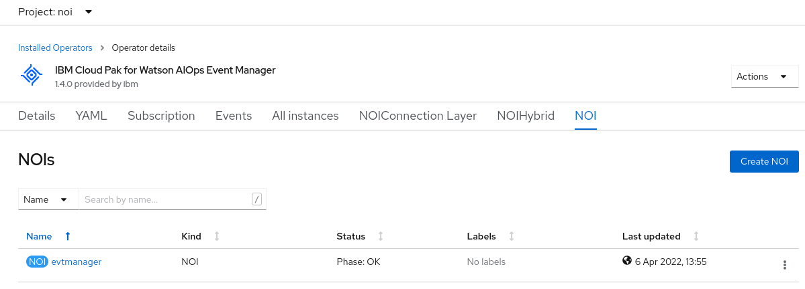

<AnchorLinks>
  <AnchorLink>2-1: Overview</AnchorLink>
  <AnchorLink>2-2: Create your OpenShift cluster on IBM Cloud </AnchorLink>
  <AnchorLink>2-3: Obtain your Entitlement key </AnchorLink>
  <AnchorLink>2-4: Prepare your OpenShift cluster</AnchorLink>
  <AnchorLink>2-5: Install the Watson for AIOps Event Manager Operator</AnchorLink>
  <AnchorLink>2-6: Deploy an instance of Watson for AIOps Event Manager</AnchorLink>
  <AnchorLink>2-7: Locate your login details and log in to Watson for AIOps Event Manager</AnchorLink>
</AnchorLinks>

## 2-1: Overview

This module focuses on the initial deployment of Event Manager.  This deployment scenario will assume you are deploying onto IBM Cloud however the steps would generally apply to an OpenShift cluster deployed on another cloud provider, or on-premise. The exception to this would be the setup of the persistent storage needed by the Event Manager. On IBM Cloud, it is recommended to simply use ibmc-block-gold for your storage class. If it is another cloud provider, select their alternative block storage option. For on-premise deployments, a good option would be VMware vSphere storage, particularly if you are already a VMware shop. In any case, block storage is recommended for performance reasons.

For more detailed notes on the topic of storage, see the documentation link: https://www.ibm.com/docs/en/noi/1.6.5?topic=preparing-storage

By the end of this module, you will have provisioned an OpenShift cluster, prepared your cluster, installed the Operator, and deployed an instance of Watson for AIOps Event Manager. You will then appreciate just how convenient and easy it is to deploy and maintain the next generation of operations management solutions from IBM.


## 2-2: Create your OpenShift cluster on IBM Cloud 

**NOTE: If cluster is already provisioned , you can progress to Section 2.3 **

The Event Manager documentation specifies two sizes of deployment: trial and production.

For a trial sized deployment, the recommended specification is as follows:

* 3 worker nodes
* each with 8 CPUs
* each with 24GB RAM
* each with 120GB disk

For a production deployment, the recommended specification is as follows:

* 6 worker nodes
* each with 14 CPUs
* each with 35GB RAM
* each with 120GB disk

NOTE: If your platform does not offer these exact specifications, then choose worker node specifications that exceed these minimums.

Documentation reference: https://www.ibm.com/docs/en/noi/1.6.5?topic=preparing-sizing

As mentioned, these instructions use the IBM Cloud platform to create an OpenShift cluster. Log into https://cloud.ibm.com and select Openshift → Clusters from the hamburger menu in the top-left hand corner.

Next click on Create cluster and use the following to create and deploy your cluster:

* Choose **Manual** setup with a **Classic** infrastructure.
* Leave the **Resource group** as **Default**.
* Choose the **Geography** closest to you, and choose **Single zone** for **Availability**.
* Choose the **Worker zone** in a city that is closest to you.
* Under **Worker pool**, click **Change flavor** and select a worker node configuration that matches or exceeds that listed above.
* Leave the **Worker pool name** as **default, Encrypt local disk** if you like, and you can leave **Master service endpoint** as **Public endpoint only**.
* Choose **OpenShift 4.8.x** for your **Orchestration service** type and version.
* Select your **OCP entitlement** from the drop-down, and modify your **Cluster name** if you like.
* Click **Create** to create your OpenShift cluster. Provisioning should take around 20 minutes or so.



## 2-3: Obtain your Entitlement key 

Navigate to [**ibm.com**](https://myibm.ibm.com/products-services/containerlibrary) to obtain your **entitlement key** that is assigned to your IBM ID which will grant you access to the IBM Entitled Registry. Copy this into a text editor in preparation for the next step. This will be needed for deploying an instance of Event Manager.

You can check your entitlement for Watson AIOPs by clicking **View Library**



**NOTE:** If you do not have an existing IBM contract that allows you access to the software for these labs, you can register for trial using link [Trial license of Watson AIOps](https://www.ibm.com/account/reg/us-en/login?formid=urx-51074)

## 2-4: Prepare your OpenShift cluster

This step involves creating a namespace to install the Watson for AIOps Event Manager Operator into, and setting up your software entitlement key, so that you will be able to deploy an instance of Event Manager.

This step involves the following tasks:

- Open the **OpenShift UI**
- Acquire a token and log in to the OpenShift cluster via the command line
- Create a **namespace** to deploy Event Manager into
- Create an **entitlement key secret**

Go to your newly created OpenShift cluster and click OpenShift web console to open the main OpenShift UI:



Click on your logged in user id > **Copy Login Command**, then **Display Token**, to reveal the cluster login command. 



Copy the full **oc login** command displayed under **Log in with this token**. Open a command prompt and paste this command into your terminal. This directive will make a connection to your cluster and authenticate you, so you will be ready to start preparing the cluster.

From your command prompt, issue the following command to create the namespace:

```sh
oc create namespace noi
```

**NOTE:** This example uses **noi** as the name of the namespace. You can call it whatever you like however. Rest of the tutorial commands are based on namespace=noi

Prepare a command like the following, that uses your entitlement key to create a registry secret.

```sh
oc create secret docker-registry noi-registry-secret --docker-username=cp --docker-password=aAbBcCdDeEfFgGhHiIjJ0k1l2m3n4o5p6q7r8s9t0 --docker-server=cp.icr.io --namespace=noi
```

**NOTES:**

* You can call the secret anything you like however the suggested value is: **noi-registry-secret**

* The docker-username is always: **cp**

* The docker-password is your **entitlement key**, copied from ibm.com

* The docker-server should be: **cp.icr.io**

* The namespace is the one you created in the previous step - eg. **noi**

You are now ready to install the Event Manager operator and deploy an instance.

For further information on this topic, see the following documentation link: https://www.ibm.com/docs/en/noi/1.6.5?topic=preparing-your-cluster

## 2-5: Install the Watson for AIOps Event Manager Operator

The next step of deploying the Event Manager is to configure the software repository for your new OpenShift cluster, and then locate and install the Watson for AIOps Event Manager Operator. This process will pull down the necessary software images so that you can deploy an instance of the Event Manager.

Return to  the OpenShift Administration UI and go to: **Administration → Cluster Settings → Global configuration → OperatorHub → Sources**

Click on **Create CatalogSource** to add the software catalog source that contains Watson for AIOps and set it up as follows:



**NOTE:** Copy and paste the following to use for the value of Image: **icr.io/cpopen/ibm-operator-catalog:latest**

After creation of your new catalog source, click on its name to edit it, then select the YAML tab.

Add the following lines to your spec and click Save:

```sh
  updateStrategy:
    registryPoll:
      interval: 45m​
```

**NOTE:** It is essential to ensure the space characters and indentation are correct.

After adding the above lines, your configuration should look like this:



After returning to the Sources page, you should have something that looks like the following:



**NOTE:** It may take several minutes for your cluster to query the repository and download the Operator information before it shows a READY status.

Next, go to: **Operators → Operator Hub** and search for **Event Manager**.

Click on **IBM Cloud Pak for Watson AIOps Event Manager** and then **Install**.

Choose the following options:

* **Update channel**: choose the latest: **v1.9**

* **Installation mode**: select **A specific namespace on the cluster** and select your previously created namespace - eg. **noi**

* Leave **Update approval** set to **Automatic**

* Click **Install**

Installation of the Operator will take a few minutes as it pulls down the installation packages from the software repository.

Navigate to: **Operators → Installed Operators** and you will be able to monitor the progress of the Operator installation.  When it has finished, it will look like this:



**NOTE:** Ensure your namespace, also referred to as **Project**, is selected from the top drop-down menu.

The Watson for AIOps Event Manager Operator is now installed and ready for use.

For further information on this topic, see the following documentation link: https://www.ibm.com/docs/en/noi/1.6.5?topic=installing-olm-ui


## 2-6: Deploy an instance of Watson for AIOps Event Manager

This final step involves deploying an instance of Watson for AIOps Event Manager onto the OpenShift cluster.

Before doing so, you will need to have your cluster domain information to-hand, as it is required by the installation. To obtain your cluster domain name, go back to the your IBM Cloud account, navigate to your OpenShift clusters page, and click on your cluster to inspect the details.

Under the **Networking** section, you will see a field like the following that contains your **Ingress subdomain**:



Copy this value into a text editor for use during the instance deployment.

The Event Manager deployment will ask you for your OpenShift **Cluster Domain (FQDN)** as part of the configuration. The inline instructions say the following:

`Use the fully qualified domain name (FQDN) to specify the cluster domain: apps.<clustername>.*.*.com`

If you are installing Event Manager on an IBM Cloud OpenShift cluster (as in this case), simply use the Ingress subdomain as-is. Do not prepend the value with apps. for instance, or modify it in any way. If you are deploying onto an on-premise OpenShift cluster, use apps.FQDN as recommended.

Navigate to: **Operators → Installed Operators** and click on **IBM Cloud Pak for Watson AIOps Event Manager**.

Click on the **NOI** tab and click the button **Create NOI**.  You will be prompted to enter the configuration settings for your new instance of Event Manager.

**NOTE:** NOI stands for **Netcool Operations Insight** and means the same thing as **Watson for AIOps Event Manager** in this context.

Use the following to guide you through the various configuration settings. Where there is no note about any parameter given, you can leave it as its default setting:

* Use the default value of `evtmanager` for the Name

* Choose **noi-registry-secret** for your **Entitlement Secret** (this is the one you created in step 2)

* Click on **License** and set License accept to **true**

* Ensure **Version** is set to the latest: **1.6.5.1**

* Under **Cluster Domain (FQDN)**, enter the **Ingress subdomain** value you copied earlier (or apps.FQDN if on-premise)

* Under **Deployment Type**, choose **trial** or **production** depending on your hardware profile from Step 1. For tutorial we will use **trial**

* Click on **LDAP** and select **ibmc-block-gold** for Storage class for LDAP

* Click on **Persistence** and set Persistence Enabled to **true** and select **ibmc-block-gold** for each **StorageClass** prompt

* Click on **Topology** and and select **ibmc-block-gold** for both StorageClass prompts

* Click on Topology Observers and check each Observer you want to deploy

* Click on Create to begin deploying your Event Manager instance

The deployment of your instance will normally take about 20 to 30 minutes. You can monitor the deployment's progress both from Installed Operators page as well as from: Workloads → Pods page. Ensure that the Project drop-down menu at the top of the page is set to your namespace. Once all the pods have deployed and are showing with a Status of Running and 1/1 or 2/2, you will know that your deployment has completed. This can also be confirmed by returning to the Installed Operators page and seeing: Phase: OK next to your deployment:



Congratulations! You have successfully deployed an OpenShift cluster, installed the Watson for AIOps Event Manager Operator, and deployed an instance of the Event Manager.

## 2-7: Locate your login details and log in to Watson for AIOps Event Manager

The final step is to locate your login credentials from your newly deployed instance of Watson for AIOps Event Manager and log in to the console.

From the OpenShift UI, select **Workloads → Secrets**.

In the search bar, search for **icpadmin** and you will find a secret named something like: **evtmanager-icpadmin-secret**

**NOTE:** The name of the secret is based on the name of your NOI deployment. In this case, mine is called **evtmanager**.


Click on the secret, look to the bottom of the page in the **Data** section, and you will see a data item called: **ICP_ADMIN_PASSWORD**

On the right-hand side of the page, click on **Reveal values**. This will cause the password to be made visible. Copy this and save it in a local text file. This is the password to your Watson for AIOps Event Manager. Note that the username is: **icpadmin**.

The access URL for your Event Manager instance is in the format:

`https://netcool-<deployment-name>.<ingress-subdomain>`

For example:

`https://netcool-evtmanager.swat01-4693fb98eXXXXXXXXXXXXXX5c18ac049-0000.us-east.containers.appdomain.cloud`

* Go to your Event Manager login page and log in as icpadmin, using the password you just got from  the secret.

* By default, the icpadmin user does not have the full list of roles assigned to it to operate Event Manager capabilities. It is necessary to assign all administrative roles to the icpadmin user before continuing to the next module. Use the following to set this up:

* Click on the hamburger button in the top-left corner of the screen, and select **Netcool WebGUI** from the drop-down menu. A new tab opens with the Netcool/WebGUI UI displayed.

* Click on the cog wheel in the top-right hand corner and select **User Roles** from the drop-down menu.

* Click on the **Search** button to bring up all users (basically do an unfiltered search).

* Click on the **icpadmin** user hyperlink.

* Check all available **Roles**, scroll down, and click **Save**.

* Close the Netcool/WebGUI tab, log out of the Event Manager UI, and log back in again as **icpadmin**. 

* You will now see the full list of menu items under the hamburger icon in the top-left corner of the screen.


You have now completed this module and are ready for module "Connect an on-premise Probe to Watson for AIOps Event Manager"


[Reference Blog](https://community.ibm.com/community/user/aiops/blogs/zane-bray1/2022/04/01/getting-started-with-watson-aiops-event-manager-17)