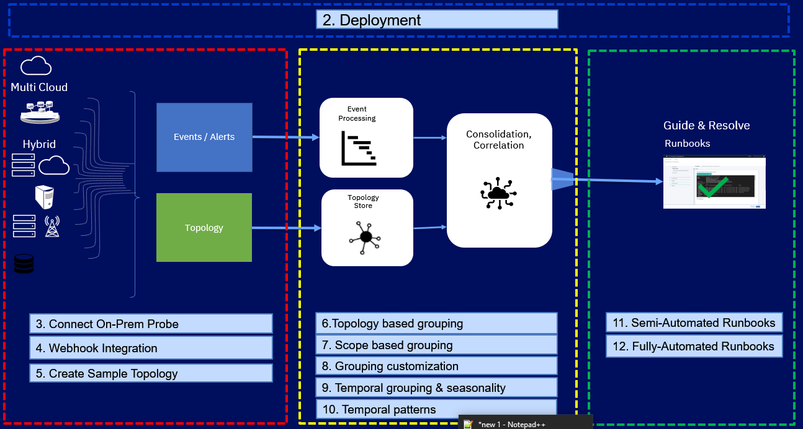

Welcome to the Watson for AIOps Event Manager tutorial series.

The tutorial series includes the following topics:

- [Deployment](/tutorials/aiops/installation)
- [Connect an on-premise Probe](/tutorials/aiops/connections)
- [Set up a webhook integration](/tutorials/aiops/webhook)
- [Create sample topology](/tutorials/aiops/createTopology)
- [Configure topology group templates](/tutorials/aiops/configureTopology)
- [Configure scope-based grouping](/tutorials/aiops/scopeBasedGrouping)
- [Enable optional grouping features](/tutorials/aiops/optionalGrouping)
- [Temporal Grouping & Seasonality](/tutorials/aiops/temporalGrouping)
- [Temporal Patterns](/tutorials/aiops/temporalPatterns)
- [Semi-Automated Runbooks](/tutorials/aiops/semiAutomatedRunbooks)
- [Fully-Automated Runbooks](/tutorials/aiops/fullyAutomatedRunbooks)

NOTES for Watson for AIOps Event Manager modules :

- You can skip section 2.2 - your cluster is already created
- You will have an email with your dedicated cluster information, including your control VM
- The AIops OpenShift cluster is the one you will be installing Event Manager onto

- For any instructions that use the "oc" command (interacting with your cluster), use your "control" VM:

	1. Download the rsa_id and rsa_id.pub files to your laptop
	2. chmod 600 rsa_id (otherwise the ssh will fail)
	3. Connect with: ssh -i rsa_id jammer@10.20.30.40
	4. Log in to your cluster using the Login Command copied from the OpenShift UI

- You can obtain a trial license from: https://www.ibm.com/account/reg/us-en/login?formid=urx-51074

