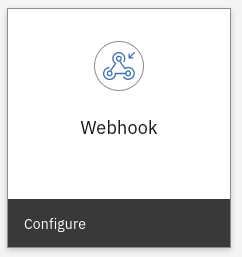
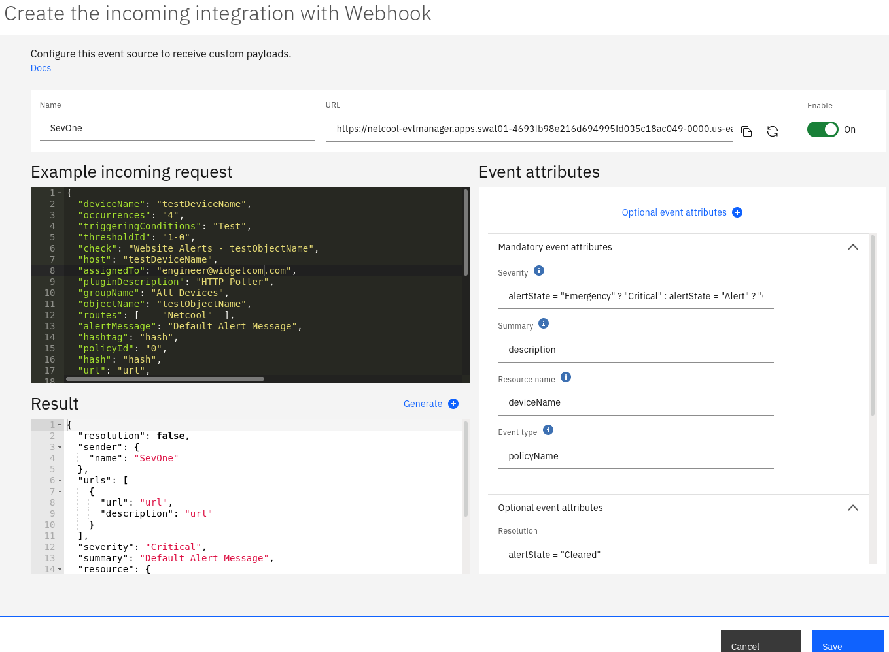

<AnchorLinks>
  <AnchorLink>4-1: Overview</AnchorLink>
  <AnchorLink>4-2: Create a new webhook integration with Microsoft Azure </AnchorLink>
  <AnchorLink>4-3: Create a new generic webhook integration with SevOne</AnchorLink>
</AnchorLinks>


## 4-1: Overview

This module focuses on the set up of two webhook integrations, so that events can be received from a cloud event source. The examples include an off-the-shelf integration with Microsoft Azure, and a generic webhook integration with SevOne.

By the end of this module, you will have configured two webhooks and be receiving events from your target sources.

## 4-2: Create a new webhook integration with Microsoft Azure

Watson for AIOps Event Manager comes with a number of built-in off-the-shelf event receivers that are pre-configured to be able to receive and interpret event payloads coming from certain types of event source, and then normalise them and insert them into Event Manager as normal events. The Microsoft Azure event receiver provides monitoring services for Azure resources and will receive events of the following types:

* Azure Classic Metrics and Azure Metrics
* Azure Activity Log Alerts
* Azure Auto-shutdown notification
* Azure Auto-scales notification
* Azure Log Search Alerts

To create a new Microsoft Azure event receiver integration, navigate to: **Administration → Integration with other systems**. Click on **New integration** and **Configure** a new integration for **Microsoft Azure**. Give the integration a name, and copy the provided webhook to a text editor and save it in a safe place. For security reasons, once you leave this page, you won't be able to access the webhook URL again.

The rest of the set-up is done in the Microsoft Azure portal, using the webhook URL just created. Instructions for doing so are provided in IBM documentation: https://www.ibm.com/docs/en/noi/1.6.5?topic=integrations-microsoft-azure

Once you have configured your event integration on both sides, return to the event view, and select the **AllEvents** or **Default** filter to see your new events.

A full list of the incoming event integrations are documented here: https://www.ibm.com/docs/en/noi/1.6.5?topic=systems-configuring-incoming-integrations

## 4-3: Create a new generic webhook integration with SevOne

While the event integrations provide a large number of off-the-shelf integrations, it is typical that a user will have an event source for which there is no corresponding integration. Like everything with Netcool, where there is not an off-the-shelf option, there is always the generic option of integration as a backstop. In this exercise, we will create a generic webhook integration with SevOne.

The basic steps to creating a generic webhook integration are as follows:

1. Assuming the event source is capable of sending to a webhook, obtain a sample payload from that source system.
2. Create the integration via the Event Manager UI.
3. Paste the sample JSON event payload into the sample box.
4. Specify the payload-to-field mappings.
5. Test the integration.


**NOTE:** Just as for the Microsoft Azure integration, it is essential to copy the generated webhook URL and save it in a text document for future reference. After the integration is saved, there is no way to retrieve the URL.

In this exercise, it is assumed that the webhook configuration has been done already on the SevOne side, and it only awaits the webhook URL.

First, navigate to: **Administration → Integration with other systems**. Click on **New integration** and **Configure** a new generic **Webhook** integration:



Use the following steps to set up your integration:

* Configure the Name field with a label to identify your webhook - eg. "SevOne".
* Copy the generated URL and save it to a text file.
* Copy sample SevOne payload in **Example incoming request**
* Configure the Event attributes.
* Check the Result field, to ensure there are no errors, and the mapped values are showing.
* Click Generate to generate a test event using the sample.
* Check the event in the Event List to ensure it looks correct.
* Copy the generated webhook over to your SevOne system as an event target.

A sample SevOne payload is provided below, which may be used to set up this integration (copy into **Example incoming request**):

```sh
{
"deviceName": "testDeviceName",
"occurrences": "4",
"triggeringConditions": "Test",
"thresholdId": "1-0",
"check": "Website Alerts - testObjectName",
"host": "testDeviceName",
"assignedTo": "engineer@widgetcom.com",
"pluginDescription": "HTTP Poller",
"groupName": "All Devices",
"objectName": "testObjectName",
"routes": ["Netcool"],
"alertMessage": "Default Alert Message",
"hashtag": "hash",
"policyId": "0",
"hash": "hash",
"url": "url",
"deviceId": "-1",
"alertState": "Alert",
"sender": "SevOne",
"objectAltName": "testObjectAltName",
"thresholdName": "Website Alerts - testDeviceName - testObjectName",
"alertType": "Metric",
"alertId": "-1",
"objectId": "-1",
"cluster": "All Devices",
"description": "Default Alert Message",
"deviceIp": "10.1.2.3",
"policyName": "Website Alerts",
"objectDescription": "testObjectDescription",
"pluginName": "HTTP"
}
```

Regarding the Event attributes, the following example mappings can be used:

```sh
Severity: alertState = "Emergency" ? "Critical" : alertState = "Alert" ? "Critical" : alertState = "Critical" ? "Critical" : alertState = "Error" ? "Major" : alertState = "Cleared" ? "Cleared"
Summary: description
Resource name: deviceName
Event type: policyName
* Resolution:  alertState = "Cleared"
* Sender: Name: "SevOne"
* URL 1: URL: url
* URL 1: Description: url

* Fields marked with an asterisk first need to be added via the Optional event attributes link.
```
**NOTE:** Further information regarding the generic webhook event integration can be found here, including a table that maps the integration attributes to event fields in the Event Manager event store (Netcool/OMNIbus ObjectServer): https://www.ibm.com/docs/en/noi/1.6.5?topic=integrations-webhook

**NOTE:** Complex mappings such as the Severity field example above can be mapped using JSONATA functions: http://docs.jsonata.org/object-functions.html


The completed configuration should look something like the following:




The sample event generated via the **Generate** function should look something like the following:


You have now completed this module and are ready for module "Create sample topology in Watson for AIOps Event Manager".


[Reference Blog](https://community.ibm.com/community/user/aiops/blogs/zane-bray1/2022/04/22/getting-started-with-watson-aiops-event-manager-37)
