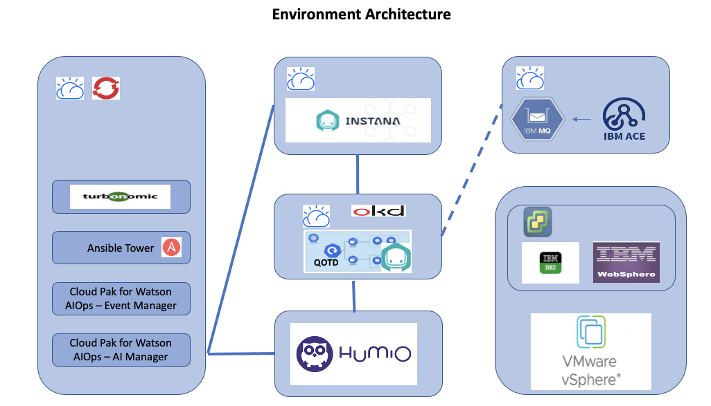

## Architecture of the Environment

Each team will be provided with the following:

* OpenShift Cluster with pre-installed Cloud Pak for Watson AIOps AI Manager, Cloud Pak for Watson AIOps Event Manager, Turbonomic and Ansible Tower. This cluster will also have independent OpenLdap installed.

* Instana server running on IBM Cloud VSI

* OKD 3.11 Cluster installed and a running deployment of `Quote of the Day` application running cloud natively. This server has instana agent running on the OKD cluster and connected to the instana server. There is also `Humio Fluentbit` agent running and sending logs to a centralized `Humio` server.

* IBM Cloud VSI which has IBM MQ and IBM ACE running. This can be connected to the `Quote of the Day` application for any MQ and ACE traces.

* A VM running in centralized VMware environment which as DB2, IBM Websphere 8.5.5 running. This can be connected to the Instana server by installing an agent.

Additionally there are centralized 

* Humio Server for log aggregation
* VMware environment running on IBM Cloud 
