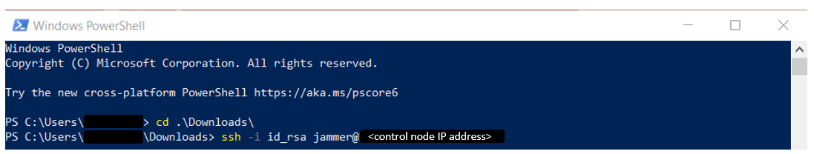
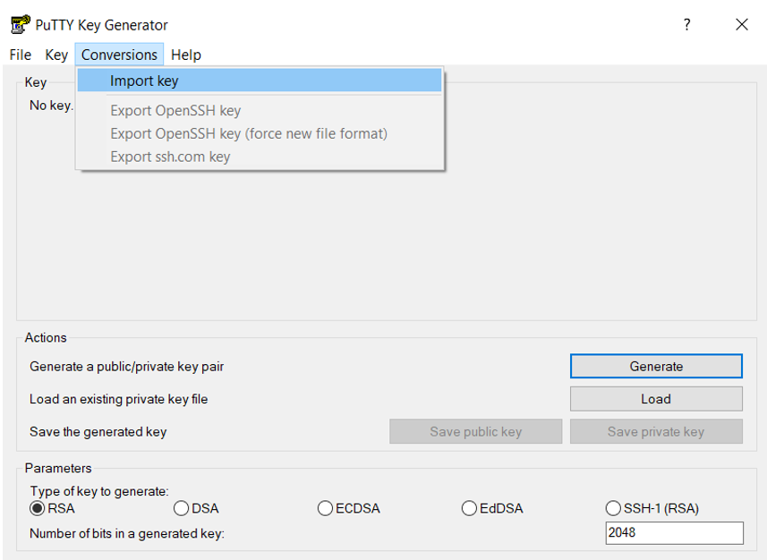
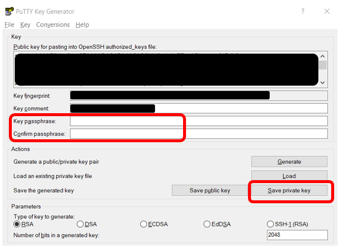
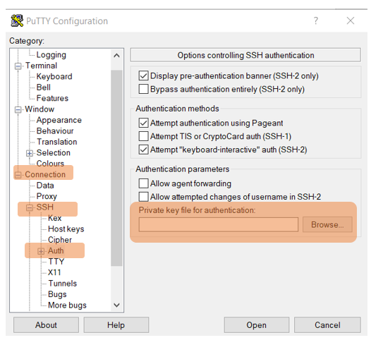

# Environmental Information

The lab environment includes 2 Openshift clusters and 4 VMs.

Openshift clusters:
1) AIOps cluster: will be used to install IBM Cloud Pak for Watson AIOps Event Manager, AI Manager and Turbonomic. 
2) Application cluster: will be used to install sample applications include RobotShop, Instana Agent, KubeTurbo Agent. Quote Of The Day is pre-installed.

Virtual Machines:
1) Control VM: will be used as "Jump Host" to ssh to all other VMs and run "oc" command to manage the 2 Openshift clusters.
2) Instana VM: will be used to install single self-hosted Instana server.
3) MQACE VM: IBM middleware (ACE and MQ) are pre-installed.
4) PI VM: will be used to install IBM Metric Manager (Predictive Insights). DB2, Objectserver, Dash and WebGUI are pre-installed.

Please see the diagram below for details. 
- Green boxes are pre-installed. 
- You will install components in blue boxes.


# How to access environment

- [Linux and Mac Users](#linux-and-mac-users)
- [Windows Users](#windows-users)

## Linux and Mac Users

### Connect to Server with Private Key

1) Search for the `Terminal app` and open

2) Update your *id_rsa* file permissions to avoid SSH permission errors

```
chmod 600 <path-to-key-file>/id_rsa
```

3) Access your control node using your provided SSH key: 

```
ssh -i <path-to-your-key> <user>@<control node IP address>
```

## Windows Users

- For Windows 10 or higher, it's recommended to use [Windows PowerShell](#1.-windows-powershell)
- For Windows users who are on lower than Windows 10, you can use [PuTTY](#2.-putty)

### 1. Windows PowerShell

1) To open PowerShell, press `Windows+X`, and then click `Windows PowerShell`.


2) Access your control node using your provided SSH key:

```
ssh -i <path-to-your-key> <user>@<control node IP address>
```

Example:



### 2. PuTTY

Use SSH Keys with PuTTY on Windows

Requirements:

- Install PuTTY and PuTTYgen from the [PuTTY Download Page](https://www.chiark.greenend.org.uk/~sgtatham/putty/latest.html)
- Remote server accessible over OpenSSH

#### Use Existing Public And Private Keys

1) If you have an existing OpenSSH public and private key, copy the `id_rsa` key to your Windows desktop. 

2) Launch `PuTTYgen` from the Windows Programs list

3) Click `Conversions` from the PuTTY Key Generator menu and select `Import key`



4) Navigate to the OpenSSH private key and click `Open`.

5) Under `Actions` -> `Save the generated key`, select `Save private key`. You can enter **optional** passphrase to protect the private key.



6) Save the private key to the desktop as `id_rsa.ppk`.

If the public key is already appended to the `authorized_keys` file on the remote SSH server, then proceed to [Connect to Server with Private Key](#connect-to-server-with-private-key).

#### Connect to Server with Private Key

1) Close the PuTTYgen tool and open `PuTTY`

2) Enter the remote server `Host Name (or IP address)` under `Session`.


3) Navigate to `Connection -> SSH -> Auth`. Click `Browse...` under `Authentication parameters` -> `Private key file for authentication`



4) Locate the `id_rsa.ppk` private key and click `Open`.


5) Finally, click `Open` again to log into the remote server with key pair authentication.
