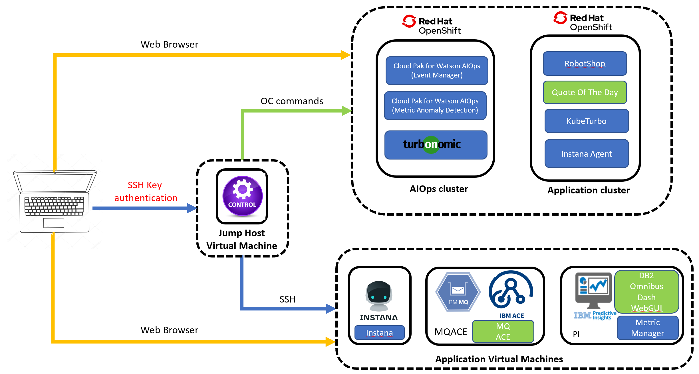

# Environmental Information

## Use SSH Keys with PuTTY on Windows

Requirements:

- Install PuTTY and PuTTYgen from the [PuTTY Download Page](https://www.chiark.greenend.org.uk/~sgtatham/putty/latest.html)
- Remote server accessible over OpenSSH

### Use Existing Public And Private Keys

1) If you have an existing OpenSSH public and private key, copy the `id_rsa` key to your Windows desktop. 

2) Launch `PuTTYgen` from the Windows Programs list

3) Click `Conversions` from the PuTTY Key Generator menu and select `Import key`

4) Navigate to the OpenSSH private key and click `Open`.

5) Under `Actions` -> `Save the generated key`, select `Save private key`. You can enter **optional** passphrase to protect the private key.

6) Save the private key to the desktop as `id_rsa.ppk`.

If the public key is already appended to the `authorized_keys` file on the remote SSH server, then proceed to [Connect to Server with Private Key](#connect-to-server-with-private-key).

### Connect to Server with Private Key

1) Close the PuTTYgen tool and open `PuTTY`

2) Enter the remote server `Host Name (or IP address)` under `Session`.

3) Navigate to `Connection -> SSH -> Auth`. Click `Browse...` under `Authentication parameters` -> `Private key file for authentication`

4) Locate the `id_rsa.ppk` private key and click `Open`.

5) Finally, click `Open` again to log into the remote server with key pair authentication.
