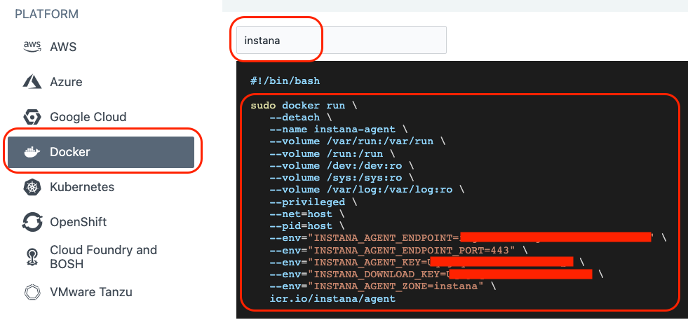

<AnchorLinks>
  <AnchorLink>3-1: Instana Agent Deployment Options</AnchorLink>
  <AnchorLink>3-2: Installing Instana agent on Linux VM</AnchorLink>
  <AnchorLink>3-3: Installing Instana Agent on the Instana Server</AnchorLink>
  <AnchorLink>3-4: Installing Instana agent on OpenShift cluster</AnchorLink>
  <AnchorLink>3-5: Troubleshooting Instana agent installation on Kubernetes cluster</AnchorLink>
  <AnchorLink>3-6: Configuring Proxy</AnchorLink>
  <AnchorLink>3-7: Configuring Instana Agent</AnchorLink>
  <AnchorLink>3-8: Agent Configuration Troubleshooting</AnchorLink>
  <AnchorLink>3-9: Configuring GitOps for Agents</AnchorLink>
</AnchorLinks>

## 3-1:  Instana Agent Deployment Options

Instana has a variety of agent installation options including the mirror repository and static agents that allow customers to meet strict change control processes. Some of the available options are listed below:

- OS specific installer (Linux, MacOS, Windows, UNIX)
- Container setup
- Docker (and other container managers)
- Kubernetes
- OpenShift
- Hosted Cloud Services
- Serverless component

All above mentioned methods are accessible via the wizard on the Instana UI


If the Instana user interface is not available, go back and look at the command prompt where you issued the **instana update** command to change the configuration parameters.  The command may still be running.  The user interface won't be available until the update is complete.

You begin by choosing the platform where you will be installing the agent.  Then you can selected the **Technology** dropdown and choose from a list of installation options.  For example, on Linux, you can choose a automatic **one-liner** installation, RPM, or TAR file installation.  For OpenShift/kubernetes, you have multiple options including operator, helm, and yaml installs.


> **&#9888; HINT: Instana agent install needs privileges! ROOT!!**

When installing Instana agent you have to select if you want agent to be **dynamic** or **static**. What does it mean? Here is the excerpt from [Instana agent documentation](https://www.ibm.com/docs/en/SSE1JP5_current/src/pages/setup_and_manage/host_agent/index.html)

The Instana Host Agent has two types, **dynamic** and **static**, based on whether it can update itself or not.

A **dynamic** host agent downloads on startup the latest set of sensors from repositories. By default, a dynamic agent updates itself daily with the latest and greatest capabilities that are released. It is also possible to tightly control the updating of dynamic host agents by [pinning a version](https://www.ibm.com/docs/en/obi/current?topic=agent-updates-dynamic-host-agents#version-pinning)

By default, dynamic host agents use the Instana repository to pull updates, but it is possible to [set up your own managed mirror](https://www.ibm.com/docs/en/obi/current?topic=agent-repositories#agent-repositories).  Currently, the mirror must be a Nexus repository.  This is probably the best option for must customers because it allows them the benefits of automatic updates, while at the same time controlling the content that is in the repository.

A **static** host agent is a self-contained host agent that includes all the latest available components at the time of its release, and has no dynamic update capabilities. The static host agent has a stable "bill of materials" that never changes after the host agent's installation. 

> **&#9888; HINT: Static host agents require no internet connection to the Instana repository, and are recommended in restrictive network setups.**

***

## 3-2:  Installing Instana Agent on Linux VM

You will be installing the Instana Agent on the ACE/MQ server that has been provisioned for you for this lab.  Open up a terminal window and login to the ACE/MQ server as root.  You can ssh to the  ACE/MQ server from the control node.
```sh
ssh <ACE/MQ server IP address\>

```

Then use sudo to switch to root:
```sh
sudo -i

```

In Instana UI, select the **"Stan"** the robot icon in the upper left corner
  

Next, click the **"Deploy Agent"** button near the upper right corner.
  

A window will open with a list of different environments where you can install the Instana Agent.  This is a Linux server, so select Linux on the left side of the screen.
  

Just to see what your options are, select the **"Technology"** dropdown list to see the different ways that you can install the Instana Agent.  You'll notice that you can perform
rpm installs or simply download a tar file.  But, the easiest method is the default one, **"Automatic Installation (One-Liner)"**.  Select that option in the dropdown list.

Notice that there are a few other options including the use of different java versions, static vs. dynamic agents, etc.   Leave the default settings.

Next, select the checkbox next to **"Install and start as service"**.  This will setup the systemctl autostart process and will also start the Agent immediately after it is installed.

Finally, copy and paste the curl command into the terminal window with the SSH session to the target server.

The install will progress and you will see an output similar to the screen capture shown below.

  

At this point the Agent is installed and up and running.

The Agent will automatically start monitoring the operating system and start discovering key processes and middleware.  In many cases it will automatically instrument
those technologies.  In the case of some technologies (eg. MQ an and App Connect Enterprise), there are manual configuration steps required due to the need to provide credentials for accessing those applications.  

***

## 3-3:  Installing Instana Agent on the Instana Server

Next, you will install the Instana agent on the Instana server.  From the control node, ssh to the Instana server.  Then, type **sudo -i** to switch to the root user.
```sh
sudo -i

```

In Instana UI, select the **"Stan"** the robot icon in the upper left corner
  

Next, click the **"Deploy Agent"** button near the upper right corner.
  

For this install, choose the **Docker** platform.  At the top of the page you will see an entry box where you can specify a **Zone**.  Specify a zone name such as **instana**.  Then, copy the
docker run command and past it into the terminal window.

  

If you issue a **docker ps** command, you'll see that there is a new docker container running. This container is the Instana agent.
```sh
docker ps
```

  


This will install the Instana Agent as a docker container running on the Instana Server machine.   It will begin to collect host metrics and will discover the various technologies like 
Cassandra, ClickHouse, ElasticSearch, Nginx, Node.js, and more.  Many of these technologies will be monitored automatically without the need for configuration.  In some cases, the sensors need to be configured in order to see the performance metrics.

***

## 3-4:  Installing Instana Agent on OpenShift Cluster

The next step is to install the Instana Monitoring into the OpenShift Cluster that we'll be using to install our Robot Shop application and has the Quote of the Day application pre-installed.  This is the cluster that we'll be monitoring.

Throughout this lab, we will be using the "oc" command to run commands within OpenShift.  The "oc" command is similar to kubectl for other versions of Kubernetes.  There are
some minor syntax differences.

To install Instana agent on OpenShift cluster you need to authenticate to the OCP cluster with appropriate permissions (cluster admin role). In the lab environment, the **control node** is already logged into the cluster.  You can confirm by issues a command such as **oc get pods**  Follow the steps below to install the Agent into the cluster:

In Instana UI select the "Stan" the robot icon in the upper left corner

  

Next, click the **"Deploy Agent"** button near the upper right corner.

  

A window will open with a list of different environments where you can install the Instana Agent.  To install into OpenShift, select OpenShift from the list.

  

Select the dropdown list next to the word **"Technology"**.  Notice that there are multiple options for installing the Agent.  Choose the **"YAML"** option from the list.

   

Enter a name for the Cluster and Zone - this will allow you to find your Agent and Kubernetes Cluster within the user interface and not get confused by data coming in from other agents.  Specify **Quote of the Day** for the Zone name since this OCP cluster will be used for the **Quote of the Day** application.

> **&#9888; HINT: Zones are used to organize the Instana Agents (and sensors).  Many customers create zones for lines of business, data center locations, public cloud regions, etc**

Next, click the "Download" button to download the yaml file.  The yaml file has been configured specifically to connect to your Instana backend environment and will contain the **Cluster** name and **Zone** name that you previously specified.

In the terminal session where you are authenticated to your OCP cluster you can now install the downloaded yaml file. This will install the Instana Agent as a daemonset within the OpenShift cluster.  The process is nearly identical for other versions of Kubernetes.

To install the Agent using the yaml file, type:  
```sh
oc create -f configuration.yaml
```

You will see output similar to what's shown below
  

 Next, you need to setup the proper permissions for the service account.  This will allow the Agent to have access to monitor the entire cluster.

 First, change to the instana-agent OpenShift project by typing:
 ```sh
 oc project instana-agent
 ```

 Type the following command to setup the proper permissions:
 ```sh
 oc adm policy add-scc-to-user privileged -z instana-agent
 ```

 You should see output similar to the screen capture below.
  

Next, type:

```sh
oc get pods -n instana-agent
```

This will provide a list of the pods that are in this namespace (project). **There should be one pod for each worker node in your target cluster**. The Agent is deployed as a daemonset so that if a new Worker Node is added to the cluster, monitoring will automatically get added to the new Worker Node.  Check, if the instana-agent pods are running.
  

If there are no pods running, wait a minute and issue the "oc get pods" command again. This completes the installation of Instana agent on OpenShift cluster.

***

## 3-5:  Troubleshooting Instana Agent Installation on Kubernetes Cluster

If you don't see your cluster in Instana UI after a couple of minutes, you need to troubleshoot the Instana Agent.  From a terminal window with connection to your OCP cluster, issue the following command:

```sh
oc get pods -n instana-agent
```

Check to make sure that all pods are running (since Instana agent runs as daemonset, number of pods should be equal to number of nodes in your cluster). If pods are running, you can examine the logs of one of the pods. Type:  

```sh
oc logs <POD NAME> -c instana-agent
```

where **<POD NAME\>** is one of the pods listed in the previous command.

***

## 3-6:  Configuring Proxy

If there is no direct connectivity for the Instana agent you may need to setup a proxy. There are 2 connections with 2 different locations for configuration:

- Connection to **Instana Backend** - defined in *INSTANA-AGENT-DIR*/etc/instana/com.instana.agent.main.sender.Backend.cfg
- Connection to **Agent/Sensor Repository** - defined in  *INSTANA-AGENT-DIR*/etc/mvn-settings.xml (This is used in case client wants to setup internal maven2 mirror repository)

Proxy configuration goes into the respective files. You can also use [environment variables](https://www.ibm.com/docs/en/obi/current?topic=requirements-installing-host-agent-docker#agent-configuration)

For backend connectivity you have to define *INSTANA_AGENT_PROXY_* variables. For repository connectivity you have to define *INSTANA_REPOSITORY_PROXY_* variables.

***

## 3-7:  Configuring Instana Agent

There are multiple ways to configure Instana agent. Settings related to agent functionality reside in `configuration.yaml` file located by default in `/opt/instana/agent/etc/instana` directory. However, other settings related to agent environment sits in other *.cfg files.

> **&#9888; HINT: Agent will actually read and use ANY yaml file in that directory.**

Some customers choose to have separate yaml files for each key technology.  For example, you could create a mq.yaml file and an ace.yaml file in the same directory and it would read both files. `configuration.yaml` will contain sample configuration entries and comments for ALL available sensors at the time of your install, **BUT** it will not automatically add new sensor config as new sensors become available.

For host based installation you can update `configuration.yaml` and agent should pick up changes automatically (no restart required). For Kubernetes based installations, there is `instana-agent` configmap where you can customize the same content that you see in the configuration.yaml file.  Using kubernetes/oc commands, you can edit the configmap.

> **&#9888; HINT: Instana agent configuration file must be a proper YAML - if your changes are not applied, make sure that it's not a formatting error**

***

## 3-8:  Agent Configuration Troubleshooting

The first place to look when the agent does not start properly or does not work as expected is agent log file. By default it is located in `/opt/instana/agent/data/log/agent.log`

In case of Kubernetes based deployment you have to look at logs of `instana-agent` pods running in `instana-agent` namespace.

***

## 4-9:  Configuring GitOps for Agents

If you don't want to modify the Instana agent configuration files for each agent locally, you can setup a centralized git repositoy for configuration files and instruct Instana agent to use these files. To accomplish that, follow the steps from the [documentation](https://www.ibm.com/docs/en/obi/current?topic=configuration-git-based-management#git-based-configuration-management).

The Instana agent fetches configuration updates from the remote repository:

1. Upon the startup or restart.
1. Through a reboot initiated over the Agent Management Dashboard.
1. Through a configuration change over the Agent Management Dashboard.
1. Through the Web API as described in the Host Agent section and the integrations that rely on it like the GitHub Update Agent action.

***

Proceed to section 4, where you will install and instrument the Robot Shop application.