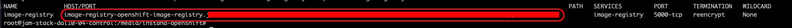

<AnchorLinks>
  <AnchorLink>3-1: Introduction</AnchorLink>
  <AnchorLink>3-2: Create Website Within Instana</AnchorLink>
  <AnchorLink>3-3: Install Bee Travels</AnchorLink>
  <AnchorLink>3-4: Automated Load</AnchorLink>
  <AnchorLink>3-5: Summary</AnchorLink>/AnchorLinks>
</AnchorLinks>
***


## 3-1:  Introduction

In this portion of the lab, you will be installing the **Bee Travels** application.   **Bee Travels** is a microservices based travel agency application that runs in OpenShift.  As part of the installation, you will learn how to add **Website Monitoring** into the application.  This will add javascript injection into the web pages so that you can capture **End User Experience (EUM)** / **Real User Monitoring (RUM)** data from the end users that are accessing the web pages.


The **Bee Travels** GitHub repository that you will be using was cloned from the official GitHub location that can be found here:  https://github.com/bee-travels.  You'll find additional information about **Bee Travels** at that site.  The application was modified slightly to work in the environment where your application will be installed.

***

## 3-2:  Create Website Within Instana
If you want to capture EUM/RUM data within Instana, you must first create a website within the GUI (or via API).  Open the Instana GUI within your browser. 

On left side navigation, select **Websites & Mobile Apps**. You'll see a dialog where you can entire a Website Name.  Enter **Bee Travels** as the website name.  Then, click the **Add Website** button.


A dialog containing **javascript** will open.  You can either copy the **javascript** or leave this dialog open so that we can use it later.  The javascript is used for **javascript injection** to gather the EUM/RUM data from the end users that access the Bee Travels application.  This **javascript** must be added to the web pages that make up the application. 

***

## 3-3:  Install Bee Travels

You will be performing the installation steps from the **control node**.  Within the **control node** change directory to /media or another directory where you can download the **Bee Travels** application.

You will need to perform some of the steps in these instructions as root.  Type the following command:
```sh
sudo su -

```

Within the /media directory, clone the GitHub repository by typing:
```sh
git clone https://github.com/IBM/instana-openshift.git

```

This will create a directory within the /media directory named **instana-openshift**.  Change directory to **instana-openshift** directory:
```sh
cd instana-openshift

```

Next, you will add the **javascript** to the web pages so that the application can capture the EUM/RUM data.  You will be editing the index.html file that is used for the front end of the **Bee Travels** applicdation.

Use vi to edit /media/instana-openshift/src/services/ui/frontend/public/index.html
```sh
vi /media/instana-openshift/src/services/ui/frontend/public/index.html

```

Within the editor, you will see the following at the top of the HTML file.


Immediately after **<head>**, add the **javascript** that was copied from the Instana UI.  If you don't have the **javascript** copied, go back into the Instana UI and copy the block of **javascript**.

Then, paste the **javascript** block immediately after **<head>**

The section should now look as follows, keeping in mind that some of your javascript will be slightly different to match your Instana server.

Save the file in **vi** by typing **:wq**.

Next, you will be setting up a secure route to access the registry.  

First, confirm that the **image-registry** service exists.  Type:
```sh
oc get svc -n openshift-image-registry
```

You should see output similar to this:


Now, create a secured route for the **image-registry**.   This route uses reencrypt TLS termination.  Type the following command:

```sh
oc create route reencrypt --service=image-registry -n openshift-image-registry

```

You should see results similar to this:


Next, retrieve the **hostname** and **port** that were assigned to the **image-registry** route.  Run the following command:
```sh
oc get route image-registry -n openshift-image-registry

```

You will see an output similar to what's shown below.  


In this example, there is no port number because it is using the HTTPS port.

Copy the hostname into your clipboard.

We will now set a **HOST** environment variable to match the **Host** and **Port** retieved in the previous step.  Type the following command, but replace <hostname\> with the hostname that you copied to your clipboard.

```sh
export HOST=<hostname>
```

Example:  **export HOST=image-registry-openshift-image-registry.jam-stack-dal10-04-565094-d8e5ccad3849ed39158bb0b911cc2b44-0000.us-south.containers.appdomain.cloud**

Next, login to the internal docker registry by typing:
```sh
docker login -u $(oc whoami) -p $(oc whoami -t) $HOST

```

The output should show that the login succeeded.


The installation script requires **yarn** to be installed.  Install yarn by typing:
```sh
npm install --global yarn

```

Next, you will run a script that will build and deploy the **Bee Travels** application.  Run the following command:
```sh
./build-and-deploy.sh -d $HOST
```

You will see a number of steps in the script execute. 

You may see the following warning appear on the screen.  You can ignore this warning.


When the script is finished, switch to the bee-travels namespaces and run the **oc get pods** command to confirm that the **Bee Travels** pods are running.

```sh
oc project bee-travels
oc get pods

```

You should see 5 pods running as shown below.


If the pods have not all started, wait a minute or two and run the **oc get pods** command again.

If you notice one of the pods in an error state such as CrashLoopBackoff, delete by typing **oc delete pod <pod name>** where you replace <<pod name> with the name of the pod that is not running.

Once all of the pods are running, you need to expose a route so that the application is available externally.  Type the following command:
```sh
oc expose service ui

```

This will expose the **ui** service as a route.

Type the following command to see the route:
```sh
oc get route

```

You will see results similar to this:


If desired, you can paste the route into a browser and bring up the **Bee Travels** user interface.  Make sure you specify HTTP.  For example:  http://ui-bee-travels.jam-stack-dal10-04-565094-d8e5ccad3849ed39158bb0b911cc2b44-0000.us-south.containers.appdomain.cloud

You have successfully installed the **Bee Travels** application.

***

## 3-4:  Automated Load

Finally, you can generate some automated workload against the application.  The traffic generation scripts are in the **traffic** directory.  

Change directory to the **/media/instana-openshift/traffic** directory by typing:

```sh
cd /media/instana-openshift/traffic

```

Next, run the npm install command:
```
npm install

```

The automated load can't be run as root.  Switch user to **jammer** by typing **exit**
```sh
exit

```

Finally, generate traffic by typing:   node traffic.js <NUM_CALLS> <ROUTE>
WHERE:
- NUM_CALLS - refers to how many calls will be made to the Bee Travels application. Each call will make 2 requests to the application. One will be for searching hotels for a random city and the other will be for searching car rentals for the same random city.
- ROUTE - refers to the created route's location/url from OpenShift. Make sure there is no trailing /

NOTE: Make sure you specify **https://** for the URL. Don't just past the hostname for your route.

Example:  **node traffic.js 1000 https://ui-bee-travels.jam-stack-dal10-04-565094-d8e5ccad3849ed39158bb0b911cc2b44-0000.us-south.containers.appdomain.cloud**

Leave this window open.  Any time you need to generate traffic to the application, re-run the previous command.

***

## 3-3:  Summary

In this exercise you have installed the **Bee Travels** application and you have learned out to add the EUM/RUM instrumentation into the webpages of a containerized application.  You also have tools that will generate automated workload against the installed application.

***

Proceed to section 4 where you will setup IBM Middleware and monitoring for IBM MQ and IBM App Connect Enterprise (ACE).