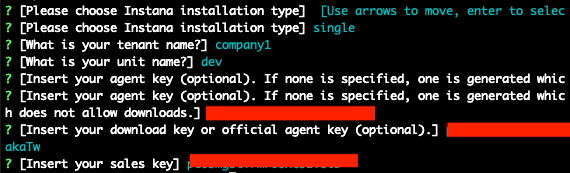
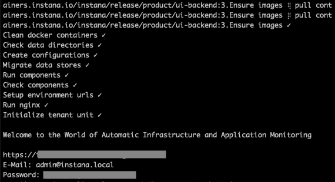
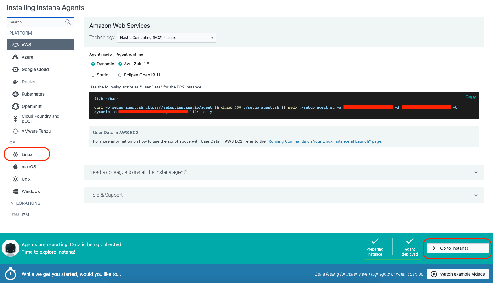

<AnchorLinks>
  <AnchorLink>2-1: Introduction</AnchorLink>
  <AnchorLink>2-2: Prerequisites</AnchorLink>
  <AnchorLink>2-3: Install Instana Server</AnchorLink>
  <AnchorLink>2-4: Activate the License</AnchorLink>
  <AnchorLink>2-5: Launch the Instana User Interface</AnchorLink>
  <AnchorLink>2-6: Turning on features and setting up SMTP</AnchorLink>
  <AnchorLink>2-7: Upgrading the Instana Server</AnchorLink>
  <AnchorLink>2-8: Summary</AnchorLink>
</AnchorLinks>

## 2-1:  Introduction
Instana backand is available as SaaS (prefered option) or self hosted (aka onPrem). For on-premises installation, Instana offers multiple options:
- Single Server **self-hosted** is a Dockerized deployment that does not support multi-tenancy.
- Two server Dockerized **self-hosted** configuration with the datastores on one server and the other components on another. This option is also single-tenant.
- Small scale kubernetes deployment with the cloud native components running in a kubernetes cluster and the datastores running on a Docker host.  This configuration is multi-tenant.
- Large scale kubernetes deployments run the cloud native portion in kubernetes and the datastores distributed across multiple servers.  For assistance with architecture/planning, 
  contact the SWAT team or open a [SWAT Request](http://ibm.biz/automation-swat) request.
- OpenShift support is currently in Tech Preview.

For informational purposes, on-prem (self-hosted) releases are delivered every 4 weeks.   The release have odd numbers such as 225, 227, 229, etc.  When upgrading, you may upgrade from N-1 or N-2, but you can't skip more than one release.  So, you can upgrade from 225 to 229, but not to 231.  Even numbered releases are for SaaS only.  SaaS is upgraded every 2 weeks.

You will be performing and on-line installation during this Tech Jam, but Instana does support off-line (air-gapped) installs.

## 2-2:  Prerequisites

For the installation of the Instana server, we'll be following the instructions layed out in the Instana documentation for a **Self-Hosted Instana backend on Docker**
The instructions can be found here for your reference, but you can follow the steps below.  
https://www.ibm.com/docs/en/instana-observability/current?topic=instana-self-hosted-backend-docker-premises  
This is Instana's smallest on-premise installation option.  Production and larger deployments are installed int kubernetes for horizontal scale and resiliency.

Login to virtual machine that was assigned to you for the installations of the Instana Server. ssh from the control node.   Then use sudo to become root.  Use the credentials provided by the proctors.
```sh
sudo -i

```


Instana has a few prereqs for installing the server.  Some of those have been setup for you.  Others, you will need to perform the installation.  For example, the firewall ports required 
for Agent, UI, and EUM communications have already been configured in the OS firewall.  

Instana requires a Linux server with 16 cores, 64 Gig of RAM and few hundred Gig of disk space for a POC sized deployment. It also requires fast backend storage.  For environments
with even a few hundred servrs, you'll need 6000 IOPS or more.  For larger deployments, you'll need more capacity.
Several different versions of Linux are supported.  We have chosen Ubuntu 20.04 for this environment.   

Prior to installing Instana, you must install Docker CE or Docker EE.  Run the following command to install Docker CE on the virtual machine. 

We recommend that you run these commands one at a time to verify that each runs successfully.
 ```sh
apt-get install ca-certificates curl gnupg lsb-release -y

mkdir -p /etc/apt/keyrings

curl -fsSL https://download.docker.com/linux/ubuntu/gpg | sudo gpg --dearmor -o /etc/apt/keyrings/docker.gpg

echo   "deb [arch=$(dpkg --print-architecture) signed-by=/etc/apt/keyrings/docker.gpg] https://download.docker.com/linux/ubuntu $(lsb_release -cs) stable" | sudo tee /etc/apt/sources.list.d/docker.list > /dev/null

apt-get update -y

apt-get install docker-ce docker-ce-cli containerd.io docker-compose-plugin -y

 ```

 Note:  There is a **Show more** button on the dialog.  Make sure you copy all of the commands and verify that docker is installed and running.  You can issue **docker ps** command to confirm that it is installed and running.
  

Next, create the following directories and/or filesystems that will be used for the Instana datastores (/mnt/metrics, /mnt/traces, /mnt/data).  Ideally, these directories/filesystems 
will be setup on fast storage volumes.
```sh
mkdir /mnt/metrics
mkdir /mnt/traces
mkdir /mnt/data

```

Normally, you would also need to ensure that the virtual machine has the correct ports opened in the firewall.  We have already done this work for you.  For reference, here are the 
ports that need to be opened for the Instana Server for an on-prem deployment.  The ports for SaaS are slightly different.
https://www.ibm.com/docs/en/instana-observability/current?topic=premises-installing-instana-backend-docker#network-security-notes


You are now ready to start the installation of the Instana Server.


***

## 2-3:  Installing Instana Server

Run the following commands to install the Instana Server.  These commands will vary depending on which Linux platform you are using for your installation.

Begin by installing the Instana package
```sh
echo "deb [arch=amd64] https://self-hosted.instana.io/apt generic main" > /etc/apt/sources.list.d/instana-product.list
wget -qO - "https://self-hosted.instana.io/signing_key.gpg" | apt-key add -
apt-get update -y
apt-get upgrade -y
apt-get install instana-console -y

```

This will install the "instana" command on the server.

Next, run the **instana init** command to install the Instana server.  You will be prompted for additional information during the install.

```sh
instana init
```

If the instana command is not found, rerun the previous block of commands one at a time and make sure that the **apt-get install instana-console -y** command executed.

When you run the **instana init** command, it generates a file named settings.hcl in your current directory.  It is important to save this file.  The settings.hcl file contains the configuration settings for your deployment.  It can be used to enable additional features and make other configuration settings in the future.

You will be prompted to select **single**, **dual-instana**, or **dual-clickhouse**.  Type **Enter** to select **single**


Next, you will be prompted to enter a tenant name for your Instana server.  This can be any string.  In a single server installation, the tenant name doesn't really matter, but in
multi-tenant or SaaS environment, the tenant name is very important because it becomes part of the URL to access the Instana server.  Customers frequently use their company name for the tenant.


Next, you will be prompted to enter a unit name. In a single server installation, the unit name doesn't really matter, but in multi-tenant or SaaS environment,
the unit name is very important because it becomes part of the URL to access the Instana server.  Customers frequently use a business unit or Dev, Test, Prod to identify the unit.


You will now be prompted for your **agent key**.  This will be provided to you by the lab proctors.


The next step is to enter your **download key**.  Use the same key as your **agent key** from the previous step.


Next, enter your **sales key**.  This will be provided to you by the lab proctors.


When you are prompted for the fully qualified hostname of the server.  Normally, you would enter a fully qualified hostname, but these servers are not in DNS.  Instead, enter the **IP address** of the server.  If you are not sure what the IP address is, you can edit the /etc/netplan/50-cloud-init.yaml file and look for the **eth1** section and look for **addresses**


You will now be prompted for the path where your data will be stored.  The default path is /mnt/data.  Press **Enter** to accept the default value.


You will now be prompted for the path where your traces will be stored.  The default path is /mnt/traces.  Press **Enter** to accept the default value.


Next, you will be prompted for the path where your metric data will be stored.  The default path is /mnt/metrics.  Press **Enter** to accept the default value.


You will be prompted for the location of the Instana logs.  Press **Enter** to accept the default value of /var/log/instana.


Finally, you will be prompted for the path to your signed certificate file.  If desired, you can create your own.  If you don't provide one, the installer will generate a certificate.
Press **Enter** and let Instana generate a certificate.


You will be prompted for the private key file. For this lab, press **Enter** and have the install generate the key file.


Instana will now begin the installation process.  It will take 30 to 60 minutes to complete the installation process.

At the end of the installation, you will be shown a username of **admin@instana.local** and a **password**.   Save the username and password.  You can use these credentials to Login
to the Instana user interface.

The output should look something like this:


Save the username (E-Mail) and password so that you can reuse it later.

***

## 2-4:  Activate the license

After completing the installation, you must activate the license.

Run the following command to download the license:
```sh
instana license download
```


Next, import the license to activate your license:
```sh
instana license import
```


You can verify the license by typing:
```sh
instana license verify
``` 


***

## 2-5:  Launch the Instana User interface

You are now ready to open a browser and login to the Instana user interface.

Open a firefox browser.  Other browsers can be used, but you would need to setup the server as a trusted URL due to the self-signed certificate.

Enter an HTTPS URL with the IP address of the Instana server.  You would have seen this URL at the end of step 1-3.  Example:   https://\<IP address\>

When prompted, enter the username and password that you saved earlier.  The username is **admin@instana.local**


You will be taken to an Initial Screen where you can install the instana agents or navigate to the main product UI.  We will perform these steps in another section of the lab.

***

## 2-6:  Turning on features and setting up SMTP

Following the initial install of your Instana server, there are optional configurations that you will likely want to make.  First, you need to setup the Instana server to use an SMTP server if you plan to send out Email notifications.  Second, there may be some optional features that you want to enable via feature flags.  Features such as VMware/vSphere monitoring, Power HMC monitoring, and zHMC monitoring are disabled by default. 

Follow the steps below to configure the SMTP settings and enable some additional feature flags.

1. Edit `settings.hcl` file according to the [documentation](https://www.ibm.com/docs/en/obi/current?topic=installer-enabling-feature-flags). The **settings.hcl** file will be located in the same directory where you issued the **instana init** command.  Some common feature flags available are:

```yaml
feature "vsphereEnabled" {
  enabled=true
}
feature "zhmcEnabled" {
  enabled=true
}
feature "phmcEnabled" {
  enabled=true
}
feature "beeinstana" {
  enabled=true
}
feature "smartAlertsLogsBlueprintEnabled" {
  enabled=true
}
feature "infraCustomDashboards" {
  enabled = true
}
feature "infraEntityExplore" {
  enabled = true
}
```

These parameters are added to the settings.hcl file in the section with the other feature flags.  Search in the settings.hcl file for **feature**.  Then, add any additional feature flags that are desired in that section of the file.  They can be place anywhere within the **feature** section of the file.

> **WARNING: Be aware that turning on features (especially BETA ones) may heavily impact backend performance. DO NOT turn on features you don't need**

In your lab enviroment, we want you to add the following feature flags.  Since you don't have access to a VMware environment, it doesn't make sense to enable that feature flag.
```yaml
feature "infraCustomDashboards" {
  enabled = true
}
feature "infraEntityExplore" {
  enabled = true
}
```

Next, search for the **smtp** section in the settings.hcl file.   Modify the smtp section to look something like this:
```sh
  smtp {
    from      = "server@instana.com"
    host      = "localhost"
    port      = 25
    user      = "root"
    password  = "<root password>"
    use_ssl   = false
    start_tls = false
  }
  ```

Replace **<root password\>** with the root password of the Instana server.  If you want, you can replace the **from** parameter with any Email address that you like.  The **from** Email address is what you will see when you see as the sender of an Email alert from Instana.

Save the changes in the settings.hcl file.

2. Run `instana update -f ./settings.hcl` to apply changes.
```sh
instana update -f ./settings.hcl

```

It will take a little while for the configuration changes to take effect.  Read section 1-7 while the configuration changes are being applied.

***

## 2-7:  Upgrading the Instana server

<span style="color:red">We are not going to execute an actual upgrade, but we want you to know the process.</span>
  

When upgrading an Instana server, it is important to know that you can only skip one release when upgrading.  The on-prem/self-hosted releases use odd numbers.  That means that you can upgrade from version 225 to either 227 or 229.  But, you can't upgrade from 225 to 231 because that would be skipping 2 releases and isn't supported.  It is important for customers to know this because they need to keep their Instana server patched on a fairly regular basis. Otherwise, it will mean that they will have to perform multiple steps to upgrade to the current version.

Before attempting to upgrade, you want to confirm your current version.  Issue the **instana version**
```sh
instana version
```

Next, find out what versions are available to be installed.   Issue the the following command:
```sh
apt-cache policy instana-console
```

You will see a long list of versions that are available.  Scroll to the top of the list where you will see the most recent versions.


You'll notice that in this example, 229-2 is the most recent version and 229-1 is the current version.  That means you can upgrade to that minor release.  There is newer major release available.

<span style="color:red">We're not going to perform the upgrade because your environment was just installed.</span>  But, here are the steps that you would normally execute.

First, install the latest instana-console.  This upgrades the **instana** command that is installed on your server:
```sh
apt install instana-console=229-2
```

Next, upgrade the server by issuing the **instana update** command.  If you are in directory with the settings.hcl file, then you don't need any arguments.  Otherwise, specify the path to the settings.hcl file.
```sh
instana update -f /root/settings.hcl
```
When performance the upgrade, the installer automatically pulls down the latest docker containers and gets them up and running on the Instana server.


***


## 2-8:  Summary

In this portion of the lab, you have learned how to install a self-hosted docker based Instana server.  For a POC, we recommend either SaaS or the single server self-hosted docker installation of the Instana server.  For production deployments, customers will want the kubernetes based deployments to gain improved scalability and resiliency.

You have also learned how to configure the SMTP settings and how to enable feature flags.

Finally, you learned how to upgrade a docker based self-hosted Instana server.

You are now ready to continue with other portions of the lab.    Navigate to section 3 of the Instana lab.

***


