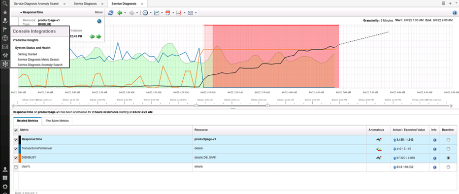

<AnchorLinks>
  <AnchorLink>5-1: Lab Introduction</AnchorLink>
  <AnchorLink>5-2: Creating a topic</AnchorLink>
  <AnchorLink>5-3: Starting Cassandra</AnchorLink>
  <AnchorLink>5-4: Configuring the REST mediation service</AnchorLink>
  <AnchorLink>5-5: Starting Kafka</AnchorLink>
  <AnchorLink>5-6: Starting Spark</AnchorLink>
  <AnchorLink>5-7: Starting the REST Mediation Service</AnchorLink>
  <AnchorLink>5-8: Send data to the REST Mediation Service</AnchorLink>
</AnchorLinks>

## 5-1: Lab Introduction

 In our previous lab, we created a model for metric data that resided in CSV files. Metric Manager can also ingest data via a REST interface. The REST interface can accept pre-defined JSON payloads and process them for analysis and machine learning.

 Since the definition of the JSON payload describes the model within its structure, it is not required to use the Mediation Tool to create a model. The prescribed JSON format defines the model. It is only necessary to ensure that the JSON payload adheres to the required format. This format is also the same as the new version of Watson AIOps container-based Metric Anomaly Detection component that is being actively developed, and that we will be working with in the final lab.

 This lab will go through the various components that make up the REST mediation service. We will configure the components that we installed in lab 1, start the mediation service, and use a simple script to send data to the REST mediation service, and view the results.

## 5-2: Create a topic for the REST mediation service

 You can store JSON data only in the topic that you use to extract the REST Mediation Service data. You cannot use an existing topic if it contains data from a CSV file or database. However, you can use an existing topic if it does not contain any data or if it contains only JSON data. We will reconfigure our BIGBLUE topic to accept REST data.

 Return to a terminal window and clear the topic using the following commands. When prompted, type " **I am sure"** and press enter. When it asks whether you want to clear out the database, type " **Yes**" and press enter.

```sh
/opt/IBM/scanalytics/analytics/bin/stop.sh -s
/opt/IBM/scanalytics/analytics/bin/admin.sh cleanup -t=BIGBLUE
```

### Modify the topic to extract data from Cassandra:

 The following command configures the topic to connect to cassandra on localhost:

```sh
/opt/IBM/scanalytics/analytics/bin/admin.sh set -t=BIGBLUE cassandra.host localhost
```

 Encrypt and copy the default Cassandra password using the following commands. When prompted, enter <CASSANDRA PASSWORD\> as the password:

```sh
/opt/IBM/scanalytics/analytics/bin/admin.sh passwd -c $PI\_HOME/config/cassandra.properties connection.password
cat /opt/IBM/scanalytics/analytics/config/cassandra.properties
```

 Copy the encrypted password that is saved in the file:

```sh
cat $PI\_HOME/config/cassandra.properties
```

** !! NOTE !!: If your encrypted Cassandra password begins with "+", due to a current defect in the PI code, you will need to select an alternative password for the Cassandra 'cassandra' user. Try making up an alternative password, encrypt that, and if is ok use that as an alternative. Then, in the next section, use your alternative password in place of <CASSANDRA PASSWORD\> **


Set the encrypted value for our BIGBLUE topic, pasting the value for 'connection.password' obtained from the previous output:

```sh
/opt/IBM/scanalytics/analytics/bin/admin.sh set -t=BIGBLUE cassandra.password <ENCRYPTED CASSANDRA PASSWORD>
```

 Set the Cassandra user for the topic to 'cassandra':

```sh
/opt/IBM/scanalytics/analytics/bin/admin.sh set -t=BIGBLUE cassandra.username cassandra_
```

## 5-3: Starting Cassandra

 Data that is sent to the REST mediation service is stored in a Cassandra database. The "run\_extractor\_instance" command will pull metrics from Cassandra for analysis. For production deployments, and depending on metric load, it is possible to use a distributed installation of Cassandra for high availability and performance. For this lab we will be configuring a single Cassandra instance.


### Procedure:

 As the 'scadmin' user, start Cassandra with the following command:

```sh
/opt/IBM/apache-cassandra-3.11.10/bin/cassandra > /opt/IBM/apache-cassandra-3.11.10/cassandra.out 2>&1
```

 Run the following command to verify that Cassandra is running:

```sh
ps -ef |grep org.apache.cassandra.service.CassandraDaemon |grep -v grep
```

 Next, using your preferred text editing tool, edit the /opt/IBM/apache-cassandra-3.11.10/bin/stop-server script and add the following line to the end of the file:

`pgrep -u $(whoami) -f cassandra | xargs -t -i kill {}`

 Run the 'stop-server' command to stop the Cassandra server:

```sh
/opt/IBM/apache-cassandra-3.11.10/bin/stop-server
```

And ensure the stop script stopped Cassandra:

```sh
ps -ef |grep org.apache.cassandra.service.CassandraDaemon |grep -v grep
```

 Clean up the Cassandra data folder:

```sh
cd /opt/IBM/apache-cassandra-3.11.10/data/data/
rm -rf system
```

 Start Cassandra:

```sh
/opt/IBM/apache-cassandra-3.11.10/bin/cassandra > /opt/IBM/apache-cassandra-3.11.10/cassandra.out 2>&1
```

List the Cassandra servers:

```sh
/opt/IBM/apache-cassandra-3.11.10/bin/nodetool status
```

You should see a response similar to the following, indicating that it is listening on your IP address:

`UN 150.238.93.122 133.29 KiB 256 100.0% b2f89d8c-dd23-451c-907a-59b72dc4d18c rack1`

### Configure Cassandra with a username and password

 For security, it is required to configure Cassandra with a username and password so the topic extractor can securely authenticate with Cassandra and extract metric data. Using your preferred text editor, edit the /opt/IBM/apache-cassandra-3.11.10/conf/cassandra.yaml and change the **authenticator** line to:

`authenticator: PasswordAuthenticator`

 Save the file and restart Cassandra:

```sh
/opt/IBM/apache-cassandra-3.11.10/bin/stop-server
/opt/IBM/apache-cassandra-3.11.10/bin/cassandra > /opt/IBM/apache-cassandra-3.11.10/cassandra.out 2>&1
/opt/IBM/apache-cassandra-3.11.10/bin/nodetool status
```

 Finally, verify password authentication is working by running cqlsh, passing in username and the default cassandra password.

```sh
/opt/IBM/apache-cassandra-3.11.10/bin/cqlsh -u cassandra -p <DEFAULT CASSANDRA PASSWORD\>
```

You should see a successful connect, and arrive at the cqlsh prompt. 

`cassandra@cqlsh>`

 Use the following commands to change the default 'cassandra' user's password to either the **<span style="color:green"><CASSANDRA PASSWORD\></span>** provided by the lab proctor, or the cassandra password you chose if you were required to use an alternative:

```sh
/opt/IBM/opt/IBM/apache-cassandra-3.11.10/bin/cqlsh -u cassandra -p <DEFAULT CASSANDRA PASSWORD\>
cassandra@cqlsh> alter user cassandra with password '<CASSANDRA PASSWORD>';
cassandra@cqlsh> quit
```

 Cassandra configuration is now complete.

## 5-4: Configuring the REST mediation service

 The next step in configuring the REST integration requires configuring the REST mediation service mediation configuration files. We will encrypt the Cassandra password and store it in the Mediation Service yaml files. We will use the user 'piadmin' to encrypt the password, then update the appropriate mediation service yaml files. The reason we need to use a separate user is because we require Java 11 for the IBM REST mediation code itself, while the rest of the REST mediation components (Cassandra, spark, kafka) requires Java 8.

 Sudo to the 'piadmin' user, using the password <LAB PASSWORD\> and run the password encryption utility:

```sh
sudo su - piadmin
cd /opt/IBM/pi-mediation-1.0.4
./encrypt_password.sh <CASSANDRA PASSWORD> 
```

The "encrypt\_password.sh" tool will print the encrypted password. Copy the encrypted password.

 Using your preferred text editor, edit the /opt/IBM/pi-mediation-1.0.4/config/metric-api-service.yml file and modify the "cassandra.encrypted.password:" entry, paste the encrypted password text.

`cassandra.encrypted.password: <ENCRYPTED CASSANDRA PASSWORD>`

 Next, edit the /opt/IBM/pi-mediation-1.0.4/config/metric-spark.yml file and modify the following entries in the file:

`spark.cassandra.auth.username: cassandra`  
`spark.cassandra.auth.encrypted.password: <ENCRYPTED CASSANDRA PASSWORD>`  
`cassandra.username: cassandra`  
`cassandra.password: <ENCRYPTED CASSANDRA PASSWORD>`  

### Configuring authentication for the REST mediation service

 The REST API requires that you set a password to ensure that connections are authenticated. We will use the password <LAB PASSWORD\> as our API password. As the piadmin user, encrypt the password, making sure to substitute <LAB PASSWORD\> with the lab password provided earlier:

```sh
cd /opt/IBM/pi-mediation-1.0.4/
./encrypt_password.sh <LAB PASSWORD>
```

 Copy the encrypted password.

 Once you have obtained and copied the encrypted password for the REST service, edit the "/opt/IBM/pi-mediation-1.0.4/config/metric-api-service.yml file and modify the entry 'metrics.api.encrypted.password' entry, pasting the encrypted password.

`metrics.api.encrypted.password: <ENCRYPTED LAB PASSWORD>`


## 5-5: Starting Kafka

 Copy the startup script for Kafka to the kafka directory, then run the script to start kafka:

```sh
cp /home/piadmin/start-pi-kafka.sh /opt/IBM/kafka_2.13-2.6.2/
/opt/IBM/kafka_2.13-2.6.2/start-pi-kafka.sh
```

 Wait about 30 seconds, then verify that it is running:

```sh
ps -ef |grep kafka.Kafka
```


## 5-6: Starting Spark


 Spark should be run as the 'piadmin' user as well, so if you are the user 'scadmin' user, sudo su to 'piadmin':

```sh
sudo su – piadmin
```

 Start the Spark services by running the following command:

```sh
/opt/IBM/spark-3.1.2-bin-hadoop3.2/sbin/start-all.sh
```

 Use <LAB PASSWORD\> for the password when it prompts.


## 5-7: Starting the REST mediation service

 Become the piadmin user (if you're not already) and start the service:

```sh
sudo su – piadmin
/opt/IBM/pi-mediation-1.0.4/run_service.sh
```

## 5-8: Send data to the REST interface:

 If you are still the 'piadmin' user, exit back to the 'scadmin' user, or open a new terminal window. We will be using secure copy to obtain a JSON file that contains metrics that we will be sending to the REST service. Run the following commands as the scadmin user to obtain the file. :

```sh
cd /home/scadmin/BookInfoDemo/data/bookinfo
scp 150.238.93.118:/home/scadmin/BookInfoJson-20220721-0000__20220806-1200.json ./
```

 When the file transfer completes, you can use curl to send the data to the REST service. Execute the following commands to send JSON data to the Metric Manager REST mediation service, making sure to substiture <LAB PASSWORD\>:

```sh
curl -vX POST --user "system:<LAB PASSWORD>" --header "Content-Type: application/json" --header "X-TenantID: BIGBLUE" http://pi-template.Hybrid-Squad.cloud:18080/metrics/api/1.0/metrics -d @BookInfoJson-20220721-0000__20220806-1200.json
```

 Wait a couple minutes, then verify that the data has made it into cassandra:

```sh
/opt/IBM/apache-cassandra-3.11.10/bin/cqlsh -u cassandra -p <CASSANDRA PASSWORD>
select * from tararam.dt_metric_value;
```

 The next step is to run the Metric Manager extractor to ingest the data from Cassandra for analysis and machine learning. Run the following command to run extraction:

```sh
/opt/IBM/scanalytics/analytics/bin/start.sh -t=BIGBLUE
/opt/IBM/scanalytics/analytics/bin/admin.sh run_extractor_instance -t=BIGBLUE -s=20220723-0000 -e=20220806-1200
```

 If you want to monitor the progress of data ingestion for a topic, a log file /opt/IBM/scanalytics/analytics/log/\<TOPICNAME\>/AnalyticsBIGBLUE\_log\_AnalyticsOperator.log. You can watch the progression of the ingestion and monitor for error messages by using the following command:

```sh
tail -f /opt/IBM/scanalytics/analytics/log/BIGBLUE/AnalyticsBIGBLUE_log_AnalyticsOperator.log
```

 The log file will show where it is in terms of what time interval it is collecting and analyzing, the amount of KPIs and how many KPIs are being evaluated for each algorithm (e.g. robust bounds, granger, flat line, etc). If you have any issues with ingestion, this log file can help you identify errors that may be attributing to the problem.

 Take a break for a few minutes. The ingestion will complete in about 10 minutes. When mediation is complete, follow the same procedure as in the previous lab to verify that the data was ingested and showing up. Open Firefox and log in as 'ncoadmin' / '<LAB PASSWORD\>', then click on the snowflake icon on the left menu pane and selecting "Service Diangosis Anomaly Search", and drilling into one of the anomalies:

 

 For live ongoing data ingestion using the REST interface, you would start the Metric Manager topic, then start the extractor \*without a start time or end time\*. That puts the Metric Manager extractor in live mode, and for each time interval (e.g. every 5 minutes), the extractor will pull the metrics that were posted to the REST interface for the last interval, and process them live. 

 You can create custom scripts to post metrics to the REST service. Additionally, our off-the-shelf Mediation Packs can collect metric from various sources (e.g. Splunk, Dynatrace, etc) and output to either CSV files for PI to collect, or can post to the REST Mediation Service.

 The REST Mediation Service code is the same code that is used in the Metric Anomaly Detection component of Watson AIOps, which you will be working with in the final lab.


 That concludes this lab. You learned how to install and configure the REST Mediation Service, how to start the components that make up the service, and also how to POST data to the service.

