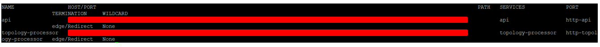
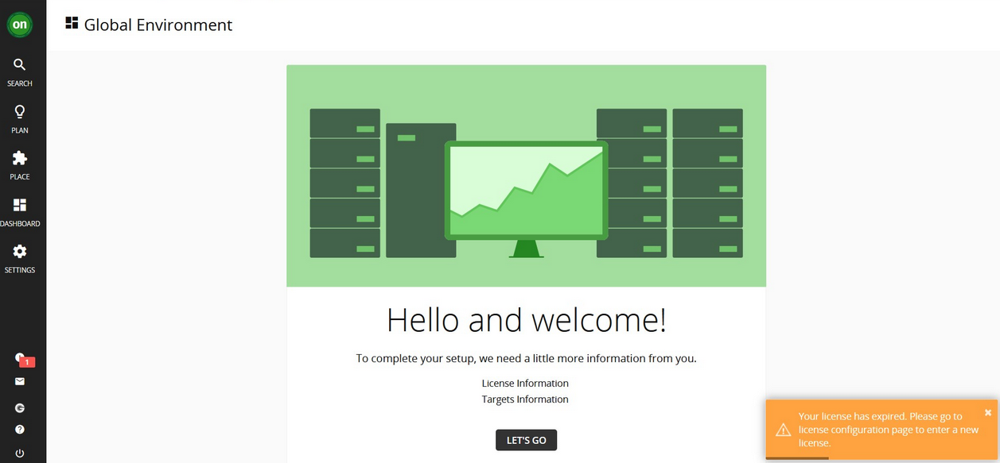

<AnchorLinks>
  <AnchorLink>2-1: Introduction</AnchorLink>
  <AnchorLink>2-2: Prerequisites</AnchorLink>
  <AnchorLink>2-3: Deploy the Operator</AnchorLink>
  <AnchorLink>2-4: Configure the Turbonomic Instance: Custom Resource</AnchorLink>
  <AnchorLink>2-5: Launch the Turbonomic User Interface</AnchorLink>
  <AnchorLink>2-6: License Configuration</AnchorLink>
  <AnchorLink>2-7: Summary</AnchorLink>
</AnchorLinks>

## 2-1:  Introduction


***

## 2-2:  Prerequisites

Login into OpenShift Console UI to copy the full `oc login` command displayed under `Log in with this token login token`

1) From your command prompt, issue the following command to create the namespace:
```sh
export NS=turbonomic
oc create namespace ${NS}
```

2) Turbonomic application will create PVs and to have the services access their PVs. We will use the UID value of the `sa.scc.uid-range` of the project.

```sh
oc get ns ${NS} -o yaml | grep uid-range
```

In the output example below, we will use `1000640000`:

```
openshift.io/sa.scc.uid-range: 1000640000/10000
```

3) Then set:

```sh
export FSGROUP=<your UID-range>
```

Example:

```
export FSGROUP=1000640000
```

4) Create the Custom Resource Definition (CRD) to allow Turbo operator to deploy all the necessary resources

For Kubernetes version 1.22 and higher (To check the Kubernetes version, you can run `oc version` command):

```sh
oc create -f https://raw.githubusercontent.com/turbonomic/t8c-install/master/operator/config/crd/bases/charts.helm.k8s.io_xls.yaml
```

You are now ready to deploy the operator


***

## 2-3:  Deploy the Operator

1) Create the operator service account 
```sh
oc create -f https://raw.githubusercontent.com/turbonomic/t8c-install/master/operator/deploy/service_account.yaml -n ${NS}
```

2) Create the cluster role
```sh
oc create -f https://raw.githubusercontent.com/turbonomic/t8c-install/master/operator/deploy/cluster_role.yaml -n ${NS}
```

3) Create the role binding
```sh
oc create -f https://raw.githubusercontent.com/turbonomic/t8c-install/master/operator/deploy/cluster_role_binding.yaml -n ${NS}
```

4) Launch the operator pod
```sh
oc create -f https://raw.githubusercontent.com/turbonomic/t8c-install/master/operator/deploy/operator.yaml -n ${NS}
```

5) Wait for the operator to become available (status = running with 1/1 ready). Check the status using

```sh
oc get pods -n ${NS} -w
```

Example output:

```
NAME                           READY   STATUS    RESTARTS   AGE
t8c-operator-fdd8b8c94-dhrt4   1/1     Running   0          72s
```

Next, we are going to configure the Turbonomic instance

***

## 2-4:  Configure the Turbonomic Instance: Custom Resource

1) Set the storage class
```sh
export STORAGE_CLASS=ibmc-block-gold
```

2) Apply custom resource file to launch Turbonomic
```sh
cat << EOF | oc -n ${NS} apply -f -
apiVersion: charts.helm.k8s.io/v1
kind: Xl
metadata:
  name: xl-release
  namespace: ${NS}
spec:
  global:
    customImageNames: false
    repository: registry.connect.redhat.com/turbonomic
    securityContext:
      fsGroup: ${FSGROUP}
    storageClassName: ${STORAGE_CLASS}
    storageSelector: false
    tag: 8.4.4
  openshiftingress:
    enabled: true
  kubeturbo:
    enabled: true
  nginx:
    httpsRedirect: false
    nginxIsPrimaryIngress: false
  nginxingress:
    enabled: false
  instana:
    enabled: true
EOF
```

3) Deployment will begin for all the Turbonomic pods. Depending on the environment, this may take some time to complete, anywhere from 5 to 20 minutes. Use command below to check the status of the deployment. 

```sh
oc get pods -n ${NS} -w
```

Ensure all the pods are in `STATUS` = `Running` and `READY` = `1/1`. 

Example output:

```
NAME                                   READY   STATUS    RESTARTS      AGE
action-orchestrator-55bbb96fd8-bxv59   1/1     Running   2 (14m ago)   17m
api-6d876bd5c8-ntpc9                   1/1     Running   0             17m
auth-57d95cdc4f-7x7jq                  1/1     Running   0             17m
clustermgr-5bff4bc746-9fvz4            1/1     Running   2 (14m ago)   17m
consul-6b979f7d9d-ncb9f                1/1     Running   0             17m
cost-679689bcb8-9r8h7                  1/1     Running   2 (14m ago)   17m
db-5547b8bb9c-xjlk8                    1/1     Running   0             17m
group-7c66b96cd6-jf69l                 1/1     Running   2 (14m ago)   17m
history-75c89bdcdb-vcsv4               1/1     Running   2 (14m ago)   17m
kafka-54b458c5ff-25tkp                 1/1     Running   0             17m
kubeturbo-6b7568cbd-8gdqp              1/1     Running   0             17m
market-784cd4f9fb-26879                1/1     Running   2 (14m ago)   17m
plan-orchestrator-5fb588cdc6-wsz4l     1/1     Running   2 (14m ago)   17m
repository-85bb8b95c4-w85nv            1/1     Running   2 (14m ago)   17m
rsyslog-64c7fb4467-qcj9v               1/1     Running   0             17m
t8c-operator-fdd8b8c94-jwwj8           1/1     Running   0             18m
topology-processor-77f7f95c8-lmpzr     1/1     Running   0             17m
ui-6d4ff8787d-6zhm4                    1/1     Running   0             17m
zookeeper-57658f68c6-6qdgb             1/1     Running   0             17m
```

4) Get Turbonomic UI route after the deployment completed

check for the route

```sh
oc get route -n ${NS}
```

Example output:


Copy the `HOST/PORT` under `api` name.

***

## 2-5:  Launch the Turbonomic User interface

You are now ready to open a browser and login to the Turbonomic user interface.

1) In the browser, navigate to the copied `HOST/PORT` that you have copied in previous step and you will see the first time login to create `administrator` password.


Create the password and click on `Create Account` button.

2) The setup wizard will take you to import the license key



***

## 2-6:  License Configuration

Your lab proctors will provide you the license file. 

1) Click on `LET'S GO` button.

2) Click on `IMPORT LICENSE` button and drag the license file provided by your lab proctors into `Enter License` box.

3) Then click on `Save` button. You will see the page below if it's successful


***


## 2-7:  Summary

In this portion of the lab, you have learned how to install Turbonomic on OpenShift. Navigate to the next section 3 to understand on Turbonomic UI.

***


