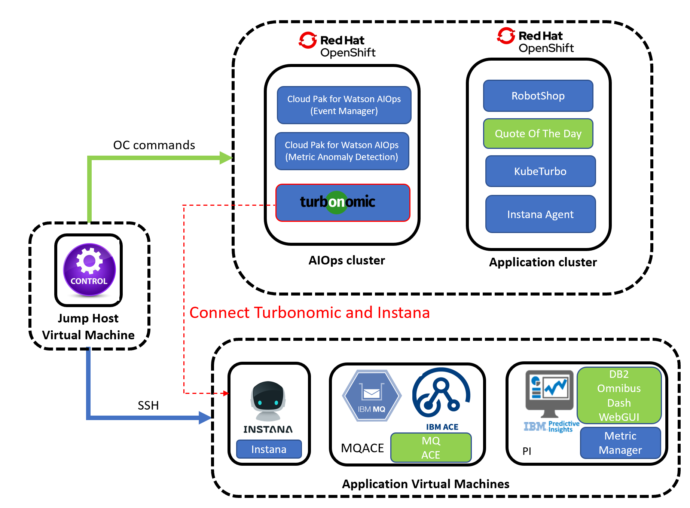

## Connect Turbonomic and Instana

In this section, we going to integrate instana to get application performance data for business critical application.

1) In the Instana console, go to `Settings -> Team Settings page -> API Tokens`. Click on `Add API Token` to create an API key from Instana

2) In the create API token page, enter the token name, e.g. `Turbonomic API Token`. Copy the API token generated which will be used later. 

Then scroll down to `Permissions` section to enable the permissions as below:

- Access to audit log
- Access to token and session timeout settings
- Access to license usage
- Access to on prem license usage
- Access to account and billing information
- Service & endpoint mapping

3) In the Turbonomic console, go to `Settings -> Target Configuration`.

4) Click on `NEW TARGET -> Applications and Databases`.

5) Click on `Instana`.

6) Add the Instana hostname, API key (which you have created in Step 2 earlier), and proxy username set as `administrator`.

It will take some time for Turbonomic to discover and validate the target. After it is validated successfully, it will be displayed as a validated target in the Target Configurations list in the Turbonomic console settings.

***

